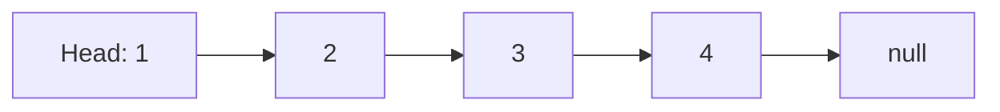
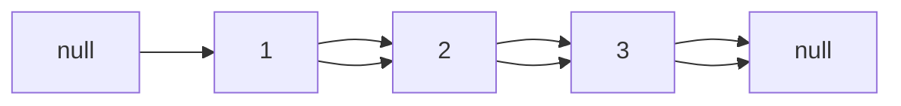
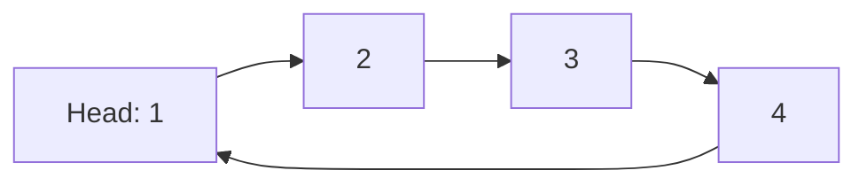
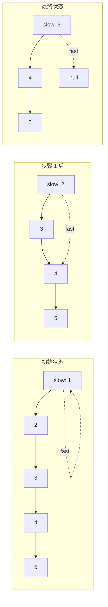
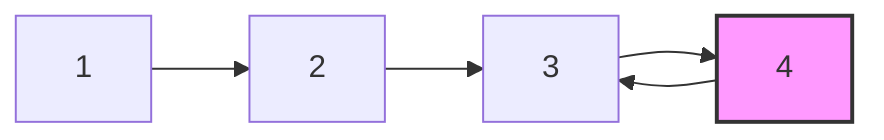

# 链表

## 为什么链表很重要

链表能够在任意位置高效地插入和删除元素——这些操作在数组中需要 O(n) 的元素移动：

- **动态内存分配**：节点分散在内存中，不需要连续的内存分配
- **高效的插入/删除**：在已知位置为 O(1)（只需更新指针）
- **实现基础**：栈、队列、哈希映射链表和图邻接表的实现基础
- **面试模式**：快慢指针、链表反转和循环检测在 30%+ 的链表问题中出现

**实际影响**：LinkedHashMap 使用双向链表来维护迭代顺序——使 `entrySet()` 遍历为 O(n)，而不是纯 HashMap 可能的 O(n²)。

## 核心概念

### 单向链表结构

每个节点包含数据和指向下一个节点的指针：

```java
class ListNode {
    int val;
    ListNode next;
    ListNode(int val) { this.val = val; }
}
```



**关键特征**：
- **头指针**：列表的入口点（丢失它意味着丢失整个列表）
- **最后一个节点**：指向 `null`（列表结束标记）
- **访问**：O(n) 到达第 i 个元素（必须从头开始遍历）

### 双向链表

节点同时具有 `next` 和 `prev` 指针：

```java
class DoublyListNode {
    int val;
    DoublyListNode prev;
    DoublyListNode next;
    DoublyListNode(int val) { this.val = val; }
}
```



**优势**：
- **双向遍历**：可以向前或向后迭代
- **O(1) 删除**：当已知节点引用时（无需找到前驱节点）
- **支持的操作**：撤销/重做、浏览器历史前进/后退

**劣势**：
- **2倍内存开销**：每个节点有两个指针而不是一个
- **复杂性**：需要维护更多的指针操作

### 循环链表

最后一个节点指向头节点（没有 `null` 终止符）：



**用例**：
- **轮询调度**：CPU 进程调度
- **缓冲区实现**：流数据的循环缓冲区
- **游戏循环**：玩家轮流循环

### 链表 vs ArrayList

| 操作 | 链表 | ArrayList | 胜者 |
|------|------|-----------|------|
| **访问（索引）** | O(n) | O(1) | ArrayList |
| **插入（头部）** | O(1) | O(n) 移动 | 链表 |
| **插入（尾部）** | O(1) 有尾指针 | O(1) 摊销 | 平局 |
| **插入（中间）** | O(n) 搜索 + O(1) 插入 | O(n) 移动 | 平局 |
| **删除（已知节点）** | O(1) | O(n) 移动 | 链表 |
| **删除（值）** | O(n) 搜索 | O(n) 搜索 | 平局 |
| **内存开销** | 16+ 字节/元素 | 4+ 字节/元素 | ArrayList |

**何时使用链表**：
- 频繁在头部插入/删除（栈、队列）
- 实现其他数据结构（LRU 缓存、LinkedHashMap）
- 未知/非常大的尺寸（无需调整大小）

**何时使用 ArrayList**：
- 按索引随机访问
- 主要为追加操作
- 内存受限的环境

## 深入探索

### 遍历模式

#### 基本遍历

```java
public void printList(ListNode head) {
    ListNode current = head;
    while (current != null) {
        System.out.print(current.val + " -> ");
        current = current.next;
    }
    System.out.println("null");
}
```

#### 哨兵节点模式

使用虚拟头节点来简化边缘情况：

```java
public ListNode insertAtHead(ListNode head, int val) {
    ListNode dummy = new ListNode(0);  // 哨兵节点
    dummy.next = head;

    ListNode newNode = new ListNode(val);
    newNode.next = dummy.next;
    dummy.next = newNode;

    return dummy.next;  // 新头节点
}
```

**好处**：空列表没有特殊情况（哨兵节点总是存在）

### 快慢指针模式

两个以不同速度移动的指针来找到中间元素或检测循环：

```java
public ListNode findMiddle(ListNode head) {
    ListNode slow = head;
    ListNode fast = head;

    while (fast != null && fast.next != null) {
        slow = slow.next;        // 移动 1 步
        fast = fast.next.next;   // 移动 2 步
    }

    return slow;  // 中间节点
}
```



**应用**：
- 找到中间元素（如上）
- 检测循环（龟兔赛跑）
- 从末尾找第 k 个元素（快指针提前 k 步）

### 链表反转

#### 迭代反转

```java
public ListNode reverseList(ListNode head) {
    ListNode prev = null;
    ListNode current = head;

    while (current != null) {
        ListNode nextTemp = current.next;  // 保存下一个
        current.next = prev;               // 反转链接
        prev = current;                    // 前进 prev
        current = nextTemp;                // 前进 current
    }

    return prev;  // 新头节点
}
```

**可视化**：
```
初始:    1 -> 2 -> 3 -> null
步骤 1:     null <- 1    2 -> 3 -> null
步骤 2:     null <- 1 <- 2    3 -> null
步骤 3:     null <- 1 <- 2 <- 3
返回:     3 (新头节点)
```

#### 递归反转

```java
public ListNode reverseListRecursive(ListNode head) {
    if (head == null || head.next == null) {
        return head;  // 基本情况：空或单节点
    }

    ListNode newHead = reverseListRecursive(head.next);
    head.next.next = head;  // 反转链接
    head.next = null;       // 旧尾节点指向 null
    return newHead;
}
```

**权衡**：递归更优雅但使用 O(n) 栈空间

### 循环检测

```java
public boolean hasCycle(ListNode head) {
    if (head == null || head.next == null) {
        return false;
    }

    ListNode slow = head;
    ListNode fast = head;

    while (fast != null && fast.next != null) {
        slow = slow.next;
        fast = fast.next.next;

        if (slow == fast) {  // 检测到循环
            return true;
        }
    }

    return false;  // fast 到达 null（无循环）
}
```

**为什么有效**：如果存在循环，快指针最终会"追上"慢指针（像跑道上的跑步者）



### 找到循环起始点

```java
public ListNode detectCycle(ListNode head) {
    if (head == null) return null;

    ListNode slow = head;
    ListNode fast = head;

    // 第 1 阶段：检测循环
    while (fast != null && fast.next != null) {
        slow = slow.next;
        fast = fast.next.next;

        if (slow == fast) {
            // 第 2 阶段：找到循环起始点
            ListNode ptr1 = head;
            ListNode ptr2 = slow;

            while (ptr1 != ptr2) {
                ptr1 = ptr1.next;
                ptr2 = ptr2.next;
            }

            return ptr1;  // 循环起始节点
        }
    }

    return null;  // 无循环
}
```

**数学证明**：
- 从头到循环起点的距离：`a`
- 从循环起点到相遇点的距离：`b`
- 循环长度：`c`
- 相遇时：`slow = a + b`，`fast = 2(a + b) = a + b + nc`
- 因此：`a = nc - b`（从相遇点到起点的距离 = a）

### 合并有序链表

```java
public ListNode mergeTwoLists(ListNode list1, ListNode list2) {
    ListNode dummy = new ListNode(0);  // 哨兵节点
    ListNode current = dummy;

    while (list1 != null && list2 != null) {
        if (list1.val <= list2.val) {
            current.next = list1;
            list1 = list1.next;
        } else {
            current.next = list2;
            list2 = list2.next;
        }
        current = current.next;
    }

    // 附加剩余节点
    current.next = (list1 != null) ? list1 : list2;

    return dummy.next;
}
```

### 常见陷阱

#### ❌ 丢失头引用

```java
public void badTraverse(ListNode head) {
    while (head != null) {
        System.out.println(head.val);
        head = head.next;  // BUG: 修改了 head 参数
    }
    // 无法再访问列表！
}
```

#### ✅ 使用临时指针

```java
public void goodTraverse(ListNode head) {
    ListNode current = head;  // 临时指针
    while (current != null) {
        System.out.println(current.val);
        current = current.next;
    }
    // head 仍然指向列表开头
}
```

#### ❌ 插入时出现 NullPointerException

```java
public void badInsert(ListNode head, int val) {
    ListNode newNode = new ListNode(val);
    head.next = newNode;  // 如果 head 为 null 会 NPE
}
```

#### ✅ 检查 null

```java
public ListNode goodInsert(ListNode head, int val) {
    if (head == null) {
        return new ListNode(val);  // 新节点成为头节点
    }

    ListNode current = head;
    while (current.next != null) {
        current = current.next;
    }
    current.next = new ListNode(val);
    return head;
}
```

#### ❌ 循环检测中的无限循环

```java
while (slow != fast) {  // BUG: 如果没有循环则永远不会进入
    slow = slow.next;
    fast = fast.next.next;
}
```

#### ✅ 检查快指针边界

```java
while (fast != null && fast.next != null) {
    slow = slow.next;
    fast = fast.next.next;
    if (slow == fast) return true;
}
```

### 高级操作

#### 从末尾删除第 N 个节点

```java
public ListNode removeNthFromEnd(ListNode head, int n) {
    ListNode dummy = new ListNode(0);
    dummy.next = head;

    ListNode fast = dummy;
    ListNode slow = dummy;

    // 将 fast 向前移动 n+1 步
    for (int i = 0; i <= n; i++) {
        fast = fast.next;
    }

    // 同时移动直到 fast 到达末尾
    while (fast != null) {
        slow = slow.next;
        fast = fast.next;
    }

    // 删除 slow 后的节点
    slow.next = slow.next.next;

    return dummy.next;
}
```

**为什么是 n+1 步**：将 `slow` 定位到要删除的节点**之前**的节点（删除需要）

#### 重新排序链表

**问题**：给定 `L0→L1→…→Ln-1→Ln`，重新排序为 `L0→Ln→L1→Ln-1→L2→Ln-2→…`

```java
public void reorderList(ListNode head) {
    if (head == null || head.next == null) return;

    // 第 1 步：找到中间
    ListNode slow = head, fast = head;
    while (fast.next != null && fast.next.next != null) {
        slow = slow.next;
        fast = fast.next.next;
    }

    // 第 2 步：反转后半部分
    ListNode secondHalf = reverseList(slow.next);
    slow.next = null;  // 分成两个链表

    // 第 3 步：合并两个链表
    ListNode first = head;
    while (secondHalf != null) {
        ListNode temp1 = first.next;
        ListNode temp2 = secondHalf.next;

        first.next = secondHalf;
        secondHalf.next = temp1;

        first = temp1;
        secondHalf = temp2;
    }
}
```

#### 回文检测

```java
public boolean isPalindrome(ListNode head) {
    if (head == null || head.next == null) return true;

    // 第 1 步：找到中间
    ListNode slow = head, fast = head;
    while (fast.next != null && fast.next.next != null) {
        slow = slow.next;
        fast = fast.next.next;
    }

    // 第 2 步：反转后半部分
    ListNode secondHalf = reverseList(slow.next);
    slow.next = null;

    // 第 3 步：比较两半
    ListNode first = head;
    ListNode second = secondHalf;
    boolean result = true;

    while (second != null) {
        if (first.val != second.val) {
            result = false;
            break;
        }
        first = first.next;
        second = second.next;
    }

    // 第 4 步：恢复（可选）
    reverseList(secondHalf);
    slow.next = secondHalf;

    return result;
}
```

**时间**：O(n) | **空间**：O(1)（原地反转）

## 实际应用

### LRU 缓存实现

```java
public class LRUCache {
    private class Node {
        int key, value;
        Node prev, next;
        Node(int key, int value) {
            this.key = key;
            this.value = value;
        }
    }

    private final int capacity;
    private final Map<Integer, Node> cache;
    private Node head, tail;  // 虚拟头尾节点

    public LRUCache(int capacity) {
        this.capacity = capacity;
        this.cache = new HashMap<>();

        // 初始化哨兵节点
        head = new Node(0, 0);
        tail = new Node(0, 0);
        head.next = tail;
        tail.prev = head;
    }

    public int get(int key) {
        if (!cache.containsKey(key)) return -1;

        Node node = cache.get(key);
        moveToHead(node);  // 最近使用
        return node.value;
    }

    public void put(int key, int value) {
        if (cache.containsKey(key)) {
            Node node = cache.get(key);
            node.value = value;
            moveToHead(node);
        } else {
            Node newNode = new Node(key, value);
            cache.put(key, newNode);
            addToHead(newNode);

            if (cache.size() > capacity) {
                Node lru = removeTail();
                cache.remove(lru.key);
            }
        }
    }

    private void addToHead(Node node) {
        node.prev = head;
        node.next = head.next;
        head.next.prev = node;
        head.next = node;
    }

    private void removeNode(Node node) {
        node.prev.next = node.next;
        node.next.prev = node.prev;
    }

    private void moveToHead(Node node) {
        removeNode(node);
        addToHead(node);
    }

    private Node removeTail() {
        Node node = tail.prev;
        removeNode(node);
        return node;
    }
}
```

### 浏览器历史记录（双向链表）

```java
public class BrowserHistory {
    private class Page {
        String url;
        Page prev, next;
        Page(String url) { this.url = url; }
    }

    private Page current;

    public BrowserHistory(String homepage) {
        current = new Page(homepage);
    }

    public void visit(String url) {
        Page newPage = new Page(url);
        newPage.prev = current;

        // 清除前进历史
        current.next = null;

        current = newPage;
    }

    public String back(int steps) {
        while (steps > 0 && current.prev != null) {
            current = current.prev;
            steps--;
        }
        return current.url;
    }

    public String forward(int steps) {
        while (steps > 0 && current.next != null) {
            current = current.next;
            steps--;
        }
        return current.url;
    }
}
```

### 哈希映射链地址法

```java
public class MyHashMap {
    private class ListNode {
        int key, value;
        ListNode next;
        ListNode(int key, int value) {
            this.key = key;
            this.value = value;
        }
    }

    private final ListNode[] buckets;
    private static final int SIZE = 1000;

    public MyHashMap() {
        buckets = new ListNode[SIZE];
    }

    private int getIndex(int key) {
        return Math.abs(key) % SIZE;
    }

    public void put(int key, int value) {
        int index = getIndex(key);
        ListNode node = findNode(index, key);

        if (node == null) {
            // 在头部插入新节点
            ListNode newNode = new ListNode(key, value);
            newNode.next = buckets[index];
            buckets[index] = newNode;
        } else {
            node.value = value;  // 更新现有节点
        }
    }

    public int get(int key) {
        int index = getIndex(key);
        ListNode node = findNode(index, key);
        return node == null ? -1 : node.value;
    }

    public void remove(int key) {
        int index = getIndex(key);

        if (buckets[index] == null) return;

        // 特殊情况：头节点
        if (buckets[index].key == key) {
            buckets[index] = buckets[index].next;
            return;
        }

        ListNode prev = buckets[index];
        while (prev.next != null) {
            if (prev.next.key == key) {
                prev.next = prev.next.next;
                return;
            }
            prev = prev.next;
        }
    }

    private ListNode findNode(int index, int key) {
        ListNode current = buckets[index];
        while (current != null) {
            if (current.key == key) return current;
            current = current.next;
        }
        return null;
    }
}
```

## 面试题

### Q1: 反转链表（简单）

**问题**：反转一个单向链表。

**方法**：使用三个指针的迭代反转（prev、current、next）

**复杂度**：时间 O(n)，空间 O(1)

```java
public ListNode reverseList(ListNode head) {
    ListNode prev = null;
    ListNode current = head;

    while (current != null) {
        ListNode nextTemp = current.next;
        current.next = prev;
        prev = current;
        current = nextTemp;
    }

    return prev;
}
```

### Q2: 合并两个有序链表（简单）

**问题**：将两个有序链表合并为一个有序链表。

**方法**：比较头节点，追加较小的，移动指针

**复杂度**：时间 O(n + m)，空间 O(1)

```java
public ListNode mergeTwoLists(ListNode list1, ListNode list2) {
    ListNode dummy = new ListNode(0);
    ListNode current = dummy;

    while (list1 != null && list2 != null) {
        if (list1.val <= list2.val) {
            current.next = list1;
            list1 = list1.next;
        } else {
            current.next = list2;
            list2 = list2.next;
        }
        current = current.next;
    }

    current.next = (list1 != null) ? list1 : list2;
    return dummy.next;
}
```

### Q3: 链表环（简单）

**问题**：确定链表是否有环。

**方法**：快慢指针（龟兔赛跑）

**复杂度**：时间 O(n)，空间 O(1)

```java
public boolean hasCycle(ListNode head) {
    if (head == null || head.next == null) return false;

    ListNode slow = head, fast = head;

    while (fast != null && fast.next != null) {
        slow = slow.next;
        fast = fast.next.next;

        if (slow == fast) return true;
    }

    return false;
}
```

### Q4: 从末尾删除第 N 个节点（中等）

**问题**：从链表末尾删除第 n 个节点。

**方法**：两个指针相隔 n 步

**复杂度**：时间 O(n)，空间 O(1)

```java
public ListNode removeNthFromEnd(ListNode head, int n) {
    ListNode dummy = new ListNode(0);
    dummy.next = head;

    ListNode fast = dummy, slow = dummy;

    // 将 fast 向前移动 n+1 步
    for (int i = 0; i <= n; i++) {
        fast = fast.next;
    }

    while (fast != null) {
        slow = slow.next;
        fast = fast.next;
    }

    slow.next = slow.next.next;
    return dummy.next;
}
```

### Q5: 重新排序链表（中等）

**问题**：将链表重新排序为 L0→Ln→L1→Ln-1→L2→Ln-2→...

**方法**：找到中间 → 反转后半部分 → 交替合并

**复杂度**：时间 O(n)，空间 O(1)

```java
public void reorderList(ListNode head) {
    if (head == null || head.next == null) return;

    // 找到中间
    ListNode slow = head, fast = head;
    while (fast.next != null && fast.next.next != null) {
        slow = slow.next;
        fast = fast.next.next;
    }

    // 反转后半部分
    ListNode secondHalf = reverseList(slow.next);
    slow.next = null;

    // 交替合并
    ListNode first = head;
    while (secondHalf != null) {
        ListNode temp1 = first.next;
        ListNode temp2 = secondHalf.next;

        first.next = secondHalf;
        secondHalf.next = temp1;

        first = temp1;
        secondHalf = temp2;
    }
}
```

### Q6: 两数相加（中等）

**问题**：两个逆序链表表示的数字相加。

**方法**：带进位的逐位相加

**复杂度**：时间 O(max(n, m))，空间 O(max(n, m))

```java
public ListNode addTwoNumbers(ListNode l1, ListNode l2) {
    ListNode dummy = new ListNode(0);
    ListNode current = dummy;
    int carry = 0;

    while (l1 != null || l2 != null || carry != 0) {
        int sum = carry;

        if (l1 != null) {
            sum += l1.val;
            l1 = l1.next;
        }

        if (l2 != null) {
            sum += l2.val;
            l2 = l2.next;
        }

        carry = sum / 10;
        current.next = new ListNode(sum % 10);
        current = current.next;
    }

    return dummy.next;
}
```

### Q7: 复制带随机指针的链表（中等）

**问题**：深度复制一个每个节点都有随机指针的链表。

**方法**：创建副本节点 → 映射原节点到副本 → 链接随机指针

**复杂度**：时间 O(n)，空间 O(n)

```java
class Node {
    int val;
    Node next, random;
    Node(int val) { this.val = val; }
}

public Node copyRandomList(Node head) {
    if (head == null) return null;

    Map<Node, Node> map = new HashMap<>();

    // 第一遍：创建副本节点
    Node current = head;
    while (current != null) {
        map.put(current, new Node(current.val));
        current = current.next;
    }

    // 第二遍：链接 next 和 random
    current = head;
    while (current != null) {
        Node copy = map.get(current);
        copy.next = map.get(current.next);
        copy.random = map.get(current.random);
        current = current.next;
    }

    return map.get(head);
}
```

## 延伸阅读

- **栈和队列**：基于链表原理构建
- **双指针**：快慢模式广泛使用
- **哈希映射**：链地址法使用链表
- **LeetCode**：[链表问题](https://leetcode.com/tag/linked-list/)