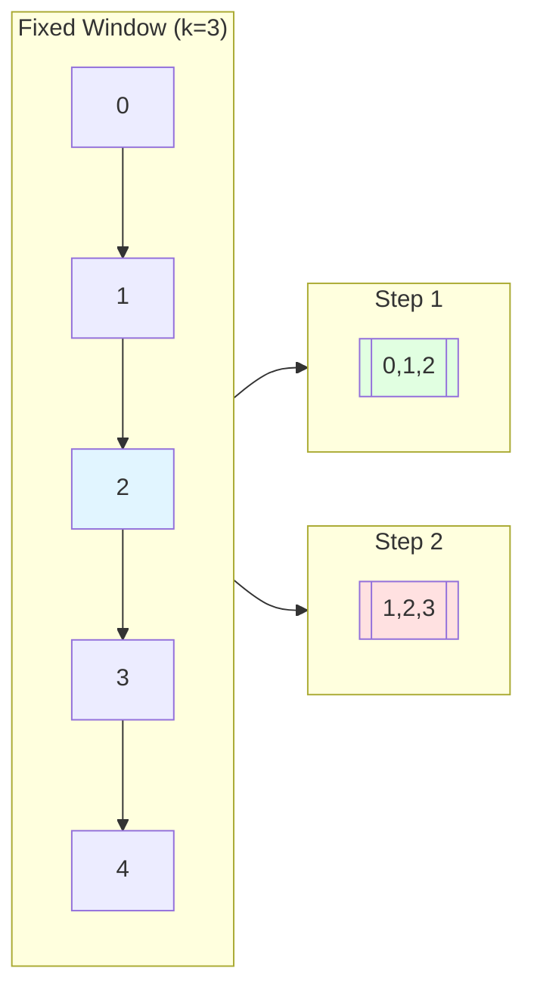
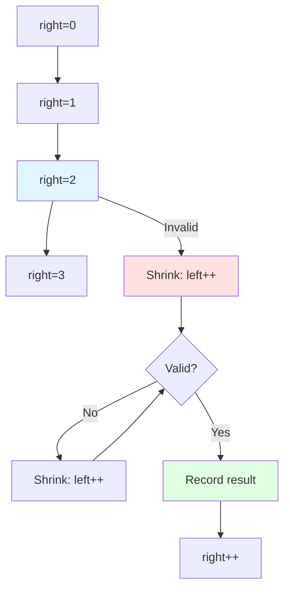
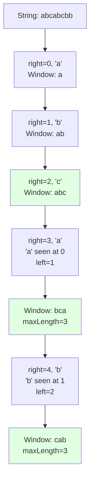

# 滑动窗口模式

## 为什么滑动窗口很重要

滑动窗口优化涉及子数组或子串的问题——将 O(n²) 降低到 O(n)：

- **子串搜索**：查找具有特定属性的最长/最短子串
- **子数组问题**：最大和子数组、满足约束的最长子数组
- **限流**：在时间窗口内跟踪请求
- **流处理**：在滑动时间窗口上计算聚合

**实际影响**：
- 查找不含重复字符的最长子串：
  - 暴力法：O(n²) 检查所有子串
  - 滑动窗口：O(n) 单次遍历——**对 100K 字符的字符串快 100,000 倍**
- 网络流量分析：在滚动窗口中监控带宽使用

## 核心概念

### 固定大小窗口

窗口大小恒定，在数组上滑动：

```java
int windowSize = k;
for (int i = 0; i < arr.length - k + 1; i++) {
    // 处理窗口 [i, i + k)
}
```



**使用场景**：
- k 个连续元素的最大和
- 大小为 k 的子数组的平均值
- 固定窗口内的计数

### 可变大小窗口

窗口根据条件扩大和缩小：

```java
int left = 0;
for (int right = 0; right < arr.length; right++) {
    // 将 arr[right] 加入窗口

    // 当窗口无效时缩小
    while (windowInvalid()) {
        // 从窗口移除 arr[left]
        left++;
    }

    // 窗口 [left, right] 有效
}
```



**使用场景**：
- 满足约束的最长子串
- 包含所有字符的最短子串
- 满足和约束的最大子数组

## 深入理解

### 固定窗口：最大平均子数组

查找长度为 k 的任意连续子数组的最大平均值：

```java
public double findMaxAverage(int[] nums, int k) {
    // 计算第一个窗口的和
    int sum = 0;
    for (int i = 0; i < k; i++) {
        sum += nums[i];
    }

    int maxSum = sum;

    // 滑动窗口
    for (int i = k; i < nums.length; i++) {
        sum += nums[i] - nums[i - k];  // 加入新元素，移除旧元素
        maxSum = Math.max(maxSum, sum);
    }

    return (double) maxSum / k;
}
```

**关键洞察**：通过加入新元素和移除离开窗口的元素，以 O(1) 更新和

### 可变窗口：无重复字符的最长子串

```java
public int lengthOfLongestSubstring(String s) {
    Map<Character, Integer> lastIndex = new HashMap<>();
    int left = 0, maxLength = 0;

    for (int right = 0; right < s.length(); right++) {
        char c = s.charAt(right);

        // 如果字符出现过且在当前窗口内
        if (lastIndex.containsKey(c) && lastIndex.get(c) >= left) {
            // 将左指针移过上一次出现的位置
            left = lastIndex.get(c) + 1;
        }

        // 更新最后出现的位置
        lastIndex.put(c, right);

        // 更新最大长度
        maxLength = Math.max(maxLength, right - left + 1);
    }

    return maxLength;
}
```



### 最小覆盖子串

在 s 中找到包含 t 所有字符的最小窗口：

```java
public String minWindow(String s, String t) {
    if (s.length() < t.length()) return "";

    // 统计 t 中的字符
    Map<Character, Integer> need = new HashMap<>();
    for (char c : t.toCharArray()) {
        need.merge(c, 1, Integer::sum);
    }

    // 跟踪需要匹配的字符数
    int required = need.size();
    int formed = 0;

    // 窗口字符计数
    Map<Character, Integer> window = new HashMap<>();

    int left = 0, right = 0;
    int[] result = {-1, 0, 0};  // {length, left, right}

    while (right < s.length()) {
        // 从右侧添加字符
        char c = s.charAt(right);
        window.merge(c, 1, Integer::sum);

        // 检查是否有足够的该字符
        if (need.containsKey(c) && window.get(c).intValue() == need.get(c).intValue()) {
            formed++;
        }

        // 尝试在窗口有效时缩小
        while (left <= right && formed == required) {
            c = s.charAt(left);

            // 如果窗口更小则更新结果
            if (result[0] == -1 || right - left + 1 < result[0]) {
                result[0] = right - left + 1;
                result[1] = left;
                result[2] = right;
            }

            // 从左侧移除字符
            window.merge(c, -1, Integer::sum);
            if (need.containsKey(c) && window.get(c) < need.get(c)) {
                formed--;
            }

            left++;
        }

        right++;
    }

    return result[0] == -1 ? "" : s.substring(result[1], result[2] + 1);
}
```

**双指针扩展与收缩**：
1. **扩展**：移动右指针，添加字符
2. **检查**：如果窗口有效（包含所有字符），尝试缩小
3. **收缩**：在窗口保持有效时移动左指针
4. **记录**：更新最小窗口

### 常见陷阱

#### ❌ 窗口无效时不收缩

```java
for (int right = 0; right < nums.length; right++) {
    sum += nums[right];

    if (sum >= target) {  // BUG：只检查一次
        minLength = Math.min(minLength, right - left + 1);
    }
}
```

#### ✅ 使用 while 循环收缩

```java
for (int right = 0; right < nums.length; right++) {
    sum += nums[right];

    while (sum >= target) {  // 收缩直到无效
        minLength = Math.min(minLength, right - left + 1);
        sum -= nums[left];
        left++;
    }
}
```

#### ❌ 窗口大小差一错误

```java
int windowSize = right - left;  // BUG：应该是 right - left + 1
```

#### ✅ 包含两端边界

```java
int windowSize = right - left + 1;  // 正确
```

#### ❌ 收缩时忘记移除左侧元素

```java
while (invalid) {
    left++;  // BUG：没有从 sum 中移除 nums[left]
}
```

#### ✅ 先移除再移动指针

```java
while (invalid) {
    sum -= nums[left];  // 先移除
    left++;             // 再移动
}
```

### 进阶模式

#### 和不超过 K 的最长子数组

```java
public int longestSubarray(int[] nums, int k) {
    int left = 0, sum = 0, maxLength = 0;

    for (int right = 0; right < nums.length; right++) {
        sum += nums[right];

        // 当和超过 k 时收缩
        while (sum > k && left <= right) {
            sum -= nums[left];
            left++;
        }

        maxLength = Math.max(maxLength, right - left + 1);
    }

    return maxLength;
}
```

#### 恰好包含 K 个 1 的子数组数

```java
public int numSubarraysWithK(int[] nums, int k) {
    // 最多 K 个 1 的子数组数 - 最多 K-1 个 1 的子数组数
    return atMostK(nums, k) - atMostK(nums, k - 1);
}

private int atMostK(int[] nums, int k) {
    int left = 0, count = 0, sum = 0;

    for (int right = 0; right < nums.length; right++) {
        sum += nums[right];

        while (sum > k) {
            sum -= nums[left];
            left++;
        }

        count += right - left + 1;
    }

    return count;
}
```

**容斥原理**：恰好 K = 最多 K - 最多 (K-1)

#### 字符串的排列

检查 s2 是否包含 s1 的排列：

```java
public boolean checkInclusion(String s1, String s2) {
    if (s1.length() > s2.length()) return false;

    int[] count = new int[26];

    // 统计 s1 中的字符
    for (char c : s1.toCharArray()) {
        count[c - 'a']++;
    }

    // 滑动窗口
    for (int i = 0; i < s2.length(); i++) {
        // 添加新字符
        count[s2.charAt(i) - 'a']--;

        // 移除离开窗口的字符
        if (i >= s1.length()) {
            count[s2.charAt(i - s1.length()) - 'a']++;
        }

        // 检查是否所有计数为零
        if (i >= s1.length() - 1) {
            boolean allZero = true;
            for (int j = 0; j < 26; j++) {
                if (count[j] != 0) {
                    allZero = false;
                    break;
                }
            }
            if (allZero) return true;
        }
    }

    return false;
}
```

## 实际应用

### 滑动窗口限流器

```java
public class SlidingWindowRateLimiter {
    private final Queue<Long> timestamps;
    private final int maxRequests;
    private final long windowSizeMs;

    public SlidingWindowRateLimiter(int maxRequests, long windowSizeMs) {
        this.timestamps = new LinkedList<>();
        this.maxRequests = maxRequests;
        this.windowSizeMs = windowSizeMs;
    }

    public synchronized boolean allowRequest(long currentTime) {
        // 移除过期时间戳
        while (!timestamps.isEmpty() &&
               currentTime - timestamps.peek() > windowSizeMs) {
            timestamps.poll();
        }

        if (timestamps.size() < maxRequests) {
            timestamps.offer(currentTime);
            return true;
        }

        return false;
    }

    public long getWaitTimeMs(long currentTime) {
        if (timestamps.size() < maxRequests) return 0;

        long oldestTimestamp = timestamps.peek();
        long elapsed = currentTime - oldestTimestamp;
        return Math.max(0, windowSizeMs - elapsed + 1);
    }
}
```

### 数据流移动平均

```java
public class MovingAverage {
    private final Queue<Integer> window;
    private final int size;
    private double sum;

    public MovingAverage(int size) {
        this.window = new LinkedList<>();
        this.size = size;
        this.sum = 0;
    }

    public double next(int val) {
        window.offer(val);
        sum += val;

        if (window.size() > size) {
            sum -= window.poll();
        }

        return sum / window.size();
    }
}
```

### 最多 K 个不同字符的最长子串

```java
public int lengthOfLongestSubstringKDistinct(String s, int k) {
    if (k == 0) return 0;

    Map<Character, Integer> count = new HashMap<>();
    int left = 0, maxLength = 0;

    for (int right = 0; right < s.length(); right++) {
        char c = s.charAt(right);
        count.merge(c, 1, Integer::sum);

        // 当不同字符超过 K 时收缩
        while (count.size() > k) {
            char leftChar = s.charAt(left);
            count.merge(leftChar, -1, Integer::sum);
            if (count.get(leftChar) == 0) {
                count.remove(leftChar);
            }
            left++;
        }

        maxLength = Math.max(maxLength, right - left + 1);
    }

    return maxLength;
}
```

## 面试题

### Q1：最大平均子数组 I（简单）

**题目**：查找长度为 k 的子数组的最大平均值。

**方法**：固定滑动窗口

**复杂度**：O(n) 时间，O(1) 空间

```java
public double findMaxAverage(int[] nums, int k) {
    int sum = 0;
    for (int i = 0; i < k; i++) {
        sum += nums[i];
    }

    int maxSum = sum;
    for (int i = k; i < nums.length; i++) {
        sum += nums[i] - nums[i - k];
        maxSum = Math.max(maxSum, sum);
    }

    return (double) maxSum / k;
}
```

### Q2：子串中元音的最大数量（简单）

**题目**：查找长度为 k 的子串中的最多元音数。

**方法**：固定窗口 + 元音检查

**复杂度**：O(n) 时间，O(1) 空间

```java
public int maxVowels(String s, int k) {
    Set<Character> vowels = Set.of('a', 'e', 'i', 'o', 'u');
    int count = 0, maxCount = 0;

    // 第一个窗口
    for (int i = 0; i < k; i++) {
        if (vowels.contains(s.charAt(i))) count++;
    }
    maxCount = count;

    // 滑动窗口
    for (int i = k; i < s.length(); i++) {
        if (vowels.contains(s.charAt(i))) count++;
        if (vowels.contains(s.charAt(i - k))) count--;
        maxCount = Math.max(maxCount, count);
    }

    return maxCount;
}
```

### Q3：无重复字符的最长子串（中等）

**题目**：查找所有字符唯一的最长子串。

**方法**：可变窗口 + 字符映射

**复杂度**：O(n) 时间，O(min(m, n)) 空间（m = 字符集大小）

```java
public int lengthOfLongestSubstring(String s) {
    Map<Character, Integer> lastIndex = new HashMap<>();
    int left = 0, maxLength = 0;

    for (int right = 0; right < s.length(); right++) {
        char c = s.charAt(right);

        if (lastIndex.containsKey(c) && lastIndex.get(c) >= left) {
            left = lastIndex.get(c) + 1;
        }

        lastIndex.put(c, right);
        maxLength = Math.max(maxLength, right - left + 1);
    }

    return maxLength;
}
```

### Q4：字符串的排列（中等）

**题目**：检查 s2 是否包含 s1 的排列。

**方法**：固定窗口 + 字符计数

**复杂度**：O(n) 时间，O(1) 空间（26 个字母）

```java
public boolean checkInclusion(String s1, String s2) {
    if (s1.length() > s2.length()) return false;

    int[] count = new int[26];

    for (char c : s1.toCharArray()) {
        count[c - 'a']++;
    }

    for (int i = 0; i < s2.length(); i++) {
        count[s2.charAt(i) - 'a']--;

        if (i >= s1.length()) {
            count[s2.charAt(i - s1.length()) - 'a']++;
        }

        if (i >= s1.length() - 1 && allZero(count)) {
            return true;
        }
    }

    return false;
}

private boolean allZero(int[] count) {
    for (int c : count) {
        if (c != 0) return false;
    }
    return true;
}
```

### Q5：最小长度子数组和（中等）

**题目**：查找和 ≥ target 的最小长度子数组。

**方法**：可变窗口，有效时收缩

**复杂度**：O(n) 时间，O(1) 空间

```java
public int minSubArrayLen(int target, int[] nums) {
    int left = 0, sum = 0, minLength = Integer.MAX_VALUE;

    for (int right = 0; right < nums.length; right++) {
        sum += nums[right];

        while (sum >= target) {
            minLength = Math.min(minLength, right - left + 1);
            sum -= nums[left];
            left++;
        }
    }

    return minLength == Integer.MAX_VALUE ? 0 : minLength;
}
```

### Q6：最多 K 个不同字符的最长子串（中等）

**题目**：查找包含 ≤ K 个不同字符的最长子串。

**方法**：可变窗口 + 字符计数

**复杂度**：O(n) 时间，O(k) 空间

```java
public int lengthOfLongestSubstringKDistinct(String s, int k) {
    if (k == 0) return 0;

    Map<Character, Integer> count = new HashMap<>();
    int left = 0, maxLength = 0;

    for (int right = 0; right < s.length(); right++) {
        count.merge(s.charAt(right), 1, Integer::sum);

        while (count.size() > k) {
            char leftChar = s.charAt(left);
            count.merge(leftChar, -1, Integer::sum);
            if (count.get(leftChar) == 0) {
                count.remove(leftChar);
            }
            left++;
        }

        maxLength = Math.max(maxLength, right - left + 1);
    }

    return maxLength;
}
```

### Q7：滑动窗口最大值（困难）

**题目**：查找每个大小为 k 的滑动窗口中的最大值。

**方法**：单调双端队列（递减顺序）

**复杂度**：O(n) 时间，O(k) 空间

```java
public int[] maxSlidingWindow(int[] nums, int k) {
    int n = nums.length;
    int[] result = new int[n - k + 1];
    Deque<Integer> deque = new ArrayDeque<>();  // 存储索引

    for (int i = 0; i < n; i++) {
        // 移除窗口外的索引
        while (!deque.isEmpty() && deque.peekFirst() < i - k + 1) {
            deque.pollFirst();
        }

        // 移除较小的元素
        while (!deque.isEmpty() && nums[deque.peekLast()] < nums[i]) {
            deque.pollLast();
        }

        deque.offerLast(i);

        if (i >= k - 1) {
            result[i - k + 1] = nums[deque.peekFirst()];
        }
    }

    return result;
}
```

## 延伸阅读

- **双指针**：通常实现滑动窗口
- **哈希表**：跟踪字符/元素频率
- **双端队列**：单调双端队列用于滑动窗口最大值
- **LeetCode**：[滑动窗口题目](https://leetcode.com/tag/sliding-window/)
