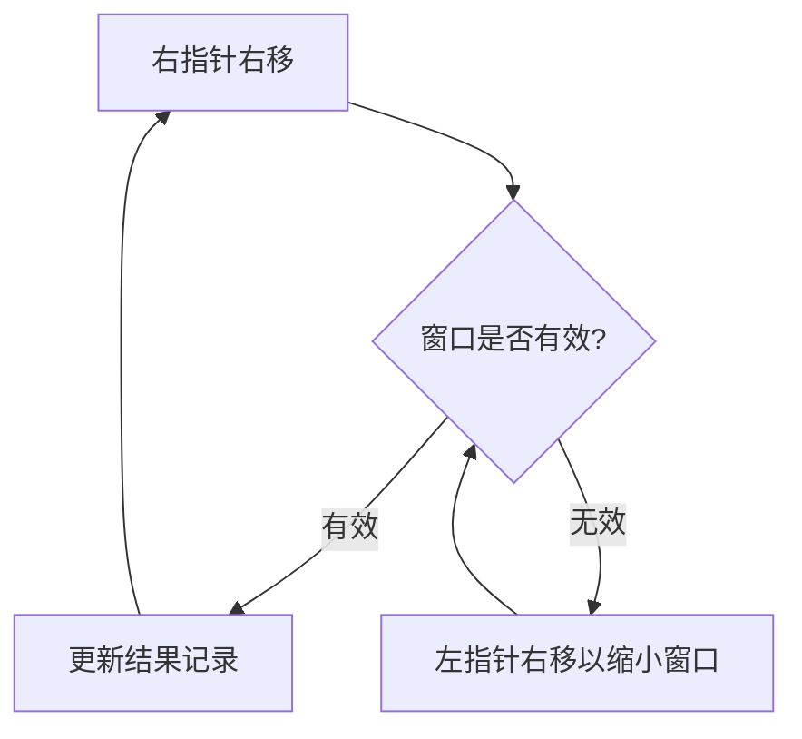

# 滑动窗口模式 (Sliding Window)

## 为什么滑动窗口很重要

滑动窗口技术专门用于优化涉及“子数组”或“子串”的问题。它能将暴力解法的 $O(n^2)$ 复杂度降低到 $O(n)$：

- **子串搜索**：寻找满足特定条件的超长/最短子串。
- **子数组计算**：最大连续和、满足约束的最长子数组。
- **速率限制**：在特定的时间窗口内追踪请求频率。
- **流处理**：在持续的数据流中计算滑动聚合指标。

**实际影响**：
- 在 10 万字符的字符串中寻找无重复字符的最长子串：
  - 暴力法：检查所有可能的子串（约 50 亿次操作）。
  - 滑动窗口：仅需一次遍历（10 万次操作） —— **效率提升 5 万倍**。

---

## 核心模式

### 1. 固定窗口 (Fixed-Size Window)
窗口大小 $k$ 保持不变，像滑块一样在数组上平移。
- **策略**：先计算第一个窗口的结果，随后每移一步，加上新进入的元素，减去刚离开的元素。

### 2. 动态窗口 (Dynamic-Size Window)
窗口大小根据约束条件伸缩。
- **逻辑流程**：
  1. **右边界扩张**：寻找可行解。
  2. **左边界收缩**：在满足条件的前提下，寻找最优解或排除非法状态。

---

## 深入理解

### 最长无重复字符子串
**核心逻辑**：使用 HashMap 记录字符最后出现的位置。当遇到重复字符且该位置在当前窗口内时，直接将左边界跳转到重复位置的下一位，从而跳过无效计算。

### 最小覆盖子串 (Hard)
**核心逻辑**：
- **扩张**：移动右指针直到窗口包含了目标字符串的所有字符。
- **收缩**：移动左指针直到窗口刚好不再满足条件。
- **记录**：在收缩过程中不断更新最小窗口的长度和起始位置。

---

## 常见陷阱与规避

1. **窗口长度计算**：索引为 $[left, right]$ 的窗口长度是 `right - left + 1`，而非 `right - left`。
2. **忘记收缩窗口**：对于“连续子数组和 $\ge K$”这类问题，必须使用 `while` 循环而非 `if` 来持续收缩左边界。
3. **元素移出处理**：在移动左指针前，务必先从当前窗口的统计数据（如 `sum` 或 `countMap`）中移除该元素。

---

## 实战应用

### 基于滑动窗口的限流器
**原理**：维护一个时间戳队列。每当新请求到来时，移除队列中超出当前时间窗口（如 1 分钟）的旧戳。若队列大小未达上限，则允许请求。

### 数据流移动平均值
**场景**：实时计算最近 1000 个采样点的平均响应时间。

---

## 面试高频题

### Q1: 子数组最大平均数 (简单)
**思路**：固定窗口。维护长度为 $k$ 的滑动窗口之和。

### Q2: 无重复字符的最长子串 (中等)
**思路**：变长窗口 + 哈希映射记录位置。

### Q3: 长度最小的子数组 (中等)
**思路**：变长窗口。当 `sum >= target` 时，尝试收缩左边界以寻找更短的数组。

### Q4: 滑动窗口最大值 (困难)
**思路**：结合单调队列。确保队列头部始终是当前窗口内的最大值索引。

---

## 延伸阅读

- **双指针关联**：滑动窗口本质上是双指针的一种特殊应用。
- **哈希映射技巧**：如何利用频率表优化窗口校验速度。
- **LeetCode**：[滑动窗口标签题目](https://leetcode.com/tag/sliding-window/)
