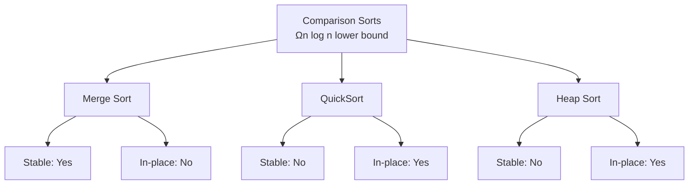

# 排序算法

## 为什么排序很重要

排序是高效数据处理的基础——支持二分搜索、重复检测和数据分析：

- **数据库查询**：ORDER BY 使用优化的排序
- **搜索优化**：二分搜索需要有序数据
- **数据分析**：查找中位数、百分位数、异常值
- **效率**：许多算法假设输入已排序

**实际影响**：
- 对 100 万个整数排序：
  - 冒泡排序：约 1 小时（O(n²)）
  - 快速排序：约 50ms（O(n log n)）—**快 70,000 倍**
- Java 的 `Arrays.sort()` 使用混合 TimSort 以获得最佳性能

## 核心概念

### 比较排序

所有比较排序的时间复杂度下界为 **O(n log n)**：



### 非比较排序

通过利用数据特性可以达到 **O(n)**：

| 算法 | 时间 | 空间 | 稳定 | 约束条件 |
|------|------|------|------|---------|
| **计数排序** | O(n + k) | O(k) | 是 | 小整数范围 |
| **基数排序** | O(d × n) | O(n + k) | 是 | 整数/字符串键 |
| **桶排序** | O(n + k) | O(n) | 是 | 均匀分布 |

其中：
- `k` = 值的范围（计数/桶排序）
- `d` = 位数（基数排序）

### 稳定性

**稳定排序**保持相等元素的相对顺序：

```
排序前：[(Alice, 25), (Bob, 20), (Charlie, 25)]
按年龄稳定排序后：
        [(Bob, 20), (Alice, 25), (Charlie, 25)]
                                ↑
                    Alice 在 Charlie 前（稳定）
```

**为什么稳定性重要**：
- 按多条件排序（如先按部门，再按薪资）
- 维持有意义的相对顺序

## 深入分析

### 归并排序（Merge Sort）

将数组一分为二，递归排序，合并有序的两半：

```java
public void mergeSort(int[] arr, int left, int right) {
    if (left < right) {
        int mid = left + (right - left) / 2;

        mergeSort(arr, left, mid);      // 排序左半部分
        mergeSort(arr, mid + 1, right);  // 排序右半部分

        merge(arr, left, mid, right);    // 合并
    }
}

private void merge(int[] arr, int left, int mid, int right) {
    // 创建临时数组
    int[] leftArr = Arrays.copyOfRange(arr, left, mid + 1);
    int[] rightArr = Arrays.copyOfRange(arr, mid + 1, right + 1);

    int i = 0, j = 0, k = left;

    while (i < leftArr.length && j < rightArr.length) {
        if (leftArr[i] <= rightArr[j]) {
            arr[k++] = leftArr[i++];
        } else {
            arr[k++] = rightArr[j++];
        }
    }

    // 复制剩余元素
    while (i < leftArr.length) arr[k++] = leftArr[i++];
    while (j < rightArr.length) arr[k++] = rightArr[j++];
}
```

**复杂度**：O(n log n) 时间，O(n) 空间
**稳定性**：是（因为使用 `<=` 比较）

**优点**：
- 保证 O(n log n) 性能
- 稳定
- 适合链表（O(1) 额外空间）

**缺点**：
- 非原地排序（需要 O(n) 额外空间）
- 由于复制操作，实际速度比快速排序慢

### 快速排序（QuickSort）

围绕基准元素分区，递归排序分区：

```java
public void quickSort(int[] arr, int low, int high) {
    if (low < high) {
        int pivotIndex = partition(arr, low, high);

        quickSort(arr, low, pivotIndex - 1);
        quickSort(arr, pivotIndex + 1, high);
    }
}

private int partition(int[] arr, int low, int high) {
    int pivot = arr[high];  // 选择最后一个元素作为基准
    int i = low - 1;  // 较小元素的索引

    for (int j = low; j < high; j++) {
        if (arr[j] <= pivot) {
            i++;
            swap(arr, i, j);
        }
    }

    swap(arr, i + 1, high);
    return i + 1;
}

private void swap(int[] arr, int i, int j) {
    int temp = arr[i];
    arr[i] = arr[j];
    arr[j] = temp;
}
```

**复杂度**：平均 O(n log n)，最坏 O(n²) 时间，O(log n) 空间
**稳定性**：否（由于分区操作）

**优点**：
- 原地排序（递归栈空间 O(log n)）
- 实际运行快（缓存友好）
- 可通过随机化基准优化

**缺点**：
- 已排序数组上最坏 O(n²)
- 不稳定
- 对基准选择敏感

### 堆排序（Heap Sort）

构建最大堆，反复提取最大值：

```java
public void heapSort(int[] arr) {
    int n = arr.length;

    // 构建最大堆
    for (int i = n / 2 - 1; i >= 0; i--) {
        heapify(arr, n, i);
    }

    // 从堆中提取元素
    for (int i = n - 1; i > 0; i--) {
        swap(arr, 0, i);  // 将当前最大值移到末尾
        heapify(arr, i, 0);  // 对缩小后的堆进行堆化
    }
}

private void heapify(int[] arr, int n, int i) {
    int largest = i;  // 初始化最大值为根节点
    int left = 2 * i + 1;
    int right = 2 * i + 2;

    if (left < n && arr[left] > arr[largest]) {
        largest = left;
    }

    if (right < n && arr[right] > arr[largest]) {
        largest = right;
    }

    if (largest != i) {
        swap(arr, i, largest);
        heapify(arr, n, largest);
    }
}
```

**复杂度**：O(n log n) 时间，O(1) 空间
**稳定性**：否

**优点**：
- 保证 O(n log n) 性能
- 原地排序
- 不需要额外内存

**缺点**：
- 不稳定
- 实际速度比快速排序慢
- 缓存局部性差

### 非比较排序

#### 计数排序

统计出现次数，重建有序数组：

```java
public void countingSort(int[] arr) {
    int max = Arrays.stream(arr).max().getAsInt();
    int min = Arrays.stream(arr).min().getAsInt();
    int range = max - min + 1;

    int[] count = new int[range];
    int[] output = new int[arr.length];

    // 统计出现次数
    for (int num : arr) {
        count[num - min]++;
    }

    // 计算累积计数
    for (int i = 1; i < range; i++) {
        count[i] += count[i - 1];
    }

    // 构建输出数组（稳定）
    for (int i = arr.length - 1; i >= 0; i--) {
        output[count[arr[i] - min] - 1] = arr[i];
        count[arr[i] - min]--;
    }

    System.arraycopy(output, 0, arr, 0, arr.length);
}
```

**复杂度**：O(n + k) 时间，O(k) 空间

**适用场景**：范围 `k` 为 O(n) 时

#### 基数排序

按每一位排序，从最低位到最高位：

```java
public void radixSort(int[] arr) {
    int max = Arrays.stream(arr).max().getAsInt();

    // 按每一位排序
    for (int exp = 1; max / exp > 0; exp *= 10) {
        countingSortByDigit(arr, exp);
    }
}

private void countingSortByDigit(int[] arr, int exp) {
    int[] output = new int[arr.length];
    int[] count = new int[10];

    // 统计出现次数
    for (int num : arr) {
        count[(num / exp) % 10]++;
    }

    // 累积计数
    for (int i = 1; i < 10; i++) {
        count[i] += count[i - 1];
    }

    // 构建输出（稳定）
    for (int i = arr.length - 1; i >= 0; i--) {
        output[count[(arr[i] / exp) % 10] - 1] = arr[i];
        count[(arr[i] / exp) % 10]--;
    }

    System.arraycopy(output, 0, arr, 0, arr.length);
}
```

**复杂度**：O(d × (n + k)) 时间，O(n + k) 空间

### Java 的排序算法

#### 基本类型的 Arrays.sort()

使用**双轴快速排序（Dual-Pivot Quicksort）**：
- 使用两个基准而非一个
- 更好的缓存局部性
- 平均比标准快速排序更快

#### 对象的 Arrays.sort()

使用 **TimSort**（归并排序和插入排序的混合）：
- 将数组分为多个 run
- 用插入排序对小 run 排序
- 自适应合并 run
- 稳定排序
- 针对真实世界（部分有序）数据优化

## 实际应用

### 自定义对象排序

```java
class Person {
    String name;
    int age;
    int salary;
}

// 按年龄排序
Arrays.sort(people, Comparator.comparingInt(p -> p.age));

// 按姓名排序，再按年龄排序（对同名元素稳定）
Arrays.sort(people, Comparator
    .comparing((Person p) -> p.name)
    .thenComparingInt(p -> p.age));

// 逆序
Arrays.sort(people, Comparator.comparingInt(Person::getAge).reversed());
```

### 二进制数组排序

```java
public void sortBinary(int[] arr) {
    int left = 0, right = arr.length - 1;

    while (left < right) {
        while (left < right && arr[left] == 0) left++;
        while (left < right && arr[right] == 1) right--;

        if (left < right) {
            arr[left] = 0;
            arr[right] = 1;
            left++;
            right--;
        }
    }
}
```

### 按频率排序

```java
public int[] frequencySort(int[] nums) {
    Map<Integer, Integer> freq = new HashMap<>();
    for (int num : nums) {
        freq.merge(num, 1, Integer::sum);
    }

    return Arrays.stream(nums)
        .boxed()
        .sorted((a, b) -> {
            int freqCompare = freq.get(b) - freq.get(a);
            return freqCompare != 0 ? freqCompare : b - a;
        })
        .mapToInt(Integer::intValue)
        .toArray();
}
```

## 面试题

### Q1：合并有序数组（简单）

**题目**：原地合并两个有序数组。

**方法**：从末尾合并

**复杂度**：O(n + m) 时间，O(1) 空间

```java
public void merge(int[] nums1, int m, int[] nums2, int n) {
    int p1 = m - 1, p2 = n - 1, p = m + n - 1;

    while (p1 >= 0 && p2 >= 0) {
        if (nums1[p1] > nums2[p2]) {
            nums1[p--] = nums1[p1--];
        } else {
            nums1[p--] = nums2[p2--];
        }
    }

    while (p2 >= 0) {
        nums1[p--] = nums2[p2--];
    }
}
```

### Q2：排序数组（中等）

**题目**：实现快速排序。

**方法**：围绕基准分区

**复杂度**：平均 O(n log n)，最坏 O(n²)

```java
public int[] sortArray(int[] nums) {
    quickSort(nums, 0, nums.length - 1);
    return nums;
}

private void quickSort(int[] nums, int low, int high) {
    if (low < high) {
        int pivot = partition(nums, low, high);
        quickSort(nums, low, pivot - 1);
        quickSort(nums, pivot + 1, high);
    }
}

private int partition(int[] nums, int low, int high) {
    int pivot = nums[high];
    int i = low;
    for (int j = low; j < high; j++) {
        if (nums[j] < pivot) {
            swap(nums, i++, j);
        }
    }
    swap(nums, i, high);
    return i;
}
```

### Q3：颜色排序（中等）

**题目**：对由 0、1、2 组成的数组排序（荷兰国旗问题）。

**方法**：三路分区

**复杂度**：O(n) 时间，O(1) 空间

```java
public void sortColors(int[] nums) {
    int low = 0, mid = 0, high = nums.length - 1;

    while (mid <= high) {
        if (nums[mid] == 0) {
            swap(nums, low++, mid++);
        } else if (nums[mid] == 1) {
            mid++;
        } else {
            swap(nums, mid, high--);
        }
    }
}
```

## 延伸阅读

- **二分搜索**：需要有序输入
- **堆**：堆排序使用优先队列
- **分治法**：归并排序策略
- **LeetCode**：[排序问题](https://leetcode.com/tag/sort/)
