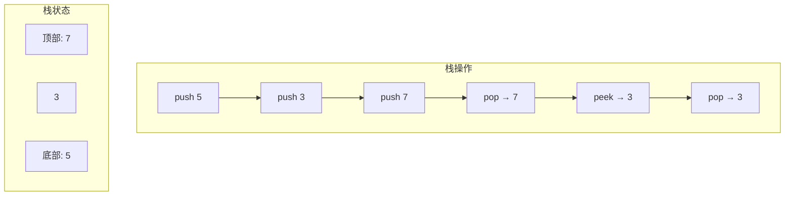
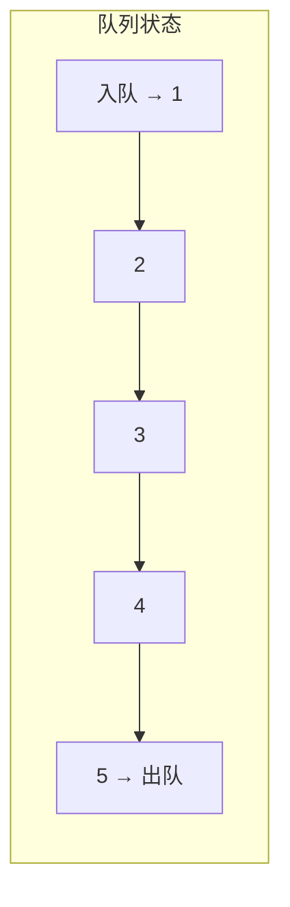
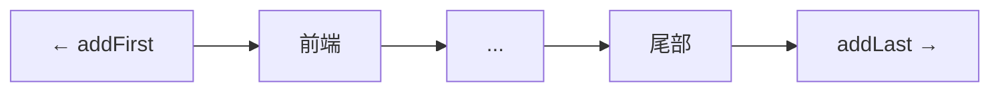

# 栈与队列

## 为什么栈与队列很重要

栈和队列提供有序的访问模式，对管理数据流至关重要：

- **栈（LIFO）**：函数调用、撤销操作、表达式求值、回溯
- **队列（FIFO）**：任务调度、消息队列、请求处理、广度优先搜索
- **双端队列**：两端操作（滑动窗口、回文检查）
- **优先队列**：任务调度、Dijkstra算法、事件模拟

**实际影响**：每个Web服务器都使用请求队列。队列设计不当可能导致负载下出现503错误，而带有背压的正确设计能处理10倍以上的请求。

## 核心概念

### 栈（后进先出）



**Java实现**：
```java
// 基于数组的栈
Deque<Integer> stack = new ArrayDeque<>();

stack.push(1);   // O(1)
stack.push(2);
stack.pop();     // 返回2，O(1)
stack.peek();    // 返回1，O(1)
stack.isEmpty(); // O(1)
```

**关键操作**：
- `push(E e)`：添加到顶部 - O(1)
- `pop()`：移除并返回顶部 - O(1)
- `peek()`：返回顶部不移除 - O(1)
- `isEmpty()`：检查是否为空 - O(1)

### 队列（先进先出）



**Java实现**：
```java
Queue<Integer> queue = new LinkedList<>();
// 更快的方式：Queue<Integer> queue = new ArrayDeque<>();

queue.offer(1);  // 入队，O(1)
queue.offer(2);
queue.poll();    // 出队返回1，O(1)
queue.peek();    // 返回2，O(1)
```

**关键操作**：
- `offer(E e)`：添加到尾部 - O(1)
- `poll()`：移除并返回头部 - O(1)
- `peek()`：返回头部不移除 - O(1)

### 双端队列（Deque）

支持在两端插入和删除：

```java
Deque<Integer> deque = new ArrayDeque<>();

// 栈操作
deque.push(1);      // 添加到前端
deque.pop();        // 从前端移除

// 队列操作
deque.offer(1);     // 添加到尾部
deque.poll();       // 从前端移除

// 双端队列特有操作
deque.addFirst(1);  // 添加到前端
deque.addLast(2);   // 添加到尾部
deque.removeFirst();
deque.removeLast();
```



### 实现方式对比

| 实现方式 | 栈推弹操作 | 队列入队出队 | 随机访问 | 内存开销 | 最佳用途 |
|----------------|----------------|------------------|----------------|-----------------|----------|
| **ArrayDeque** | O(1) | O(1) | 否 | 低 | 通用目的（最快） |
| **LinkedList** | O(1) | O(1) | 否 | 高（节点对象） | 频繁的中间插入 |
| **ArrayList作为栈** | O(1) 均摊 | O(n) 移动 | 是 | 低 | 需要随机访问 |
| **PriorityQueue** | O(log n) | O(log n) | 否 | 低 | 基于优先级的排序 |

**推荐**：始终使用 `ArrayDeque`，除非你需要其他实现方式的特定功能。

## 深入探讨

### ArrayDeque实现

ArrayDeque使用循环缓冲区避免调整大小的开销：

```java
public class ArrayDeque<E> {
    transient Object[] elements;
    transient int head;
    transient int tail;

    public void addFirst(E e) {
        elements[head = (head - 1) & (elements.length - 1)] = e;
        if (head == tail) doubleCapacity();
    }

    public void addLast(E e) {
        elements[tail] = e;
        if ((tail = (tail + 1) & (elements.length - 1)) == head) {
            doubleCapacity();
        }
    }
}
```

**循环缓冲区可视化**：
```
大小为8的数组: [_, _, _, _, _, _, _, _]
              h
              t

addFirst(1):   [1, _, _, _, _, _, _, _]
              ht

addLast(2):    [1, _, _, _, _, _, _, 2]
              h                   t

addFirst(3):   [1, _, _, _, _, _, _, 2]
           h   t                  (回绕)
```

**优点**：
- 从两端添加/移除时不需要移动
- 比链表有更好的缓存局部性
- 没有每个元素的开销（无节点对象）

### 单调栈

维持元素按升序/降序排列：

```java
public int[] nextGreaterElement(int[] nums) {
    int n = nums.length;
    int[] result = new int[n];
    Arrays.fill(result, -1);
    Deque<Integer> stack = new ArrayDeque<>();  // 存储索引

    for (int i = 0; i < n; i++) {
        while (!stack.isEmpty() && nums[stack.peek()] < nums[i]) {
            int idx = stack.pop();
            result[idx] = nums[i];  // i是idx的下一个更大元素
        }
        stack.push(i);
    }

    return result;
}
```

**示例**：`[73, 74, 75, 71, 69, 72, 76, 73]`
- 73 → 74（下一个更大）
- 74 → 75
- 75 → 76
- 71 → 72
- 69 → 72
- 72 → 76
- 76 → -1（没有更大的）
- 73 → -1

**应用场景**：
- 下一个更大/更小元素
- 直方图中的最大矩形
- 每日温度
- 股票跨度问题

### 有效括号

```java
public boolean isValid(String s) {
    Deque<Character> stack = new ArrayDeque<>();

    for (char c : s.toCharArray()) {
        if (c == '(' || c == '{' || c == '[') {
            stack.push(c);
        } else {
            if (stack.isEmpty()) return false;

            char open = stack.pop();
            if (!isMatchingPair(open, c)) {
                return false;
            }
        }
    }

    return stack.isEmpty();
}

private boolean isMatchingPair(char open, char close) {
    return (open == '(' && close == ')') ||
           (open == '{' && close == '}') ||
           (open == '[' && close == ']');
}
```

### 常见陷阱

#### ❌ 使用Stack类（遗留代码）

```java
Stack<Integer> stack = new Stack<>();  // 同步，慢
```

#### ✅ 使用ArrayDeque

```java
Deque<Integer> stack = new ArrayDeque<>();  // 不同步，快
```

#### ❌ 忘记检查空栈

```java
while (true) {
    int val = stack.pop();  // 空栈时抛出EmptyStackException
}
```

#### ✅ 轮询前检查

```java
while (!stack.isEmpty()) {
    int val = stack.pop();
}
```

或者使用 `poll()` 返回 `null` 而不是抛出异常：
```java
Integer val = stack.poll();  // 空时返回null
if (val != null) {
    // 处理val
}
```

#### ❌ 队列容量问题

```java
// 无容量限制的LinkedBlockingQueue
BlockingQueue<Task> queue = new LinkedBlockingQueue<>();
// 可以无限增长 → OOM
```

#### ✅ 带背压的边界队列

```java
BlockingQueue<Task> queue = new ArrayBlockingQueue<>(1000);

// 生产者：处理拒绝
public void submit(Task task) {
    if (!queue.offer(task)) {  // 满时返回false
        // 应用背压：等待、拒绝或丢弃
        throw new RejectedExecutionException("队列已满");
    }
}

// 或使用超时
try {
    boolean success = queue.offer(task, 1, TimeUnit.SECONDS);
    if (!success) {
        // 处理超时
    }
} catch (InterruptedException e) {
    Thread.currentThread().interrupt();
}
```

### 高级操作

#### 用栈实现队列

```java
class MyQueue {
    private Deque<Integer> inStack = new ArrayDeque<>();
    private Deque<Integer> outStack = new ArrayDeque<>();

    public void push(int x) {
        inStack.push(x);
    }

    public int pop() {
        if (outStack.isEmpty()) {
            while (!inStack.isEmpty()) {
                outStack.push(inStack.pop());
            }
        }
        return outStack.pop();
    }

    public int peek() {
        if (outStack.isEmpty()) {
            while (!inStack.isEmpty()) {
                outStack.push(inStack.pop());
            }
        }
        return outStack.peek();
    }

    public boolean empty() {
        return inStack.isEmpty() && outStack.isEmpty();
    }
}
```

**均摊O(1)**：每个元素最多移动两次（进栈→出栈，然后弹出）

#### 用队列实现栈

```java
class MyStack {
    private Queue<Integer> queue = new LinkedList<>();

    public void push(int x) {
        queue.offer(x);
        // 旋转使最新元素在前面
        int size = queue.size();
        for (int i = 0; i < size - 1; i++) {
            queue.offer(queue.poll());
        }
    }

    public int pop() {
        return queue.poll();
    }

    public int top() {
        return queue.peek();
    }

    public boolean empty() {
        return queue.isEmpty();
    }
}
```

#### 最小栈

```java
class MinStack {
    private Deque<int[]> stack = new ArrayDeque<>();  // [值, 当前最小值]

    public void push(int val) {
        int min = stack.isEmpty() ? val : Math.min(stack.peek()[1], val);
        stack.push(new int[]{val, min});
    }

    public void pop() {
        stack.pop();
    }

    public int top() {
        return stack.peek()[0];
    }

    public int getMin() {
        return stack.peek()[1];
    }
}
```

**替代方法**：使用两个栈
```java
class MinStack {
    private Deque<Integer> stack = new ArrayDeque<>();
    private Deque<Integer> minStack = new ArrayDeque<>();

    public void push(int val) {
        stack.push(val);
        minStack.push(minStack.isEmpty() ? val :
                      Math.min(minStack.peek(), val));
    }

    public void pop() {
        stack.pop();
        minStack.pop();
    }

    public int top() {
        return stack.peek();
    }

    public int getMin() {
        return minStack.peek();
    }
}
```

### 滑动窗口最大值

```java
public int[] maxSlidingWindow(int[] nums, int k) {
    if (nums == null || nums.length == 0) return new int[0];

    int n = nums.length;
    int[] result = new int[n - k + 1];
    Deque<Integer> deque = new ArrayDeque<>();  // 存储索引

    for (int i = 0; i < n; i++) {
        // 移除窗口外的索引
        while (!deque.isEmpty() && deque.peekFirst() < i - k + 1) {
            deque.pollFirst();
        }

        // 移除较小的元素（它们不可能是最大值）
        while (!deque.isEmpty() && nums[deque.peekLast()] < nums[i]) {
            deque.pollLast();
        }

        deque.offerLast(i);

        // 记录以i结尾的窗口的最大值
        if (i >= k - 1) {
            result[i - k + 1] = nums[deque.peekFirst()];
        }
    }

    return result;
}
```

**示例**：`nums = [1,3,-1,-3,5,3,6,7], k = 3`
- 窗口 [1,3,-1] → 最大值 3
- 窗口 [3,-1,-3] → 最大值 3
- 窗口 [-1,-3,5] → 最大值 5
- 窗口 [-3,5,3] → 最大值 5
- 窗口 [5,3,6] → 最大值 6
- 窗口 [3,6,7] → 最大值 7

## 实际应用

### 带背压的请求队列

```java
public class RequestQueue {
    private final BlockingQueue<Request> queue;
    private final ExecutorService workers;
    private final int maxQueueSize;

    public RequestQueue(int queueSize, int workerThreads) {
        this.queue = new ArrayBlockingQueue<>(queueSize);
        this.maxQueueSize = queueSize;
        this.workers = Executors.newFixedThreadPool(workerThreads);

        // 启动工作线程
        for (int i = 0; i < workerThreads; i++) {
            workers.submit(this::processRequests);
        }
    }

    public boolean submit(Request request) {
        try {
            // 非阻塞提交
            boolean accepted = queue.offer(request, 100, TimeUnit.MILLISECONDS);

            if (!accepted) {
                // 应用背压
                Metrics.recordRejection();
                return false;
            }

            Metrics.recordQueued();
            return true;
        } catch (InterruptedException e) {
            Thread.currentThread().interrupt();
            return false;
        }
    }

    private void processRequests() {
        while (!Thread.currentThread().isInterrupted()) {
            try {
                Request request = queue.take();  // 阻塞等待
                handleRequest(request);
            } catch (InterruptedException e) {
                Thread.currentThread().interrupt();
                break;
            }
        }
    }

    private void handleRequest(Request request) {
        long start = System.nanoTime();
        try {
            // 处理请求
            request.execute();
            Metrics.recordSuccess(System.nanoTime() - start);
        } catch (Exception e) {
            Metrics.recordFailure(e);
        }
    }

    public int getQueueSize() {
        return queue.size();
    }

    public double getLoadFactor() {
        return (double) queue.size() / maxQueueSize;
    }

    public void shutdown() {
        workers.shutdown();
        try {
            if (!workers.awaitTermination(10, TimeUnit.SECONDS)) {
                workers.shutdownNow();
            }
        } catch (InterruptedException e) {
            workers.shutdownNow();
        }
    }
}
```

### 表达式求值

```java
public class Calculator {
    public int calculate(String expression) {
        Deque<Integer> values = new ArrayDeque<>();
        Deque<Character> ops = new ArrayDeque<>();

        for (int i = 0; i < expression.length(); i++) {
            char c = expression.charAt(i);

            if (Character.isWhitespace(c)) continue;

            if (Character.isDigit(c)) {
                StringBuilder sb = new StringBuilder();
                while (i < expression.length() &&
                       Character.isDigit(expression.charAt(i))) {
                    sb.append(expression.charAt(i++));
                }
                values.push(Integer.parseInt(sb.toString()));
                i--;
            } else if (c == '(') {
                ops.push(c);
            } else if (c == ')') {
                while (ops.peek() != '(') {
                    values.push(applyOp(ops.pop(), values.pop(), values.pop()));
                }
                ops.pop();  // 移除'('
            } else if (isOperator(c)) {
                while (!ops.isEmpty() && hasPrecedence(c, ops.peek())) {
                    values.push(applyOp(ops.pop(), values.pop(), values.pop()));
                }
                ops.push(c);
            }
        }

        while (!ops.isEmpty()) {
            values.push(applyOp(ops.pop(), values.pop(), values.pop()));
        }

        return values.pop();
    }

    private boolean isOperator(char c) {
        return c == '+' || c == '-' || c == '*' || c == '/';
    }

    private boolean hasPrecedence(char op1, char op2) {
        if (op2 == '(' || op2 == ')') return false;
        return (op1 != '*' && op1 != '/') || (op2 != '+' && op2 != '-');
    }

    private int applyOp(char op, int b, int a) {
        switch (op) {
            case '+': return a + b;
            case '-': return a - b;
            case '*': return a * b;
            case '/':
                if (b == 0) throw new ArithmeticException("除零错误");
                return a / b;
        }
        return 0;
    }
}
```

### 带冷却的任务调度器

```java
public class TaskScheduler {
    public int leastInterval(char[] tasks, int cooldown) {
        Map<Character, Integer> freq = new HashMap<>();
        for (char task : tasks) {
            freq.merge(task, 1, Integer::sum);
        }

        // 基于频率的最大堆
        PriorityQueue<Integer> maxHeap =
            new PriorityQueue<>((a, b) -> b - a);
        maxHeap.addAll(freq.values());

        int time = 0;
        Deque<int[]> cooldownQueue = new ArrayDeque<>();  // [任务, 可用时间]

        while (!maxHeap.isEmpty() || !cooldownQueue.isEmpty()) {
            time++;

            if (!maxHeap.isEmpty()) {
                int count = maxHeap.poll();
                if (count > 1) {
                    cooldownQueue.offer(new int[]{count - 1, time + cooldown});
                }
            }

            if (!cooldownQueue.isEmpty() && cooldownQueue.peek()[1] == time) {
                maxHeap.offer(cooldownQueue.poll()[0]);
            }
        }

        return time;
    }
}
```

### 基于队列的速率限制器

```java
public class SlidingWindowRateLimiter {
    private final Deque<Long> timestamps = new ArrayDeque<>();
    private final int maxRequests;
    private final long windowSizeMs;

    public SlidingWindowRateLimiter(int maxRequests, long windowSizeMs) {
        this.maxRequests = maxRequests;
        this.windowSizeMs = windowSizeMs;
    }

    public synchronized boolean allowRequest() {
        long now = System.currentTimeMillis();

        // 移除过期的时间戳
        while (!timestamps.isEmpty() &&
               now - timestamps.peekFirst() > windowSizeMs) {
            timestamps.pollFirst();
        }

        if (timestamps.size() < maxRequests) {
            timestamps.offerLast(now);
            return true;
        }

        return false;
    }

    public long getWaitTimeMs() {
        if (timestamps.size() < maxRequests) return 0;

        long oldestTimestamp = timestamps.peekFirst();
        long now = System.currentTimeMillis();
        long elapsed = now - oldestTimestamp;

        return Math.max(0, windowSizeMs - elapsed + 1);
    }
}
```

## 面试题目

### Q1: 有效括号（简单）

**问题**：判断包含括号的字符串是否有效。

**方法**：使用栈匹配开闭括号

**复杂度**：O(n)时间，O(n)空间

```java
public boolean isValid(String s) {
    Deque<Character> stack = new ArrayDeque<>();

    for (char c : s.toCharArray()) {
        if (c == '(') stack.push(')');
        else if (c == '{') stack.push('}');
        else if (c == '[') stack.push(']');
        else {
            if (stack.isEmpty() || stack.pop() != c) return false;
        }
    }

    return stack.isEmpty();
}
```

### Q2: 最小栈（简单）

**问题**：栈具有O(1)的getMin操作。

**方法**：在每层栈跟踪最小值

**复杂度**：所有操作O(1)

```java
class MinStack {
    private Deque<int[]> stack = new ArrayDeque<>();

    public void push(int val) {
        int min = stack.isEmpty() ? val :
                  Math.min(stack.peek()[1], val);
        stack.push(new int[]{val, min});
    }

    public void pop() { stack.pop(); }
    public int top() { return stack.peek()[0]; }
    public int getMin() { return stack.peek()[1]; }
}
```

### Q3: 用栈实现队列（简单）

**问题**：使用两个栈实现FIFO队列。

**方法**：一个输入栈，一个输出栈（延迟转移）

**复杂度**：均摊O(1)操作

```java
class MyQueue {
    private Deque<Integer> in = new ArrayDeque<>();
    private Deque<Integer> out = new ArrayDeque<>();

    public void push(int x) { in.push(x); }

    public int pop() {
        if (out.isEmpty()) transfer();
        return out.pop();
    }

    public int peek() {
        if (out.isEmpty()) transfer();
        return out.peek();
    }

    private void transfer() {
        while (!in.isEmpty()) out.push(in.pop());
    }

    public boolean empty() { return in.isEmpty() && out.isEmpty(); }
}
```

### Q4: 每日温度（中等）

**问题**：对于每一天，找出温度升高需要等待的天数。

**方法**：单调递减栈

**复杂度**：O(n)时间，O(n)空间

```java
public int[] dailyTemperatures(int[] temps) {
    int n = temps.length;
    int[] result = new int[n];
    Deque<Integer> stack = new ArrayDeque<>();  // 索引

    for (int i = 0; i < n; i++) {
        while (!stack.isEmpty() && temps[i] > temps[stack.peek()]) {
            int idx = stack.pop();
            result[idx] = i - idx;
        }
        stack.push(i);
    }

    return result;
}
```

### Q5: 逆波兰表达式求值（中等）

**问题**：求后缀表达式值。

**方法**：使用栈计算运算符

**复杂度**：O(n)时间，O(n)空间

```java
public int evalRPN(String[] tokens) {
    Deque<Integer> stack = new ArrayDeque<>();

    for (String token : tokens) {
        if (isOperator(token)) {
            int b = stack.pop();
            int a = stack.pop();
            stack.push(apply(token, a, b));
        } else {
            stack.push(Integer.parseInt(token));
        }
    }

    return stack.pop();
}

private boolean isOperator(String s) {
    return s.length() == 1 && "+-*/".contains(s);
}

private int apply(String op, int a, int b) {
    switch (op) {
        case "+": return a + b;
        case "-": return a - b;
        case "*": return a * b;
        case "/": return a / b;
    }
    return 0;
}
```

### Q6: 滑动窗口最大值（困难）

**问题**：找出大小为k的每个滑动窗口的最大值。

**方法**：单调双端队列按降序存储候选值

**复杂度**：O(n)时间，O(k)空间

```java
public int[] maxSlidingWindow(int[] nums, int k) {
    int n = nums.length;
    int[] result = new int[n - k + 1];
    Deque<Integer> deque = new ArrayDeque<>();

    for (int i = 0; i < n; i++) {
        // 移除窗口外的索引
        while (!deque.isEmpty() && deque.peekFirst() < i - k + 1) {
            deque.pollFirst();
        }

        // 移除较小的元素
        while (!deque.isEmpty() && nums[deque.peekLast()] < nums[i]) {
            deque.pollLast();
        }

        deque.offerLast(i);

        if (i >= k - 1) {
            result[i - k + 1] = nums[deque.peekFirst()];
        }
    }

    return result;
}
```

### Q7: 直方图中的最大矩形（困难）

**问题**：找出直方图中的最大矩形面积。

**方法**：单调栈跟踪递增高度

**复杂度**：O(n)时间，O(n)空间

```java
public int largestRectangleArea(int[] heights) {
    Deque<Integer> stack = new ArrayDeque<>();
    int maxArea = 0;
    int n = heights.length;

    for (int i = 0; i <= n; i++) {
        int currentHeight = (i == n) ? 0 : heights[i];

        while (!stack.isEmpty() && currentHeight < heights[stack.peek()]) {
            int height = heights[stack.pop()];
            int width = stack.isEmpty() ? i : i - stack.peek() - 1;
            maxArea = Math.max(maxArea, height * width);
        }

        stack.push(i);
    }

    return maxArea;
}
```

## 延伸阅读

- **哈希映射**：HashMap使用桶链（链表）
- **树**：BST可以实现优先队列
- **堆**：更高效的优先队列实现
- **LeetCode**：[栈](https://leetcode.com/tag/stack/) | [队列](https://leetcode.com/tag/queue/)