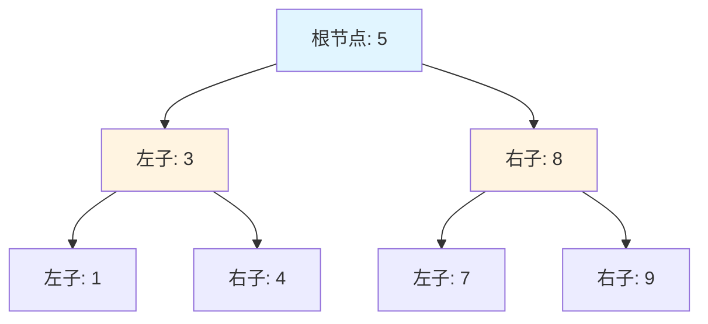

# 树 (Trees)

## 为什么树很重要

树能够以 O(log n) 的操作复杂度实现高效的层级数据组织：

- **数据库索引**：B+ 树驱动着 MySQL/PostgreSQL 索引（查找速度提升 1000 倍）。
- **文件系统**：目录结构本质上就是树。
- **DOM/JSON**：HTML/XML 文档、JSON 对象都是树状结构。
- **自动补全**：基于 Trie（字典树）的搜索建议。
- **路由**：IP 路由表使用树结构（Trie、前缀树）。

**现实影响**：一个拥有 10 亿个节点的平衡二叉搜索树（BST）仅需 30 次比较（log₂1,000,000,000）即可找到任何元素 —— 而线性搜索平均需要 5 亿次比较。这种 1000 万倍的速度提升，正是每个数据库索引都使用树的原因。

## 核心概念

### 二叉树结构

```java
class TreeNode {
    int val;
    TreeNode left;
    TreeNode right;
    TreeNode(int val) { this.val = val; }
}
```



**关键术语**：
- **根节点 (Root)**：顶部节点（没有父节点）。
- **叶子节点 (Leaf)**：没有子节点的节点。
- **内部节点**：至少有一个子节点的节点。
- **高度 (Height)**：从节点到叶子节点的最长路径。
- **深度 (Depth)**：到根节点的距离。

### 二叉树 vs 二叉搜索树 (BST)

| 属性 | 二叉树 | 二叉搜索树 (BST) |
|----------|-------------|--------------------------|
| **排序规则** | 无 | 左子 < 根 < 右子 |
| **搜索** | O(n) 必须检查所有节点 | O(log n) 利用 BST 性质 |
| **插入** | 任意位置 | 维持 BST 性质 |
| **用例** | 堆、表达式树 | 字典、集合 |

**BST 性质**：对于每个节点，左子树中的所有值都更小，右子树中的所有值都更大。

### 平衡树 (Balanced Trees)

#### AVL 树
一种自平衡 BST，其中子树之间的**高度差**最大为 1。通过**旋转**操作维持平衡。

#### 红黑树 (Red-Black Tree)
带**颜色属性**的平衡 BST。Java 的 `TreeMap` 和 `TreeSet` 底层即使用红黑树，它能保证 O(log n) 的操作复杂度，且由于旋转次数少于 AVL，插入和删除速度更快。

## 深入理解

### 树的遍历 (Tree Traversals)

#### 深度优先遍历 (DFS)
- **前序遍历 (Preorder)** (根, 左, 右)：`1, 2, 4, 5, 3, 6, 7` —— 用于复制树、前缀表达式求值。
- **中序遍历 (Inorder)** (左, 根, 右)：`4, 2, 5, 1, 6, 3, 7` —— 在 BST 中遍历会得到有序序列。
- **后序遍历 (Postorder)** (左, 右, 根)：`4, 5, 2, 6, 7, 3, 1` —— 用于删除树、后缀表达式求值。

#### 广度优先遍历 (BFS / 层序遍历)
使用队列按层访问节点值。

### BST 核心操作

- **搜索 (Search)**：利用二分思想极速查找。
- **插入 (Insert)**：递归寻找合适的空位并挂载。
- **删除 (Delete)**：分三种情况（无子、单子、双子），最为复杂。

## 高级算法

### 最近公共祖先 (LCA)
寻找两个节点在树中共同的最底层祖先。

### 树的序列化与反序列化
将内存中的树结构转换为字符串（如 "1,2,null,null,3..."）进行持久化或网络传输，并在另一端完整还原。

## 实战应用

### 文件系统树
文件为叶子节点，文件夹为内部节点，通过递归计算总空间占用。

### HTML DOM 树
浏览器将网页解析为 DOM 树，通过递归搜索实现 `querySelector` 等功能。

### 表达式树
将数学公式存储为树，叶子节点为数字，内部节点为操作符。

## 面试题精选

### Q1：二叉树的最大深度 (简单)
**思路**：递归深度 = 1 + max(左, 右)。

### Q2：翻转二叉树 (简单)
**思路**：递归交换每个节点的左右子节点。

### Q3：验证二叉搜索树 (中等)
**思路**：不仅要检查子节点大小，更要通过递归传递并校验全局的 (min, max) 范围约束。

### Q4：二叉树的层序遍历 (中等)
**思路**：使用队列，每次处理一层的所有节点。

## 延伸阅读

- **堆 (Heaps)**：一种特殊的二叉树。
- **图 (Graphs)**：树的广义化形式。
- **字典树 (Tries)**：用于字符串高效处理的树状结构。
- **LeetCode**：[树标签题目](https://leetcode.com/tag/tree/)
