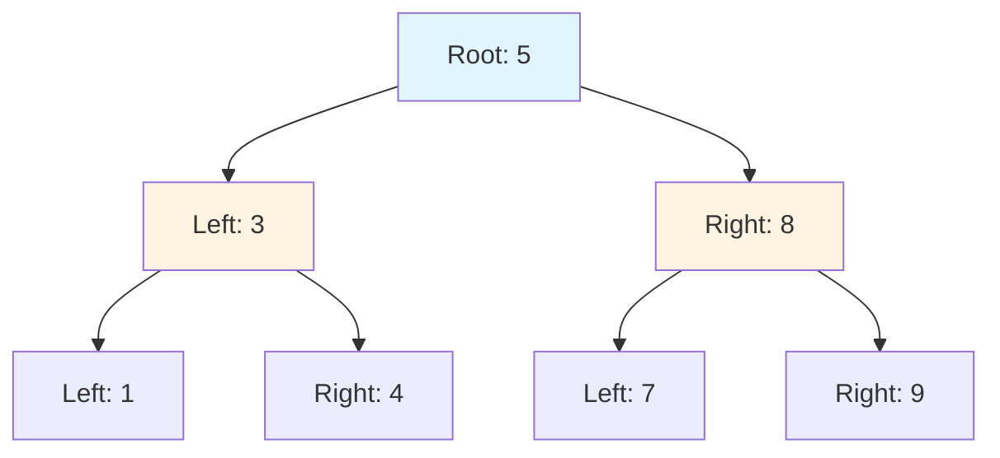
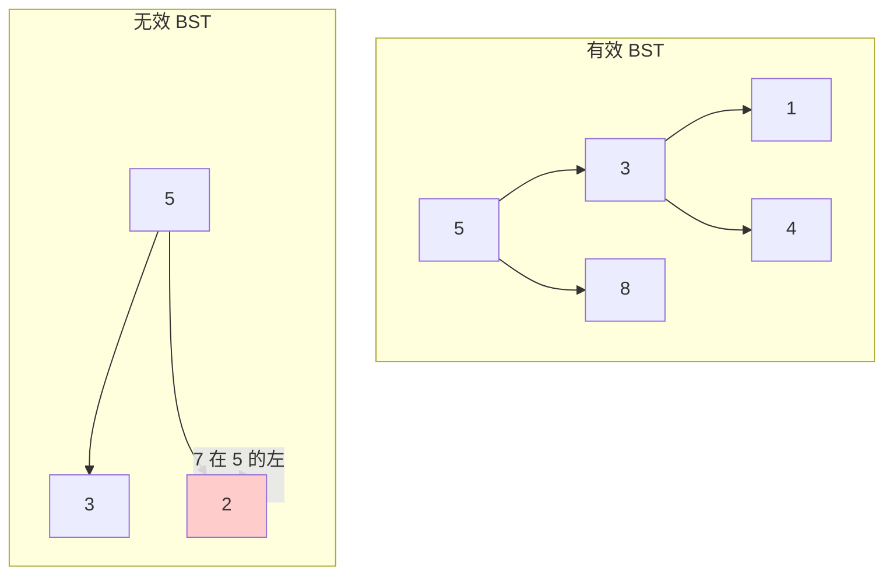
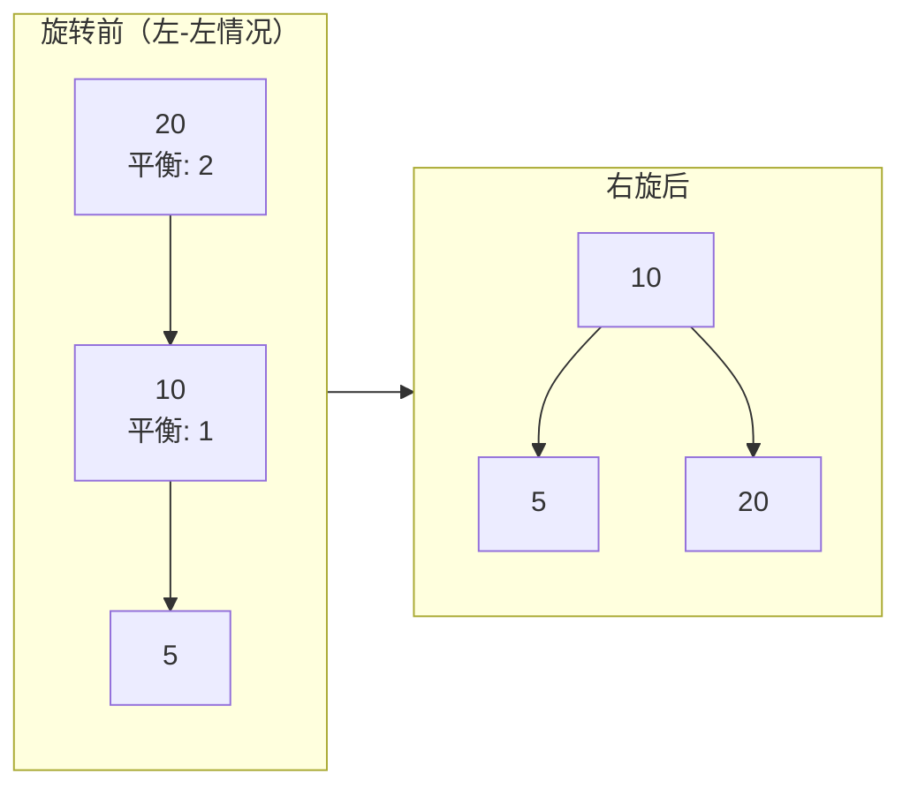
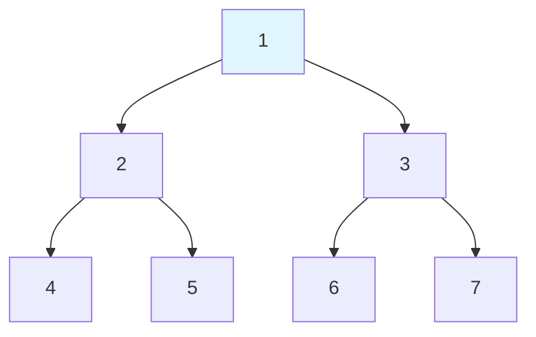
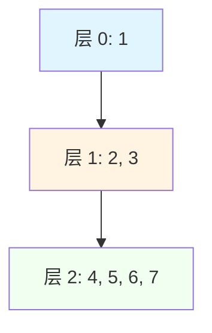

# 树

## 为什么树很重要

树实现高效的层次化数据组织，支持 O(log n) 操作：

- **数据库索引**：B+ 树驱动 MySQL/PostgreSQL 索引（快 1000 倍的查找）
- **文件系统**：目录结构就是树
- **DOM/JSON**：HTML/XML 文档、JSON 对象
- **自动补全**：基于 Trie 的搜索建议
- **路由**：IP 路由表使用树结构（Trie、前缀树）

**实际影响**：拥有 10 亿节点的平衡 BST 只需 30 次比较（log₂1,000,000,000）就能找到任意元素——而线性搜索平均需要 5 亿次比较。这 1000 万倍的加速是每个数据库索引都使用树的原因。

## 核心概念

### 二叉树结构

```java
class TreeNode {
    int val;
    TreeNode left;
    TreeNode right;
    TreeNode(int val) { this.val = val; }
}
```



**关键术语**：
- **根节点（Root）**：顶部节点（无父节点）
- **叶节点（Leaf）**：无子节点的节点
- **内部节点**：至少有一个子节点的节点
- **高度（Height）**：从节点到叶节点的最长路径
- **深度（Depth）**：从根节点到该节点的距离

### 二叉树 vs 二叉搜索树

| 性质 | 二叉树 | 二叉搜索树（BST） |
|------|--------|-------------------|
| **排序** | 无 | 左 < 根 < 右 |
| **搜索** | O(n) 必须检查所有 | O(log n) 利用 BST 性质 |
| **插入** | 任意位置 | 维持 BST 性质 |
| **使用场景** | 堆、表达式树 | 字典、集合 |

**BST 性质**：对于每个节点，左子树中的所有值都更小，右子树中的所有值都更大。



### 平衡树

#### AVL 树

自平衡 BST，子树之间的**高度差**最多为 1：

```java
class AVLNode {
    int val, height;
    AVLNode left, right;
    AVLNode(int val) {
        this.val = val;
        this.height = 1;
    }
}
```

**旋转**以维持平衡：
- **左旋**：右子树过重
- **右旋**：左子树过重
- **左右旋**：左子节点右偏重
- **右左旋**：右子节点左偏重



#### 红黑树

具有**颜色性质**的平衡 BST：
1. 每个节点是红色或黑色
2. 根节点是黑色
3. 红色节点不能有红色子节点（不能连续红色）
4. 从节点到叶子的每条路径有相同数量的黑色节点

**Java 的 TreeMap 使用红黑树**：
- 保证 O(log n) 操作
- 比 AVL 更少的旋转（更快的插入/删除）
- 比 AVL 稍高（仍是 O(log n)）

## 深入理解

### 树遍历

#### 深度优先遍历



**前序（Preorder）**（根、左、右）：`1, 2, 4, 5, 3, 6, 7`
- 使用场景：复制树、前缀表达式求值

**中序（Inorder）**（左、根、右）：`4, 2, 5, 1, 6, 3, 7`
- 使用场景：BST 产生排序顺序

**后序（Postorder）**（左、右、根）：`4, 5, 2, 6, 7, 3, 1`
- 使用场景：删除树（先删除子节点）、后缀表达式求值

#### 递归实现

```java
// 前序遍历
public void preorder(TreeNode root) {
    if (root == null) return;

    System.out.print(root.val + " ");  // 访问根
    preorder(root.left);                // 遍历左子树
    preorder(root.right);               // 遍历右子树
}

// 中序遍历
public void inorder(TreeNode root) {
    if (root == null) return;

    inorder(root.left);
    System.out.print(root.val + " ");
    inorder(root.right);
}

// 后序遍历
public void postorder(TreeNode root) {
    if (root == null) return;

    postorder(root.left);
    postorder(root.right);
    System.out.print(root.val + " ");
}
```

#### 迭代实现

```java
// 前序（迭代）
public List<Integer> preorderIterative(TreeNode root) {
    List<Integer> result = new ArrayList<>();
    if (root == null) return result;

    Deque<TreeNode> stack = new ArrayDeque<>();
    stack.push(root);

    while (!stack.isEmpty()) {
        TreeNode node = stack.pop();
        result.add(node.val);

        // 先压入右子节点（这样左子节点先被处理）
        if (node.right != null) stack.push(node.right);
        if (node.left != null) stack.push(node.left);
    }

    return result;
}

// 中序（迭代）
public List<Integer> inorderIterative(TreeNode root) {
    List<Integer> result = new ArrayList<>();
    Deque<TreeNode> stack = new ArrayDeque<>();
    TreeNode current = root;

    while (current != null || !stack.isEmpty()) {
        // 到达最左节点
        while (current != null) {
            stack.push(current);
            current = current.left;
        }

        current = stack.pop();
        result.add(current.val);
        current = current.right;
    }

    return result;
}
```

#### 广度优先遍历（层序遍历）

```java
public List<List<Integer>> levelOrder(TreeNode root) {
    List<List<Integer>> result = new ArrayList<>();
    if (root == null) return result;

    Queue<TreeNode> queue = new LinkedList<>();
    queue.offer(root);

    while (!queue.isEmpty()) {
        int levelSize = queue.size();
        List<Integer> level = new ArrayList<>();

        for (int i = 0; i < levelSize; i++) {
            TreeNode node = queue.poll();
            level.add(node.val);

            if (node.left != null) queue.offer(node.left);
            if (node.right != null) queue.offer(node.right);
        }

        result.add(level);
    }

    return result;
}
```



### BST 操作

#### 搜索

```java
public TreeNode search(TreeNode root, int target) {
    while (root != null && root.val != target) {
        if (target < root.val) {
            root = root.left;
        } else {
            root = root.right;
        }
    }
    return root;  // 找到或 null
}
```

#### 插入

```java
public TreeNode insert(TreeNode root, int val) {
    if (root == null) return new TreeNode(val);

    if (val < root.val) {
        root.left = insert(root.left, val);
    } else if (val > root.val) {
        root.right = insert(root.right, val);
    }

    return root;
}
```

#### 删除

```java
public TreeNode delete(TreeNode root, int key) {
    if (root == null) return null;

    if (key < root.val) {
        root.left = delete(root.left, key);
    } else if (key > root.val) {
        root.right = delete(root.right, key);
    } else {
        // 找到要删除的节点

        // 情况 1：无子节点（叶节点）
        if (root.left == null && root.right == null) {
            return null;
        }

        // 情况 2：一个子节点
        if (root.left == null) return root.right;
        if (root.right == null) return root.left;

        // 情况 3：两个子节点
        // 找到中序后继（右子树中的最小值）
        TreeNode minNode = findMin(root.right);
        root.val = minNode.val;  // 复制值
        root.right = delete(root.right, minNode.val);  // 删除重复值
    }

    return root;
}

private TreeNode findMin(TreeNode node) {
    while (node.left != null) {
        node = node.left;
    }
    return node;
}
```

### 常见陷阱

#### ❌ 不检查 null

```java
public int badSum(TreeNode root) {
    return root.val + badSum(root.left) + badSum(root.right);
    // 如果 root 为 null 会 NPE！
}
```

#### ✅ 始终先检查 null

```java
public int goodSum(TreeNode root) {
    if (root == null) return 0;
    return root.val + goodSum(root.left) + goodSum(root.right);
}
```

#### ❌ 遍历时修改树

```java
public void badDelete(TreeNode root, int val) {
    if (root == null) return;
    if (root.val == val) {
        root = null;  // 只是将局部引用设为 null！
    }
    badDelete(root.left, val);
    badDelete(root.right, val);
}
```

#### ✅ 返回修改后的根节点

```java
public TreeNode goodDelete(TreeNode root, int val) {
    if (root == null) return null;
    if (root.val == val) return null;  // 返回给父节点
    root.left = goodDelete(root.left, val);
    root.right = goodDelete(root.right, val);
    return root;
}
```

#### ❌ 假设 BST 性质

```java
public boolean isBSTBad(TreeNode root) {
    if (root == null) return true;
    if (root.left != null && root.left.val >= root.val) return false;
    if (root.right != null && root.right.val <= root.val) return false;
    return isBSTBad(root.left) && isBSTBad(root.right);
    // BUG：没有检查子树边界！
}
```

#### ✅ 跟踪有效范围

```java
public boolean isValidBST(TreeNode root) {
    return validate(root, Long.MIN_VALUE, Long.MAX_VALUE);
}

private boolean validate(TreeNode node, long min, long max) {
    if (node == null) return true;

    if (node.val <= min || node.val >= max) return false;

    return validate(node.left, min, node.val) &&
           validate(node.right, node.val, max);
}
```

### 进阶算法

#### 最近公共祖先（LCA）

```java
public TreeNode lowestCommonAncestor(TreeNode root, TreeNode p, TreeNode q) {
    if (root == null || root == p || root == q) return root;

    TreeNode left = lowestCommonAncestor(root.left, p, q);
    TreeNode right = lowestCommonAncestor(root.right, p, q);

    if (left != null && right != null) return root;  // 分叉点
    return left != null ? left : right;  // 一侧找到
}
```

#### 树的序列化/反序列化

```java
// 序列化为 "1,2,null,null,3,4,null,null,5,null,null"
public String serialize(TreeNode root) {
    StringBuilder sb = new StringBuilder();
    serializeHelper(root, sb);
    return sb.toString();
}

private void serializeHelper(TreeNode node, StringBuilder sb) {
    if (node == null) {
        sb.append("null,");
        return;
    }

    sb.append(node.val).append(",");
    serializeHelper(node.left, sb);
    serializeHelper(node.right, sb);
}

// 从字符串反序列化
public TreeNode deserialize(String data) {
    Queue<String> nodes = new LinkedList<>(Arrays.asList(data.split(",")));
    return deserializeHelper(nodes);
}

private TreeNode deserializeHelper(Queue<String> nodes) {
    String val = nodes.poll();
    if (val.equals("null")) return null;

    TreeNode node = new TreeNode(Integer.parseInt(val));
    node.left = deserializeHelper(nodes);
    node.right = deserializeHelper(nodes);
    return node;
}
```

#### 最大深度

```java
public int maxDepth(TreeNode root) {
    if (root == null) return 0;
    return 1 + Math.max(maxDepth(root.left), maxDepth(root.right));
}

// 迭代（层序）
public int maxDepthIterative(TreeNode root) {
    if (root == null) return 0;

    Queue<TreeNode> queue = new LinkedList<>();
    queue.offer(root);
    int depth = 0;

    while (!queue.isEmpty()) {
        int levelSize = queue.size();
        depth++;

        for (int i = 0; i < levelSize; i++) {
            TreeNode node = queue.poll();
            if (node.left != null) queue.offer(node.left);
            if (node.right != null) queue.offer(node.right);
        }
    }

    return depth;
}
```

## 实际应用

### 文件系统树

```java
class FileNode {
    String name;
    boolean isFile;
    List<FileNode> children;

    public int totalSize() {
        if (isFile) return getSizeOfFile();
        return children.stream()
            .mapToInt(FileNode::totalSize)
            .sum();
    }
}
```

### HTML DOM 树

```java
class DomNode {
    String tagName;
    String id;
    String className;
    List<DomNode> children;

    public List<DomNode> querySelector(String selector) {
        List<DomNode> result = new ArrayList<>();
        search(this, selector, result);
        return result;
    }

    private void search(DomNode node, String selector, List<DomNode> result) {
        if (node == null) return;

        if (matches(node, selector)) {
            result.add(node);
        }

        for (DomNode child : node.children) {
            search(child, selector, result);
        }
    }
}
```

### 表达式树

```java
class ExprNode {
    String value;
    ExprNode left, right;

    public int evaluate() {
        if (left == null && right == null) {
            return Integer.parseInt(value);  // 叶节点
        }

        int leftVal = left.evaluate();
        int rightVal = right.evaluate();

        switch (value) {
            case "+": return leftVal + rightVal;
            case "-": return leftVal - rightVal;
            case "*": return leftVal * rightVal;
            case "/": return leftVal / rightVal;
        }
        throw new IllegalArgumentException("Unknown operator");
    }
}
```

## 面试题

### Q1：二叉树的最大深度（简单）

**题目**：查找最大深度（最长路径上的节点数）。

**方法**：递归深度 = 1 + max(左, 右)

**复杂度**：O(n) 时间，O(h) 空间

```java
public int maxDepth(TreeNode root) {
    if (root == null) return 0;
    return 1 + Math.max(maxDepth(root.left), maxDepth(root.right));
}
```

### Q2：翻转二叉树（简单）

**题目**：镜像二叉树（交换左右子节点）。

**方法**：递归交换

**复杂度**：O(n) 时间，O(h) 空间

```java
public TreeNode invertTree(TreeNode root) {
    if (root == null) return null;

    TreeNode temp = root.left;
    root.left = root.right;
    root.right = temp;

    invertTree(root.left);
    invertTree(root.right);

    return root;
}
```

### Q3：相同的树（简单）

**题目**：检查两棵树是否相同。

**方法**：递归比较

**复杂度**：O(n) 时间，O(h) 空间

```java
public boolean isSameTree(TreeNode p, TreeNode q) {
    if (p == null && q == null) return true;
    if (p == null || q == null) return false;

    return p.val == q.val &&
           isSameTree(p.left, q.left) &&
           isSameTree(p.right, q.right);
}
```

### Q4：另一棵树的子树（简单）

**题目**：检查树 `subRoot` 是否是 `root` 的子树。

**方法**：检查每个节点作为潜在的子树根

**复杂度**：O(m × n) 时间，其中 m = size(subRoot)，n = size(root)

```java
public boolean isSubtree(TreeNode root, TreeNode subRoot) {
    if (subRoot == null) return true;
    if (root == null) return false;

    if (isSameTree(root, subRoot)) return true;

    return isSubtree(root.left, subRoot) ||
           isSubtree(root.right, subRoot);
}
```

### Q5：BST 的最近公共祖先（中等）

**题目**：在 BST 中找 LCA（两个节点都存在）。

**方法**：利用 BST 性质导航

**复杂度**：O(h) 时间，O(1) 空间

```java
public TreeNode lowestCommonAncestor(TreeNode root, TreeNode p, TreeNode q) {
    TreeNode current = root;

    while (current != null) {
        if (p.val < current.val && q.val < current.val) {
            current = current.left;
        } else if (p.val > current.val && q.val > current.val) {
            current = current.right;
        } else {
            return current;  // 分叉点
        }
    }

    return null;
}
```

### Q6：二叉树层序遍历（中等）

**题目**：按层返回节点值。

**方法**：BFS + 队列

**复杂度**：O(n) 时间，O(n) 空间

```java
public List<List<Integer>> levelOrder(TreeNode root) {
    List<List<Integer>> result = new ArrayList<>();
    if (root == null) return result;

    Queue<TreeNode> queue = new LinkedList<>();
    queue.offer(root);

    while (!queue.isEmpty()) {
        int levelSize = queue.size();
        List<Integer> level = new ArrayList<>();

        for (int i = 0; i < levelSize; i++) {
            TreeNode node = queue.poll();
            level.add(node.val);

            if (node.left != null) queue.offer(node.left);
            if (node.right != null) queue.offer(node.right);
        }

        result.add(level);
    }

    return result;
}
```

### Q7：验证二叉搜索树（中等）

**题目**：检查树是否是有效的 BST。

**方法**：跟踪有效 (min, max) 范围

**复杂度**：O(n) 时间，O(h) 空间

```java
public boolean isValidBST(TreeNode root) {
    return validate(root, Long.MIN_VALUE, Long.MAX_VALUE);
}

private boolean validate(TreeNode node, long min, long max) {
    if (node == null) return true;

    if (node.val <= min || node.val >= max) return false;

    return validate(node.left, min, node.val) &&
           validate(node.right, node.val, max);
}
```

## 延伸阅读

- **堆**：特殊的二叉树
- **图**：树的泛化
- **字典树**：用于字符串的类树结构
- **LeetCode**：[树题目](https://leetcode.com/tag/tree/)
