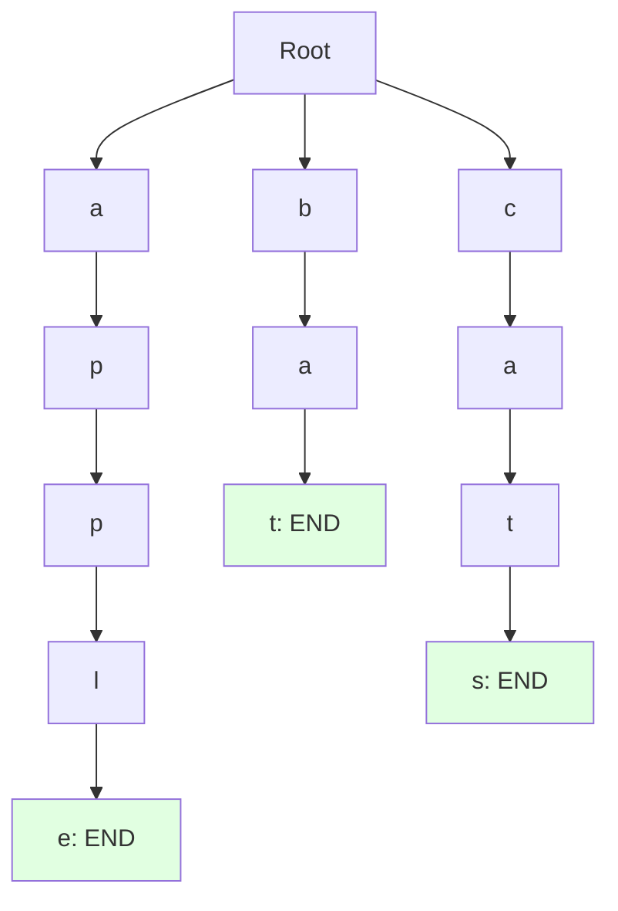
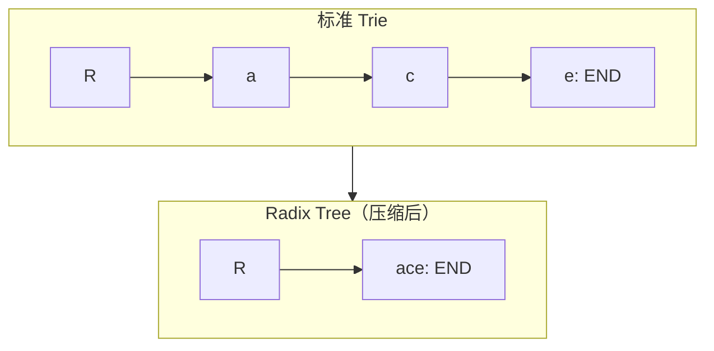

# Tries（字典树 / 前缀树）

## 为什么 Tries 很重要

Tries（发音 "try"）提供了 HashMap 无法匹配的高效字符串操作：

- **自动补全系统**：输入时建议补全（Google 搜索、IDE）
- **拼写检查**：高效查找具有共同前缀的单词
- **IP 路由**：网络路由器中的最长前缀匹配
- **字典应用**：文字游戏（Scrabble、Boggle）、联系人搜索

**实际影响**：
- 在 100 万个单词中搜索前缀 "app"：
  - HashMap：O(n) 扫描所有键 - 约 1ms
  - Trie：O(前缀长度) - 约 0.001ms（快 1000 倍）
- Google 每秒处理超过 10 万次搜索，使用基于 Trie 的自动补全

## 核心概念

### Trie 结构

每个节点包含：
- **Children（子节点）**：字符到子节点的映射
- **Is end（结束标记）**：标记完整单词的标志



**单词**：apple、bat、cats

### Trie vs HashMap 对比

| 操作 | HashMap | Trie |
|------|---------|------|
| **插入单词** | O(1) 平均 | O(单词长度) |
| **精确搜索** | O(1) 平均 | O(单词长度) |
| **前缀搜索** | O(n) 扫描 | O(前缀长度) |
| **空间** | O(总字符数) | O(总字符数) × 额外开销 |
| **排序** | 无序 | 自然排序 |

**何时使用 Trie**：
- 需要基于前缀的搜索
- 需要有序遍历
- 很多单词共享共同前缀
- 内存不受限

**何时使用 HashMap**：
- 只需要精确匹配
- 需要更快的查找
- 更少的内存开销

## 深入理解

### Trie 实现

```java
class TrieNode {
    Map<Character, TrieNode> children = new HashMap<>();
    boolean isEnd = false;
}

public class Trie {
    private final TrieNode root;

    public Trie() {
        this.root = new TrieNode();
    }

    // 插入单词到 Trie
    public void insert(String word) {
        TrieNode node = root;

        for (char c : word.toCharArray()) {
            node.children.putIfAbsent(c, new TrieNode());
            node = node.children.get(c);
        }

        node.isEnd = true;
    }

    // 搜索精确单词
    public boolean search(String word) {
        TrieNode node = searchPrefix(word);
        return node != null && node.isEnd;
    }

    // 检查是否有以指定前缀开头的单词
    public boolean startsWith(String prefix) {
        return searchPrefix(prefix) != null;
    }

    private TrieNode searchPrefix(String prefix) {
        TrieNode node = root;

        for (char c : prefix.toCharArray()) {
            if (!node.children.containsKey(c)) {
                return null;
            }
            node = node.children.get(c);
        }

        return node;
    }
}
```

### 常用操作

#### 统计具有指定前缀的单词数

```java
public int countWordsWithPrefix(String prefix) {
    TrieNode node = searchPrefix(prefix);
    if (node == null) return 0;

    return countWordsFromNode(node);
}

private int countWordsFromNode(TrieNode node) {
    int count = node.isEnd ? 1 : 0;

    for (TrieNode child : node.children.values()) {
        count += countWordsFromNode(child);
    }

    return count;
}
```

#### 删除单词

```java
public boolean delete(String word) {
    return delete(root, word, 0);
}

private boolean delete(TrieNode node, String word, int index) {
    if (index == word.length()) {
        if (!node.isEnd) return false;
        node.isEnd = false;
        return node.children.isEmpty();
    }

    char c = word.charAt(index);
    TrieNode child = node.children.get(c);

    if (child == null) return false;

    boolean shouldDeleteChild = delete(child, word, index + 1);

    if (shouldDeleteChild) {
        node.children.remove(c);
        return node.children.isEmpty() && !node.isEnd;
    }

    return false;
}
```

#### 最长公共前缀

```java
public String longestCommonPrefix() {
    TrieNode node = root;
    StringBuilder prefix = new StringBuilder();

    while (node.children.size() == 1 && !node.isEnd) {
        Map.Entry<Character, TrieNode> entry =
            node.children.entrySet().iterator().next();
        prefix.append(entry.getKey());
        node = entry.getValue();
    }

    return prefix.toString();
}
```

### 常见陷阱

#### ❌ 子节点不使用 Map

```java
class BadTrieNode {
    TrieNode[] children = new TrieNode[26];  // 仅支持小写英文
    // 稀疏 Trie 浪费空间
    // 不支持 Unicode
}
```

#### ✅ 使用 HashMap 更灵活

```java
class GoodTrieNode {
    Map<Character, TrieNode> children = new HashMap<>();
    // 支持任何字符，空间高效
}
```

#### ❌ 不清理未使用的节点

```java
node.isEnd = false;  // 单词已移除但节点仍在
// 长单词会导致内存泄漏
```

#### ✅ 删除未使用的节点

```java
// 如果没有其他单词使用，递归删除节点
if (node.children.isEmpty() && !node.isEnd) {
    return null;  // 通知父节点删除此节点
}
```

#### ❌ 大小写不一致

```java
trie.insert("Apple");
trie.search("apple");  // 返回 false！
```

#### ✅ 统一大小写

```java
public void insert(String word) {
    word = word.toLowerCase();  // 统一转小写
    // ... 插入
}
```

### 进阶：压缩字典树（Radix Tree）

压缩单子节点的链：



**优势**：
- 更少的节点（节省内存）
- 长单词的遍历更快
- 适合有长共同前缀的字典

## 实际应用

### 自动补全系统

```java
public class AutocompleteSystem {
    private final Trie trie;

    public AutocompleteSystem(List<String> words) {
        this.trie = new Trie();
        for (String word : words) {
            trie.insert(word);
        }
    }

    public List<String> getSuggestions(String prefix) {
        TrieNode node = trie.searchPrefix(prefix);
        if (node == null) return Collections.emptyList();

        List<String> suggestions = new ArrayList<>();
        collectWords(node, prefix, suggestions);

        return suggestions.stream()
            .sorted()
            .limit(10)  // 前 10 条建议
            .collect(Collectors.toList());
    }

    private void collectWords(TrieNode node, String current,
                             List<String> results) {
        if (node.isEnd) {
            results.add(current);
        }

        for (Map.Entry<Character, TrieNode> entry :
             node.children.entrySet()) {
            collectWords(entry.getValue(), current + entry.getKey(), results);
        }
    }
}
```

### 拼写检查器

```java
public class SpellChecker {
    private final Trie dictionary;

    public SpellChecker(Set<String> words) {
        this.dictionary = new Trie();
        for (String word : words) {
            dictionary.insert(word);
        }
    }

    public boolean isCorrect(String word) {
        return dictionary.search(word);
    }

    // 查找相似单词（编辑距离为 1）
    public List<String> getSuggestions(String word) {
        List<String> suggestions = new ArrayList<>();

        // 尝试所有可能的单字符编辑
        for (int i = 0; i < word.length(); i++) {
            // 插入
            for (char c = 'a'; c <= 'z'; c++) {
                String edited = word.substring(0, i) + c + word.substring(i);
                if (dictionary.search(edited)) {
                    suggestions.add(edited);
                }
            }
        }

        // 删除
        for (int i = 0; i < word.length(); i++) {
            String edited = word.substring(0, i) + word.substring(i + 1);
            if (dictionary.search(edited)) {
                suggestions.add(edited);
            }
        }

        // 替换
        for (int i = 0; i < word.length(); i++) {
            for (char c = 'a'; c <= 'z'; c++) {
                String edited = word.substring(0, i) + c + word.substring(i + 1);
                if (dictionary.search(edited)) {
                    suggestions.add(edited);
                }
            }
        }

        return suggestions.stream()
            .distinct()
            .limit(5)
            .collect(Collectors.toList());
    }
}
```

### 单词搜索 II

在二维棋盘中找出字典中的所有单词：

```java
public List<String> findWords(char[][] board, String[] words) {
    // 从字典构建 Trie
    Trie trie = new Trie();
    for (String word : words) {
        trie.insert(word);
    }

    Set<String> result = new HashSet<>();
    int m = board.length, n = board[0].length;

    for (int i = 0; i < m; i++) {
        for (int j = 0; j < n; j++) {
            dfs(board, i, j, trie.root, "", result);
        }
    }

    return new ArrayList<>(result);
}

private void dfs(char[][] board, int i, int j, TrieNode node,
                 String word, Set<String> result) {
    if (i < 0 || i >= board.length || j < 0 || j >= board[0].length) {
        return;
    }

    char c = board[i][j];
    if (c == '#' || !node.children.containsKey(c)) {
        return;
    }

    node = node.children.get(c);
    word += c;

    if (node.isEnd) {
        result.add(word);
    }

    board[i][j] = '#';  // 标记已访问

    dfs(board, i + 1, j, node, word, result);
    dfs(board, i - 1, j, node, word, result);
    dfs(board, i, j + 1, node, word, result);
    dfs(board, i, j - 1, node, word, result);

    board[i][j] = c;  // 恢复
}
```

## 面试题

### Q1：实现 Trie（中等）

**题目**：实现包含 insert、search、startsWith 的 Trie。

**方法**：使用 HashMap 子节点的标准 Trie

**复杂度**：每次操作 O(L)，空间 O(N × L)（N 个单词，L 平均长度）

```java
class TrieNode {
    Map<Character, TrieNode> children = new HashMap<>();
    boolean isEnd = false;
}

class Trie {
    private final TrieNode root;

    public Trie() {
        root = new TrieNode();
    }

    public void insert(String word) {
        TrieNode node = root;
        for (char c : word.toCharArray()) {
            node.children.putIfAbsent(c, new TrieNode());
            node = node.children.get(c);
        }
        node.isEnd = true;
    }

    public boolean search(String word) {
        TrieNode node = searchNode(word);
        return node != null && node.isEnd;
    }

    public boolean startsWith(String prefix) {
        return searchNode(prefix) != null;
    }

    private TrieNode searchNode(String str) {
        TrieNode node = root;
        for (char c : str.toCharArray()) {
            if (!node.children.containsKey(c)) return null;
            node = node.children.get(c);
        }
        return node;
    }
}
```

### Q2：设计添加和搜索单词（中等）

**题目**：实现 addWord 和支持 '.' 通配符的 search。

**方法**：使用递归搜索的 Trie

**复杂度**：添加 O(L)，带通配符搜索 O(N × 26^L)

```java
class WordDictionary {
    private TrieNode root;

    public WordDictionary() {
        root = new TrieNode();
    }

    public void addWord(String word) {
        TrieNode node = root;
        for (char c : word.toCharArray()) {
            node.children.putIfAbsent(c, new TrieNode());
            node = node.children.get(c);
        }
        node.isEnd = true;
    }

    public boolean search(String word) {
        return search(root, word, 0);
    }

    private boolean search(TrieNode node, String word, int index) {
        if (index == word.length()) {
            return node.isEnd;
        }

        char c = word.charAt(index);

        if (c == '.') {
            for (TrieNode child : node.children.values()) {
                if (search(child, word, index + 1)) {
                    return true;
                }
            }
            return false;
        } else {
            if (!node.children.containsKey(c)) return false;
            return search(node.children.get(c), word, index + 1);
        }
    }
}
```

### Q3：单词搜索 II（困难）

**题目**：在二维棋盘中找出字典中的所有单词。

**方法**：构建 Trie，DFS + 剪枝

**复杂度**：时间 O(M × N × 4 × 3^L)，空间 O(N × L)

```java
public List<String> findWords(char[][] board, String[] words) {
    Trie trie = new Trie();
    for (String word : words) {
        trie.insert(word);
    }

    Set<String> result = new HashSet<>();
    int m = board.length, n = board[0].length;

    for (int i = 0; i < m; i++) {
        for (int j = 0; j < n; j++) {
            dfs(board, i, j, trie.root, new StringBuilder(), result);
        }
    }

    return new ArrayList<>(result);
}

private void dfs(char[][] board, int i, int j, TrieNode node,
                 StringBuilder word, Set<String> result) {
    if (i < 0 || i >= board.length || j < 0 || j >= board[0].length) {
        return;
    }

    char c = board[i][j];
    if (c == '#' || !node.children.containsKey(c)) {
        return;
    }

    node = node.children.get(c);
    word.append(c);

    if (node.isEnd) {
        result.add(word.toString());
    }

    board[i][j] = '#';

    dfs(board, i + 1, j, node, word, result);
    dfs(board, i - 1, j, node, word, result);
    dfs(board, i, j + 1, node, word, result);
    dfs(board, i, j - 1, node, word, result);

    board[i][j] = c;
    word.setLength(word.length() - 1);
}
```

## 延伸阅读

- **哈希表**：精确字符串匹配的替代方案
- **树**：类似的层次结构
- **图**：Tries 是类似树的有向无环图
- **LeetCode**：[Trie 题目](https://leetcode.com/tag/trie/)
