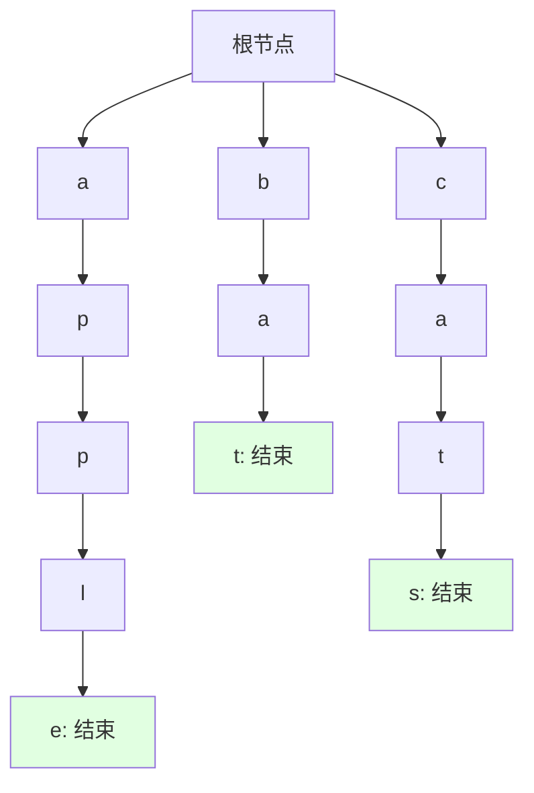

# 字典树 (Tries / 前缀树)

## 为什么字典树很重要

字典树（Trie，读作 "try"）提供了一些 HashMap 无法企及的高效字符串操作：

- **自动补全系统**：当你输入时实时建议补全内容（如搜索引擎、IDE）。
- **拼写检查**：高效查找具有相同前缀的单词。
- **IP 路由**：网络路由器中的最长前缀匹配。
- **词典应用**：文字游戏、联系人搜索。

**现实影响**：
- 在 100 万个单词中搜索前缀 "app"：
  - HashMap：O(n) 扫描所有键 —— 约需 1ms。
  - 字典树：O(前缀长度) —— 约需 0.001ms（快 1000 倍）。
- 搜索引擎利用基于字典树的补全功能，每秒处理数十万次搜索请求。

## 核心概念

### 字典树结构

每个节点包含：
- **子节点 (Children)**：字符到子节点的映射（Map 或数组）。
- **结束标记 (Is End)**：标记该位置是否构成一个完整的单词。

**图中单词**：apple, bat, cats

### 字符串处理：字典树 vs HashMap

| 操作 | HashMap | 字典树 |
|-----------|---------|------|
| **插入单词** | 平均 O(1) | O(单词长度) |
| **精确搜索** | 平均 O(1) | O(单词长度) |
| **前缀搜索** | O(n) 全表扫描 | O(前缀长度) |
| **空间复杂度**| O(总字符数) | O(总字符数) × 额外开销 |
| **排序属性** | 无序 | 天然具备字典序 |

## 深入理解

### 核心操作

- **插入 (Insert)**：逐字符向下移动，若字符不存在则创建新节点。
- **精确搜索 (Search)**：逐字符匹配，最终需停留在带 `isEnd` 标记的节点。
- **前缀搜索 (StartsWith)**：仅需匹配完前缀字符序列即可。

### 高级：压缩字典树 (Radix Tree)
压缩只有单个子节点的链路，将 "a" -> "p" -> "p" -> "le" 压缩为 "apple" 一个节点，能显著节省空间并加快长单词遍历。

## 实战应用

### 自动补全系统
预先将词库存入字典树。当用户输入前缀时，先定位到前缀节点，再通过 DFS（深度优先遍历）收集其所有子树中的单词作为建议结果。

### 拼写检查
检查单词是否存在于字典树中。若不存在，可通过尝试单字符的“增、删、改”操作并验证是否存在于树中，来提供修正建议。

## 面试题精选

### Q1：实现 Trie (中等)
**目标**：实现 `insert`、`search` 和 `startsWith` 三个方法。

### Q2：添加与搜索单词 (中等)
**目标**：支持包含 `.` 通配符的模糊匹配搜索。通过递归 DFS 遍历通配符位置的所有子节点即可解决。

### Q3：单词搜索 II (困难)
**目标**：在 2D 字符网格中找出词典中的所有单词。
**思路**：将词典建成字典树，再对网格进行 DFS，利用字典树进行剪枝（若当前路径的前缀不在树中，直接回溯），这是解决此类问题的最优解。

## 延伸阅读

- **哈希映射 (HashMaps)**：精确匹配的替代方案。
- **压缩前缀树 (Radix Tree)**：针对长公共前缀优化的变体。
- **LeetCode**：[字典树标签题目](https://leetcode.com/tag/trie/)
