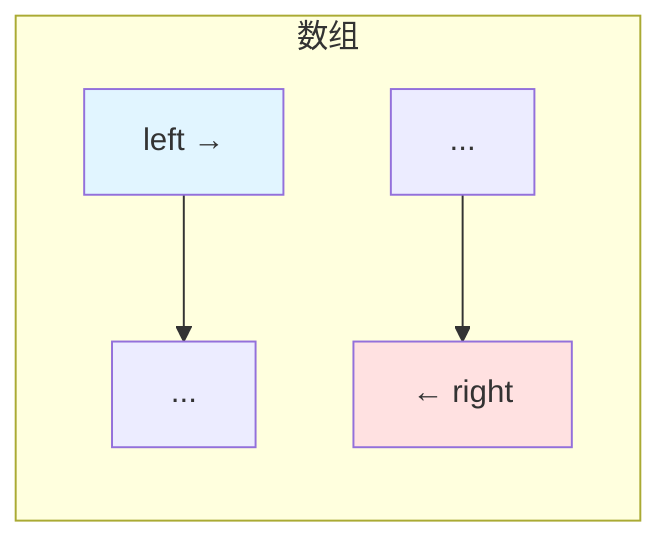
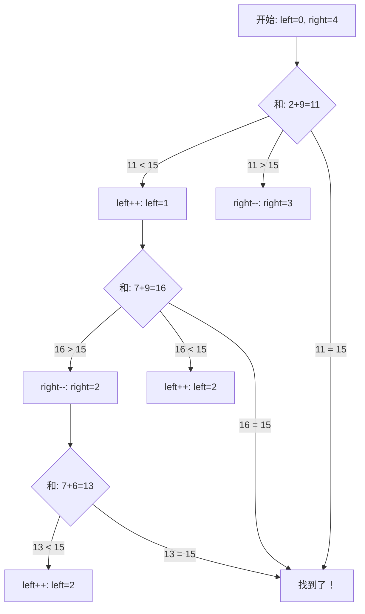
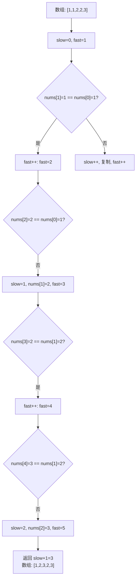

# 双指针模式

## 为什么双指针很重要

双指针技术以 O(n) 时间和 O(1) 空间解决问题——消除嵌套循环：

- **数组/字符串问题**：找数对、反转、分区
- **链表**：检测环、找中点
- **滑动窗口**：通常用双指针实现
- **回文检测**：前后指针

**实际影响**：在数组中找所有和为给定值的数对：
- 暴力法：O(n²) 两层嵌套循环
- 双指针：排序后 O(n)——**对 10,000 个元素快 1000 倍**

## 核心概念

### 双指针模式

#### 1. 对向指针

从两端开始，向中间移动：

```java
int left = 0, right = arr.length - 1;

while (left < right) {
    // 处理 arr[left] 和 arr[right]
    left++;
    right--;
}
```



**使用场景**：
- 两数之和（有序数组）
- 回文检查
- 盛最多水的容器
- 反转数组/字符串

#### 2. 同向指针（快慢指针）

都从起点开始，快指针先行：

```java
int slow = 0, fast = 0;

while (fast < arr.length) {
    // 处理
    fast++;
    if (condition) slow++;
}
```

**使用场景**：
- 删除重复元素
- 移除元素
- 链表环检测
- 找中间元素

#### 3. 固定距离指针

保持指针间固定距离：

```java
int left = 0, right = k;  // k 是窗口大小或固定距离

while (right < arr.length) {
    // 比较 arr[left] 和 arr[right]
    left++;
    right++;
}
```

**使用场景**：
- 查找具有特定属性的子数组
- 固定大小滑动窗口
- 比较距离为 k 的元素

## 深入理解

### 两数之和 II - 有序数组

给定有序数组，找出和为目标值的两个数：

```java
public int[] twoSum(int[] numbers, int target) {
    int left = 0, right = numbers.length - 1;

    while (left < right) {
        int sum = numbers[left] + numbers[right];

        if (sum == target) {
            return new int[]{left + 1, right + 1};  // 1-indexed
        } else if (sum < target) {
            left++;  // 需要更大的和
        } else {
            right--;  // 需要更小的和
        }
    }

    return new int[]{-1, -1};  // 未找到
}
```



**为什么有效**：数组有序，所以：
- 如果和 < 目标值：需要更大的元素 → 左指针右移
- 如果和 > 目标值：需要更小的元素 → 右指针左移

### 验证回文串

检查字符串是否是回文（忽略非字母数字字符）：

```java
public boolean isPalindrome(String s) {
    int left = 0, right = s.length() - 1;

    while (left < right) {
        // 跳过非字母数字字符
        while (left < right && !Character.isLetterOrDigit(s.charAt(left))) {
            left++;
        }
        while (left < right && !Character.isLetterOrDigit(s.charAt(right))) {
            right--;
        }

        // 比较字符
        char c1 = Character.toLowerCase(s.charAt(left));
        char c2 = Character.toLowerCase(s.charAt(right));

        if (c1 != c2) return false;

        left++;
        right--;
    }

    return true;
}
```

### 盛最多水的容器

找出两条垂直线构成的最大面积：

```java
public int maxArea(int[] height) {
    int left = 0, right = height.length - 1;
    int maxArea = 0;

    while (left < right) {
        int width = right - left;
        int containerHeight = Math.min(height[left], height[right]);
        int area = width * containerHeight;

        maxArea = Math.max(maxArea, area);

        // 将较短的线向内移动
        if (height[left] < height[right]) {
            left++;
        } else {
            right--;
        }
    }

    return maxArea;
}
```

**关键洞察**：将较长的线向内移动不可能增加面积（高度受限于较短的线，宽度在减少）。始终移动较短的线。

### 快慢指针

#### 删除有序数组中的重复项

```java
public int removeDuplicates(int[] nums) {
    if (nums.length == 0) return 0;

    int slow = 0;  // 放置下一个唯一元素的位置

    for (int fast = 1; fast < nums.length; fast++) {
        if (nums[fast] != nums[slow]) {
            slow++;
            nums[slow] = nums[fast];
        }
    }

    return slow + 1;  // 唯一部分的长度
}
```



### 常见陷阱

#### ❌ 未处理边界情况

```java
public boolean badPalindrome(String s) {
    int left = 0, right = s.length() - 1;

    while (left < right) {  // 如果 s 为空会 NPE
        if (s.charAt(left) != s.charAt(right)) {
            return false;
        }
        left++;
        right--;
    }
    return true;
}
```

#### ✅ 处理空输入

```java
public boolean goodPalindrome(String s) {
    if (s == null || s.isEmpty()) return true;

    int left = 0, right = s.length() - 1;

    while (left < right) {
        if (s.charAt(left) != s.charAt(right)) {
            return false;
        }
        left++;
        right--;
    }
    return true;
}
```

#### ❌ 指针更新错误导致无限循环

```java
while (left < right) {
    int sum = nums[left] + nums[right];
    if (sum == target) return true;
    if (sum < target) left = left;  // BUG：没有移动！
    else right = right;  // BUG：没有移动！
}
```

#### ✅ 始终更新指针

```java
while (left < right) {
    int sum = nums[left] + nums[right];
    if (sum == target) return true;
    if (sum < target) left++;  // 左指针前进
    else right--;  // 右指针后退
}
```

#### ❌ 乘法溢出

```java
int area = height[left] * height[right] * (right - left);
// 大值时可能溢出！
```

#### ✅ 使用 long 或 min

```java
int width = right - left;
int containerHeight = Math.min(height[left], height[right]);
int area = width * containerHeight;  // 不太可能溢出
// 或使用 long 更安全
```

### 进阶模式

#### 三数之和

找出所有和为零的唯一三元组：

```java
public List<List<Integer>> threeSum(int[] nums) {
    List<List<Integer>> result = new ArrayList<>();
    Arrays.sort(nums);

    for (int i = 0; i < nums.length - 2; i++) {
        // 跳过重复
        if (i > 0 && nums[i] == nums[i - 1]) continue;

        int left = i + 1, right = nums.length - 1;

        while (left < right) {
            int sum = nums[i] + nums[left] + nums[right];

            if (sum == 0) {
                result.add(Arrays.asList(nums[i], nums[left], nums[right]));

                // 跳过重复
                while (left < right && nums[left] == nums[left + 1]) left++;
                while (left < right && nums[right] == nums[right - 1]) right--;

                left++;
                right--;
            } else if (sum < 0) {
                left++;
            } else {
                right--;
            }
        }
    }

    return result;
}
```

#### 数组分区（荷兰国旗问题）

```java
public void sortColors(int[] nums) {
    int low = 0, mid = 0, high = nums.length - 1;

    while (mid <= high) {
        if (nums[mid] == 0) {
            swap(nums, low++, mid++);
        } else if (nums[mid] == 1) {
            mid++;
        } else {  // nums[mid] == 2
            swap(nums, mid, high--);
        }
    }
}

private void swap(int[] nums, int i, int j) {
    int temp = nums[i];
    nums[i] = nums[j];
    nums[j] = temp;
}
```

**三个指针**：
- `low`：0 的边界（low 之前的元素都是 0）
- `mid`：当前元素
- `high`：2 的边界（high 之后的元素都是 2）

## 实际应用

### 合并两个有序数组

```java
public void merge(int[] nums1, int m, int[] nums2, int n) {
    int p1 = m - 1;  // nums1 的指针
    int p2 = n - 1;  // nums2 的指针
    int p = m + n - 1;  // 合并后数组的指针

    while (p1 >= 0 && p2 >= 0) {
        if (nums1[p1] > nums2[p2]) {
            nums1[p--] = nums1[p1--];
        } else {
            nums1[p--] = nums2[p2--];
        }
    }

    // 复制 nums2 剩余元素
    while (p2 >= 0) {
        nums1[p--] = nums2[p2--];
    }
}
```

**从末尾合并**以避免覆盖 nums1 的元素

### 移动零

```java
public void moveZeroes(int[] nums) {
    int slow = 0;  // 下一个非零元素的位置

    for (int fast = 0; fast < nums.length; fast++) {
        if (nums[fast] != 0) {
            nums[slow] = nums[fast];
            if (slow != fast) {
                nums[fast] = 0;
            }
            slow++;
        }
    }
}
```

### 有序数组的平方

```java
public int[] sortedSquares(int[] nums) {
    int n = nums.length;
    int[] result = new int[n];
    int left = 0, right = n - 1;
    int pos = n - 1;  // 从末尾填充

    while (left <= right) {
        int leftSquare = nums[left] * nums[left];
        int rightSquare = nums[right] * nums[right];

        if (leftSquare > rightSquare) {
            result[pos--] = leftSquare;
            left++;
        } else {
            result[pos--] = rightSquare;
            right--;
        }
    }

    return result;
}
```

**最大平方值**来自最负或最正的数

## 面试题

### Q1：两数之和 II - 输入有序数组（简单）

**题目**：在有序数组中找出和为目标值的两个数。

**方法**：对向指针

**复杂度**：O(n) 时间，O(1) 空间

```java
public int[] twoSum(int[] numbers, int target) {
    int left = 0, right = numbers.length - 1;

    while (left < right) {
        int sum = numbers[left] + numbers[right];

        if (sum == target) {
            return new int[]{left + 1, right + 1};
        } else if (sum < target) {
            left++;
        } else {
            right--;
        }
    }

    return new int[]{-1, -1};
}
```

### Q2：验证回文串（简单）

**题目**：检查字符串是否是回文（忽略大小写和非字母数字字符）。

**方法**：双指针从两端开始

**复杂度**：O(n) 时间，O(1) 空间

```java
public boolean isPalindrome(String s) {
    int left = 0, right = s.length() - 1;

    while (left < right) {
        while (left < right && !Character.isLetterOrDigit(s.charAt(left))) {
            left++;
        }
        while (left < right && !Character.isLetterOrDigit(s.charAt(right))) {
            right--;
        }

        if (Character.toLowerCase(s.charAt(left)) !=
            Character.toLowerCase(s.charAt(right))) {
            return false;
        }

        left++;
        right--;
    }

    return true;
}
```

### Q3：移除元素（简单）

**题目**：原地移除数组中所有等于给定值的元素。

**方法**：快慢指针

**复杂度**：O(n) 时间，O(1) 空间

```java
public int removeElement(int[] nums, int val) {
    int slow = 0;

    for (int fast = 0; fast < nums.length; fast++) {
        if (nums[fast] != val) {
            nums[slow] = nums[fast];
            slow++;
        }
    }

    return slow;
}
```

### Q4：K 和数对的最大数量（中等）

**题目**：找出和为 k 的数对的最大数量。

**方法**：排序 + 双指针

**复杂度**：O(n log n) 时间，O(1) 空间

```java
public int maxOperations(int[] nums, int k) {
    Arrays.sort(nums);
    int left = 0, right = nums.length - 1;
    int operations = 0;

    while (left < right) {
        int sum = nums[left] + nums[right];

        if (sum == k) {
            operations++;
            left++;
            right--;
        } else if (sum < k) {
            left++;
        } else {
            right--;
        }
    }

    return operations;
}
```

### Q5：三数之和（中等）

**题目**：找出所有和为零的唯一三元组。

**方法**：排序 + 每个元素配双指针

**复杂度**：O(n²) 时间，O(1) 空间（不含输出）

```java
public List<List<Integer>> threeSum(int[] nums) {
    List<List<Integer>> result = new ArrayList<>();
    Arrays.sort(nums);

    for (int i = 0; i < nums.length - 2; i++) {
        if (i > 0 && nums[i] == nums[i - 1]) continue;

        int left = i + 1, right = nums.length - 1;

        while (left < right) {
            int sum = nums[i] + nums[left] + nums[right];

            if (sum == 0) {
                result.add(Arrays.asList(nums[i], nums[left], nums[right]));

                while (left < right && nums[left] == nums[left + 1]) left++;
                while (left < right && nums[right] == nums[right - 1]) right--;

                left++;
                right--;
            } else if (sum < 0) {
                left++;
            } else {
                right--;
            }
        }
    }

    return result;
}
```

### Q6：盛最多水的容器（中等）

**题目**：找出构成最大面积的容器。

**方法**：对向指针，移动较短的线

**复杂度**：O(n) 时间，O(1) 空间

```java
public int maxArea(int[] height) {
    int left = 0, right = height.length - 1;
    int maxArea = 0;

    while (left < right) {
        int width = right - left;
        int containerHeight = Math.min(height[left], height[right]);
        maxArea = Math.max(maxArea, width * containerHeight);

        if (height[left] < height[right]) {
            left++;
        } else {
            right--;
        }
    }

    return maxArea;
}
```

### Q7：接雨水（困难）

**题目**：计算柱子之间能接住的雨水量。

**方法**：双指针追踪最大高度

**复杂度**：O(n) 时间，O(1) 空间

```java
public int trap(int[] height) {
    int left = 0, right = height.length - 1;
    int leftMax = 0, rightMax = 0;
    int water = 0;

    while (left < right) {
        if (height[left] < height[right]) {
            if (height[left] >= leftMax) {
                leftMax = height[left];
            } else {
                water += leftMax - height[left];
            }
            left++;
        } else {
            if (height[right] >= rightMax) {
                rightMax = height[right];
            } else {
                water += rightMax - height[right];
            }
            right--;
        }
    }

    return water;
}
```

## 延伸阅读

- **滑动窗口**：通常用双指针实现
- **二分查找**：另一种分治技术
- **链表**：快慢指针用于环检测
- **LeetCode**：[双指针题目](https://leetcode.com/tag/two-pointers/)
