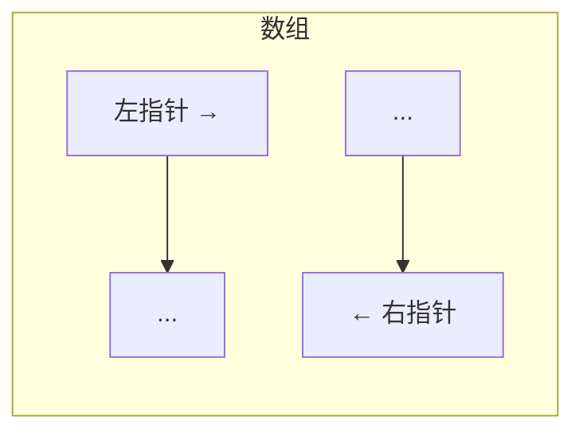

# 双指针模式 (Two Pointers)

## 为什么双指针很重要

双指针技术能以 $O(n)$ 的时间复杂度和 $O(1)$ 的空间复杂度解决许多复杂问题，从而消除不必要的嵌套循环：

- **数组与字符串**：寻找对子、反转序列、区间划分。
- **链表操作**：环检测（寻找入口）、寻找中点。
- **滑动窗口**：许多窗口问题的底层实现即为双指针。
- **回文检测**：首尾指针向中间逼近。

**实际影响**：在数组中寻找和为特定值的两个数：
- 暴力搜索：$O(n^2)$（两层嵌套循环）。
- 双指针：排序后仅需 $O(n)$ —— **在万级数据量下，比暴力法快 1000 倍**。

---

## 核心模式

### 1. 对撞指针 (Opposite Direction)
指针分别从两端开始，向中间靠拢。
- **应用**：两数之和（有序数组）、反转数组、盛最多水的容器。

### 2. 快慢指针 (Same Direction / Fast-Slow)
两个指针从同一端开始，以不同步长移动。
- **应用**：移除元素、去重、链表找环、寻找链表倒数第 K 个节点。

### 3. 固定间距指针
两个指针保持固定的距离同步移动。
- **应用**：固定窗口大小的滑动、寻找特定长度的子串特征。

---

## 深入理解

### 盛最多水的容器 (Container With Most Water)
**核心逻辑**：面积由“短板”决定。为了寻找更大面积，必须尝试移动较短的那根线（向内移），因为移动长线只会让宽度变小且高度依然受限于短线。

### 移除有序数组中的重复项
**核心逻辑**：使用 `slow` 指针记录“下一个唯一元素应存放的位置”，用 `fast` 指针遍历。当发现新元素时，将其复制到 `slow` 位置并推进。

---

## 进阶模式

### 三数之和 (3Sum)
**思路**：先对数组排序，然后固定一个数 $i$，在剩余区间 $[i+1, n-1]$ 内利用双指针寻找和为 $-i$ 的两数。注意在遍历和移动指针时跳过重复元素。

### 荷兰国旗问题 (Dutch National Flag)
**思路**：使用三个指针（`low`, `mid`, `high`）将数组划分为三块区域。这是解决“按颜色/类别排序”问题的最优方案，时间复杂度 $O(n)$。

---

## 面试高频题

### Q1: 两数之和 II - 有序数组 (简单)
**思路**：对撞指针。若 `sum < target`，左指针右移；若 `sum > target`，右指针左移。

### Q2: 验证回文串 (简单)
**思路**：首尾指针。跳过非字母数字字符，比较对应字符是否相等。

### Q3: 三数之和 (中等)
**思路**：排序 + 循环固定首元素 + 内部对撞指针。

### Q4: 接雨水 (困难)
**思路**：这是双指针的巅峰应用。通过左右两个指针维护当前的“左侧最大高度”和“右侧最大高度”，哪边小就处理哪边并计算当前位的积水，时间复杂度 $O(n)$，空间复杂度 $O(1)$。

---

## 延伸阅读

- **滑动窗口进阶**：了解如何将双指针扩展为变长窗口。
- **二分查找**：另一种特殊的“双指针”分治技术。
- **链表技巧**：深入理解快慢指针在空间复杂度优化中的妙用。
- **LeetCode**：[双指针标签题目](https://leetcode.com/tag/two-pointers/)
