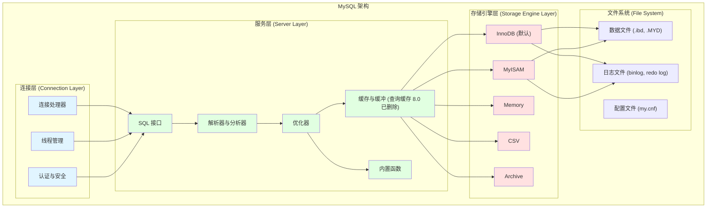
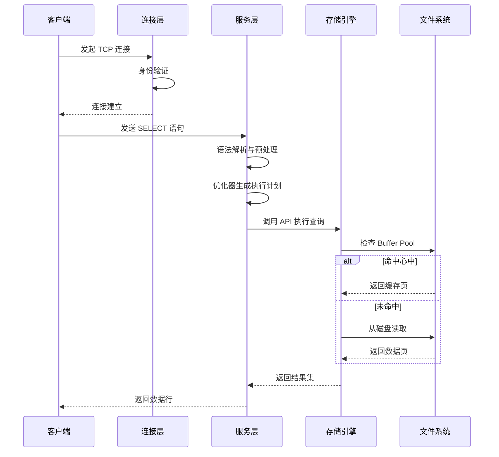
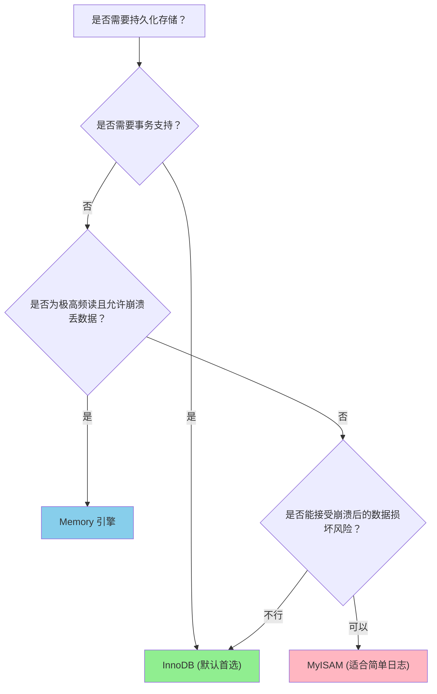

# 架构与存储引擎

## 为什么架构很重要

理解 MySQL 的架构有助于你：

- **诊断性能问题**：明确瓶颈出现在哪一层。
- **选择正确的存储引擎**：事务型选 InnoDB，分析型选 MyISAM。
- **优化查询**：理解查询在系统中的流动路径。
- **高效配置 MySQL**：合理调优缓冲区和缓存。

**现实影响**：
- 错误选择存储引擎（如使用 MyISAM 处理写密集型任务）可能导致严重的表级锁阻塞。
- 缓冲区配置不当会引发过度的磁盘 I/O。
- 不了解查询缓存（8.0 已删除）会导致内存资源的无谓浪费。

---

## MySQL 架构概览

MySQL 采用**分层架构**，主要分为三层：

### 第 1 层：连接层

**核心职责**：
- **连接处理**：接收客户端连接（TCP/IP、套接字）。
- **线程管理**：为每个连接分配一个线程（MySQL 8.0 引入了线程池）。
- **身份认证**：验证用户凭据及权限。
- **安全保障**：SSL/TLS 加密支持。

**关键配置**：
- `max_connections`：最大并发连接数。
- `thread_cache_size`：线程缓存大小，避免频繁创建/销毁线程。

### 第 2 层：服务层

**核心组件**：

1. **SQL 接口**：接收 SQL 命令并返回结果集。
2. **解析器 (Parser)**：验证语法并构建抽象语法树 (AST)。
3. **优化器 (Optimizer)**：核心步骤。它会基于成本模型选择最优执行路径（如：选择哪个索引，Join 的先后顺序）。
4. **缓冲与缓存**：
   - **查询缓存 (Query Cache)**：8.0 已彻底移除，因为其在大规模写操作下锁竞争严重。
   - **Buffer Pool**（InnoDB 特有）：缓存数据页和索引页，减少磁盘 I/O。建议设置为物理内存的 70-80%。

### 第 3 层：存储引擎层

**核心特性：插件式存储引擎**。MySQL 允许为不同的表指定不同的存储引擎：

- **InnoDB**：默认引擎。支持事务（ACID）、行级锁和外键。
- **MyISAM**：不支持事务，支持表级锁。适合读密集、非核心数据的场景。
- **Memory**：全内存操作，速度极快但数据易失。

---

## 查询执行流程

---

## 存储引擎深度对比

### InnoDB vs MyISAM

| 特性 | InnoDB | MyISAM |
|---------|--------|--------|
| **事务支持** | ✅ 符合 ACID 标准 | ❌ 不支持 |
| **锁定粒度** | 行级锁 (Row-level) | 表级锁 (Table-level) |
| **外键支持** | ✅ 支持 | ❌ 不支持 |
| **崩溃恢复** | ✅ 通过 Redo Log 自动恢复 | ❌ 崩溃易导致损坏 |
| **并发性能** | 极高（多版本并发控制 MVCC）| 较低（受表锁限制） |
| **存储开销** | 较高（需存储日志和元数据）| 较低 |
| **典型场景** | OLTP、高并发交易 | 读密集、简单报表、日志归档 |

---

## 存储引擎决策树

---

## 面试高频题

### Q1: 为什么 InnoDB 是默认存储引擎？
**回答**：InnoDB 提供了生产级系统所需的**可靠性**（事务、外键、崩溃恢复）和**高性能**（行级锁支持高并发）。相比之下，MyISAM 无法保证数据一致性，且在写操作时会锁定整张表。

### Q2: MySQL 8.0 为什么要删除查询缓存？
**回答**：
1. **锁竞争严重**：任何对表的写操作都会导致该表的所有缓存失效，在大规模并发下性能不升反降。
2. **命中率低**：对于动态数据，缓存几乎起不到作用。
3. **更佳方案**：现代架构通常在应用层使用 Redis 等专门的缓存中间件。

### Q3: 插件式存储引擎的意义是什么？
**回答**：它实现了**逻辑与存储的解耦**。服务层负责 SQL 解析和逻辑优化，而存储引擎负责底层的数据读写。这种架构允许开发者针对不同的业务需求（如全文检索、内存计算、长期存档）灵活切换底层实现。

---

## 延伸阅读

- **[索引原理](../indexes)** - 了解 InnoDB 如何利用 B+ 树组织海量数据。
- **[事务隔离](../transactions)** - 深入探讨 InnoDB 的 ACID 实现机制。
- **[锁机制](../locking)** - 理解行级锁与意向锁的交互逻辑。
- **[日志与复制](../logging-replication)** - 揭秘 Redo log 和 Undo log 的底层原理。
