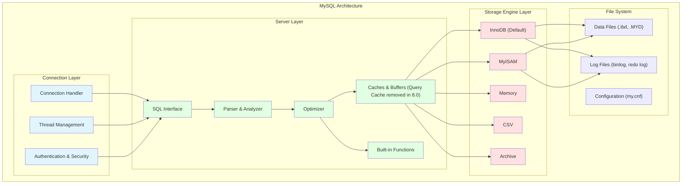
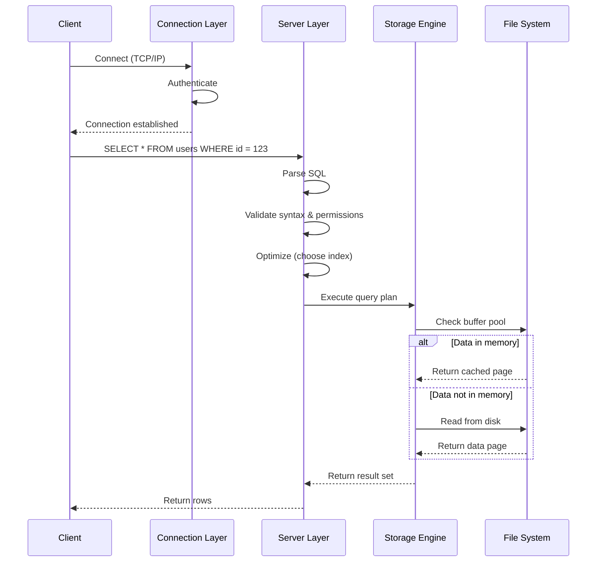
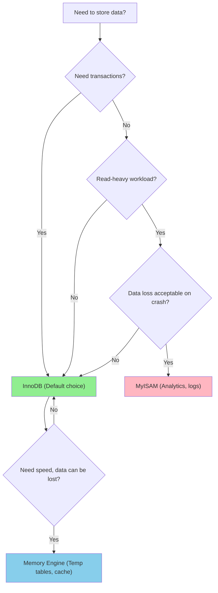

# 架构与存储引擎

## 为什么架构很重要

理解 MySQL 架构有助于你：

- **诊断性能问题**：知道哪一层造成了瓶颈
- **选择正确的存储引擎**：InnoDB 用于事务，MyISAM 用于分析
- **优化查询**：理解查询如何在系统中流转
- **有效配置 MySQL**：合理调整缓冲区和缓存

**实际影响**：
- 存储引擎选择不当会导致表级锁阻塞所有写入
- 缓冲区配置不当会导致过多的磁盘 I/O
- 不理解查询缓存（8.0 中已移除）会浪费内存

## MySQL 架构概览

MySQL 具有**分层架构**，包含三个主要层次：



### 第 1 层：连接层

**职责**：
- **连接处理**：接受客户端连接（TCP/IP、socket）
- **线程管理**：每个连接一个线程（MySQL 8.0 支持线程池）
- **认证**：验证用户凭据、权限
- **安全**：SSL/TLS 加密、密码验证

**配置**：
```ini
max_connections = 151              # 最大并发连接数
thread_cache_size = 10             # 缓存线程以复用
connect_timeout = 10               # 连接超时（秒）
```

**要点**：每个连接使用一个线程，消耗内存（约 256KB/线程）。过多连接可能导致 OOM。

### 第 2 层：服务器层

**职责**：

#### 1. SQL 接口
- 接受客户端的 SQL 查询
- 向客户端返回结果集

#### 2. 解析器与分析器


**示例**：
```sql
SELECT name, age FROM users WHERE id = 123;
```

**解析步骤**：
1. **词法分析**：`SELECT`、`name`、`,`、`age`、`FROM`、`users`、`WHERE`、`id`、`=`、`123`
2. **语法分析**：构建抽象语法树（AST）
3. **预处理**：检查表/列是否存在、权限
4. **优化器**：选择索引扫描还是全表扫描

#### 3. 优化器
- **查询优化**：选择最佳执行计划
- **索引选择**：决定使用哪个索引
- **连接顺序**：确定最优的连接顺序
- **基于成本**：估算不同计划的成本

**示例**：
```sql
-- 优化器选择：
-- - 如果选择性好则使用索引扫描（id = 123）
-- - 如果选择性差则使用全表扫描（status = 'pending' 且占 90% 行）
EXPLAIN SELECT * FROM users WHERE id = 123;
```

#### 4. 缓存与缓冲区

**查询缓存**（MySQL 8.0 中已移除）：
- 缓存 SELECT 查询的结果集
- 表有任何修改时缓存失效
- **为什么移除？**：
  - 写密集场景下竞争严重
  - 复杂性和 Bug
  - 对大多数应用收益有限

**缓冲池**（InnoDB 特有）：
- 缓存数据页和索引页
- 减少磁盘 I/O
- **配置**：
  ```ini
  innodb_buffer_pool_size = 2G      # 专用数据库服务器建议为 RAM 的 70-80%
  innodb_buffer_pool_instances = 8  # 减少竞争
  ```

#### 5. 内置函数
- 数学函数（`ABS`、`ROUND`）
- 字符串函数（`CONCAT`、`SUBSTRING`）
- 日期/时间函数（`NOW`、`DATE_FORMAT`）
- 聚合函数（`COUNT`、`SUM`、`AVG`）

### 第 3 层：存储引擎层

**关键特性**：**可插拔存储引擎**

MySQL 的存储引擎架构允许你根据工作负载选择最佳引擎：

- **InnoDB**：MySQL 5.5 起默认引擎，ACID 兼容
- **MyISAM**：读优化，不支持事务
- **Memory**：内存表，快速但不持久
- **CSV**：CSV 文件存储
- **Archive**：压缩存储，用于历史数据

**指定引擎**：
```sql
CREATE TABLE users (
    id INT PRIMARY KEY,
    name VARCHAR(100)
) ENGINE=InnoDB;  -- 或 MyISAM、Memory 等
```

## 查询执行流程



**逐步流程**：
1. **连接**：客户端建立 TCP 连接
2. **认证**：服务器验证凭据
3. **发送查询**：客户端发送 SQL 语句
4. **解析**：服务器检查语法，构建 AST
5. **优化**：服务器选择执行计划
6. **执行**：存储引擎检索数据
7. **返回**：服务器向客户端发送结果集

## 存储引擎对比

### InnoDB vs MyISAM

| 特性 | InnoDB | MyISAM |
|------|--------|--------|
| **事务** | ✅ ACID 兼容 | ❌ 不支持事务 |
| **锁粒度** | 行级锁 | 表级锁 |
| **外键** | ✅ 支持 | ❌ 不支持 |
| **崩溃恢复** | ✅ Redo log 恢复 | ❌ 崩溃时损坏 |
| **全文搜索** | ✅（MySQL 5.6+） | ✅ |
| **并发** | 高（行锁） | 低（表锁） |
| **空间需求** | 较高（undo/redo log） | 较低 |
| **Count 性能** | 较慢（扫描行） | 较快（缓存计数器） |
| **使用场景** | OLTP、高并发 | 读密集、分析 |

### 何时使用 InnoDB

**大多数应用的默认选择**：
- 电商（订单、支付、库存）
- 银行（交易、账户）
- 社交媒体（帖子、评论、点赞）
- 任何需要 ACID 属性的应用

**示例**：
```sql
CREATE TABLE orders (
    id INT PRIMARY KEY AUTO_INCREMENT,
    user_id INT NOT NULL,
    total DECIMAL(10, 2) NOT NULL,
    status ENUM('pending', 'paid', 'shipped') DEFAULT 'pending',
    created_at TIMESTAMP DEFAULT CURRENT_TIMESTAMP,
    FOREIGN KEY (user_id) REFERENCES users(id)
) ENGINE=InnoDB;

BEGIN;
UPDATE inventory SET quantity = quantity - 1 WHERE product_id = 123;
INSERT INTO orders (user_id, total) VALUES (456, 99.99);
COMMIT;  -- 两个操作要么都成功，要么都失败
```

### 何时使用 MyISAM

**极少数读性能至关重要的场景**：
- 数据仓库（读密集分析）
- 全文搜索（MySQL 5.6 之前）
- 批量插入（无并发写入）
- 临时表

**示例**：
```sql
CREATE TABLE access_logs (
    id BIGINT PRIMARY KEY AUTO_INCREMENT,
    ip VARCHAR(45) NOT NULL,
    path VARCHAR(255) NOT NULL,
    timestamp TIMESTAMP DEFAULT CURRENT_TIMESTAMP,
    FULLTEXT (path)
) ENGINE=MyISAM;

-- 快速批量插入
LOAD DATA INFILE '/var/log/access.log' INTO TABLE access_logs;
```

**为什么要避免 MyISAM？**：
- 表级锁在读取时阻塞所有写入
- 没有崩溃恢复（崩溃时数据损坏）
- 不支持事务（数据不一致风险）
- 不支持外键（需要手动维护完整性）

### 其他存储引擎

#### Memory 引擎
- **存储**：内存（RAM）
- **速度**：最快（无磁盘 I/O）
- **持久性**：重启后数据丢失
- **使用场景**：临时表、缓存、会话存储

```sql
CREATE TEMPORARY TABLE temp_sessions (
    session_id VARCHAR(128) PRIMARY KEY,
    user_id INT NOT NULL,
    expires_at DATETIME NOT NULL
) ENGINE=Memory;
```

#### CSV 引擎
- **存储**：CSV 文件
- **使用场景**：数据交换、外部工具
- **限制**：无索引，查询慢

```sql
CREATE TABLE products_csv (
    id INT NOT NULL,
    name VARCHAR(100) NOT NULL,
    price DECIMAL(10, 2)
) ENGINE=CSV;
```

#### Archive 引擎
- **存储**：压缩（zlib）
- **使用场景**：历史数据、日志归档
- **限制**：无索引，仅支持 INSERT 和 SELECT

```sql
CREATE TABLE old_orders (
    id INT PRIMARY KEY,
    order_data TEXT
) ENGINE=ARCHIVE;
```

## 存储引擎决策树



## 配置示例

### 专用数据库服务器

**场景**：8GB RAM，MySQL 为唯一服务

```ini
[mysqld]
# 连接设置
max_connections = 500
thread_cache_size = 50

# InnoDB 缓冲池（RAM 的 70-80%）
innodb_buffer_pool_size = 6G
innodb_buffer_pool_instances = 8
innodb_log_file_size = 512M

# 查询缓存（仅 MySQL 5.7）
# query_cache_type = 1
# query_cache_size = 0  # 已禁用，改用 Redis

# 日志设置
slow_query_log = 1
long_query_time = 1
log_error = /var/log/mysql/error.log
```

### 共享服务器

**场景**：2GB RAM，MySQL + Web 服务器

```ini
[mysqld]
# 保守设置
max_connections = 100
innodb_buffer_pool_size = 1G
innodb_log_buffer_size = 8M
```

## 面试题

### Q1：为什么 InnoDB 是默认存储引擎？

**答案**：InnoDB 提供：
- **ACID 兼容**：事务、外键、崩溃恢复
- **行级锁**：比 MyISAM 的表级锁并发性更高
- **崩溃恢复**：Redo log 确保持久性
- **可靠性**：崩溃时不会数据损坏（与 MyISAM 不同）

MyISAM 仅适用于读密集、非关键数据且不需要崩溃恢复的场景。

### Q2：InnoDB 和 MyISAM 有什么区别？

**答案**：
- **事务**：InnoDB 支持 ACID，MyISAM 不支持
- **锁**：InnoDB 使用行级锁，MyISAM 使用表级锁
- **外键**：InnoDB 支持，MyISAM 不支持
- **崩溃恢复**：InnoDB 通过 redo log 恢复，MyISAM 会损坏
- **性能**：MyISAM 全表扫描更快，InnoDB 并发 OLTP 更好

### Q3：什么时候使用 MyISAM 而不是 InnoDB？

**答案**：极少场景：
- **读密集分析**：带批量加载的数据仓库
- **全文搜索**（MySQL 5.6 之前）：性能更好
- **无事务需求**：日志、历史数据
- **简单性**：备份更容易（直接复制文件）

**实际建议**：99% 的应用使用 InnoDB。MyISAM 的限制（无事务、表锁）通常超过其优势。

### Q4：解释 MySQL 的可插拔存储引擎架构

**答案**：
- **关注点分离**：服务器层处理 SQL，存储引擎处理数据
- **API**：服务器调用存储引擎 API（读、写、提交）
- **灵活性**：根据工作负载为每个表选择引擎
- **透明性**：SQL 查询在任何引擎下工作方式相同

**示例**：
```sql
-- 同一数据库中使用不同引擎
CREATE TABLE users (...) ENGINE=InnoDB;      -- 事务型
CREATE TABLE logs (...) ENGINE=MyISAM;       -- 读密集日志
CREATE TABLE temp (...) ENGINE=Memory;       -- 临时缓存
```

### Q5：连接层发生了什么？

**答案**：
1. **接受连接**：连接处理器监听 3306 端口
2. **认证**：验证用户名/密码，SSL/TLS 协商
3. **分配线程**：每个连接一个线程（或线程池）
4. **维护状态**：连接状态、用户权限、临时表

**配置**：
- `max_connections`：最大并发连接数
- `thread_cache_size`：缓存线程以避免创建开销

### Q6：查询缓存是什么，为什么被移除？

**答案**：
- **是什么**：缓存 SELECT 查询的结果集，以查询文本为键
- **失效**：表的任何 INSERT/UPDATE/DELETE 操作都会使缓存失效
- **MySQL 8.0 移除原因**：
  - **竞争严重**：写密集场景下的全局缓存锁
  - **收益有限**：OLTP 中缓存失效太频繁
  - **复杂性**：Bug 和边界情况
  - **更好的替代**：Redis、Memcached、应用层缓存

## 延伸阅读

- **[索引](../indexes)** - 了解 InnoDB 如何用 B+ 树组织数据
- **[事务](../transactions)** - 深入 InnoDB 的 ACID 实现
- **[锁](../locking)** - 理解 InnoDB 的行级锁机制
- **[日志与复制](../logging-replication)** - InnoDB 的 redo log 和 undo log
