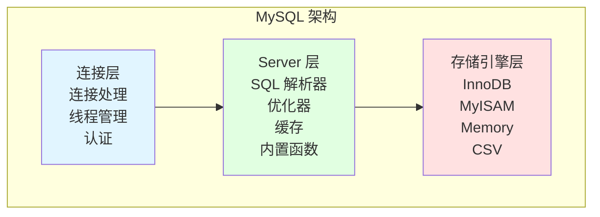

# MySQL 概览

## 为什么 MySQL 很重要

MySQL 是无数生产系统的骨干。理解 MySQL 内核对于以下方面至关重要：

- **性能优化**：一个未优化的查询可能拖垮整个应用
- **数据完整性**：正确的事务处理防止财务数据不一致
- **系统可靠性**：理解复制机制防止数据丢失
- **面试成功**：数据库内核是后端面试的核心话题

**实际影响**：
- 缺少索引可能导致查询耗时 10 秒而非 10 毫秒
- 错误的隔离级别可能导致金融事务中出现幻读
- 不理解死锁可能导致生产故障

## MySQL 概览



**核心特性**：
- **可插拔存储引擎**：在 InnoDB、MyISAM 等之间切换
- **客户端-服务器架构**：网络连接、每连接一个线程
- **SQL 标准兼容**：ACID 事务、外键、视图
- **开源**：广泛支持、社区驱动

## 快速参考

### 存储引擎

| 特性 | InnoDB | MyISAM |
|------|--------|--------|
| **事务** | ✅ ACID | ❌ |
| **锁** | 行级锁 | 表级锁 |
| **外键** | ✅ | ❌ |
| **崩溃恢复** | ✅ | ❌ |
| **默认引擎始于** | MySQL 5.5 | 5.5 之前 |

### 事务隔离级别

| 级别 | 脏读 | 不可重复读 | 幻读 | 使用场景 |
|------|------|------------|------|----------|
| **Read Uncommitted** | ✅ | ✅ | ✅ | 很少使用 |
| **Read Committed (RC)** | ❌ | ✅ | ✅ | 许多数据库的默认值 |
| **Repeatable Read (RR)** | ❌ | ❌ | ⚠️* | MySQL 默认值 |
| **Serializable** | ❌ | ❌ | ❌ | 严格一致性 |

*MySQL InnoDB 通过 Gap Lock 防止幻读

### 索引类型

| 类型 | 描述 | 示例 |
|------|------|------|
| **主键索引** | 聚簇索引，数据与索引一起存储 | `PRIMARY KEY (id)` |
| **二级索引** | 非聚簇，存储主键值 | `INDEX (email)` |
| **唯一索引** | 强制唯一性 | `UNIQUE (username)` |
| **组合索引** | 多列索引 | `INDEX (name, age)` |
| **全文索引** | 文本搜索 | `FULLTEXT (content)` |

### 关键日志

| 日志 | 层级 | 用途 |
|------|------|------|
| **Binlog** | Server 层 | 复制、恢复 |
| **Redo Log** | InnoDB 层 | 崩溃恢复（WAL） |
| **Undo Log** | InnoDB 层 | 回滚、MVCC |

## 文档结构

本 MySQL 文档分为 6 个完整章节：

### 1. [架构与存储引擎](./architecture)

**你将学到**：
- MySQL 的三层架构
- InnoDB 与 MyISAM 对比
- 查询执行流程
- 不同存储引擎的适用场景

**为什么重要**：
选择错误的存储引擎可能导致数据损坏、并发性能差和无法从崩溃中恢复。

### 2. [索引](./indexes)

**你将学到**：
- B+ Tree 结构及为什么 MySQL 使用它
- 聚簇索引与二级索引
- 最左前缀规则
- 覆盖索引
- 索引优化技术

**为什么重要**：
一个索引可以将查询性能提升 1000 倍。过度索引会拖慢写入。

### 3. [事务](./transactions)

**你将学到**：
- ACID 属性及其实际示例
- 隔离级别及其权衡
- MVCC（多版本并发控制）
- Undo log 和 redo log 的作用

**为什么重要**：
理解隔离级别可以防止金融系统中的幻读。MVCC 实现了无锁高并发。

### 4. [锁](./locking)

**你将学到**：
- 锁粒度（全局锁、表锁、行锁）
- 锁模式（共享锁 vs 排他锁）
- Gap Lock 和 Next-Key Lock
- 死锁检测和预防

**为什么重要**：
死锁可能导致生产故障。理解锁类型有助于诊断性能问题。

### 5. [日志与复制](./logging-replication)

**你将学到**：
- Binlog、redo log、undo log 的区别
- WAL（Write-Ahead Logging）
- 主从复制过程
- 复制延迟监控

**为什么重要**：
复制实现读取扩展和灾难恢复。正确的日志配置确保数据持久性。

### 6. [SQL 优化](./optimization)

**你将学到**：
- EXPLAIN 分析
- 查询优化技术
- 深分页优化
- Schema 设计最佳实践

**为什么重要**：
优化的查询减少数据库负载、提升响应时间、降低基础设施成本。

## 面试题清单

用此清单验证你的 MySQL 知识：

### 架构
- [ ] 解释 MySQL 的三层架构
- [ ] 对比 InnoDB 和 MyISAM
- [ ] 什么情况下会用 MyISAM 而非 InnoDB？
- [ ] 查询缓存是什么，为什么在 MySQL 8.0 中被移除？

### 索引
- [ ] 为什么 MySQL 使用 B+ Tree 而非 B Tree？
- [ ] 聚簇索引和二级索引有什么区别？
- [ ] 用示例解释最左前缀规则
- [ ] 什么是覆盖索引？
- [ ] 为什么 `WHERE YEAR(date) = 2024` 不使用索引？
- [ ] 如何优化深分页（`LIMIT 1000000, 10`）？

### 事务
- [ ] 用实际示例解释 ACID
- [ ] Undo log 如何保证原子性？
- [ ] Redo log 如何保证持久性？
- [ ] RC 和 RR 隔离级别有什么区别？
- [ ] InnoDB 中的 MVCC 如何工作？

### 锁
- [ ] 表锁和行锁有什么区别？
- [ ] 解释 S 锁和 X 锁
- [ ] 意向锁有什么用途？
- [ ] 什么是 Gap Lock，何时使用？
- [ ] InnoDB 如何检测死锁？
- [ ] Record Lock、Gap Lock 和 Next-Key Lock 有什么区别？

### 日志与复制
- [ ] Binlog、redo log 和 undo log 有什么区别？
- [ ] WAL（Write-Ahead Logging）如何工作？
- [ ] 解释 MySQL 主从复制过程
- [ ] 什么是半同步复制？
- [ ] 如何监控复制延迟？

### 优化
- [ ] 如何分析慢查询？
- [ ] EXPLAIN 中 `ref` 和 `eq_ref` 有什么区别？
- [ ] 为什么 `WHERE LOWER(name) = 'alice'` 不使用索引？
- [ ] 什么时候应该反范式化 Schema？
- [ ] 如何优化 `COUNT(*)` 查询？

## 常见面试题

### Q1：为什么 InnoDB 是默认存储引擎？

**答案**：InnoDB 提供 ACID 合规性、行级锁（更好的并发性）、通过 redo log 实现的崩溃恢复以及外键支持。MyISAM 缺少事务支持且使用表级锁，不适合高并发的 OLTP 负载。

### Q2：聚簇索引和二级索引有什么区别？

**答案**：聚簇索引在叶节点中存储实际的数据行。在 InnoDB 中，主键就是聚簇索引。二级索引在叶节点中存储主键值，需要二次查找才能获取完整行数据。

### Q3：解释 InnoDB 中的 MVCC

**答案**：MVCC（多版本并发控制）允许多个事务在不加锁的情况下并发访问数据库。InnoDB 使用 undo log 实现 MVCC，undo log 存储行的先前版本。每个事务基于其读视图看到数据快照，防止脏读并实现非阻塞读。

### Q4：Binlog 和 redo log 有什么区别？

**答案**：Binlog 是 Server 层的逻辑日志，记录 SQL 语句或行变更，用于复制和时间点恢复。Redo log 是 InnoDB 特定的物理日志，记录页修改，用于通过 WAL 进行崩溃恢复。Binlog 在事务提交后写入，而 redo log 在事务提交前写入。

### Q5：如何优化深分页？

**答案**：使用延迟关联（仅查主键的子查询）或记住上一页的最后 ID。例如：
```sql
-- 慢：扫描 1,000,010 行
SELECT * FROM orders ORDER BY id LIMIT 1000000, 10;

-- 快：子查询仅扫描主键
SELECT o.* FROM orders o
INNER JOIN (SELECT id FROM orders ORDER BY id LIMIT 1000000, 10) tmp
ON o.id = tmp.id;
```

## 学习路径

**面试准备**：
1. 从架构开始 → 理解全局
2. 索引 → 最常见的面试话题
3. 事务 → ACID 和隔离级别
4. 锁 → 死锁场景
5. 日志与复制 → 高级话题
6. 优化 → 实际应用

**生产实践**：
1. 架构 → 选择合适的存储引擎
2. 索引 → 优化查询
3. 优化 → EXPLAIN 和调优
4. 事务 → 选择合适的隔离级别
5. 锁 → 诊断和预防死锁
6. 日志与复制 → 确保数据持久性和可用性

## 下一步

深入每个章节的细节：

- **[架构与存储引擎](./architecture)** - 从这里开始理解 MySQL 的基础
- **[索引](./indexes)** - 对查询性能最关键
- **[事务](./transactions)** - 数据一致性的核心
- **[锁](./locking)** - 预防和诊断死锁
- **[日志与复制](./logging-replication)** - 确保数据持久性
- **[SQL 优化](./optimization)** - 让查询飞起来
