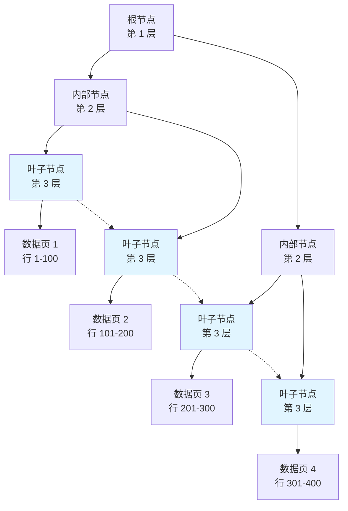

# 索引原理

## 为什么索引很重要

索引是 MySQL 性能调优中单一最重要的机制：

- **千倍提速**：索引查找 vs 全表扫描。
- **减少 I/O**：仅读取相关数据页，而非扫描整张表。
- **有序访问**：B+ 树天然维护数据的排序。
- **权衡**：写操作变慢（需维护索引树），占用更多磁盘空间。

**现实影响**：
- 在千万级订单表中，若缺失 `user_id` 索引，一个简单的查询可能从 10 毫秒激增至 10 秒。
- 哪怕只有一个未优化的查询，也可能拖垮整个应用程序的响应性能。

---

## B+ 树结构深度解析

### 为什么选择 B+ 树？

MySQL 选择 **B+ 树**（而非 B 树）作为索引结构，原因有四：

1. **高扇出 (High Fanout)**：非叶子节点仅存储键值（不存数据），单页能容纳更多分叉。
2. **树更矮**：千万级数据仅需 3-4 层即可覆盖，意味着只需 3-4 次磁盘 I/O。
3. **范围查询极佳**：叶子节点通过双向链表相连，且数据有序，区间扫描极快。
4. **磁盘友好**：节点大小通常与磁盘页（InnoDB 默认为 16KB）对齐。

### B+ 树 vs B 树

| 特性 | B+ 树 | B 树 |
|---------|---------|--------|
| **数据存储** | 仅存储在叶子节点 | 所有节点均存储数据 |
| **叶子节点链接** | 有（双向链表） | 无 |
| **扇出能力** | 极高（容纳更多键） | 较低 |
| **范围查询** | 极其高效 | 低效（需多次树遍历） |
| **树高度** | 更矮 | 较高 |

---

## 索引分类

### 1. 聚簇索引 (Clustered Index)

**核心特征**：
- **每表唯一**：InnoDB 的主键即为聚簇索引。
- **索引即数据**：叶子节点存储完整的行数据。
- **物理有序**：数据按索引键值在物理磁盘上顺序存储。

### 2. 二级索引 (Secondary Index / 非聚簇索引)

**核心特征**：
- **可有多个**：根据业务需求创建。
- **叶子存储主键**：二级索引的叶子节点不存行数据，只存主键值。
- **回表 (Lookup)**：二级索引 → 获取主键 → 查找聚簇索引 → 获取完整数据行。

### 3. 联合索引 (Composite Index)

**核心特征**：涉及多个列，如 `(name, age, city)`。遵循**最左前缀匹配原则**。

---

## 最左前缀匹配原则

对于联合索引 `(col1, col2, col3)`，索引仅在以下查询条件下生效：
- 仅使用 `col1`。
- 同时使用 `col1` 和 `col2`。
- 同时使用 `col1`、`col2` 和 `col3`。

**关键陷阱**：
- 缺失前缀：`WHERE col2 = ?` —— **索引失效**。
- 跳过中间：`WHERE col1 = ? AND col3 = ?` —— **仅 col1 部分生效**。
- 范围查询：`WHERE col1 = ? AND col2 > 10 AND col3 = ?` —— **col3 无法使用索引**（范围查询右侧的索引位失效）。

---

## 覆盖索引 (Covering Index)

**定义**：一个索引包含了查询所需的所有列（包括 SELECT、WHERE、JOIN 等涉及的列）。

**收益**：
- **无需回表**：直接从索引树获取所有数据。
- **极致速度**：减少一半的 I/O 操作。
- **EXPLAIN 标识**：在 Extra 列显示 `Using index`。

---

## 索引设计原则

1. **高区分度**：选择唯一值较多（基数大）的列。性别列（男/女）就不适合单独建索引。
2. **遵循最左匹配**：根据最常见的查询组合设定联合索引的列顺序。
3. **控制索引数量**：每个索引都会增加写入开销并占用 Buffer Pool 内存。
4. **前缀索引**：针对超长字符串，仅索引其前 10-20 个字符以节省空间。

---

## 索引失效的 5 种典型场景

1. **函数/计算操作**：`WHERE YEAR(created_at) = 2024` —— **失效**。
2. **隐式类型转换**：字符串列用数字查询 `WHERE phone = 138...` —— **失效**。
3. **模糊匹配前缀通配符**：`LIKE '%keyword%'` —— **失效**。
4. **OR 条件混用**：若 OR 链接的某一列无索引，则整体索引失效。
5. **范围查询阻断**：在联合索引中，范围查询（`>`、`<`）之后的列无法使用索引。

---

## 面试高频题

### Q1: 既然二级索引存主键，为什么不直接存行指针？
**回答**：为了**减少索引维护成本**。如果存行指针（物理地址），一旦聚簇索引发生页分裂导致行移动，所有的二级索引都必须跟着更新。而存主键值则提供了一个稳定的逻辑引用，牺牲一点查找性能换取更高的写入稳定性。

### Q2: 什么是“回表”，如何规避它？
**回答**：回表是指在二级索引找到主键后，再去主键索引树查找完整行数据的过程。规避方法是使用**覆盖索引** —— 即创建一个包含所有查询列的联合索引，让查询在二级索引树上就能直接“结案”。

### Q3: 为什么不建议使用 UUID 作为主键？
**回答**：UUID 是随机无序的。在聚簇索引下，这会导致数据插入时在磁盘上频繁发生**页分裂和随机 I/O**，严重影响写入性能。自增 ID 保证了数据的顺序追加，效率最高。

---

## 延伸阅读

- **[架构篇](../architecture)** - 理解 InnoDB 是如何物理存储索引页的。
- **[优化篇](../optimization)** - 学习深分页（Deep Pagination）的索引优化方案。
- **[日志篇](../logging-replication)** - 了解 Redo log 对索引修改的保障机制。
