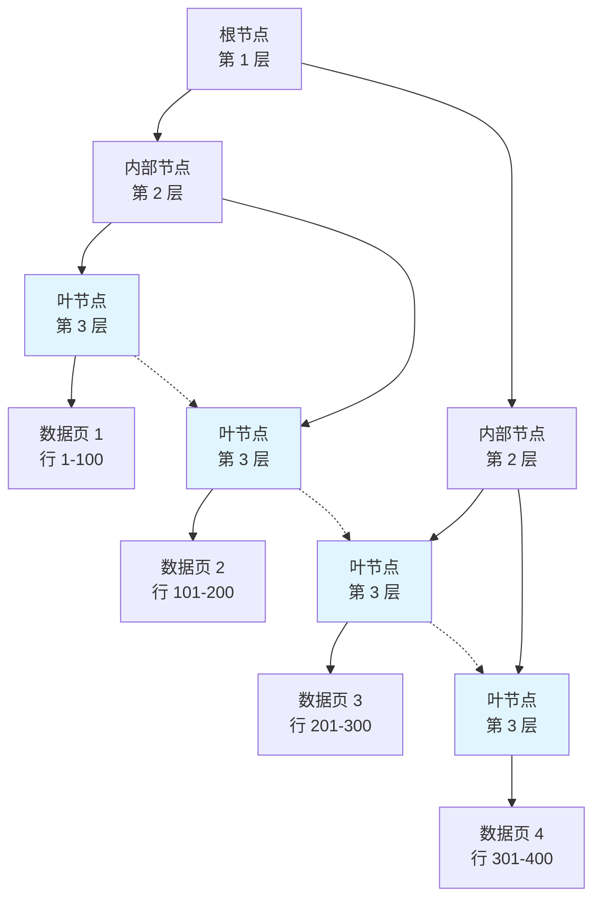
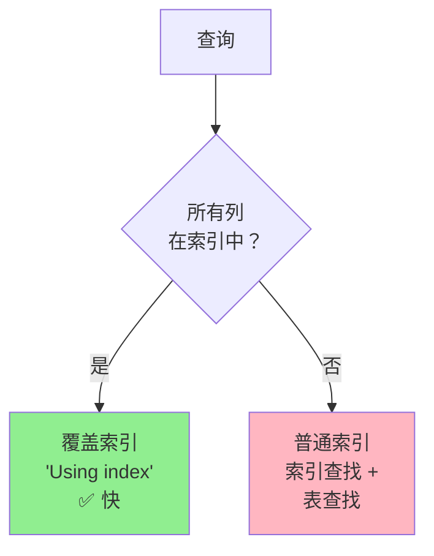

# 索引

## 为什么索引很重要

索引是 MySQL 中最重要的性能调优机制：

- **查询速度提升 1000 倍**：索引查找 vs 全表扫描
- **减少 I/O**：只读取相关数据页而非整个表
- **有序访问**：B+ 树保持数据有序
- **权衡**：写入变慢（索引维护），占用更多磁盘空间

**实际影响**：
- 在 1000 万行的 `orders` 表上缺少 `user_id` 索引，一个简单查询可能需要 10 秒而非 10 毫秒
- 一个未优化的查询可能拖垮整个应用的性能

## B+ 树结构

### 为什么用 B+ 树？

MySQL 使用 **B+ 树**（而非 B 树）作为索引，因为：

1. **高扇出**：非叶节点只存键（不存数据），每个节点可以有更多子节点
2. **浅层树**：数百万记录只需 3-4 层（更少的磁盘 I/O）
3. **范围查询**：叶节点按序链接（高效的范围扫描）
4. **磁盘友好**：节点大小匹配磁盘页大小（InnoDB 中 16KB）



**示例**：查找 `id = 250` 的行

1. **根节点**：读取根节点（1 次 I/O），确定进入节点 C
2. **内部节点**：读取内部节点 C（1 次 I/O），确定进入叶节点 F
3. **叶节点**：读取叶节点 F（1 次 I/O），找到数据页指针
4. **数据页**：读取数据页（1 次 I/O），返回行

**总计**：数百万记录只需 3-4 次 I/O（全表扫描则需要数百万次）

### B+ 树 vs B 树

| 特性 | B+ 树 | B 树 |
|------|-------|------|
| **数据存储** | 只在叶节点 | 在所有节点 |
| **叶节点链接** | 有（链表） | 无 |
| **扇出** | 更高（更多键） | 更低 |
| **范围查询** | 高效（扫描叶节点） | 低效（需要遍历树） |
| **高度** | 更低（更少层级） | 更高 |

**MySQL 的选择**：B+ 树，因为范围查询性能更好且树高更低。

## 索引类型

### 主键索引（聚簇索引）

**特点**：
- **每表一个**：InnoDB 的主键就是聚簇索引
- **数据存储**：叶节点存储实际的数据行
- **有序**：行按主键物理排序

```sql
CREATE TABLE users (
    id INT PRIMARY KEY,           -- 聚簇索引
    name VARCHAR(100),
    email VARCHAR(100)
);

-- 聚簇索引查找（最快）
SELECT * FROM users WHERE id = 123;
```

**如果没有主键**：InnoDB 使用：
1. 第一个包含 NOT NULL 列的**唯一索引**
2. 隐藏的 **6 字节行 ID**（自动生成，不推荐）

### 二级索引

**特点**：
- **每表可有多个**：按需创建
- **叶节点**：存储主键值，而非完整行
- **两次查找**：二级索引 → 主键 → 数据行


```sql
CREATE TABLE users (
    id INT PRIMARY KEY,
    name VARCHAR(100),
    email VARCHAR(100),
    INDEX idx_email (email)        -- 二级索引
);

-- 两次查找：
-- 1. 通过 idx_email 找到 id
-- 2. 通过 id 上的聚簇索引找到行
SELECT * FROM users WHERE email = 'user@example.com';
```

**覆盖索引优化**：如果二级索引包含所有查询列，则跳过第二次查找。

### 唯一索引

**特点**：
- **强制唯一性**：防止重复值
- **性能**：与普通索引相同（B+ 树）
- **使用场景**：邮箱、用户名、SKU

```sql
CREATE TABLE users (
    id INT PRIMARY KEY,
    username VARCHAR(50) UNIQUE,   -- 唯一索引
    email VARCHAR(100) UNIQUE      -- 唯一索引
);

-- 错误：Duplicate entry 'alice' for key 'username'
INSERT INTO users (username) VALUES ('alice');
INSERT INTO users (username) VALUES ('alice');
```

### 组合索引

**特点**：
- **多列**：`(name, age, city)`
- **顺序很重要**：遵循最左前缀规则
- **使用场景**：多列 WHERE 子句

```sql
CREATE TABLE users (
    id INT PRIMARY KEY,
    name VARCHAR(100),
    age INT,
    city VARCHAR(50),
    INDEX idx_name_age_city (name, age, city)  -- 组合索引
);

-- ✅ 使用索引（name 是第一列）
SELECT * FROM users WHERE name = 'Alice';

-- ✅ 使用索引（name, age 匹配前缀）
SELECT * FROM users WHERE name = 'Alice' AND age = 25;

-- ✅ 使用索引（name, age, city 匹配前缀）
SELECT * FROM users WHERE name = 'Alice' AND age = 25 AND city = 'NYC';

-- ❌ 不使用索引（跳过了 name）
SELECT * FROM users WHERE age = 25;

-- ✅ 使用索引的 name 部分，忽略 age 和 city（最左前缀）
SELECT * FROM users WHERE name = 'Alice' AND city = 'NYC';
```

### 全文索引

**特点**：
- **文本搜索**：在文本列中搜索单词
- **InnoDB 支持**：MySQL 5.6 起
- **使用场景**：文章搜索、商品描述

```sql
CREATE TABLE articles (
    id INT PRIMARY KEY,
    title VARCHAR(200),
    content TEXT,
    FULLTEXT INDEX ft_content (title, content)
);

-- 全文搜索
SELECT * FROM articles
WHERE MATCH(title, content) AGAINST('MySQL tutorial' IN NATURAL LANGUAGE MODE);
```

## 最左前缀规则

### 规则定义

对于组合索引 `(col1, col2, col3)`，索引可用于以下查询：
- 只使用 `col1`
- 使用 `col1` 和 `col2`
- 使用 `col1`、`col2` 和 `col3`

**不能跳过列**：`(col1, col3)` 跳过了 `col2`，所以 `col3` 不会被使用。

### 示例

```sql
-- 索引：(name, age, city)
CREATE INDEX idx_user ON users (name, age, city);

-- ✅ 使用索引：name 匹配前缀
SELECT * FROM users WHERE name = 'Alice';
EXPLAIN 显示：key=idx_user, ref=const

-- ✅ 使用索引：name, age 匹配前缀
SELECT * FROM users WHERE name = 'Alice' AND age = 25;
EXPLAIN 显示：key=idx_user, ref=const,const

-- ✅ 使用索引：name, age, city 匹配前缀
SELECT * FROM users WHERE name = 'Alice' AND age = 25 AND city = 'NYC';
EXPLAIN 显示：key=idx_user, ref=const,const,const

-- ❌ 不使用索引：跳过了 name
SELECT * FROM users WHERE age = 25;
EXPLAIN 显示：key=NULL, type=ALL（全表扫描）

-- ✅ 使用索引的 name，忽略 age 和 city
SELECT * FROM users WHERE name = 'Alice' AND city = 'NYC';
EXPLAIN 显示：key=idx_user, ref=const（只用了 name）

-- ❌ 不使用索引：name 在函数中
SELECT * FROM users WHERE UPPER(name) = 'ALICE';
EXPLAIN 显示：key=NULL, type=ALL

-- ✅ 最后一列范围查询：name, age 被使用，city 范围扫描
SELECT * FROM users WHERE name = 'Alice' AND age = 25 AND city > 'A';
EXPLAIN 显示：key=idx_user, type=range
```

### 设计建议

**列顺序很重要**：
```sql
-- 查询如：WHERE name = ? AND age = ?
-- 最佳：INDEX (name, age)

-- 查询如：WHERE age = ?
-- 最佳：INDEX (age)  -- 独立索引，非组合

-- 两种查询都有：
CREATE INDEX idx_name_age ON users (name, age);
CREATE INDEX idx_age ON users (age);  -- 独立索引
```

## 覆盖索引

### 定义

**覆盖索引**包含查询所需的所有列，无需访问表的数据行。



### 示例

```sql
-- 索引：(user_id, status, created_at)
CREATE INDEX idx_order_stats ON orders (user_id, status, created_at);

-- ✅ 覆盖索引（所有列在索引中）
SELECT user_id, status, created_at
FROM orders
WHERE user_id = 123 AND status = 'pending';
-- EXPLAIN 显示：Extra='Using index'（无需表查找）

-- ❌ 非覆盖（SELECT * 包含其他列）
SELECT * FROM orders
WHERE user_id = 123 AND status = 'pending';
-- EXPLAIN 显示：Extra=''（需要表查找）

-- ✅ 覆盖索引（COUNT(*) 使用索引）
SELECT COUNT(*)
FROM orders
WHERE user_id = 123 AND status = 'pending';
-- EXPLAIN 显示：Extra='Using index'
```

### 优势

- **无需表查找**：查询执行更快
- **减少 I/O**：只读索引页，不读数据页
- **内存缓存**：索引页更可能在缓冲池中

**权衡**：索引更大（索引中存储更多列）。

## 索引设计原则

### 1. 选择性高的列

**高基数 = 更好的索引**：
```sql
-- ✅ 好：很多唯一值
CREATE INDEX idx_email ON users (email);  -- 几乎唯一

-- ❌ 差：很少唯一值
CREATE INDEX idx_gender ON users (gender);  -- 只有 'M', 'F'

-- 经验法则：选择性 > 95% 才是有效索引
SELECT COUNT(DISTINCT email) / COUNT(*) FROM users;  -- 0.98 ✅
SELECT COUNT(DISTINCT gender) / COUNT(*) FROM users;  -- 0.5 ❌
```

### 2. 遵循最左前缀

```sql
-- 查询：WHERE name = ?, WHERE name = ? AND age = ?
-- 最佳索引：(name, age)
CREATE INDEX idx_name_age ON users (name, age);

-- 而非：(age, name)  -- 第一个查询跳过了 name
```

### 3. 考虑覆盖索引

```sql
-- 查询：SELECT user_id, status, created_at FROM orders WHERE user_id = ?
-- 覆盖索引：(user_id, status, created_at)
CREATE INDEX idx_covering ON orders (user_id, status, created_at);
```

### 4. 避免过度索引

**每个索引都有代价**：
- **插入/更新/删除变慢**：每个索引都需要更新
- **更多磁盘空间**：索引页占用存储
- **缓冲池压力**：更多索引竞争内存

**原则**：为频繁运行或性能关键的查询创建索引。

## 常见陷阱

### 1. 对列使用函数

```sql
-- ❌ 索引失效：对列使用函数
SELECT * FROM users WHERE YEAR(created_at) = 2024;

-- ✅ 改写为范围查询
SELECT * FROM users
WHERE created_at >= '2024-01-01' AND created_at < '2025-01-01';
```

**原因**：函数破坏索引使用，因为索引存储原始值而非计算结果。

### 2. 类型转换

```sql
-- ❌ 隐式类型转换：phone 是 VARCHAR
SELECT * FROM users WHERE phone = 13800138000;

-- ✅ 使用字符串字面量
SELECT * FROM users WHERE phone = '13800138000';
```

**原因**：MySQL 会转换列值而非常量，导致索引失效。

### 3. 前导通配符

```sql
-- ❌ 前导通配符：无法使用索引
SELECT * FROM users WHERE name LIKE '%john%';

-- ✅ 去掉前导通配符或使用全文搜索
SELECT * FROM users WHERE name LIKE 'john%';  -- 使用索引
-- 或使用全文索引搜索中间内容
SELECT * FROM articles WHERE MATCH(content) AGAINST('john' IN BOOLEAN MODE);
```

### 4. OR 条件

```sql
-- ❌ OR 连接不同列：可能无法高效使用索引
SELECT * FROM users WHERE name = 'Alice' OR age = 25;

-- ✅ 使用 UNION（每个查询使用索引）
SELECT * FROM users WHERE name = 'Alice'
UNION
SELECT * FROM users WHERE age = 25;
```

### 5. 否定条件

```sql
-- ❌ 否定操作符：可能不使用索引
SELECT * FROM users WHERE status != 'pending';

-- ✅ 使用 IN 列举正向值
SELECT * FROM users WHERE status IN ('paid', 'shipped', 'cancelled');
```

## EXPLAIN 分析

### 关键列

```sql
EXPLAIN SELECT * FROM orders WHERE user_id = 123;

+----+-------------+-------+------+---------------+---------+-------+------+-------------+
| id | select_type | table | type | possible_keys | key     | key_len | ref  | rows | Extra |
+----+-------------+-------+------+---------------+---------+-------+------+-------------+
|  1 | SIMPLE      | orders| ref  | idx_user_id   | idx_u   | 5       | const|  100 | Using index |
+----+-------------+-------+------+---------------+---------+-------+------+-------------+
```

### Type 列（访问类型）

**从优到差**：

| 类型 | 描述 | 示例 |
|------|------|------|
| **system** | 表中只有 1 行 | `SELECT * FROM config WHERE id = 1` |
| **const** | 主键或唯一索引查找（1 行） | `WHERE id = 123` |
| **eq_ref** | 唯一索引扫描（JOIN） | `JOIN users ON orders.user_id = users.id` |
| **ref** | 非唯一索引查找 | `WHERE user_id = 123` |
| **range** | 索引范围扫描 | `WHERE id > 100 AND id < 200` |
| **index** | 全索引扫描 | `SELECT COUNT(*) FROM orders` |
| **ALL** | 全表扫描 ❌ | `WHERE name = 'Alice'`（无索引） |

**目标**：避免 `type=ALL`（全表扫描）。

### Extra 列

| 值 | 含义 | 好/差 |
|----|------|-------|
| **Using index** | 覆盖索引（无需表查找） | ✅ 最佳 |
| **Using where** | WHERE 子句过滤 | ✅ 正常 |
| **Using filesort** | 额外排序（ORDER BY 未使用索引） | ❌ 差 |
| **Using temporary** | 临时表用于 GROUP BY/DISTINCT | ❌ 差 |
| **Using index condition** | 索引条件下推优化 | ✅ 好 |

## 优化示例

### 1. 深度分页

```sql
-- ❌ 慢：扫描 1,000,010 行
SELECT * FROM orders ORDER BY id LIMIT 1000000, 10;

-- ✅ 方案 1：延迟关联
SELECT o.* FROM orders o
INNER JOIN (
    SELECT id FROM orders ORDER BY id LIMIT 1000000, 10
) tmp ON o.id = tmp.id;

-- ✅ 方案 2：记住上次 ID
SELECT * FROM orders WHERE id > last_seen_id ORDER BY id LIMIT 10;
```

### 2. 避免 Filesort

```sql
-- ❌ Filesort：ORDER BY 未使用索引
SELECT * FROM orders WHERE user_id = 123 ORDER BY created_at;
-- 索引：(user_id)  -- 不覆盖 ORDER BY

-- ✅ 添加覆盖索引
CREATE INDEX idx_user_created ON orders (user_id, created_at);
```

### 3. 优化 JOIN

```sql
-- ❌ 每行子查询
SELECT * FROM users
WHERE id IN (SELECT user_id FROM orders WHERE status = 'pending');

-- ✅ JOIN（优化器可以优化）
SELECT DISTINCT u.* FROM users u
INNER JOIN orders o ON u.id = o.user_id
WHERE o.status = 'pending';
```

## 面试题

### Q1：为什么 MySQL 使用 B+ 树而非 B 树？

**答案**：
- **更高扇出**：非叶节点只存键（不存数据），每个节点可以有更多子节点
- **更浅的树**：更少层级 = 更少磁盘 I/O
- **范围查询**：叶节点按序链接，支持高效范围扫描
- **磁盘友好**：节点大小匹配磁盘页大小（16KB）

### Q2：聚簇索引和二级索引有什么区别？

**答案**：
- **聚簇索引**：每表一个，叶节点存储实际数据行，InnoDB 中主键就是聚簇索引
- **二级索引**：每表可有多个，叶节点存储主键值，需要两次查找（二级 → 主键 → 数据）

### Q3：用例子解释最左前缀规则

**答案**：对于组合索引 `(A, B, C)`：
- ✅ `WHERE A = ?`（使用 A）
- ✅ `WHERE A = ? AND B = ?`（使用 A, B）
- ✅ `WHERE A = ? AND B = ? AND C = ?`（使用 A, B, C）
- ❌ `WHERE B = ?`（跳过 A，不使用索引）
- ✅ `WHERE A = ? AND C = ?`（使用 A，忽略 B, C）

### Q4：什么是覆盖索引？

**答案**：包含查询所需所有列的索引，无需访问表的数据行。在 EXPLAIN 的 Extra 列中标记为 `Using index`。

示例：
```sql
-- 索引：(user_id, status)
-- 查询：SELECT user_id, status FROM orders WHERE user_id = 123
-- ✅ 覆盖索引：无需表查找
```

### Q5：为什么 `WHERE YEAR(date) = 2024` 不使用索引？

**答案**：函数 `YEAR(date)` 从列中计算值，索引存储的是原始日期值，无法使用。改写为范围查询：
```sql
WHERE date >= '2024-01-01' AND date < '2025-01-01'
```

### Q6：如何优化 `SELECT * FROM table LIMIT 1000000, 10`？

**答案**：
- **延迟关联**：用子查询只获取主键，再 JOIN 获取完整行
- **记住上次 ID**：`WHERE id > last_seen_id ORDER BY id LIMIT 10`
- **Seek 方法**：使用覆盖索引定位偏移量

### Q7：`type=ref`、`type=range` 和 `type=ALL` 有什么区别？

**答案**：
- **ref**：非唯一索引查找（如 `WHERE user_id = 123`）
- **range**：索引范围扫描（如 `WHERE id > 100 AND id < 200`）
- **ALL**：全表扫描（未使用索引） ❌

## 延伸阅读

- **[架构与存储引擎](../architecture)** - 了解 InnoDB 如何存储索引
- **[事务](../transactions)** - 索引如何与 MVCC 交互
- **[查询优化](../optimization)** - 高级查询优化技巧
