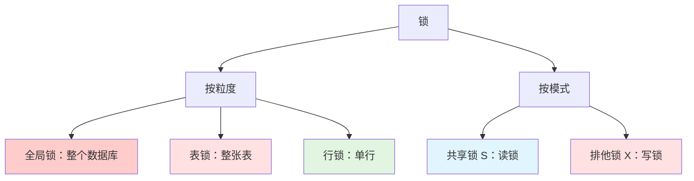
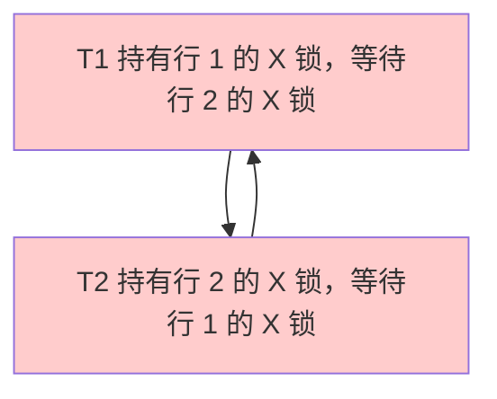

# 锁机制

## 为什么锁很重要

锁是 MySQL 并发数据访问的基础：

- **数据完整性**：防止丢失更新和不一致读取
- **隔离性**：确保事务互不干扰
- **性能**：在一致性（加锁）和并发性（减少加锁）之间平衡
- **死锁**：理解锁有助于预防和解决死锁

**实际影响**：
- 一个持有排他锁的长事务可能阻塞所有其他操作
- 不必要的表锁会使整个应用串行化
- 死锁处理不当可能导致生产故障

**示例**：
```sql
-- 事务 1 持有行 1 的 X 锁
BEGIN;
UPDATE accounts SET balance = 100 WHERE id = 1;

-- 事务 2 等待行 1 的 X 锁
BEGIN;
UPDATE accounts SET balance = 200 WHERE id = 1;  -- 阻塞！
-- 等待直到 T1 提交或回滚
```

## 锁分类



## 锁粒度

### 全局锁

**范围**：锁定整个数据库（所有表、所有操作）

**使用场景**：全库备份（mysqldump 逻辑备份）

```sql
-- 获取全局读锁
FLUSH TABLES WITH READ LOCK;

-- 所有写入被阻塞，读取允许
-- 执行备份
mysqldump --all-databases > backup.sql

-- 释放锁
UNLOCK TABLES;
```

**性能影响**：严重（阻塞整个数据库的所有写入）

**替代方案**：使用 Percona XtraBackup（物理备份，无全局锁）

### 表锁

**范围**：锁定整张表

**类型**：
- **读锁**：多个会话可以读取，但不能写入
- **写锁**：只有持锁会话可以读/写

```sql
-- 获取表锁（手动，很少使用）
LOCK TABLES users READ;   -- 读锁
LOCK TABLES users WRITE;  -- 写锁

-- 释放锁
UNLOCK TABLES;
```

**自动表锁**：
- **MyISAM**：所有 DML 操作获取表锁
- **InnoDB**：DDL 操作（ALTER TABLE、CREATE INDEX）获取表锁

**示例**：
```sql
-- 会话 1
LOCK TABLES users WRITE;
UPDATE users SET name = 'Alice' WHERE id = 1;
-- 仍然持有锁

-- 会话 2（阻塞）
SELECT * FROM users;  -- 阻塞
UPDATE users SET ...;  -- 阻塞

-- 会话 1
UNLOCK TABLES;  -- 会话 2 现在可以继续
```

**性能影响**：高（阻塞表上所有操作）

### 行锁

**范围**：锁定单行（或索引记录）

**优势**：
- **高并发**：多个事务可以修改不同的行
- **细粒度**：只锁定受影响的数据

**仅 InnoDB 支持**：MyISAM 不支持行锁

```sql
-- 事务 1
BEGIN;
SELECT * FROM users WHERE id = 1 FOR UPDATE;  -- 行 1 的 X 锁
UPDATE users SET name = 'Alice' WHERE id = 1;

-- 事务 2（并发，不被阻塞）
BEGIN;
SELECT * FROM users WHERE id = 2 FOR UPDATE;  -- 行 2 的 X 锁
UPDATE users SET name = 'Bob' WHERE id = 2;
COMMIT;  -- T2 成功，不被 T1 阻塞

-- 事务 1
COMMIT;
```

**性能影响**：低（只锁一行）

## 锁模式

### 共享锁（S Lock）

**语法**：`LOCK IN SHARE MODE`（MySQL 5.7）或 `FOR SHARE`（MySQL 8.0+）

**用途**：读锁，阻止并发写入

**行为**：
- 多个 S 锁可以共存（多个读者）
- S 锁阻塞 X 锁（写者等待读者）
- S 锁与 S 锁兼容，与 X 锁不兼容

```sql
-- 事务 1
BEGIN;
SELECT * FROM users WHERE id = 1 LOCK IN SHARE MODE;
-- 持有 S 锁，阻止对行 1 的写入

-- 事务 2（阻塞）
UPDATE users SET name = 'Alice' WHERE id = 1;  -- 等待 X 锁

-- 事务 3（不被阻塞）
SELECT * FROM users WHERE id = 1 LOCK IN SHARE MODE;  -- S 锁兼容

-- 事务 1
COMMIT;  -- 释放 S 锁，T2 可以继续
```

**使用场景**：确保读取期间数据不变（如报表生成）

### 排他锁（X Lock）

**语法**：`FOR UPDATE`

**用途**：写锁，阻止并发读取和写入

**行为**：
- 只能存在一个 X 锁
- X 锁阻塞 S 锁和 X 锁
- UPDATE、DELETE、INSERT 隐式获取

```sql
-- 事务 1
BEGIN;
SELECT * FROM users WHERE id = 1 FOR UPDATE;
-- 持有 X 锁，阻塞行 1 上所有其他操作

-- 事务 2（阻塞）
SELECT * FROM users WHERE id = 1 LOCK IN SHARE MODE;  -- 阻塞
UPDATE users SET name = 'Alice' WHERE id = 1;  -- 阻塞

-- 事务 1
COMMIT;  -- 释放 X 锁
```

**使用场景**：修改行（UPDATE、DELETE）或确保独占访问

### 兼容性矩阵

| | S Lock | X Lock |
|---|--------|--------|
| **S Lock** | ✅ 兼容 | ❌ 阻塞 |
| **X Lock** | ❌ 阻塞 | ❌ 阻塞 |

**示例**：
```sql
-- 会话 1：S 锁
SELECT * FROM users WHERE id = 1 LOCK IN SHARE MODE;

-- 会话 2：S 锁（兼容）
SELECT * FROM users WHERE id = 1 LOCK IN SHARE MODE;  -- ✅ 允许

-- 会话 3：X 锁（阻塞）
SELECT * FROM users WHERE id = 1 FOR UPDATE;  -- ❌ 阻塞，直到 S1 释放 S 锁
```

## InnoDB 行锁类型

### Record Lock（记录锁）

**定义**：锁定单条索引记录（不包括前后的间隙）

**示例**：
```sql
-- 表：users，id 上有主键索引，name 上有索引
-- 记录：(id=1, name='Alice'), (id=5, name='Bob'), (id=10, name='Charlie')

BEGIN;
SELECT * FROM users WHERE id = 5 FOR UPDATE;
-- 对 id=5 的索引记录加记录锁
-- 允许 INSERT id=2（不同记录）
-- 阻塞 UPDATE id=5（同一条记录）
```

### Gap Lock（间隙锁）

**定义**：锁定索引记录之间的间隙（防止幻读）

**用途**：阻止其他事务在间隙中插入新行

**示例**：
```sql
-- 记录：id=1, id=5, id=10

-- 事务 1（RR 隔离级别）
BEGIN;
SELECT * FROM users WHERE id > 1 AND id < 10 FOR UPDATE;
-- 对间隙 (1, 5) 和 (5, 10) 加间隙锁
-- 阻止 INSERT id=2, 3, 4, 6, 7, 8, 9

-- 事务 2（阻塞）
INSERT INTO users (id, name) VALUES (3, 'David');  -- 被间隙锁阻塞

-- 事务 1
COMMIT;  -- 释放间隙锁，T2 可以继续
```

**要点**：
- 间隙锁不阻止其他事务锁定间隙（共享间隙锁）
- 间隙锁只在 **RR 隔离级别** 使用（防止幻读）
- 间隙锁在 **RC 隔离级别** 下禁用

### Next-Key Lock（临键锁）

**定义**：记录锁 + 记录前面的间隙锁的组合

**示例**：
```sql
-- 记录：id=1, id=5, id=10

BEGIN;
SELECT * FROM users WHERE id = 5 FOR UPDATE;
-- 临键锁：(1, 5]（5 前面的间隙 + 5 上的记录锁）
-- 如果有前一个锁，还会锁定间隙 (5, 10)

-- 阻塞：
-- UPDATE id=5（记录锁）
-- INSERT id=3（间隙锁）
-- INSERT id=7（如果有后续临键锁）
```

**默认行为**：InnoDB 在 **RR 隔离级别** 使用临键锁来防止幻读。

**可视化**：


## 意向锁

### 用途

意向锁是**表级锁**，表示事务打算获取什么类型的行级锁。

**为什么需要？**：在获取行锁之前快速检查表级锁冲突

**类型**：
- **意向共享锁（IS）**：事务打算获取行的 S 锁
- **意向排他锁（IX）**：事务打算获取行的 X 锁

### 兼容性

| | IS | IX | S | X |
|---|----|----|---|---|
| **IS** | ✅ | ✅ | ✅ | ❌ |
| **IX** | ✅ | ✅ | ❌ | ❌ |
| **S** | ✅ | ❌ | ✅ | ❌ |
| **X** | ❌ | ❌ | ❌ | ❌ |

**示例**：
```sql
-- 事务 1
BEGIN;
SELECT * FROM users WHERE id = 1 FOR UPDATE;
-- 获取 users 表上的 IX 锁（打算获取行的 X 锁）
-- 获取行 id=1 上的 X 锁

-- 事务 2（尝试表级操作时阻塞）
ALTER TABLE users ADD COLUMN phone VARCHAR(20);  -- 阻塞（X 锁与 IX 不兼容）

-- 事务 3（不被阻塞，行级操作）
SELECT * FROM users WHERE id = 2 FOR UPDATE;  -- 允许（IX 与 IX 兼容）
```

**获取行锁之前**：
1. 检查表级意向锁兼容性
2. 如果兼容，获取行锁
3. 如果不兼容，等待

## 死锁

### 什么是死锁？

**定义**：两个或多个事务无限期等待对方释放锁。

**示例**：
```sql
-- 事务 1
BEGIN;
UPDATE users SET name = 'Alice' WHERE id = 1;  -- 行 1 的 X 锁
UPDATE users SET name = 'Bob' WHERE id = 2;    -- 阻塞：T2 持有行 2 的 X 锁

-- 事务 2
BEGIN;
UPDATE users SET name = 'Charlie' WHERE id = 2;  -- 行 2 的 X 锁
UPDATE users SET name = 'David' WHERE id = 1;    -- 阻塞：T1 持有行 1 的 X 锁

-- 死锁！T1 等待 T2，T2 等待 T1
```

**可视化**：


### 死锁检测

**InnoDB 机制**：
- **等待图（Wait-for Graph）**：跟踪哪些事务在等待哪些锁
- **环路检测**：检测循环等待条件（死锁）
- **回滚牺牲者**：选择一个事务回滚（通常是修改行数较少的那个）

**错误信息**：
```
ERROR 1213 (40001): Deadlock found when trying to get lock;
try restarting transaction
```

**示例**：
```sql
-- 事务 1（牺牲者，被回滚）
BEGIN;
UPDATE accounts SET balance = balance - 100 WHERE id = 1;
UPDATE accounts SET balance = balance + 100 WHERE id = 2;
-- ERROR 1213: 死锁，事务被回滚

-- 事务 2（成功）
BEGIN;
UPDATE accounts SET balance = balance - 50 WHERE id = 2;
UPDATE accounts SET balance = balance + 50 WHERE id = 1;
COMMIT;
```

### 死锁预防

**最佳实践**：

1. **以相同顺序访问表**
```sql
-- ❌ 差：不同顺序导致死锁
-- T1: UPDATE t1 WHERE id=1; UPDATE t2 WHERE id=2;
-- T2: UPDATE t2 WHERE id=2; UPDATE t1 WHERE id=1;

-- ✅ 好：相同顺序
-- T1: UPDATE t1 WHERE id=1; UPDATE t2 WHERE id=2;
-- T2: UPDATE t1 WHERE id=1; UPDATE t2 WHERE id=2;
```

2. **保持事务简短**
```sql
-- ❌ 差：长事务持有锁
BEGIN;
SELECT * FROM large_table;  -- 长时间持有锁
UPDATE users SET ...;
COMMIT;

-- ✅ 好：短事务
BEGIN;
UPDATE users SET ...;  -- 快速释放锁
COMMIT;
```

3. **尽可能使用较低的隔离级别**
```sql
-- RC 有更少的锁（无间隙锁）
SET TRANSACTION ISOLATION LEVEL READ COMMITTED;
```

4. **添加索引**（减少锁定范围）
```sql
-- ❌ 全表扫描锁定所有行
UPDATE users SET status = 'pending';  -- 锁定整张表

-- ✅ 索引扫描只锁定匹配的行
UPDATE users SET status = 'pending' WHERE id = 123;  -- 只锁一行
```

5. **在应用层处理死锁**
```sql
-- 重试逻辑（伪代码）
max_retries = 3
for attempt in 1..max_retries:
    try:
        BEGIN;
        UPDATE accounts SET balance = ... WHERE id = 1;
        UPDATE accounts SET balance = ... WHERE id = 2;
        COMMIT;
        break;
    catch DeadlockError:
        if attempt == max_retries:
            raise;
        sleep(random_backoff);  // 等待后重试
        continue;
```

## 锁监控

### 查看锁

```sql
-- 查看当前事务（MySQL 8.0+）
SELECT * FROM performance_schema.data_locks\G

-- 查看锁等待
SELECT * FROM performance_schema.data_lock_waits\G

-- 查看持有锁的事务
SELECT * FROM information_schema.innodb_trx\G

-- 查看等待的锁（MySQL 5.7）
SELECT * FROM information_schema.innodb_lock_waits\G
```

### 终止持有锁的事务

```sql
-- 查找事务 ID
SELECT trx_id, trx_state, trx_mysql_thread_id
FROM information_schema.innodb_trx;

-- 终止事务
KILL 123;  -- MySQL 线程 ID
```

## 面试题

### Q1：表锁和行锁有什么区别？

**答案**：
- **表锁**：锁定整张表，阻塞表上所有操作（高竞争）
- **行锁**：锁定单行，允许对不同行的并发操作（高并发）
- **InnoDB**：默认使用行锁（DDL 操作除外）
- **MyISAM**：只支持表锁

### Q2：解释 S 锁和 X 锁

**答案**：
- **S 锁（共享锁）**：读锁，多个 S 锁可以共存，阻塞 X 锁
- **X 锁（排他锁）**：写锁，只能存在一个 X 锁，阻塞 S 锁和 X 锁
- **S 锁**：`LOCK IN SHARE MODE` 或 `FOR SHARE`
- **X 锁**：`FOR UPDATE` 或 UPDATE/DELETE/INSERT 隐式获取

### Q3：意向锁的作用是什么？

**答案**：意向锁是表级锁，表示事务打算获取什么类型的行级锁。它们允许在获取行锁之前快速检查表级锁兼容性，避免不必要的等待。

### Q4：什么是间隙锁？什么时候使用？

**答案**：间隙锁锁定索引记录之间的间隙，阻止其他事务在间隙中插入新行。在 **RR 隔离级别** 中使用以防止幻读。在 **RC 隔离级别** 中禁用。

### Q5：InnoDB 如何检测死锁？

**答案**：InnoDB 维护一个等待图，跟踪哪些事务在等待哪些锁。当检测到环路（循环等待）时，InnoDB 选择一个牺牲事务（通常是修改行数较少的那个）并回滚，打破死锁。

### Q6：如何预防死锁？

**答案**：
1. 跨事务以相同顺序访问表
2. 保持事务简短（快速释放锁）
3. 尽可能使用较低隔离级别（RC 而非 RR）
4. 添加索引（减少锁定范围）
5. 在应用层处理死锁（重试逻辑）

### Q7：Record Lock、Gap Lock 和 Next-Key Lock 有什么区别？

**答案**：
- **Record Lock**：锁定单条索引记录
- **Gap Lock**：锁定记录之间的间隙（防止插入）
- **Next-Key Lock**：记录锁 + 记录前面的间隙锁的组合（RR 中的默认行为）

## 延伸阅读

- **[事务](../transactions)** - 锁与隔离级别的交互
- **[查询优化](../optimization)** - 通过查询优化减少锁竞争
- **[日志与复制](../logging-replication)** - 复制环境中的锁
