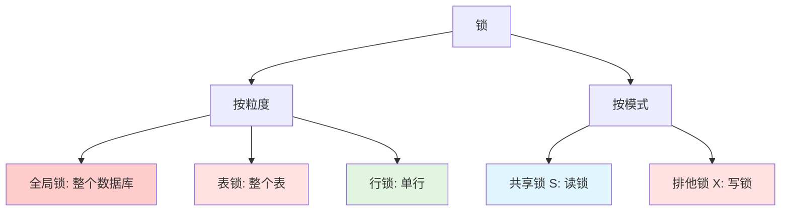
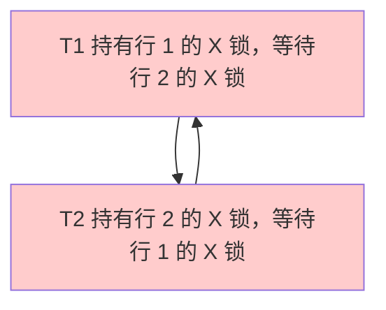

# 锁机制

## 为什么锁机制很重要

锁机制是 MySQL 并发数据访问的基石：

- **数据完整性**：防止更新丢失和不一致读取。
- **隔离性**：确保事务之间互不干扰。
- **性能**：平衡一致性（锁定）和并发性（减少锁定）之间的关系。
- **死锁**：理解锁有助于预防和解决死锁问题。

**实际影响**：
- 一个持有排他锁的长时间运行事务可以阻塞所有其他操作。
- 不必要的表锁可以使整个应用程序串行化。
- 死锁如果处理不当，可能导致生产环境中断。

**示例**：
```sql
-- 事务 1 持有行 1 的 X 锁
BEGIN;
UPDATE accounts SET balance = 100 WHERE id = 1;

-- 事务 2 阻塞等待行 1 的 X 锁
BEGIN;
UPDATE accounts SET balance = 200 WHERE id = 1;  -- 阻塞!
-- 等待直到事务 1 提交或回滚
```

## 锁分类



## 锁粒度

### 全局锁 (Global Lock)

**范围**：锁定整个数据库（所有表，所有操作）。

**用例**：全量数据库备份（使用 `mysqldump` 进行逻辑备份）。

```sql
-- 获取全局读锁
FLUSH TABLES WITH READ LOCK;

-- 所有写操作被阻塞，允许读操作
-- 执行备份
mysqldump --all-databases > backup.sql

-- 释放锁
UNLOCK TABLES;
```

**性能影响**：严重（阻塞整个数据库的所有写操作）。

**替代方案**：使用 Percona XtraBackup（物理备份，不使用全局锁）。

### 表锁 (Table Lock)

**范围**：锁定整个表。

**类型**：
- **读锁**：多个会话可以读取，但没有任何会话可以写入。
- **写锁**：只有持有锁的会话可以读/写。

```sql
-- 获取表锁 (手动，很少使用)
LOCK TABLES users READ;  -- 读锁
LOCK TABLES users WRITE;  -- 写锁

-- 释放锁
UNLOCK TABLES;
```

**自动表锁**：
- **MyISAM**：所有 DML 操作都会获取表锁。
- **InnoDB**：DDL 操作（ALTER TABLE, CREATE INDEX）会获取表锁。

**示例**：
```sql
-- 会话 1
LOCK TABLES users WRITE;
UPDATE users SET name = 'Alice' WHERE id = 1;
-- 仍然持有锁

-- 会话 2 (被阻塞)
SELECT * FROM users;  -- 被阻塞
UPDATE users SET ...;  -- 被阻塞

-- 会话 1
UNLOCK TABLES;  -- 会话 2 现在可以继续
```

**性能影响**：高（阻塞表上的所有操作）。

### 行锁 (Row Lock)

**范围**：锁定单行（或索引记录）。

**优点**：
- **高并发**：多个事务可以修改不同的行。
- **细粒度**：只锁定受影响的数据。

**仅 InnoDB 支持**：MyISAM 不支持行锁。

```sql
-- 事务 1
BEGIN;
SELECT * FROM users WHERE id = 1 FOR UPDATE;  -- 行 1 上的 X 锁
UPDATE users SET name = 'Alice' WHERE id = 1;

-- 事务 2 (并发，未被阻塞)
BEGIN;
SELECT * FROM users WHERE id = 2 FOR UPDATE;  -- 行 2 上的 X 锁
UPDATE users SET name = 'Bob' WHERE id = 2;
COMMIT;  -- 事务 2 成功，未被事务 1 阻塞

-- 事务 1
COMMIT;
```

**性能影响**：低（只锁定一行）。

## 锁模式

### 共享锁 (Shared Lock, S Lock)

**符号**：`LOCK IN SHARE MODE` (MySQL 5.7) 或 `FOR SHARE` (MySQL 8.0+)

**目的**：读锁，阻止并发写入。

**行为**：
- 多个 S 锁可以共存（允许多个读取者）。
- S 锁阻塞 X 锁（写入者等待读取者）。
- S 锁与 S 锁兼容，与 X 锁不兼容。

```sql
-- 事务 1
BEGIN;
SELECT * FROM users WHERE id = 1 LOCK IN SHARE MODE;
-- S 锁被持有，阻止对行 1 的写入

-- 事务 2 (被阻塞)
UPDATE users SET name = 'Alice' WHERE id = 1;  -- 被阻塞等待 X 锁

-- 事务 3 (未被阻塞)
SELECT * FROM users WHERE id = 1 LOCK IN SHARE MODE;  -- S 锁兼容

-- 事务 1
COMMIT;  -- 释放 S 锁，事务 2 可以继续
```

**用例**：确保在读取数据时数据不会改变（例如，用于报告生成）。

### 排他锁 (Exclusive Lock, X Lock)

**符号**：`FOR UPDATE`

**目的**：写锁，阻止并发读取和写入。

**行为**：
- 只能存在一个 X 锁。
- X 锁阻塞 S 锁和 X 锁。
- UPDATE、DELETE、INSERT 操作隐式获取 X 锁。

```sql
-- 事务 1
BEGIN;
SELECT * FROM users WHERE id = 1 FOR UPDATE;
-- X 锁被持有，阻塞对行 1 的所有其他操作

-- 事务 2 (被阻塞)
SELECT * FROM users WHERE id = 1 LOCK IN SHARE MODE;  -- 被阻塞
UPDATE users SET name = 'Alice' WHERE id = 1;  -- 被阻塞

-- 事务 1
COMMIT;  -- 释放 X 锁
```

**用例**：修改行（UPDATE, DELETE）或确保独占访问。

### 兼容性矩阵

| | IS | IX | S | X |
|---|----|----|---|---|
| **IS** | ✅ | ✅ | ✅ | ❌ |
| **IX** | ✅ | ✅ | ❌ | ❌ |
| **S** | ✅ | ❌ | ✅ | ❌ |
| **X** | ❌ | ❌ | ❌ | ❌ |

**示例**：
```sql
-- 会话 1: S 锁
SELECT * FROM users WHERE id = 1 LOCK IN SHARE MODE;

-- 会话 2: S 锁 (兼容)
SELECT * FROM users WHERE id = 1 LOCK IN SHARE MODE;  -- ✅ 允许

-- 会话 3: X 锁 (被阻塞)
SELECT * FROM users WHERE id = 1 FOR UPDATE;  -- ❌ 被阻塞直到 S1 释放 S 锁
```

## InnoDB 行锁

### 记录锁 (Record Lock)

**定义**：锁定单个索引记录（不包括记录前后的间隙）。

**示例**：
```sql
-- 表: users，在 id (主键) 和 name 上有索引
-- 记录: (id=1, name='Alice'), (id=5, name='Bob'), (id=10, name='Charlie')

BEGIN;
SELECT * FROM users WHERE id = 5 FOR UPDATE;
-- 在 id=5 的索引记录上加记录锁
-- 允许插入 id=2 的记录 (不同记录)
-- 阻塞更新 id=5 的记录 (相同记录)
```

### 间隙锁 (Gap Lock)

**定义**：锁定索引记录之间的间隙（防止幻读）。

**目的**：阻止其他事务向间隙中插入新行。

**示例**：
```sql
-- 记录: id=1, id=5, id=10

-- 事务 1 (RR 隔离级别)
BEGIN;
SELECT * FROM users WHERE id > 1 AND id < 10 FOR UPDATE;
-- 在间隙 (1, 5) 和 (5, 10) 上加间隙锁
-- 阻止插入 id=2, 3, 4, 6, 7, 8, 9 的记录

-- 事务 2 (被阻塞)
INSERT INTO users (id, name) VALUES (3, 'David');  -- 被间隙锁阻塞

-- 事务 1
COMMIT;  -- 释放间隙锁，事务 2 可以继续
```

**关键点**：
- 间隙锁不阻止其他事务锁定间隙（共享间隙锁）。
- 间隙锁仅在 **RR 隔离级别**中使用（防止幻读）。
- 间隙锁在 **RC 隔离级别**下被禁用。

### Next-Key Lock (临键锁)

**定义**：记录锁和记录前间隙锁的组合。

**示例**：
```sql
-- 记录: id=1, id=5, id=10

BEGIN;
SELECT * FROM users WHERE id = 5 FOR UPDATE;
-- 临键锁: (1, 5] (记录 5 前的间隙 + 记录 5 上的记录锁)
-- 如果存在前一个锁，也会锁定间隙 (5, 10)

-- 阻塞:
-- 更新 id=5 (记录锁)
-- 插入 id=3 (间隙锁)
-- 插入 id=7 (如果存在后续的临键锁)
```

**默认行为**：InnoDB 在 **RR 隔离级别**下使用临键锁来防止幻读。

**可视化**：


## 意向锁 (Intention Locks)

### 目的

意向锁是**表级锁**，用于指示一个事务打算在行级别上获取何种类型的锁。

**为什么需要？**：在获取行锁之前，快速检查表级锁冲突。

**类型**：
- **意向共享锁 (IS)**：事务打算在行上获取 S 锁。
- **意向排他锁 (IX)**：事务打算在行上获取 X 锁。

### 兼容性

| | IS | IX | S | X |
|---|----|----|---|---|
| **IS** | ✅ | ✅ | ✅ | ❌ |
| **IX** | ✅ | ✅ | ❌ | ❌ |
| **S** | ✅ | ❌ | ✅ | ❌ |
| **X** | ❌ | ❌ | ❌ | ❌ |

**示例**：
```sql
-- 事务 1
BEGIN;
SELECT * FROM users WHERE id = 1 FOR UPDATE;
-- 在 users 表上获取 IX 锁 (表示打算在行上获取 X 锁)
-- 在行 id=1 上获取 X 锁

-- 事务 2 (尝试表级操作被阻塞)
ALTER TABLE users ADD COLUMN phone VARCHAR(20);  -- 被阻塞 (X 锁与 IX 不兼容)

-- 事务 3 (行级操作未被阻塞)
SELECT * FROM users WHERE id = 2 FOR UPDATE;  -- 允许 (IX 与 IX 兼容)
```

**在获取行锁之前**：
1. 检查表级意向锁兼容性。
2. 如果兼容，获取行锁。
3. 如果不兼容，等待。

## 死锁 (Deadlocks)

### 什么是死锁？

**定义**：两个或多个事务无限期地相互等待对方释放锁。

**示例**：
```sql
-- 事务 1
BEGIN;
UPDATE users SET name = 'Alice' WHERE id = 1;  -- 在行 1 上获取 X 锁
UPDATE users SET name = 'Bob' WHERE id = 2;    -- 阻塞：T2 持有行 2 上的 X 锁

-- 事务 2
BEGIN;
UPDATE users SET name = 'Charlie' WHERE id = 2;  -- 在行 2 上获取 X 锁
UPDATE users SET name = 'David' WHERE id = 1;    -- 阻塞：T1 持有行 1 上的 X 锁

-- 死锁！T1 等待 T2，T2 等待 T1
```

**可视化**：


### 死锁检测

**InnoDB 机制**：
- **等待图 (Wait-for graph)**：跟踪事务之间的锁等待关系。
- **循环检测**：检测循环等待条件（死锁）。
- **回滚牺牲者**：选择一个事务进行回滚（通常是修改行数较少的事务）来打破死锁。

**错误信息**：
```
ERROR 1213 (40001): Deadlock found when trying to get lock;
try restarting transaction
```

**示例**：
```sql
-- 事务 1 (牺牲者，被回滚)
BEGIN;
UPDATE accounts SET balance = balance - 100 WHERE id = 1;
UPDATE accounts SET balance = balance + 100 WHERE id = 2;
-- ERROR 1213: 死锁，事务被回滚

-- 事务 2 (成功)
BEGIN;
UPDATE accounts SET balance = balance - 50 WHERE id = 2;
UPDATE accounts SET balance = balance + 50 WHERE id = 1;
COMMIT;
```

### 死锁预防

**最佳实践**：

1. **按相同顺序访问表**
```sql
-- ❌ 不良: 不同顺序导致死锁
-- T1: UPDATE t1 WHERE id=1; UPDATE t2 WHERE id=2;
-- T2: UPDATE t2 WHERE id=2; UPDATE t1 WHERE id=1;

-- ✅ 良好: 相同顺序
-- T1: UPDATE t1 WHERE id=1; UPDATE t2 WHERE id=2;
-- T2: UPDATE t1 WHERE id=1; UPDATE t2 WHERE id=2;
```

2. **保持事务简短**
```sql
-- ❌ 不良: 长事务长时间持有锁
BEGIN;
SELECT * FROM large_table;  -- 长时间持有锁
UPDATE users SET ...;
COMMIT;

-- ✅ 良好: 短事务
BEGIN;
UPDATE users SET ...;  -- 快速释放锁
COMMIT;
```

3. **如果可能，使用较低的隔离级别**
```sql
-- RC 隔离级别锁较少 (没有间隙锁)
SET TRANSACTION ISOLATION LEVEL READ COMMITTED;
```

4. **添加索引**（缩小锁的范围）
```sql
-- ❌ 全表扫描锁定所有行
UPDATE users SET status = 'pending';  -- 锁定整个表

-- ✅ 索引扫描只锁定匹配的行
UPDATE users SET status = 'pending' WHERE id = 123;  -- 锁定一行
```

5. **在应用程序中处理死锁**
```sql
-- 重试逻辑 (伪代码)
max_retries = 3
for attempt in 1..max_retries:
    try:
        BEGIN;
        UPDATE accounts SET balance = ... WHERE id = 1;
        UPDATE accounts SET balance = ... WHERE id = 2;
        COMMIT;
        break;
    catch DeadlockError:
        if attempt == max_retries:
            raise;
        sleep(random_backoff);  // 等待随机退避时间后重试
        continue;
```

## 锁监控

### 查看锁

```sql
-- 显示当前事务 (MySQL 8.0+)
SELECT * FROM performance_schema.data_locks\G

-- 显示锁等待
SELECT * FROM performance_schema.data_lock_waits\G

-- 显示持有锁的事务
SELECT * FROM information_schema.innodb_trx\G

-- 显示等待中的锁 (MySQL 5.7)
SELECT * FROM information_schema.innodb_lock_waits\G
```

### 杀死持有锁的事务

```sql
-- 查找事务 ID
SELECT trx_id, trx_state, trx_mysql_thread_id
FROM information_schema.innodb_trx;

-- 杀死事务
KILL 123;  -- MySQL 线程 ID
```

## 面试问题

### Q1: 表锁和行锁有什么区别？

**回答**：
- **表锁**：锁定整个表，阻塞表上的所有操作（高竞争）。
- **行锁**：锁定单行，允许在不同行上并发操作（高并发）。
- **InnoDB**：默认使用行锁（DDL 操作除外）。
- **MyISAM**：只支持表锁。

### Q2: 解释 S 锁和 X 锁

**回答**：
- **S 锁 (共享)**：读锁，多个 S 锁可以共存，阻塞 X 锁。
- **X 锁 (排他)**：写锁，只能有一个 X 锁，阻塞 S 锁和 X 锁。
- **S 锁**：`LOCK IN SHARE MODE` 或 `FOR SHARE`。
- **X 锁**：`FOR UPDATE` 或由 UPDATE/DELETE/INSERT 隐式获取。

### Q3: 意向锁有什么用？

**回答**：意向锁是表级锁，用于指示事务打算在行级别获取何种类型的锁。它们可以在获取行锁之前快速检查表级锁的兼容性，从而防止不必要的等待。

### Q4: 什么是间隙锁，何时使用？

**回答**：间隙锁锁定索引记录之间的间隙，阻止其他事务向间隙中插入新行。在 **RR 隔离级别**中使用，以防止幻读。在 **RC 隔离级别**下禁用。

### Q5: InnoDB 如何检测死锁？

**回答**：InnoDB 维护一个等待图，跟踪事务之间的锁等待关系。当检测到循环等待（死锁）时，InnoDB 会选择一个牺牲者事务（通常是修改行数较少的事务）并回滚它，从而打破死锁。

### Q6: 如何预防死锁？

**回答**：
1. 跨事务按相同顺序访问表。
2. 保持事务简短（快速释放锁）。
3. 如果可能，使用较低的隔离级别（RC 而非 RR）。
4. 添加索引（缩小锁的范围）。
5. 在应用程序中处理死锁（重试逻辑）。

### Q7: 记录锁、间隙锁和临键锁有什么区别？

**回答**：
- **记录锁**：锁定单个索引记录。
- **间隙锁**：锁定记录之间的间隙（阻止插入）。
- **临键锁**：记录锁 + 记录前间隙锁的组合（RR 隔离级别下的默认锁）。

## 延伸阅读

- **[事务](../transactions)** - 锁如何与隔离级别交互。
- **[优化](../optimization)** - 通过查询优化减少锁竞争。
- **[日志与复制](../logging-replication)** - 复制上下文中的锁。
