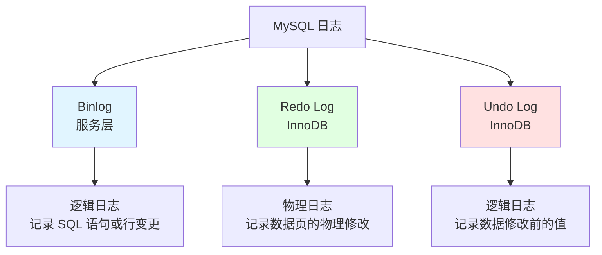
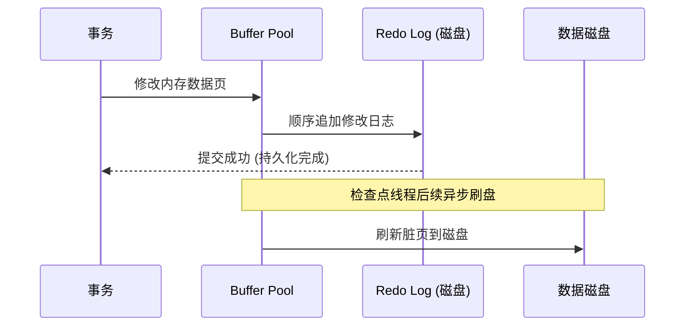
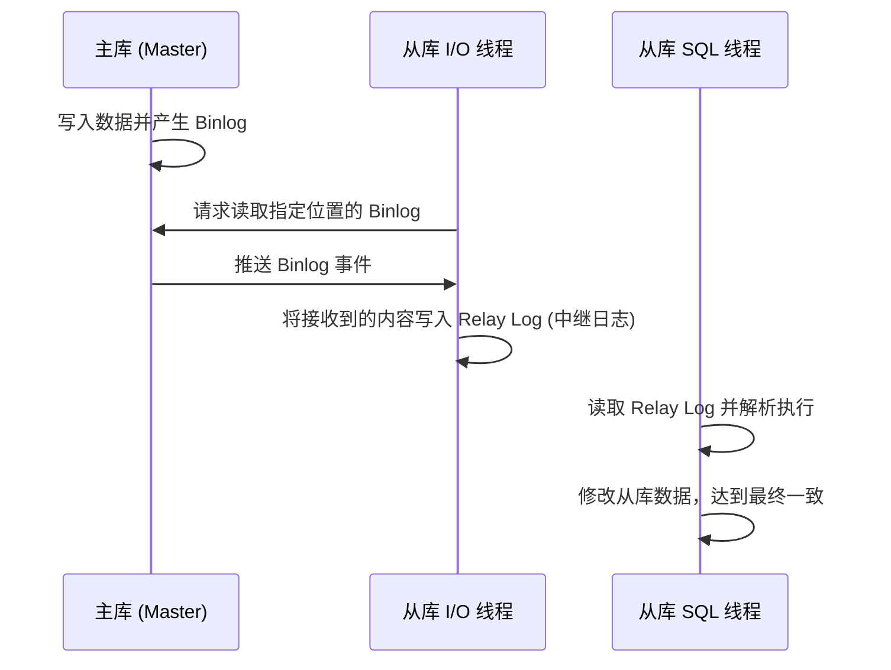

# 日志与复制

## 为什么日志与复制很重要

日志确保了数据的持久化（Durability），而复制实现了系统的高可用与读扩展：

- **崩溃恢复 (Crash Recovery)**：在断电或宕机后恢复数据。
- **主从复制**：将数据同步至从库，实现读写分离与扩展。
- **任意时间点恢复 (PITR)**：将数据库还原到过去的某个特定时刻。
- **审计与追踪**：记录对数据的所有变更。

---

## MySQL 三大日志

### 核心对比

| 日志类型 | 所属层级 | 日志属性 | 主要用途 | 存储形式 |
|-----|-------|------|---------|----------|
| **Binlog** | 服务层 (Server) | 逻辑日志 | 主从复制、数据恢复 | 磁盘文件，追加写入 |
| **Redo Log** | 存储引擎 (InnoDB) | 物理日志 | 崩溃恢复 (WAL) | 循环覆盖，固定大小 |
| **Undo Log** | 存储引擎 (InnoDB) | 逻辑日志 | 事务回滚、MVCC | 回滚段 (Rollback Segments) |

---

## Binlog (归档日志)

### 什么是 Binlog？
Binlog 记录了所有的 DDL（建表等）和 DML（增删改）语句。它是 MySQL **高可用架构**的基石。

### 三种格式
1. **Statement**：记录原始 SQL。优点：日志量小；缺点：对于 `NOW()` 等非确定性函数会导致主从不一致。
2. **Row**：记录行数据的具体变更。优点：最安全、最准确；缺点：日志量巨大。
3. **Mixed**：混合模式。普通语句用 Statement，风险语句自动切为 Row。

---

## Redo Log (重做日志)

### WAL 机制 (Write-Ahead Logging)
**核心原则**：数据的修改先写入 Redo Log 并同步到磁盘，稍后再异步将内存中的脏页刷新到数据磁盘。

**为什么需要 WAL？**
1. **随机写转顺序写**：直接写数据磁盘是随机 I/O（慢），写 Redo Log 是顺序 I/O（极快）。
2. **保证持久性**：只要 Redo Log 落盘了，即使机器掉电，重启后也能根据日志重放数据。

---

## Undo Log (回滚日志)

### 核心功能
1. **原子性保障**：事务失败或执行 `ROLLBACK` 时，利用 Undo Log 恢复到原始状态。
2. **MVCC 支持**：InnoDB 利用 Undo Log 链保存数据的旧版本，实现非阻塞读取。

---

## 主从复制原理

### 复制流程架构

### 三个核心线程
- **Binlog Dump 线程 (主库)**：负责读取 Binlog 并发送给从库。
- **I/O 线程 (从库)**：负责连接主库，接收日志并写入本地 **Relay Log**。
- **SQL 线程 (从库)**：负责解析 Relay Log 并重放到从库数据库中。

---

## 复制模式对比

### 1. 异步复制 (默认)
主库提交事务后直接返回客户端，不关心从库是否收到。性能最高，但在主库宕机时可能丢失数据。

### 2. 半同步复制 (Semi-Sync)
主库提交事务后，必须等待**至少一个从库**确认收到并写入 Relay Log 才会返回给客户端。大幅提升了数据安全性，但增加了网络延迟（RTT）。

---

## 面试高频题

### Q1: 为什么有 Binlog 了还需要 Redo Log？
**回答**：
1. **职责不同**：Binlog 是服务层日志，用于归档和主从同步；Redo Log 是 InnoDB 特有的，专门用于故障恢复。
2. **能力不同**：Redo Log 具备 **Crash-safe** 能力。Redo Log 是循环写的，记录的是物理页的变动，能确保磁盘数据不一致时快速修复；而 Binlog 是追加写的，逻辑上记录了过程，不具备物理恢复能力。

### Q2: 什么是主从延迟，如何排查？
**回答**：
- **定义**：从库执行完主库事务的时间与主库执行时间的差值。
- **排查**：执行 `SHOW SLAVE STATUS`，关注 `Seconds_Behind_Master`。
- **原因**：主库并发写而从库单线程重放（老版本）、从库硬件较差、大事务（如一次性删除百万行数据）。

### Q3: 两阶段提交 (2PC) 的意义是什么？
**回答**：为了保证 **Redo Log 和 Binlog 的逻辑一致性**。在事务提交时，先写 Redo Log 并标记为 `prepare`，再写 Binlog，最后将 Redo Log 标记为 `commit`。这样即使在两个日志写入之间发生宕机，也能根据标志位确保两个日志的内容完全匹配。

---

## 延伸阅读

- **[事务隔离](../transactions)** - 深入了解 Undo Log 与 MVCC 的交互。
- **[系统优化](../optimization)** - 学习如何通过批量提交减少日志 I/O 压力。
- **[锁机制](../locking)** - 了解主从复制中 SQL 线程的锁竞争问题。
 stone
