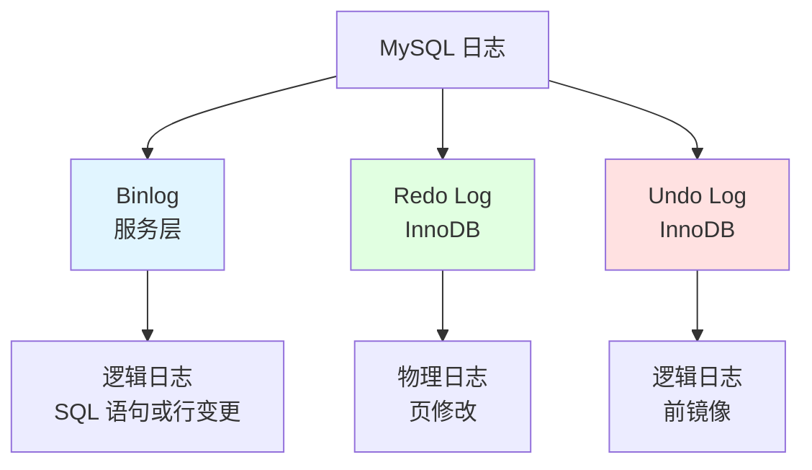
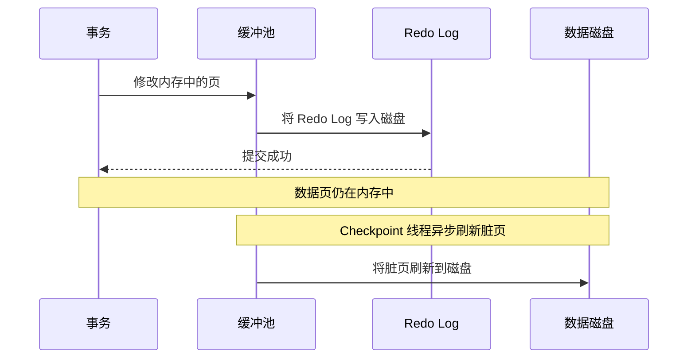
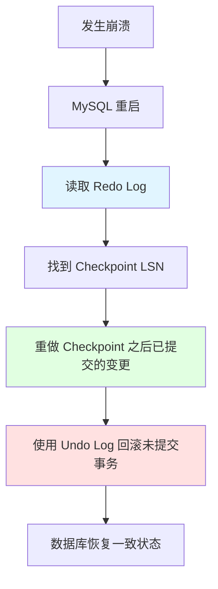
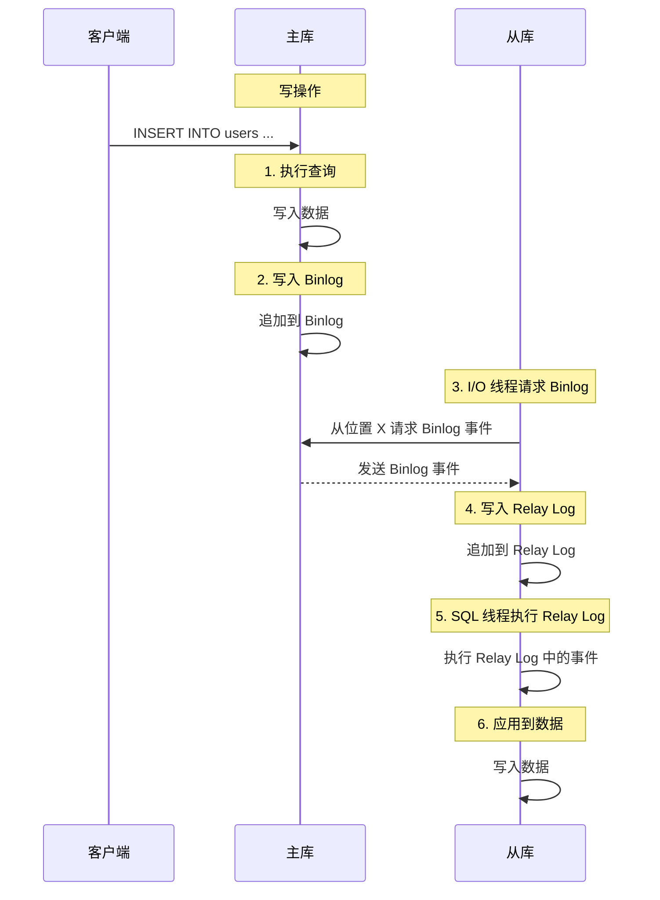
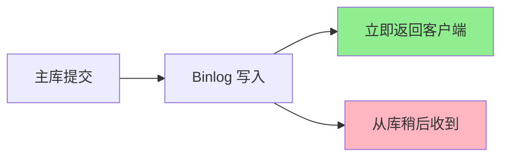

# 日志与复制

## 为什么日志与复制很重要

日志确保数据持久性并支持复制：

- **崩溃恢复**：从断电、崩溃中恢复
- **复制**：将数据复制到从库以扩展读能力
- **时间点恢复**：恢复到特定时刻
- **审计追踪**：跟踪所有数据变更

**实际影响**：
- 没有 Redo Log：崩溃导致数据损坏，丢失已提交事务
- 没有 Binlog：无法复制到从库，无法恢复到特定时间
- 复制配置不当：主从数据不一致

## 三大日志



### 对比

| 日志 | 层级 | 类型 | 用途 | 位置 |
|------|------|------|------|------|
| **Binlog** | 服务层 | 逻辑 | 复制、时间点恢复 | 磁盘文件 |
| **Redo** | InnoDB | 物理 | 崩溃恢复（WAL） | 循环缓冲区（固定大小） |
| **Undo** | InnoDB | 逻辑 | 回滚、MVCC | 回滚段 |

## Binlog

### 什么是 Binlog？

**二进制日志**是服务级逻辑日志，记录**所有数据修改**（INSERT、UPDATE、DELETE）和 **DDL 语句**（CREATE、ALTER、DROP）。

**特点**：
- **逻辑日志**：记录 SQL 语句或行级变更（不是物理页修改）
- **顺序追加**：事件按提交顺序追加到日志
- **持久化**：以文件形式存储在磁盘上（非内存）

### Binlog 格式

| 格式 | 描述 | 优势 | 劣势 |
|------|------|------|------|
| **Statement** | 记录 SQL 语句 | 紧凑，节省空间 | 非确定性函数不安全（NOW()、UUID()） |
| **Row** | 记录行变更 | 安全、准确 | 体积更大，调试困难 |
| **Mixed** | 默认 Statement + 不安全语句用 Row | 平衡 | 复杂性 |

**配置**：
```ini
binlog_format = ROW      # 推荐（安全）
# binlog_format = STATEMENT  # 紧凑但不安全
# binlog_format = MIXED      # 平衡
```

**示例（Row 格式）**：
```
# Binlog event
# at 1234
#240214 10:30:00 server id 1  end_log_pos 1456  Table_map: `test`.`users` mapped to number 123
#240214 10:30:00 server id 1  end_log_pos 1567  Update_rows: table id 123 flags: STMT_END_F

### UPDATE test.users
### WHERE
###   @1=1    /* id INT */
###   @2='Alice'  /* name VARCHAR(100) */
### SET
###   @1=1    /* id INT */
###   @2='Alice Updated'  /* name VARCHAR(100) */
```

### Binlog 结构

```sql
-- 列出 binlog 文件
SHOW BINARY LOGS;
+----------------+-----------+
| Log_name       | File_size |
+----------------+-----------+
| binlog.000001  | 123456    |
| binlog.000002  | 234567    |
| binlog.000003  | 345678    |
+----------------+-----------+

-- 显示当前 binlog 位置
SHOW MASTER STATUS;
+----------------+----------+--------------+------------------+
| File           | Position | Binlog_Do_DB | Binlog_Ignore_DB |
+----------------+----------+--------------+------------------+
| binlog.000003  | 1234     | test         |                  |
+----------------+----------+--------------+------------------+
```

**文件**：
- `binlog.000001`、`binlog.000002`、...：顺序 binlog 文件
- `binlog.index`：索引文件，列出所有 binlog 文件

### Binlog 使用场景

#### 1. 主从复制

主库将 binlog 事件发送到从库进行复制。

#### 2. 时间点恢复

```bash
# 恢复到特定时间
mysqlbinlog --start-datetime="2024-02-14 10:00:00" \
            --stop-datetime="2024-02-14 11:00:00" \
            binlog.000003 | mysql -u root -p
```

#### 3. 数据审计

```sql
-- 查看 binlog 事件
SHOW BINLOG EVENTS IN 'binlog.000003' LIMIT 10;

+-------+------+------------+-----------+-------------+----------------------------------------+
| Pos   | Event_type | Server_id | End_log_pos | Info |
+-------+------+------------+-----------+-------------+----------------------------------------+
|   123 | Query      |         1 |         234 | BEGIN |
|   234 | Table_map  |         1 |         345 | table_id: 123 (test.users) |
|   345 | Update_rows|         1 |         456 | table_id: 123 flags: STMT_END_F |
|   456 | Xid        |         1 |         567 | COMMIT /* xid=123 */ |
+-------+------+------------+-----------+-------------+----------------------------------------+
```

### Binlog 配置

```ini
# 启用 binlog（复制必需）
log_bin = mysql-bin

# Binlog 格式
binlog_format = ROW

# Binlog 文件大小（达到此大小时滚动）
max_binlog_size = 1G

# Binlog 过期时间（自动删除旧文件）
expire_logs_days = 7

# Binlog 缓存大小（每个事务）
binlog_cache_size = 1M
```

## Redo Log

### 什么是 Redo Log？

**Redo Log（重做日志）** 是 InnoDB 特有的物理日志，记录**所有数据页的变更**，用于崩溃恢复。

**特点**：
- **物理日志**：记录页修改（不是 SQL 语句）
- **顺序写入**：优化为顺序磁盘 I/O
- **循环缓冲区**：固定大小，旧日志被覆盖

### 预写式日志（WAL）

**原则**：在将数据页写入磁盘**之前**，先将 Redo Log 写入磁盘。



**为什么使用 WAL？**
1. **随机 → 顺序**：写数据页是随机 I/O（慢），Redo Log 是顺序写入（快）
2. **持久性**：即使数据页未刷新，已提交的变更也能在崩溃后存活
3. **性能**：每个事务只刷一次 Redo Log，而非每次页修改都刷

### Redo Log 结构

**文件**：
- `ib_logfile0`、`ib_logfile1`、...：Redo Log 文件（循环缓冲区）
- **配置**：
  ```ini
  innodb_log_file_size = 512M         # 每个 Redo Log 文件大小
  innodb_log_files_in_group = 2       # Redo Log 文件数量
  innodb_log_buffer_size = 16M        # Redo Log 内存缓冲区
  ```

**循环缓冲区**：
```
[ib_logfile0] [ib_logfile1]
  ^                               ^
  |                               |
  Head（写入位置）          Tail（Checkpoint 位置）
```

**写入过程**：
1. 写入内存中的 Redo Log 缓冲区
2. 刷新到磁盘上的 Redo Log 文件（取决于 `innodb_flush_log_at_trx_commit`）
3. 缓冲区满时，回到开头覆盖旧日志

### Redo Log 与崩溃恢复

**恢复过程**：


**LSN（Log Sequence Number，日志序列号）**：单调递增的数字，标识 Redo Log 记录。

### Redo Log 配置

```ini
# 提交时将 Redo Log 刷新到磁盘（最安全，默认）
innodb_flush_log_at_trx_commit = 1

# 每秒刷新到 OS 缓存，Checkpoint 时刷新到磁盘（更快，安全性略低）
# innodb_flush_log_at_trx_commit = 2

# 提交时刷新到 OS 缓存（最快，安全性最低）
# innodb_flush_log_at_trx_commit = 0

# Redo Log 容量（总大小 = innodb_log_file_size * innodb_log_files_in_group）
innodb_log_file_size = 512M
innodb_log_files_in_group = 2
```

**权衡**：
- `innodb_flush_log_at_trx_commit = 1`：最安全（每个事务持久化），较慢
- `innodb_flush_log_at_trx_commit = 2`：更快（OS 缓存持久性），有少量数据丢失风险
- `innodb_flush_log_at_trx_commit = 0`：最快，可能丢失最多 1 秒的事务

## Undo Log

### 什么是 Undo Log？

**Undo Log（回滚日志）** 是 InnoDB 特有的逻辑日志，存储被修改行的**前镜像**。

**用途**：
1. **回滚**：在 ROLLBACK 时撤销未提交的变更
2. **MVCC**：为一致性读提供行的旧版本

### Undo Log 结构

**段结构**：
```
Undo Log 段
  └── Undo Log 条目
        ├── 行的前镜像
        ├── 事务 ID（trx_id）
        └── 回滚指针（roll_ptr）
```

**存储**：
- **Undo 表空间**：与数据表空间分开
- **配置**（MySQL 8.0+）：
  ```ini
  innodb_undo_tablespaces = 2    # Undo 表空间数量
  innodb_undo_log_truncate = ON  # 启用自动截断
  ```

### Undo Log 在 MVCC 中的作用

**读视图**：当事务读取一行时，InnoDB 检查行的 `trx_id`：
- 如果 `trx_id` < 读视图的最小值：在快照之前已提交（可见）
- 如果 `trx_id` 在活跃列表中：未提交（不可见，通过 Undo Log 查找旧版本）
- 如果 `trx_id` >= 读视图的最大值：尚未开始（不可见）

**Undo Log 链**：一行的多个版本存储在 Undo Log 中（通过 `roll_ptr` 链接）。

### 清理（Purge）

**后台线程**：删除已提交事务的 Undo Log，释放空间。

**配置**：
```ini
# 清理批次大小
innodb_purge_batch_size = 300

# 清理线程数
innodb_purge_threads = 4
```

## 主从复制

### 架构



### 三个线程

| 线程 | 位置 | 用途 |
|------|------|------|
| **Binlog Dump 线程** | 主库 | 向从库发送 Binlog 事件 |
| **I/O 线程** | 从库 | 从主库请求 Binlog，写入 Relay Log |
| **SQL 线程** | 从库 | 执行 Relay Log 事件，应用变更 |

### 复制模式

#### 1. 异步复制（默认）

**行为**：主库不等待从库确认收到 Binlog 事件。

**优势**：
- 快速（主库无额外延迟）
- 简单（无需协调）

**劣势**：
- 可能丢失数据（主库在从库收到 Binlog 前崩溃）
- 从库延迟（从库落后于主库）



#### 2. 半同步复制

**行为**：主库等待**至少一个从库**确认收到 Binlog 事件后才返回给客户端。

**配置**：
```sql
-- 主库
INSTALL PLUGIN rpl_semi_sync_master SONAME 'semisync_master.so';
SET GLOBAL rpl_semi_sync_master_enabled = 1;

-- 从库
INSTALL PLUGIN rpl_semi_sync_slave SONAME 'semisync_slave.so';
SET GLOBAL rpl_semi_sync_slave_enabled = 1;
```

**优势**：
- 减少数据丢失（至少一个从库有数据）
- 更好的持久性

**劣势**：
- 较慢（主库等待从库确认）
- 如果从库故障，主库回退到异步模式


#### 3. 组复制

**行为**：多主复制，使用组通信和共识协议。

**使用场景**：高可用、自动故障转移

**此处不详述**：配置复杂，要求所有服务器运行 MySQL 5.7+

### 复制搭建

**主库配置**（`/etc/mysql/my.cnf`）：
```ini
[mysqld]
server-id = 1
log_bin = mysql-bin
binlog_format = ROW
binlog_do_db = test  # 只复制此数据库
```

**从库配置**（`/etc/mysql/my.cnf`）：
```ini
[mysqld]
server-id = 2
relay_log = mysql-relay-bin
read_only = 1
```

**搭建命令**：
```sql
-- 主库：创建复制用户
CREATE USER 'repl'@'%' IDENTIFIED BY 'password';
GRANT REPLICATION SLAVE ON *.* TO 'repl'@'%';
FLUSH PRIVILEGES;

-- 主库：获取当前 Binlog 位置
SHOW MASTER STATUS;
+----------------+----------+--------------+------------------+
| File           | Position | Binlog_Do_DB | Binlog_Ignore_DB |
+----------------+----------+--------------+------------------+
| mysql-bin.000003 | 1234    | test         |                  |
+----------------+----------+--------------+------------------+

-- 从库：配置主库连接
CHANGE MASTER TO
  MASTER_HOST='master.example.com',
  MASTER_USER='repl',
  MASTER_PASSWORD='password',
  MASTER_LOG_FILE='mysql-bin.000003',
  MASTER_LOG_POS=1234;

-- 从库：启动复制
START SLAVE;

-- 从库：检查状态
SHOW SLAVE STATUS\G
```

### 复制监控

**关键指标**（来自 `SHOW SLAVE STATUS`）：
```sql
-- 从库延迟（落后主库的秒数）
Seconds_Behind_Master: 0

-- I/O 线程状态
Slave_IO_Running: Yes

-- SQL 线程状态
Slave_SQL_Running: Yes

-- 最后一个错误
Last_Error: (none)

-- Binlog 位置
Master_Log_File: mysql-bin.000003
Read_Master_Log_Pos: 2345

-- Relay Log 位置
Relay_Log_File: mysql-relay-bin.000005
Relay_Log_Pos: 567
```

**告警条件**：
- `Seconds_Behind_Master > 60`（从库延迟过大）
- `Slave_IO_Running: No`（I/O 线程停止）
- `Slave_SQL_Running: No`（SQL 线程停止，复制出错）

### 常见复制问题

#### 1. 从库延迟

**原因**：
- SQL 线程慢（从库硬件弱于主库）
- 网络延迟
- 从库上的长事务

**解决方案**：
- 升级从库硬件
- 使用多线程复制（`slave_parallel_workers`）
- 优化从库上的查询

#### 2. 复制错误

**示例**：重复键错误
```
Last_Error: Error 'Duplicate entry '123' for key 'PRIMARY'' on query.
```

**原因**：
- 直接写入从库（绕过复制）
- 主从数据不一致

**解决方案**：
- 设置从库只读（`read_only = 1`）
- 跳过出错事务（不推荐）：
  ```sql
  STOP SLAVE;
  SET GLOBAL sql_slave_skip_counter = 1;
  START SLAVE;
  ```
- 从主库备份重建从库

#### 3. 脑裂

**定义**：主库和从库各自接受写入，导致数据分歧。

**预防**：
- 设置从库只读
- 使用半同步复制
- 监控复制健康状态

## 面试题

### Q1：Binlog、Redo Log 和 Undo Log 有什么区别？

**答案**：
- **Binlog**：服务级逻辑日志，用于复制和时间点恢复
- **Redo Log**：InnoDB 物理日志，用于崩溃恢复（WAL）
- **Undo Log**：InnoDB 逻辑日志，用于回滚和 MVCC

### Q2：WAL（预写式日志）如何工作？

**答案**：变更在写入数据页（随机 I/O）**之前**，先写入 Redo Log（顺序 I/O）。提交时，Redo Log 被刷新，使变更持久化。数据页由 Checkpoint 线程异步刷新。减少随机 I/O，提升性能。

### Q3：解释 MySQL 主从复制过程

**答案**：
1. 主库执行查询，写入 Binlog
2. 从库 I/O 线程从主库请求 Binlog，写入 Relay Log
3. 从库 SQL 线程执行 Relay Log，应用变更
4. 从库数据与主库同步

### Q4：什么是半同步复制？

**答案**：主库等待至少一个从库确认收到 Binlog 事件后才返回给客户端。相比异步复制减少了数据丢失风险，但增加了延迟。

### Q5：为什么 InnoDB 需要同时有 Redo Log 和 Undo Log？

**答案**：
- **Redo Log**：确保持久性（已提交变更在崩溃后不丢失）
- **Undo Log**：支持回滚（撤销未提交变更）和 MVCC（一致性读）

### Q6：如何监控复制延迟？

**答案**：检查 `SHOW SLAVE STATUS` 中的 `Seconds_Behind_Master`。同时监控 `Slave_IO_Running` 和 `Slave_SQL_Running` 确保线程正常运行。

### Q7：崩溃恢复过程中发生了什么？

**答案**：
1. MySQL 从上次 Checkpoint 处读取 Redo Log
2. 重做已提交的变更（Redo）
3. 回滚未提交的事务（Undo）
4. 数据库恢复到一致状态

## 延伸阅读

- **[事务](../transactions)** - ACID、MVCC 和隔离级别
- **[锁机制](../locking)** - 复制环境中的锁
- **[查询优化](../optimization)** - 通过查询优化减少复制延迟
