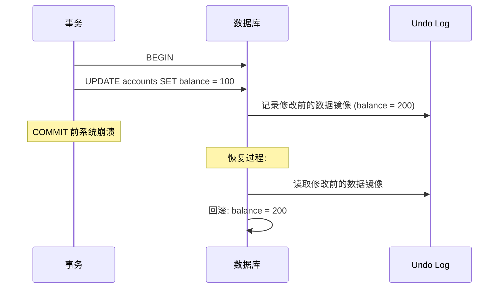
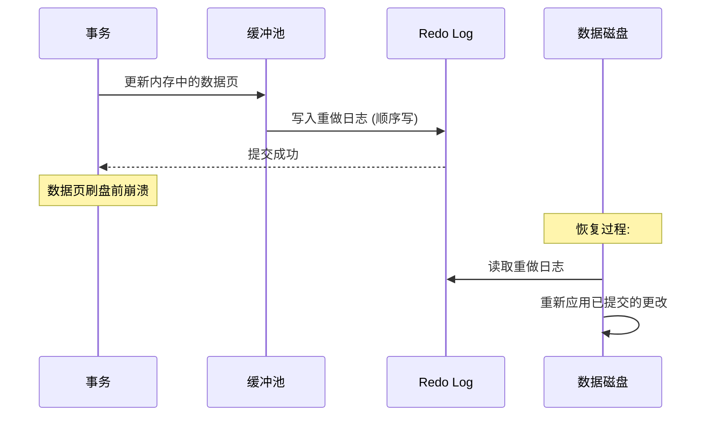
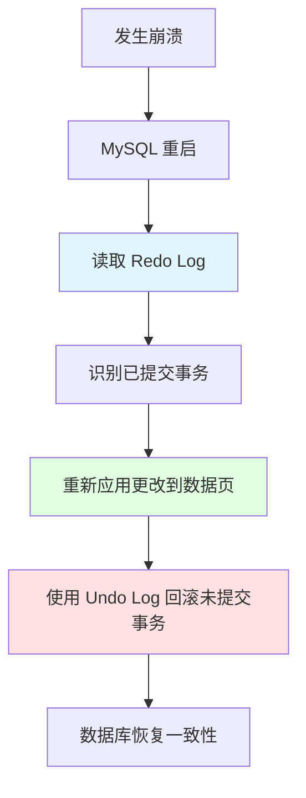

# 事务

## 为什么事务很重要

事务是关系型数据库数据完整性的基石：

- **原子性 (Atomicity)**：所有操作要么全部成功，要么全部失败（没有部分更新）。
- **一致性 (Consistency)**：数据在事务前后保持有效状态（强制执行约束）。
- **隔离性 (Isolation)**：并发事务互不干扰，每个事务看到一致的数据快照。
- **持久性 (Durability)**：一旦事务提交，即使系统崩溃，其更改也会持久存在。

**实际影响**：
- **金融系统**：从 A 账户转账到 B 账户——扣款和入账必须同时成功或同时失败。
- **电商平台**：订单创建——库存更新和订单记录必须是原子性的。
- **社交媒体**：发布帖子——帖子和通知必须保持一致。

**示例**：
```sql
-- 银行转账：两项操作必须同时成功或同时失败
BEGIN;
UPDATE accounts SET balance = balance - 100 WHERE id = 1;  -- 扣款
UPDATE accounts SET balance = balance + 100 WHERE id = 2;  -- 入账
COMMIT;  -- 使更改永久生效
-- 如果是 ROLLBACK，则两个账户都不会被修改
```

## ACID 特性

### 原子性 (Atomicity)

**定义**：事务中的所有操作被视为一个不可分割的单元。它们要么全部成功，要么全部失败。

**实现**：**Undo Log**（回滚日志，存储修改前的数据镜像）



**示例**：
```sql
BEGIN;
UPDATE inventory SET quantity = quantity - 1 WHERE id = 123;
INSERT INTO orders (product_id, quantity) VALUES (123, 1);
-- 如果 INSERT 失败，UPDATE 将通过 undo log 回滚
COMMIT;
```

### 一致性 (Consistency)

**定义**：数据库从一个有效状态转换到另一个有效状态，并遵循所有预定义的约束（如主键、外键、检查约束）。

**实现**：**约束、外键、触发器**

**示例**：
```sql
-- 主键约束
CREATE TABLE users (
    id INT PRIMARY KEY,  -- 必须唯一且不为 null
    name VARCHAR(100)
);

-- 外键约束
CREATE TABLE orders (
    id INT PRIMARY KEY,
    user_id INT,
    FOREIGN KEY (user_id) REFERENCES users(id)  -- 必须引用有效的用户 ID
);

-- 检查约束 (MySQL 8.0.16+)
CREATE TABLE products (
    price DECIMAL(10, 2) CHECK (price >= 0)  -- 价格不能为负数
);
```

### 隔离性 (Isolation)

**定义**：并发事务之间互不干扰。每个事务都看到数据库的一个一致性快照，仿佛它是唯一正在运行的事务。

**实现**：**MVCC (多版本并发控制) + 锁**

**示例**：
```sql
-- 事务 1
BEGIN;
SELECT balance FROM accounts WHERE id = 1;  -- 返回 100

-- 事务 2 (并发)
BEGIN;
UPDATE accounts SET balance = 200 WHERE id = 1;
COMMIT;  -- 事务 2 提交

-- 事务 1 (仍在 RR 隔离级别)
SELECT balance FROM accounts WHERE id = 1;  -- 仍然返回 100 (与 T2 隔离)
COMMIT;
```

### 持久性 (Durability)

**定义**：一旦事务提交，其更改会持久存在，即使在系统崩溃后也不会丢失。

**实现**：**Redo Log**（重做日志，通过 WAL - Write-Ahead Logging 机制）



**示例**：
```sql
BEGIN;
UPDATE accounts SET balance = 100 WHERE id = 1;
COMMIT;  -- Redo Log 已写入，即使数据尚未刷盘，更改也持久化了
```

## 事务隔离级别

### 四个级别

| 级别 | 脏读 | 不可重复读 | 幻读 | 性能 | 用例 |
|-------|------------|---------------------|--------------|-------------|----------|
| **读未提交 (Read Uncommitted)** | ✅ 可能 | ✅ 可能 | ✅ 可能 | 最快 | 极少使用 |
| **读已提交 (Read Committed, RC)** | ❌ 阻止 | ✅ 可能 | ✅ 可能 | 较快 | PostgreSQL、SQL Server 默认 |
| **可重复读 (Repeatable Read, RR)** | ❌ 阻止 | ❌ 阻止 | ⚠️* | 中等 | MySQL 默认 |
| **串行化 (Serializable)** | ❌ 阻止 | ❌ 阻止 | ❌ 阻止 | 最慢 | 严格一致性要求 |

*MySQL InnoDB 通过间隙锁 (Gap Locks) 阻止幻读（与标准 RR 不同）

### 设置隔离级别

```sql
-- 为当前会话设置
SET SESSION TRANSACTION ISOLATION LEVEL READ COMMITTED;

-- 全局设置 (需要 SUPER 权限)
SET GLOBAL TRANSACTION ISOLATION LEVEL READ COMMITTED;

-- 检查当前隔离级别
SELECT @@transaction_isolation;
-- 返回示例: 'REPEATABLE-READ' (MySQL 默认)
```

### 并发问题解释


#### 1. 脏读 (Dirty Read)

**定义**：读取了尚未提交的数据。

```sql
-- 事务 1
BEGIN;
UPDATE accounts SET balance = 100 WHERE id = 1;
-- 尚未提交

-- 事务 2 (读未提交隔离级别)
BEGIN;
SELECT balance FROM accounts WHERE id = 1;  -- 读取 100 (未提交数据)
COMMIT;

-- 事务 1
ROLLBACK;  -- 余额恢复到 200

-- 事务 2 读取了从未存在的数据（脏读）
```

**预防**：使用读已提交 (Read Committed) 或更高级别。

#### 2. 不可重复读 (Non-Repeatable Read)

**定义**：在同一事务内，对同一行数据重复读取，得到不同的结果。

```sql
-- 事务 1 (RC 隔离级别)
BEGIN;
SELECT balance FROM accounts WHERE id = 1;  -- 返回 100

-- 事务 2
BEGIN;
UPDATE accounts SET balance = 200 WHERE id = 1;
COMMIT;

-- 事务 1
SELECT balance FROM accounts WHERE id = 1;  -- 返回 200 (不同了!)
COMMIT;
```

**预防**：使用可重复读 (Repeatable Read) 或串行化 (Serializable)。

#### 3. 幻读 (Phantom Read)

**定义**：在同一事务内，对某一范围的数据进行查询，却发现该范围内的行数发生了变化（有新行插入或删除）。

```sql
-- 事务 1 (RC 隔离级别)
BEGIN;
SELECT * FROM accounts WHERE balance > 100;  -- 返回 2 行

-- 事务 2
BEGIN;
INSERT INTO accounts (balance) VALUES (200);
COMMIT;

-- 事务 1
SELECT * FROM accounts WHERE balance > 100;  -- 返回 3 行 (幻读!)
COMMIT;
```

**预防**：使用串行化 (Serializable)（或 MySQL 的 RR 隔离级别配合间隙锁）。

## MVCC (多版本并发控制)

### 什么是 MVCC？

MVCC 允许多个事务并发访问数据库而无需互相锁定，通过维护数据行的多个版本来实现。

**主要优点**：
- **非阻塞读**：读操作不阻塞写操作，写操作不阻塞读操作。
- **一致性快照**：每个事务都看到自其开始时的数据快照。
- **高并发**：比传统锁定机制提供更好的性能。

### InnoDB 中 MVCC 的工作原理


**核心组件**：
1. **Undo Log**：存储数据行的修改前镜像（旧版本）。
2. **Read View**：查询开始时活跃事务的快照。
3. **事务 ID (trx_id)**：每个事务都有一个唯一的、递增的 ID。
4. **行版本 (Row Version)**：每行都包含一个 `trx_id`，指示哪个事务修改了它。

### Read View 结构

```sql
-- Read View 在 RR 隔离级别下的第一次 SELECT (或 RC 隔离级别下的每次 SELECT) 时创建
struct ReadView {
    m_low_limit_id;    // 最小活跃事务 ID (此 ID 之前的事务对当前 Read View 可见)
    m_up_limit_id;     // 创建 Read View 时最大的事务 ID (此 ID 之后的事务对当前 Read View 不可见)
    m_ids;             // 创建 Read View 时活跃的事务 ID 列表
    m_low_limit_no;    // 第一个尚未分配的事务 ID
};
```

**可见性规则**：
- 如果行的 `trx_id` < Read View 的 `min_trx_id`：**可见**（在快照创建前已提交）。
- 如果行的 `trx_id` >= Read View 的 `max_trx_id`：**不可见**（在快照创建后才创建）。
- 如果行的 `trx_id` 在活跃事务列表中：**不可见**（未提交），需要检查 Undo Log 获取其旧版本。

### RC vs RR 在 MVCC 中的区别

**关键区别**：Read View 何时创建

| 隔离级别 | Read View 创建时机 | 行为 |
|-----------------|-------------------|----------|
| **读已提交 (RC)** | 每次 SELECT 时创建新的 Read View | 能看到其他事务已提交的更改 |
| **可重复读 (RR)** | 事务中第一次 SELECT 时创建 Read View，后续复用 | 看不到后续提交的更改（一致性快照） |

**示例**：
```sql
-- 事务 1 (RC)
BEGIN;
SELECT balance FROM accounts WHERE id = 1;  -- 创建 Read View，余额=100

-- 事务 2
BEGIN;
UPDATE accounts SET balance = 200 WHERE id = 1;
COMMIT;  -- trx_id=101

-- 事务 1 (RC)
SELECT balance FROM accounts WHERE id = 1;  -- 创建新的 Read View，看到 200

-- 事务 1 (RR 则两次查询都看到 100)
COMMIT;
```

## Undo Log 与 Redo Log

### Undo Log (回滚日志)

**目的**：
1. **回滚**：在 `ROLLBACK` 时撤销未提交的更改。
2. **MVCC**：为一致性读提供数据行的旧版本。

**结构**：
```
Undo Log 段 (Segment)
  └── Undo Log 条目 (Entry)
        ├── 数据行的修改前镜像
        ├── 事务 ID (trx_id)
        └── 回滚指针 (roll_ptr)
```

**示例**：
```sql
BEGIN;
UPDATE accounts SET balance = 100 WHERE id = 1;
-- Undo Log 记录: 修改前镜像 (balance=200, trx_id=100)

UPDATE accounts SET balance = 50 WHERE id = 1;
-- Undo Log 记录: 修改前镜像 (balance=100, trx_id=100)

ROLLBACK;
-- 使用 Undo Log 逐级回滚: 100 → 200 → 原始值
```

**Purge (清除)**：后台线程负责删除已提交事务的 Undo Log，释放空间。

### Redo Log (重做日志)

**目的**：**崩溃恢复**（通过 WAL 机制确保持久性）

**WAL (Write-Ahead Logging - 预写式日志)**：
1. 修改内存缓冲池中的数据页。
2. 在事务提交**之前**将 Redo Log 写入磁盘。
3. 异步地将数据页刷新到磁盘。

**为什么需要 WAL？**
- 随机写（数据页）→ 顺序写（Redo Log），极大地提升了写入性能。
- 无需在每次提交时都刷新所有数据页，保证了持久性。
- 恢复速度更快（Redo Log 是顺序的）。

**配置**：
```ini
innodb_log_file_size = 512M          # 每个 Redo Log 文件的大小
innodb_log_files_in_group = 2        # Redo Log 文件的数量
innodb_log_buffer_size = 16M         # Redo Log 的内存缓冲区大小
innodb_flush_log_at_trx_commit = 1   # 最安全：每次事务提交时刷新到磁盘
```

**恢复过程**：


## 事务中的锁定

### 锁类型

| 锁类型 | 符号 | 目的 | 示例 |
|-----------|--------|---------|---------|
| **共享锁 (Shared Lock, S)** | `LOCK IN SHARE MODE` | 读锁，阻止并发写入 | `SELECT * FROM users WHERE id = 1 LOCK IN SHARE MODE` |
| **排他锁 (Exclusive Lock, X)** | `FOR UPDATE` | 写锁，阻止并发读写 | `SELECT * FROM users WHERE id = 1 FOR UPDATE` |

**兼容性**：

| | S 锁 | X 锁 |
|---|--------|--------|
| **S 锁** | ✅ 兼容 | ❌ 阻塞 |
| **X 锁** | ❌ 阻塞 | ❌ 阻塞 |

### 锁的持续时间

```sql
BEGIN;
SELECT * FROM users WHERE id = 1 FOR UPDATE;  -- 获取 X 锁
-- 锁会一直持有直到 COMMIT 或 ROLLBACK
UPDATE users SET name = 'Alice' WHERE id = 1;  -- 仍持有该锁
COMMIT;  -- 释放锁
```

## 面试高频题

### Q1: 用实际例子解释 ACID

**回答**：
- **原子性**：银行转账——扣款和入账必须同时成功或同时失败。
- **一致性**：外键确保订单引用了有效的用户 ID。
- **隔离性**：两个并发事务更新同一余额时互不干扰。
- **持久性**：提交的更改即使在崩溃后也能持久存在（通过 Redo Log）。

### Q2: Undo Log 如何确保原子性？

**回答**：Undo Log 存储所有修改的修改前镜像。如果事务回滚（或在提交前崩溃），InnoDB 使用 Undo Log 撤销更改，将数据库恢复到事务前的状态。

### Q3: Redo Log 如何确保持久性？

**回答**：Redo Log 实现了预写式日志 (WAL)。在事务提交**之前**，更改会写入 Redo Log（顺序写，速度快）。如果发生崩溃，Redo Log 会被重放以恢复已提交的更改。

### Q4: RC 和 RR 隔离级别有什么区别？

**回答**：
- **RC**：每次 SELECT 时创建新的 Read View，能看到其他事务的提交。
- **RR**：在事务中第一次 SELECT 时创建 Read View，并在整个事务中复用（一致性快照）。
- **不可重复读**：RC 允许，RR 阻止。
- **幻读**：RC 允许，RR 在 MySQL 中通过间隙锁阻止。

### Q5: MVCC 在 InnoDB 中如何工作？

**回答**：MVCC 使用 Undo Log 维护数据行的多个版本。每个事务都有一个 Read View（活跃事务的快照）。读取行时：
- 如果行的 `trx_id` < Read View 的 `min_trx_id`：可见（旧版本）。
- 如果行的 `trx_id` 在活跃列表中：不可见（检查 Undo Log 获取旧版本）。
- 如果行的 `trx_id` > Read View 的 `max_trx_id`：不可见（较新版本）。

### Q6: 为什么 RR 理论上仍然允许幻读？

**回答**：标准 RR 阻止不可重复读，但允许幻读（范围查询中出现新行）。MySQL InnoDB 在 RR 中使用**间隙锁**（锁定记录之间的间隙）来阻止幻读，但标准 RR 不保证这一点。

### Q7: 生产环境应该使用哪个隔离级别？

**回答**：
- **RR (MySQL 默认)**：大多数应用——阻止不可重复读和幻读。
- **RC**：当您需要看到最新提交的更改时（例如，长时间运行的报告）。
- **串行化 (Serializable)**：很少使用，仅当需要绝对一致性时（对性能有影响）。
- **读未提交 (Read Uncommitted)**：生产环境绝不使用（数据完整性风险）。

## 延伸阅读

- **[锁机制](../locking)** - 深度解析 InnoDB 的锁定机制。
- **[日志与复制](../logging-replication)** - Redo Log 和 Undo Log 的详细信息。
- **[索引原理](../indexes)** - 索引如何与事务交互。
