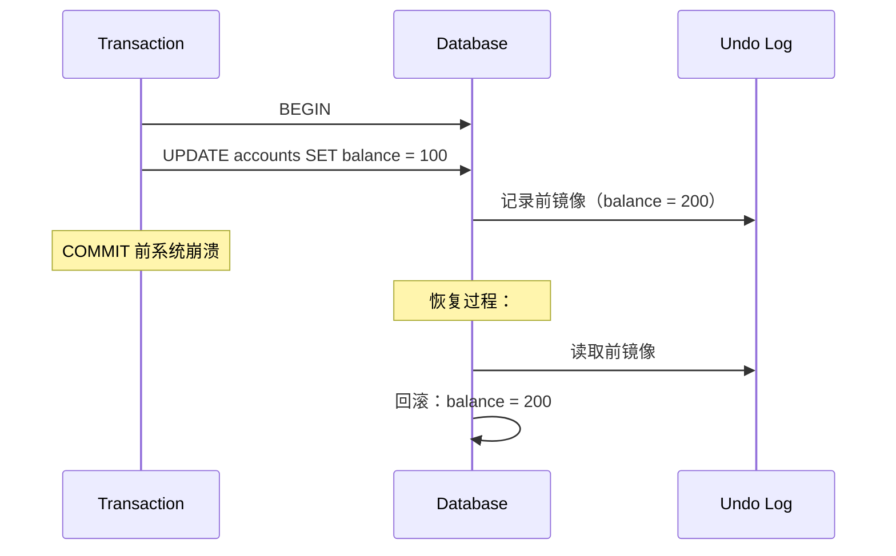
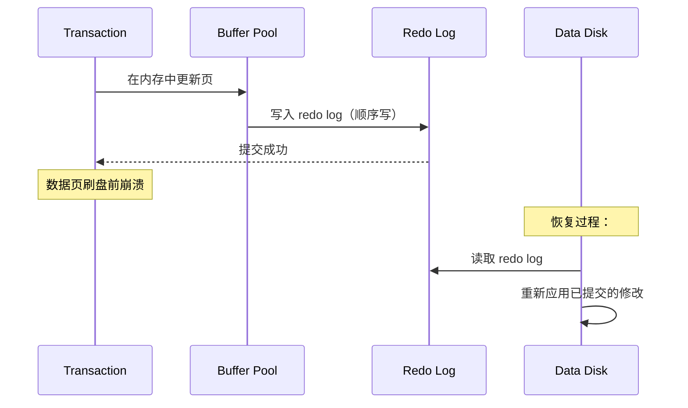
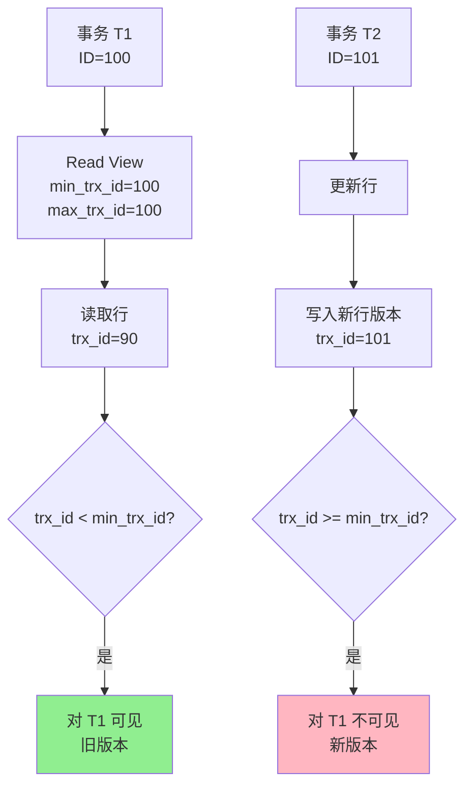
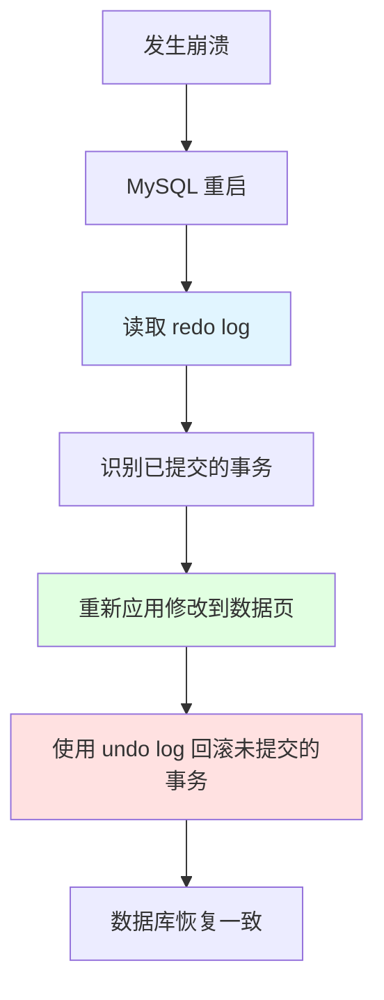

# 事务

## 为什么事务很重要

事务是关系型数据库数据完整性的基础：

- **原子性（Atomicity）**：所有操作要么全部成功，要么全部失败（无部分更新）
- **一致性（Consistency）**：数据在事务间保持有效状态（约束得到执行）
- **隔离性（Isolation）**：并发事务互不干扰
- **持久性（Durability）**：已提交的数据在崩溃后依然存在

**实际影响**：
- **金融系统**：从 A 转账到 B —— 借记和贷记必须同时成功或同时失败
- **电商**：创建订单 —— 库存更新和订单记录必须原子化
- **社交媒体**：发布帖子 —— 帖子和通知必须一致

**示例**：
```sql
-- 银行转账：两个操作必须同时成功或同时失败
BEGIN;
UPDATE accounts SET balance = balance - 100 WHERE id = 1;  -- 借记
UPDATE accounts SET balance = balance + 100 WHERE id = 2;  -- 贷记
COMMIT;  -- 永久生效
-- 如果改为 ROLLBACK，两个账户都不会被修改
```

## ACID 特性

### 原子性（Atomicity）

**定义**：事务中的所有操作被视为一个单元。要么全部成功，要么全部失败。

**实现机制**：**Undo Log（回滚日志）**（前镜像）



**示例**：
```sql
BEGIN;
UPDATE inventory SET quantity = quantity - 1 WHERE id = 123;
INSERT INTO orders (product_id, quantity) VALUES (123, 1);
-- 如果 INSERT 失败，UPDATE 通过 undo log 回滚
COMMIT;
```

### 一致性（Consistency）

**定义**：数据库从一个有效状态转换到另一个有效状态，遵守所有约束。

**实现机制**：**约束、外键、触发器**

**示例**：
```sql
-- 主键约束
CREATE TABLE users (
    id INT PRIMARY KEY,  -- 必须唯一且非空
    name VARCHAR(100)
);

-- 外键约束
CREATE TABLE orders (
    id INT PRIMARY KEY,
    user_id INT,
    FOREIGN KEY (user_id) REFERENCES users(id)  -- 必须引用有效用户
);

-- 检查约束（MySQL 8.0.16+）
CREATE TABLE products (
    price DECIMAL(10, 2) CHECK (price >= 0)  -- 价格不能为负
);
```

### 隔离性（Isolation）

**定义**：并发事务互不干扰。每个事务看到一致的数据快照。

**实现机制**：**MVCC（多版本并发控制）+ 锁**

**示例**：
```sql
-- 事务 1
BEGIN;
SELECT balance FROM accounts WHERE id = 1;  -- 返回 100

-- 事务 2（并发）
BEGIN;
UPDATE accounts SET balance = 200 WHERE id = 1;
COMMIT;  -- T2 提交

-- 事务 1（仍在 RR 隔离级别）
SELECT balance FROM accounts WHERE id = 1;  -- 仍然是 100（与 T2 隔离）
COMMIT;
```

### 持久性（Durability）

**定义**：事务一旦提交，其修改在系统崩溃后依然存在。

**实现机制**：**Redo Log（WAL - 预写式日志）**



**示例**：
```sql
BEGIN;
UPDATE accounts SET balance = 100 WHERE id = 1;
COMMIT;  -- Redo log 已写入，即使数据页尚未刷盘，修改也是持久的
```

## 事务隔离级别

### 四个级别

| 级别 | 脏读 | 不可重复读 | 幻读 | 性能 | 使用场景 |
|------|------|-----------|------|------|---------|
| **Read Uncommitted** | ✅ 可能 | ✅ 可能 | ✅ 可能 | 最快 | 极少使用 |
| **Read Committed (RC)** | ❌ 防止 | ✅ 可能 | ✅ 可能 | 快 | PostgreSQL、SQL Server 默认 |
| **Repeatable Read (RR)** | ❌ 防止 | ❌ 防止 | ⚠️* | 中等 | MySQL 默认 |
| **Serializable** | ❌ 防止 | ❌ 防止 | ❌ 防止 | 最慢 | 需要严格一致性的场景 |

*MySQL InnoDB 通过 Gap Lock（间隙锁）防止幻读（不同于标准 RR）

### 设置隔离级别

```sql
-- 设置当前会话的隔离级别
SET SESSION TRANSACTION ISOLATION LEVEL READ COMMITTED;

-- 全局设置（需要 SUPER 权限）
SET GLOBAL TRANSACTION ISOLATION LEVEL READ COMMITTED;

-- 查看当前隔离级别
SELECT @@transaction_isolation;
-- 返回: 'REPEATABLE-READ'（MySQL 默认）
```

### 并发问题详解


#### 1. 脏读（Dirty Read）

**定义**：读取尚未提交的数据。

```sql
-- 事务 1
BEGIN;
UPDATE accounts SET balance = 100 WHERE id = 1;
-- 尚未提交

-- 事务 2（Read Uncommitted 隔离级别）
BEGIN;
SELECT balance FROM accounts WHERE id = 1;  -- 读取到 100（未提交）
COMMIT;

-- 事务 1
ROLLBACK;  -- 回滚到 200

-- 事务 2 读取了从未真正存在的数据（脏读）
```

**预防**：使用 Read Committed 或更高级别。

#### 2. 不可重复读（Non-Repeatable Read）

**定义**：同一事务内相同查询返回不同值。

```sql
-- 事务 1（RC 隔离级别）
BEGIN;
SELECT balance FROM accounts WHERE id = 1;  -- 返回 100

-- 事务 2
BEGIN;
UPDATE accounts SET balance = 200 WHERE id = 1;
COMMIT;

-- 事务 1
SELECT balance FROM accounts WHERE id = 1;  -- 返回 200（不同了！）
COMMIT;
```

**预防**：使用 Repeatable Read 或 Serializable。

#### 3. 幻读（Phantom Read）

**定义**：同一事务内后续查询出现新行。

```sql
-- 事务 1（RC 隔离级别）
BEGIN;
SELECT * FROM accounts WHERE balance > 100;  -- 返回 2 行

-- 事务 2
BEGIN;
INSERT INTO accounts (balance) VALUES (200);
COMMIT;

-- 事务 1
SELECT * FROM accounts WHERE balance > 100;  -- 返回 3 行（幻读！）
COMMIT;
```

**预防**：使用 Serializable（或 MySQL 的 RR 级别配合间隙锁）。

## MVCC（多版本并发控制）

### 什么是 MVCC？

MVCC 通过维护数据的多个版本，允许多个事务并发访问数据库而无需加锁。

**核心优势**：
- **非阻塞读**：读不阻塞写，写不阻塞读
- **一致性快照**：每个事务看到启动时的数据快照
- **高并发**：比加锁方式性能更好

### InnoDB 中 MVCC 的工作原理



**组件**：
1. **Undo Log**：存储行的前镜像（历史版本）
2. **Read View**：查询启动时活跃事务的快照
3. **事务 ID**：每个事务有唯一递增的 ID
4. **行版本**：每行有 `trx_id` 标识修改它的事务

### Read View 结构

```sql
-- RR 级别在首次 SELECT 时创建 Read View（RC 级别在每次 SELECT 时创建）
struct ReadView {
    m_low_limit_id;    // 最小活跃事务 ID（不可见）
    m_up_limit_id;     // 创建视图时的最大事务 ID（小于此值可见）
    m_ids;             // 创建视图时的活跃事务 ID 列表
    m_low_limit_no;    // 尚未分配的第一个事务 ID
};
```

**可见性规则**：
- 如果行的 `trx_id` < read view 的 `min_trx_id`：**可见**（在快照前已提交）
- 如果行的 `trx_id` >= read view 的 `max_trx_id`：**不可见**（在快照后创建）
- 如果行的 `trx_id` 在活跃列表中：**不可见**（未提交），查看 undo log

### RC 与 RR 在 MVCC 中的区别

**关键区别**：Read View 的创建时机

| 隔离级别 | Read View 创建时机 | 行为 |
|---------|-------------------|------|
| **Read Committed (RC)** | 每次 SELECT 创建新 Read View | 能看到其他事务已提交的修改 |
| **Repeatable Read (RR)** | 事务中首次 SELECT 时创建 | 看不到后续提交（一致性快照） |

**示例**：
```sql
-- 事务 1（RC）
BEGIN;
SELECT balance FROM accounts WHERE id = 1;  -- 创建 Read View，balance=100

-- 事务 2
BEGIN;
UPDATE accounts SET balance = 200 WHERE id = 1;
COMMIT;  -- trx_id=101

-- 事务 1（RC）
SELECT balance FROM accounts WHERE id = 1;  -- 新 Read View，看到 200

-- 事务 1（RR 级别下两次查询都会看到 100）
COMMIT;
```

## Undo Log 与 Redo Log

### Undo Log（回滚日志）

**用途**：
1. **回滚**：在 ROLLBACK 时撤销未提交的修改
2. **MVCC**：为一致性读提供行的历史版本

**结构**：
```
Undo Log Segment
  └── Undo Log Entry
        ├── 行的前镜像
        ├── 事务 ID（trx_id）
        └── 回滚指针（roll_ptr）
```

**示例**：
```sql
BEGIN;
UPDATE accounts SET balance = 100 WHERE id = 1;
-- Undo log: 前镜像（balance=200, trx_id=100）

UPDATE accounts SET balance = 50 WHERE id = 1;
-- Undo log: 前镜像（balance=100, trx_id=100）

ROLLBACK;
-- 使用 undo log 回滚：100 → 200 → 原始值
```

**清理（Purge）**：后台线程删除已提交事务的 undo log，释放空间。

### Redo Log（重做日志）

**用途**：**崩溃恢复**（通过 WAL 保证持久性）

**WAL（预写式日志）**：
1. 在内存缓冲池中修改页
2. 在提交**之前**将 redo log 写入磁盘
3. 异步刷数据页到磁盘

**为什么用 WAL？**
- 随机写（数据页）→ 顺序写（redo log）
- 无需在每次提交时刷所有页即可保证持久性
- 恢复更快（redo log 是顺序的）

**配置**：
```ini
innodb_log_file_size = 512M          # 每个 redo log 文件的大小
innodb_log_files_in_group = 2        # redo log 文件数量
innodb_log_buffer_size = 16M         # redo log 的内存缓冲区
innodb_flush_log_at_trx_commit = 1   # 最安全：提交时刷盘
```

**恢复过程**：


## 事务中的锁

### 锁类型

| 锁类型 | 语法 | 用途 | 示例 |
|--------|------|------|------|
| **共享锁（S Lock）** | `LOCK IN SHARE MODE` | 读锁，阻止并发写入 | `SELECT * FROM users WHERE id = 1 LOCK IN SHARE MODE` |
| **排他锁（X Lock）** | `FOR UPDATE` | 写锁，阻止并发读/写 | `SELECT * FROM users WHERE id = 1 FOR UPDATE` |

**兼容性**：

| | S Lock | X Lock |
|---|--------|--------|
| **S Lock** | ✅ 兼容 | ❌ 阻塞 |
| **X Lock** | ❌ 阻塞 | ❌ 阻塞 |

### 锁持有时间

```sql
BEGIN;
SELECT * FROM users WHERE id = 1 FOR UPDATE;  -- 获取 X 锁
-- 锁持有直到 COMMIT 或 ROLLBACK
UPDATE users SET name = 'Alice' WHERE id = 1;  -- 同一把锁
COMMIT;  -- 释放锁
```

## 面试题

### Q1：用实际例子解释 ACID

**答案**：
- **原子性**：银行转账 —— 借记和贷记必须同时成功或同时失败
- **一致性**：外键确保订单引用有效用户
- **隔离性**：两个事务更新同一余额互不干扰
- **持久性**：已提交的修改在崩溃后依然存在（redo log）

### Q2：Undo Log 如何保证原子性？

**答案**：Undo log 存储所有修改的前镜像。如果事务回滚（或在提交前崩溃），InnoDB 使用 undo log 恢复修改，将数据库还原到事务前的状态。

### Q3：Redo Log 如何保证持久性？

**答案**：Redo log 实现了预写式日志（WAL）。修改在事务提交**之前**写入 redo log（顺序写，速度快）。如果发生崩溃，重放 redo log 恢复已提交的修改。

### Q4：RC 和 RR 隔离级别有什么区别？

**答案**：
- **RC**：每次 SELECT 创建新 Read View，能看到其他事务的提交
- **RR**：首次 SELECT 时创建 Read View，整个事务复用（一致性快照）
- **不可重复读**：RC 允许，RR 防止
- **幻读**：RC 允许，MySQL 的 RR 通过间隙锁防止

### Q5：InnoDB 中 MVCC 如何工作？

**答案**：MVCC 使用 undo log 维护行的多个版本。每个事务有一个 read view（活跃事务快照）。读取行时：
- 如果行的 `trx_id` < read view 的 min：可见（旧版本）
- 如果行的 `trx_id` 在活跃列表中：不可见（查看 undo log 获取历史版本）
- 如果行的 `trx_id` > read view 的 max：不可见（更新的版本）

### Q6：为什么 RR 理论上仍允许幻读？

**答案**：标准 RR 防止不可重复读但允许幻读（范围查询中出现新行）。MySQL InnoDB 通过**间隙锁**（锁定记录之间的间隙）在 RR 级别防止幻读，但标准 RR 不保证这一点。

### Q7：生产环境应该使用哪个隔离级别？

**答案**：
- **RR（MySQL 默认）**：大多数应用 —— 防止不可重复读和幻读
- **RC**：需要看到最新提交时（如长时间运行的报表）
- **Serializable**：极少使用，仅在需要绝对一致性时（性能影响大）
- **Read Uncommitted**：生产环境永不使用（数据完整性风险）

## 延伸阅读

- **[锁](../locking)** - 深入了解 InnoDB 的锁机制
- **[日志与复制](../logging-replication)** - Redo log 和 undo log 详解
- **[索引](../indexes)** - 索引如何与事务交互
