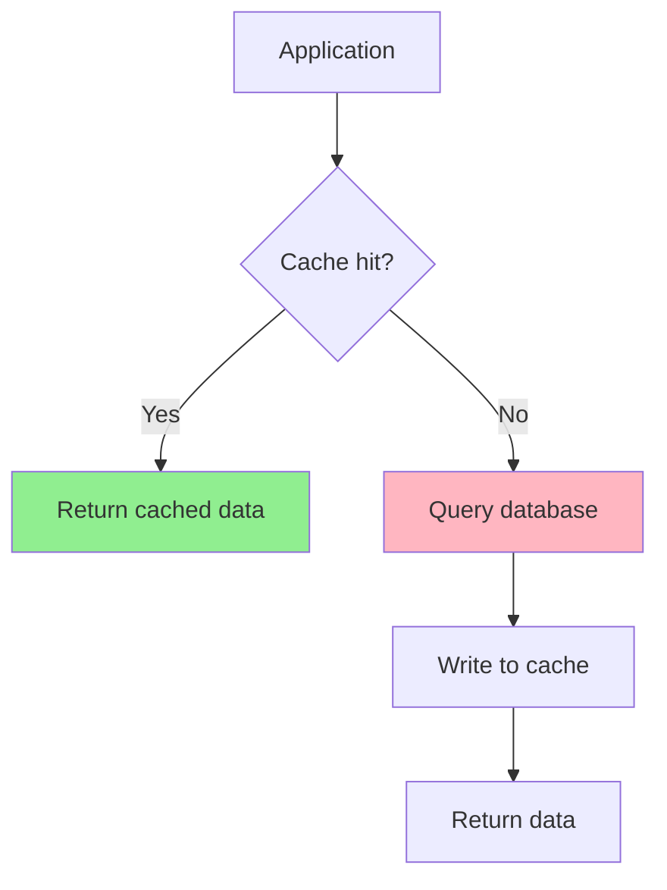
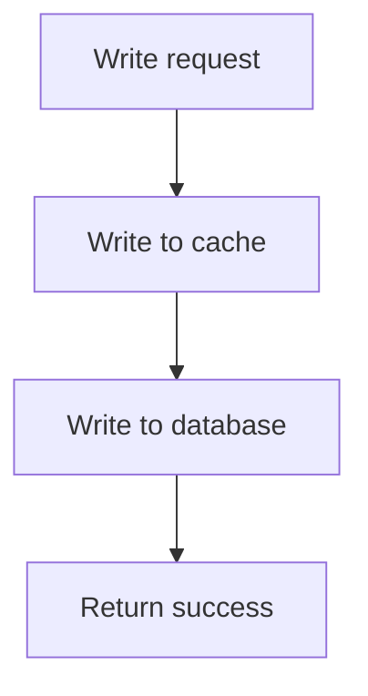
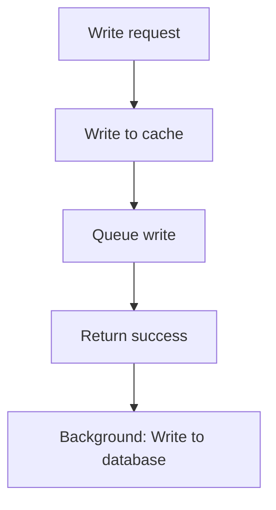

# 缓存模式

有效的缓存策略对性能和数据一致性至关重要。

## 为什么缓存模式很重要

- **性能**：缓存命中 = 微秒级延迟 vs 数据库的毫秒级
- **一致性**：过期缓存 = 错误数据
- **可扩展性**：减少数据库负载，处理更多流量

**实际影响**：
- 好的缓存：90%+ 命中率，数据库查询减少 10 倍
- 差的缓存：缓存雪崩（惊群效应）压垮数据库
- 不一致的缓存：用户看到旧数据、更新丢失

## Cache Aside（旁路缓存/懒加载）

### 工作原理



### 实现

```bash
# 读取
cache_value = GET cache:user:123
if cache_value == NULL:
    # 缓存未命中，查询数据库
    user = db.query("SELECT * FROM users WHERE id = 123")
    # 写入缓存（带 TTL）
    SETEX cache:user:123 3600 user.to_json()
    return user
else:
    # 缓存命中
    return parse_json(cache_value)

# 写入（更新数据库，使缓存失效）
db.execute("UPDATE users SET name = 'Alice' WHERE id = 123")
DEL cache:user:123  # 使缓存失效
```

### 优缺点

| 优点 | 缺点 |
|------|------|
| 实现简单 | 缓存未命中时可能发生雪崩 |
| 只缓存请求过的数据 | 缓存可能过期（直到 TTL） |
| 内存占用低（只缓存热数据） | 未命中时需要三次往返 |

### 缓存雪崩预防

**问题**：多个请求同时缓存未命中，同时查询数据库

**解决方案**：加锁或提前过期

```bash
# 使用 SETNX（不存在时设置）实现锁
lock_key = "lock:user:123"
if SETNX lock_key 1 == 1:
    # 获取锁，查询数据库
    EXPIRE lock_key 10  # 防止锁过期
    user = db.query("SELECT * FROM users WHERE id = 123")
    SETEX cache:user:123 3600 user.to_json()
    DEL lock_key
else:
    # 等待并重试
    sleep(0.1)
    return get_user_cached(123)  # 重试

# 或使用概率性提前过期（在 TTL 到期前刷新缓存）
value = GET cache:user:123
if value != NULL and ttl < 60:  # TTL < 60 秒
    # 异步刷新缓存
    async_refresh_cache(123)
```

## Write Through（写穿透）

### 工作原理



### 实现

```bash
# 写入
user = {"id": 123, "name": "Alice"}
# 写入缓存（同步）
SETEX cache:user:123 3600 user.to_json()
# 写入数据库（同步）
db.execute("UPDATE users SET name = 'Alice' WHERE id = 123")

# 读取（更简单，命中时无需查数据库）
cache_value = GET cache:user:123
if cache_value != NULL:
    return parse_json(cache_value)
else:
    # 回退到数据库
    user = db.query("SELECT * FROM users WHERE id = 123")
    SETEX cache:user:123 3600 user.to_json()
    return user
```

### 优缺点

| 优点 | 缺点 |
|------|------|
| 缓存始终与数据库一致 | 写入较慢（写缓存 + 写数据库） |
| 不会有过期缓存 | 缓存存储所有写入（包括不常访问的数据） |
| 读取简单 | 写入失败导致缓存不一致 |

## Write Behind（异步写入）

### 工作原理



### 实现

```bash
# 写入（快速，立即返回）
user = {"id": 123, "name": "Alice"}
SETEX cache:user:123 3600 user.to_json()
queue.push({"type": "update", "table": "users", "id": 123, "data": user})
return success  # 立即返回

# 后台工作线程（处理队列）
while true:
    task = queue.pop()
    if task.type == "update":
        db.execute("UPDATE users SET ... WHERE id = ?", task.id)
```

### 优缺点

| 优点 | 缺点 |
|------|------|
| 写入快速（无数据库 I/O） | 缓存持久化前故障导致数据丢失 |
| 批量写入数据库（高效） | 实现复杂 |
| 减少数据库负载 | 最终一致性（数据库写入有延迟） |

## 缓存失效策略

### TTL（生存时间）

**自动过期**：缓存条目在固定时间后过期

```bash
SETEX cache:user:123 3600 user  # 1 小时后过期
EXPIRE cache:user:123 300  # 设置过期时间为 5 分钟
```

**权衡**：
- 短 TTL：频繁缓存未命中（更多数据库负载）
- 长 TTL：缓存过期（数据不一致）

**最佳实践**：
- 在数据变更前让缓存过期（主动刷新）
- 不同数据类型使用不同 TTL
- 监控缓存命中率来调优 TTL

### 写入失效

**写入时失效**：数据变更时删除或更新缓存

```bash
# 更新用户
db.execute("UPDATE users SET name = 'Alice' WHERE id = 123")
DEL cache:user:123  # 使缓存失效

# 或更新缓存（写穿透）
user = db.query("SELECT * FROM users WHERE id = 123")
SETEX cache:user:123 3600 user.to_json()
```

**挑战**：多次数据库写入，需要跟踪所有变更

**解决方案**：使用 ORM 钩子、数据库触发器或应用事件

### 数据库触发器失效

**数据库变更时触发器使缓存失效**：

```sql
-- MySQL 触发器
CREATE TRIGGER user_update AFTER UPDATE ON users
FOR EACH ROW
BEGIN
    -- 调用 Redis（通过 UDF 或外部脚本）
    DO redis_del(concat('cache:user:', NEW.id));
END;
```

**优点**：数据库驱动，与应用无关
**缺点**：复杂性，延迟（触发器执行时间）

### 消息队列失效

**发布失效事件**：

```bash
# 数据库更新时
db.execute("UPDATE users SET name = 'Alice' WHERE id = 123")
# 发布失效事件
PUBLISH cache:invalidate:user:123 ""

# 缓存订阅者（多个缓存实例）
SUBSCRIBE cache:invalidate:user:*
# 收到消息：DEL cache:user:123
```

**优点**：解耦，支持分布式缓存
**缺点**：最终一致性（发布和订阅之间有延迟）

## 常见缓存陷阱

### 1. 缓存穿透

**问题**：攻击者请求不存在的数据，绕过缓存（始终未命中）

```bash
# 攻击者请求：GET /users/99999（不存在）
# 缓存未命中，数据库查询返回 NULL
# 下次请求：相同 key，再次缓存未命中（NULL 未被缓存）
```

**解决方案**：缓存空结果

```bash
cache_value = GET cache:user:99999
if cache_value == NULL:
    user = db.query("SELECT * FROM users WHERE id = 99999")
    if user == NULL:
        # 缓存空结果（短 TTL）
        SETEX cache:user:99999 60 "NULL"
    else:
        SETEX cache:user:99999 3600 user.to_json()
```

### 2. 缓存击穿

**问题**：热点 key 过期，大量请求同时查询数据库（缓存雪崩）

**解决方案**：概率性提前过期或加锁

```bash
# 提前过期：10% 的请求提前刷新缓存
value = GET cache:user:123
if value != NULL:
    ttl = TTL cache:user:123
    if ttl < 60 and random() < 0.1:  # TTL < 60 秒时有 10% 概率
        # 异步刷新缓存
        async_refresh_cache(123)
```

### 3. 缓存雪崩

**问题**：大量缓存 key 同时过期（如服务器重启、批量过期）

**解决方案**：随机化 TTL

```bash
# 不要使用固定 TTL
SETEX cache:user:123 3600 user

# 使用随机 TTL（3540-3660 秒）
ttl = 3600 + random(-60, 60)
SETEX cache:user:123 ttl user
```

## 缓存最佳实践

### 1. 正确序列化

```bash
# ❌ 差：Python pickle（安全风险，语言特定）
SET cache:user:123 pickle.dumps(user)

# ✅ 好：JSON（可移植，人类可读）
SET cache:user:123 json.dumps(user)

# ✅ 更好：MessagePack（紧凑，快速）
SET cache:user:123 msgpack.packb(user)
```

### 2. 使用合适的数据结构

```bash
# ❌ 差：存储 JSON 字符串
SET cache:user:123 '{"name":"Alice","age":25}'
GET cache:user:123  # 应用层需要解析 JSON

# ✅ 好：使用 Hash
HSET cache:user:123 name "Alice" age 25
HGET cache:user:123 name  # 无需解析
```

### 3. 设置 TTL（防止内存泄漏）

```bash
# 始终为缓存数据设置 TTL
SETEX cache:user:123 3600 user  # 1 小时后自动过期

# 监控内存使用
INFO memory
# 设置最大内存和淘汰策略
CONFIG SET maxmemory 2gb
CONFIG SET maxmemory-policy allkeys-lru
```

### 4. 监控缓存命中率

```bash
# Redis 统计
INFO stats
# keyspace_hits: 缓存命中数
# keyspace_misses: 缓存未命中数

# 命中率 = hits / (hits + misses)
hit_rate = keyspace_hits / (keyspace_hits + keyspace_misses)

# 目标：> 90% 命中率
```

### 5. 使用命名空间便于失效

```bash
# 使用冒号分隔的命名空间
SET app:user:123:name "Alice"
SET app:product:456:price 99.99

# 使所有用户缓存失效（不直接支持，使用 scan 或每个用户独立 key）
SCAN 0 MATCH app:user:123:*
DEL <returned keys>
```

## 淘汰策略

当 Redis 达到 `maxmemory` 时，根据策略淘汰 key：

| 策略 | 描述 |
|------|------|
| **noeviction** | 内存限制时写入返回错误 |
| **allkeys-lru** | 淘汰最近最少使用的 key（任意 key） |
| **volatile-lru** | 在设置了 TTL 的 key 中淘汰 LRU |
| **allkeys-random** | 随机淘汰 key |
| **volatile-random** | 在设置了 TTL 的 key 中随机淘汰 |
| **volatile-ttl** | 优先淘汰 TTL 最短的 key |
| **allkeys-lfu**（Redis 4.0+） | 淘汰最不经常使用的 key |
| **volatile-lfu**（Redis 4.0+） | 在设置了 TTL 的 key 中淘汰 LFU |

**推荐**：纯缓存使用 `allkeys-lru`，缓存 + 持久数据使用 `volatile-lru`

```bash
CONFIG SET maxmemory 2gb
CONFIG SET maxmemory-policy allkeys-lru
```

## 面试题

### Q1：什么是缓存雪崩，如何预防？

**答案**：缓存雪崩（惊群效应）发生在热点 key 过期时，大量请求同时查询数据库。预防方法：1) 加锁（SETNX），2) 概率性提前过期（在 TTL 到期前刷新缓存），3) 热缓存（永不过期，显式更新）。

### Q2：Cache Aside 和 Write Through 有什么区别？

**答案**：Cache Aside：应用管理缓存（懒加载，显式失效）。Write Through：更新时同步写入缓存和数据库。Cache Aside：更简单，更灵活。Write Through：始终一致，写入较慢。

### Q3：如何处理缓存失效？

**答案**：1) TTL（自动过期），2) 写入失效（写入时删除/更新缓存），3) 消息队列（发布失效事件），4) 数据库触发器。根据一致性需求和复杂性选择。

### Q4：什么是缓存穿透？

**答案**：攻击者请求不存在的数据，绕过缓存（始终未命中）。解决方案：1) 缓存空结果（NULL），2) 布隆过滤器（快速检查 key 是否存在），3) 限流。

## 延伸阅读

- **[数据结构](../data-structures)** - 为缓存选择数据结构
- **[持久化](../persistence)** - 缓存持久化和恢复
