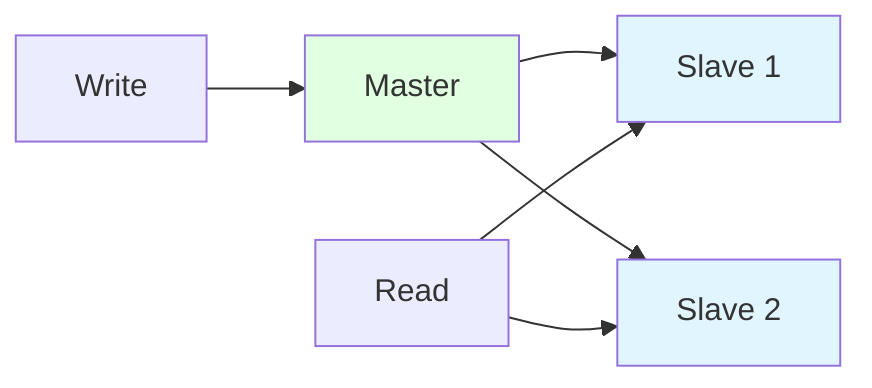
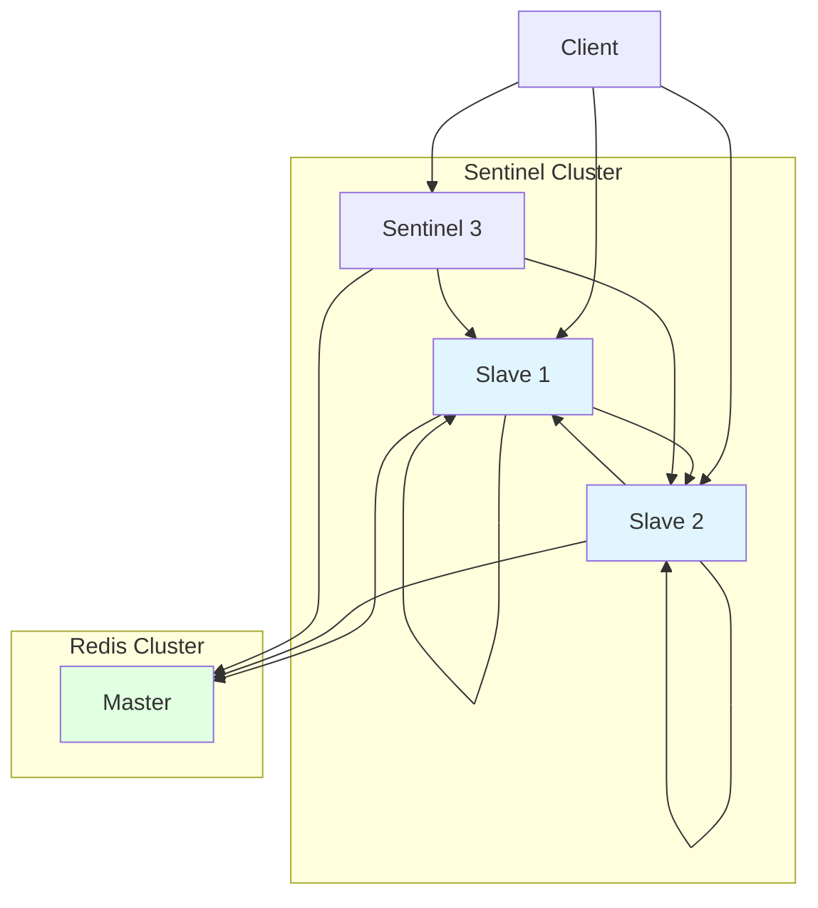
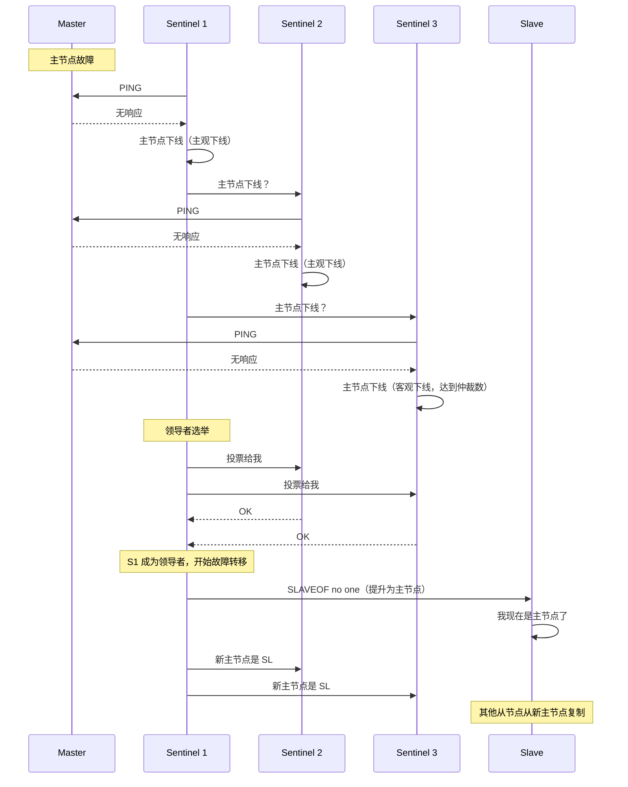
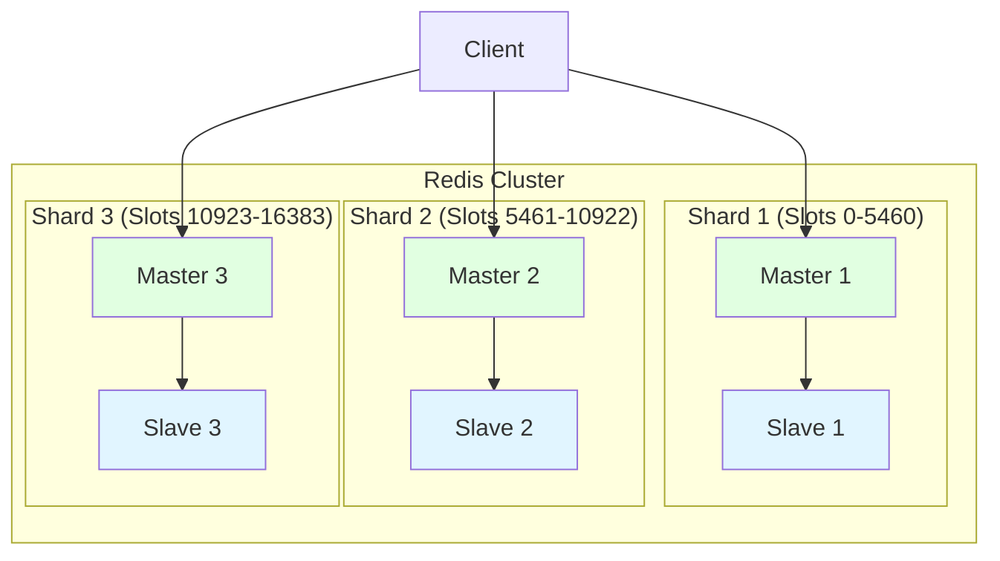

# Cluster & Sentinel

Redis 提供两种高可用解决方案：
- **Redis Sentinel**：主从复制的自动故障转移
- **Redis Cluster**：水平扩展（分片）加高可用

## 为什么高可用很重要

- **故障不可避免**：硬件故障、网络问题、进程崩溃
- **停机代价高昂**：收入损失、用户体验差
- **扩展需求**：单实例受限于内存和 CPU

**实际影响**：
- 无高可用：Redis 故障 = 应用停机
- 使用 Sentinel：数秒内自动故障转移
- 使用 Cluster：跨多节点扩展到 TB 级数据

## 主从复制

### 架构



**特性**：
- **异步复制**：主节点向从节点发送写入（不等待确认）
- **读扩展**：从节点处理读查询
- **写扩展**：受限于主节点（单点故障）

### 配置

**主节点**（`redis.conf`）：
```bash
bind 0.0.0.0
port 6379
requirepass yourpassword
```

**从节点**（`redis.conf`）：
```bash
bind 0.0.0.0
port 6380
replicaof <master_ip> 6379
masterauth yourpassword
```

### 复制过程

1. 从节点连接主节点
2. 从节点发送 `SYNC` 命令
3. 主节点 fork 子进程，创建 RDB 快照
4. 主节点将 RDB 文件发送给从节点
5. 主节点发送缓冲的写入（快照期间的新写入）给从节点
6. 从节点加载 RDB，应用缓冲写入
7. 持续复制：主节点将新写入发送给从节点

### 部分重同步

**问题**：完全重同步（RDB 快照）对大数据集代价昂贵

**解决方案**：使用复制偏移量和积压缓冲区进行部分重同步

**组件**：
- **复制偏移量**：单调递增的数字（已处理的复制流字节数）
- **复制积压缓冲区**：主节点上的固定大小缓冲区（默认 1MB）

**过程**：
1. 从节点断连后重新连接
2. 从节点发送自己的复制偏移量
3. 如果主节点的积压缓冲区中有该偏移量的数据，发送增量数据
4. 否则，回退到完全重同步

**配置**：
```bash
# 复制积压缓冲区大小
repl-backlog-size 1mb

# 积压缓冲区 TTL（从节点断连后保留的秒数）
repl-backlog-ttl 3600
```

## Redis Sentinel

### 什么是 Sentinel？

**高可用解决方案**：监控 Redis 实例、自动故障转移、配置提供者

**功能**：
- **监控**：检查主节点和从节点是否正常运行
- **通知**：通过 API 发送故障告警
- **自动故障转移**：主节点故障时将从节点提升为主节点
- **配置提供者**：客户端向 Sentinel 查询当前主节点地址

### Sentinel 架构



**仲裁（Quorum）**：在执行故障转移前，最少需要多少个 Sentinel 同意主节点已下线

### Sentinel 配置

**创建 sentinel.conf**：
```bash
# 监控主节点（sentinel monitor <master_name> <ip> <port> <quorum>）
sentinel monitor mymaster 127.0.0.1 6379 2

# 故障转移超时（毫秒）
sentinel failover-timeout mymaster 60000

# 判定下线的毫秒数（无响应）
sentinel down-after-milliseconds mymaster 5000

# 并行同步数（同时与新模式同步的从节点数）
sentinel parallel-syncs mymaster 1

# 密码
sentinel auth-pass mymaster yourpassword
```

**启动 Sentinel**：
```bash
redis-sentinel /path/to/sentinel.conf
# 或
redis-server /path/to/sentinel.conf --sentinel
```

**至少部署 3 个 Sentinel 实例**以保证容错性。

### 故障转移过程



**步骤**：
1. Sentinel 检测到主节点下线（无 PING 响应）
2. 多个 Sentinel 同意主节点下线（达到仲裁数）
3. Sentinel 投票选举领导者（负责协调故障转移）
4. 领导者将从节点提升为主节点
5. 领导者重新配置其他从节点从新主节点复制
6. 旧主节点（如果恢复）成为新主节点的从节点

### 客户端集成

**客户端向 Sentinel 查询主节点地址**：
```bash
# 向 Sentinel 查询主节点地址
redis-cli -p 26379 SENTINEL get-master-addr-by-name mymaster
# 返回: <new_master_ip> <new_master_port>
```

**支持 Sentinel 的 Redis 客户端**：
- Java：Lettuce、Jedis
- Python：redis-py
- Node.js：ioredis

### Sentinel 配置最佳实践

1. **至少部署 3 个 Sentinel**，分布在不同机器上
2. **仲裁数 = (Sentinel 数量 / 2) + 1**，确保多数同意
3. **使用奇数个 Sentinel**（3、5、7），确保明确的多数
4. **监控所有 Sentinel**（不仅是主节点和从节点）

## Redis Cluster

### 什么是 Redis Cluster？

**分片解决方案**：将数据分布到多个 Redis 节点

**特性**：
- **自动分片**：数据按 16384 个槽位分配到各节点
- **高可用**：分片内主从复制
- **水平扩展**：添加节点增加容量
- **分区容错**：大多数主节点可达时正常工作

### Cluster 架构



**哈希槽**：16384 个槽位分布到各主节点
- 槽位分配：`CRC16(key) % 16384`
- 每个主节点处理一部分槽位
- 客户端重定向到正确的节点

### Cluster 配置

**最低要求**：3 个主节点（可选从节点）

**创建集群**（Redis CLI）：
```bash
# 创建 3 主节点的集群（无从节点）
redis-cli --cluster create \
  127.0.0.1:7000 \
  127.0.0.1:7001 \
  127.0.0.1:7002 \
  --cluster-replicas 0

# 创建 3 主节点 + 各 1 从节点的集群（共 6 节点）
redis-cli --cluster create \
  127.0.0.1:7000 \
  127.0.0.1:7001 \
  127.0.0.1:7002 \
  127.0.0.1:7003 \
  127.0.0.1:7004 \
  127.0.0.1:7005 \
  --cluster-replicas 1
```

**节点配置**（`redis.conf`）：
```bash
# 启用集群模式
cluster-enabled yes

# 集群配置文件（自动生成）
cluster-config-file nodes.conf

# 集群节点超时（毫秒）
cluster-node-timeout 5000

# 绑定地址
cluster-announce-ip <node_ip>
cluster-announce-port 7000
cluster-announce-bus-port 17000
```

### 集群操作

```bash
# 检查集群状态
redis-cli -c -p 7000 cluster info

# 列出集群节点
redis-cli -c -p 7000 cluster nodes

# 添加槽位
redis-cli -c -p 7000 cluster addslots {0..5460}

# 重新分片（从节点1迁移到节点2）
redis-cli --cluster reshard <target_ip>:<target_port> \
  --cluster-from <source_node_id> \
  --cluster-to <target_node_id> \
  --cluster-slots 1000 \
  --cluster-yes
```

### Hash Tags

**问题**：多键操作（MGET、Lua、事务）要求键在同一节点上

**解决方案**：Hash Tags 确保键映射到同一槽位

**语法**：将键的一部分用花括号 `{...}` 包裹

```bash
# user:123:profile 和 user:123:settings 可能在不同槽位
SET user:123:profile "..."
SET user:123:settings "..."

# Hash Tag: {user:123}
SET {user:123}:profile "..."
SET {user:123}:settings "..."
# 两个键映射到同一槽位（对 "user:123" 取哈希）
```

**使用场景**：
- 多键操作：`MGET {user:123}:profile {user:123}:settings`
- 事务：`MULTI`、`SET {user:123}:balance ...`、`EXEC`
- 访问多个键的 Lua 脚本

### Cluster vs Sentinel

| 特性 | Sentinel | Cluster |
|------|----------|---------|
| **目的** | 高可用（故障转移） | 分片 + 高可用 |
| **扩展方式** | 垂直扩展（更大机器） | 水平扩展（更多节点） |
| **最大数据量** | 受单节点内存限制 | 多节点内存总和 |
| **复杂度** | 简单 | 复杂 |
| **多键操作** | 支持（单主节点） | 受限（必须在同一分片） |

## 面试题

### Q1：Redis Sentinel 和 Redis Cluster 有什么区别？

**答案**：Sentinel 为单主架构提供高可用（自动故障转移）。Cluster 提供水平扩展（分片）并内置高可用。

### Q2：Redis Sentinel 如何检测主节点故障？

**答案**：Sentinel 向主节点发送 PING。如果在 `down-after-milliseconds` 内无响应，标记为主观下线。如果达到仲裁数（大多数 Sentinel 同意），标记为客观下线并开始故障转移。

### Q3：Redis Cluster 如何分片数据？

**答案**：使用哈希槽（共 16384 个）。每个主节点分配一部分槽位。键的槽位由 `CRC16(key) % 16384` 确定。如果键不在当前节点上，客户端重定向到正确的节点。

## 延伸阅读

- **[持久化](../persistence)** - 复制与持久化的交互
- **[缓存模式](../caching-patterns)** - 分布式环境下的缓存
