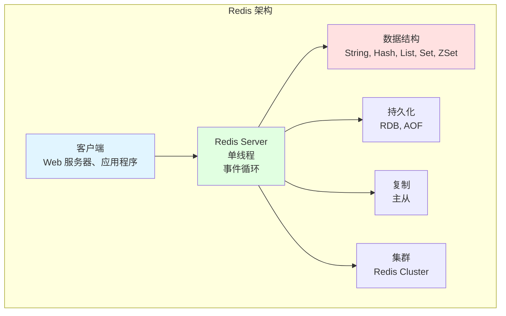
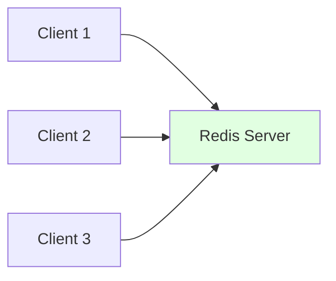
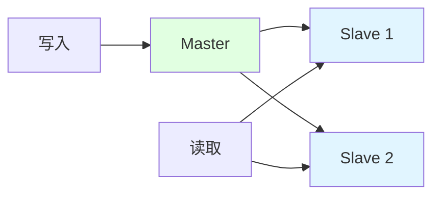
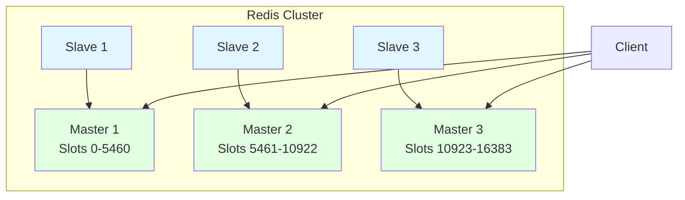

# Redis 概览

## 为什么 Redis 很重要

Redis（Remote Dictionary Server）是现代后端系统中的关键组件：

- **性能**：内存操作，微秒级延迟（vs 基于磁盘数据库的毫秒级）
- **多功能性**：丰富的数据结构（字符串、哈希、列表、集合、有序集合）
- **特性**：发布/订阅、事务、Lua 脚本、集群
- **使用场景**：缓存、会话存储、排行榜、限流、消息队列

**实际影响**：
- 缓存频繁访问的数据可以减少 90% 的数据库负载
- Redis 中的会话存储实现了 Web 服务器的水平扩展
- 有序集合支持数百万用户的实时排行榜

**示例**：
```bash
# 设置缓存（微秒级延迟）
SET user:123:name "Alice"
GET user:123:name  # 返回 "Alice"

# 对比 MySQL：每次查询 10-100ms
```

## Redis 一览



**核心特性**：
- **内存存储**：所有数据存储在 RAM 中（快速）
- **键值存储**：通过键访问数据
- **单线程**：避免并发问题（但可通过集群使用多 CPU）
- **数据结构**：丰富的数据类型（不仅仅是字符串）
- **持久化**：可选（可以纯缓存或持久化）

## 常见使用场景

### 1. 缓存

**目的**：减少数据库负载，提升响应时间

```bash
# 缓存用户资料
HSET user:123 name "Alice" email "alice@example.com" age 25
HGET user:123 name  # 返回 "Alice"

# 带 TTL 的缓存（1 小时后过期）
SETEX user:123:profile 3600 "Alice,alice@example.com,25"
```

**优势**：
- 比 MySQL 快 1000 倍（微秒 vs 毫秒）
- 减少数据库负载（更少连接、更少 CPU）
- 改善用户体验（更快的页面加载）

### 2. 会话存储

**目的**：存储用户会话（登录状态、购物车）

```bash
# 登录时设置会话数据
HSET session:abc123 user_id 123 login_time "2024-02-14T10:00:00Z"
EXPIRE session:abc123 3600  # 1 小时后过期

# 后续请求时检查会话
HEXISTS session:abc123 user_id  # 返回 1（存在）
HGET session:abc123 user_id  # 返回 123
```

**优势**：
- 跨多个 Web 服务器的共享会话存储（水平扩展）
- 快速会话查找（微秒级延迟）
- 自动过期（TTL）

### 3. 排行榜

**目的**：实时排名（游戏、社交媒体）

```bash
# 添加分数
ZADD leaderboard 1000 "alice" 950 "bob" 1200 "charlie"

# 获取前 10 名
ZREVRANGE leaderboard 0 9 WITHSCORES

# 获取用户排名
ZREVRANK leaderboard "alice"  # 返回 2（从 0 开始）

# 增加分数
ZINCRBY leaderboard 50 "alice"  # Alice 的分数变为 1050
```

**优势**：
- 实时更新（微秒级延迟）
- 高效排名（插入/排名 O(log N)）
- 范围查询（前 N 名、用户排名）

### 4. 限流

**目的**：限制 API 请求频率（防止滥用）

```bash
# 递增计数器
INCR ratelimit:user:123:2024-02-14:10:00

# 首次请求时设置过期
EXPIRE ratelimit:user:123:2024-02-14:10:00 60

# 检查是否超限
GET ratelimit:user:123:2024-02-14:10:00
# 如果 > 100，返回 429 Too Many Requests
```

### 5. 发布/订阅

**目的**：实时消息传递（通知、聊天）

```bash
# 发布者
PUBLISH notifications:123 "New message from Alice"

# 订阅者
SUBSCRIBE notifications:123
# 收到："New message from Alice"
```

## 快速参考

### 数据结构

| 类型 | 描述 | 使用场景 |
|------|------|----------|
| **String** | 二进制安全字符串 | 缓存、计数器、会话 |
| **Hash** | 字段-值对 | 对象存储、用户资料 |
| **List** | 链表（有序）| 队列、栈、时间线 |
| **Set** | 无序唯一元素 | 标签、关注者、唯一访客 |
| **ZSet** | 带分数的有序集合 | 排行榜、排名、优先队列 |

### 常用命令

```bash
# String
SET key value
GET key
INCR key  # 原子递增
SETEX key seconds value  # 带 TTL 的设置

# Hash
HSET key field value
HGET key field
HGETALL key

# List
LPUSH key value  # 从左边推入（头部）
RPUSH key value  # 从右边推入（尾部）
LPOP key  # 从左边弹出
RPOP key  # 从右边弹出
LRANGE key 0 -1  # 获取所有元素

# Set
SADD key member
SMEMBERS key
SISMEMBER key member

# Sorted Set
ZADD key score member
ZREVRANGE key start stop WITHSCORES
ZRANK key member
```

### 持久化

| 方法 | 描述 | 优点 | 缺点 |
|------|------|------|------|
| **RDB** | 定时快照 | 紧凑、备份快 | 上次快照后的数据丢失 |
| **AOF** | 追加文件（记录每次写入）| 持久、最小数据丢失 | 文件大、较慢 |

## Redis vs MySQL

| 特性 | Redis | MySQL |
|------|-------|-------|
| **存储** | 内存（RAM）| 磁盘 |
| **延迟** | 微秒（μs）| 毫秒（ms）|
| **数据结构** | 丰富（String, Hash, List, Set, ZSet）| 表（行、列）|
| **查询语言** | 键值命令（无 SQL）| SQL（复杂查询、JOIN）|
| **事务** | 有限（无回滚）| 完整 ACID |
| **持久化** | 可选（RDB、AOF）| 始终持久（InnoDB）|
| **使用场景** | 缓存、实时 | 主数据存储 |

**何时使用 Redis**：
- 缓存（减少数据库负载）
- 实时功能（排行榜、通知）
- 会话存储（水平扩展）
- 消息队列（发布/订阅、流）

**何时使用 MySQL**：
- 主数据存储（用户账户、订单）
- 复杂查询（JOIN、聚合）
- ACID 事务（金融数据）
- 数据关系（外键）

## 架构

### 单实例



**优点**：简单、低延迟
**缺点**：单点故障、受单台服务器 RAM 限制

### 主从复制



**优点**：读扩展、高可用（故障转移）
**缺点**：写扩展受限于主节点、最终一致性

### Redis Cluster



**优点**：水平扩展（分片）、高可用
**缺点**：配置复杂、不支持跨槽操作

## 性能技巧

### 1. 使用合适的数据结构

```bash
# ❌ 差：在 String 中存储 JSON
SET user:123 '{"name":"Alice","age":25}'
GET user:123  # 应用层需要解析 JSON

# ✅ 好：使用 Hash
HSET user:123 name "Alice" age 25
HGET user:123 name  # 无需解析
```

### 2. 批量操作

```bash
# ❌ 差：每条命令一次往返
SET key1 value1
SET key2 value2
SET key3 value3

# ✅ 好：Pipeline（发送所有命令，接收所有响应）
# 或使用 MSET
MSET key1 value1 key2 value2 key3 value3
```

### 3. 使用过期时间（TTL）

```bash
# 防止内存泄漏：始终为缓存数据设置 TTL
SETEX session:abc123 3600 "user data"  # 1 小时后过期
EXPIRE cache:user:123 300  # 5 分钟后过期
```

### 4. 监控内存使用

```bash
# 检查内存使用
INFO memory

# 设置最大内存（淘汰策略）
CONFIG SET maxmemory 2gb
CONFIG SET maxmemory-policy allkeys-lru
```

## 文档结构

本 Redis 文档涵盖：

1. **[数据结构](./data-structures)** - String、Hash、List、Set、ZSet 详细指南
2. **[持久化](./persistence)** - RDB vs AOF、持久性配置
3. **[集群](./cluster)** - Redis Cluster、Sentinel、高可用
4. **[缓存模式](./caching-patterns)** - 缓存策略、失效、最佳实践

## 面试题清单

### 基础
- [ ] Redis 是什么，何时使用？
- [ ] Redis 有哪些数据结构？
- [ ] Redis 与 MySQL 有什么区别？
- [ ] RDB 和 AOF 持久化有什么区别？

### 数据结构
- [ ] 如何在 Redis 中实现排行榜？
- [ ] List 和 Set 有什么区别？
- [ ] 如何在 Redis 中存储用户资料？
- [ ] 如何实现限流？

### 架构
- [ ] Redis 复制如何工作？
- [ ] 什么是 Redis Cluster，它如何分片数据？
- [ ] Redis Sentinel 如何提供高可用？
- [ ] 为什么 Redis 是单线程的？

### 缓存
- [ ] 常见的缓存策略有哪些？
- [ ] 如何处理缓存失效？
- [ ] 什么是缓存雪崩，如何防止？
- [ ] 如何避免缓存穿透？

## 下一步

深入了解 Redis：

- **[数据结构](./data-structures)** - 学习 String、Hash、List、Set、ZSet 操作
- **[持久化](./persistence)** - 理解 RDB 和 AOF
- **[集群](./cluster)** - Redis Cluster 和 Sentinel
- **[缓存模式](./caching-patterns)** - 缓存策略和最佳实践
