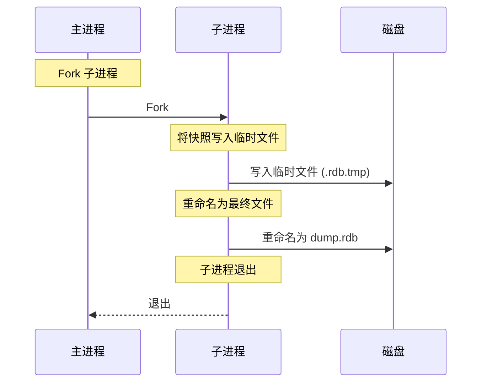
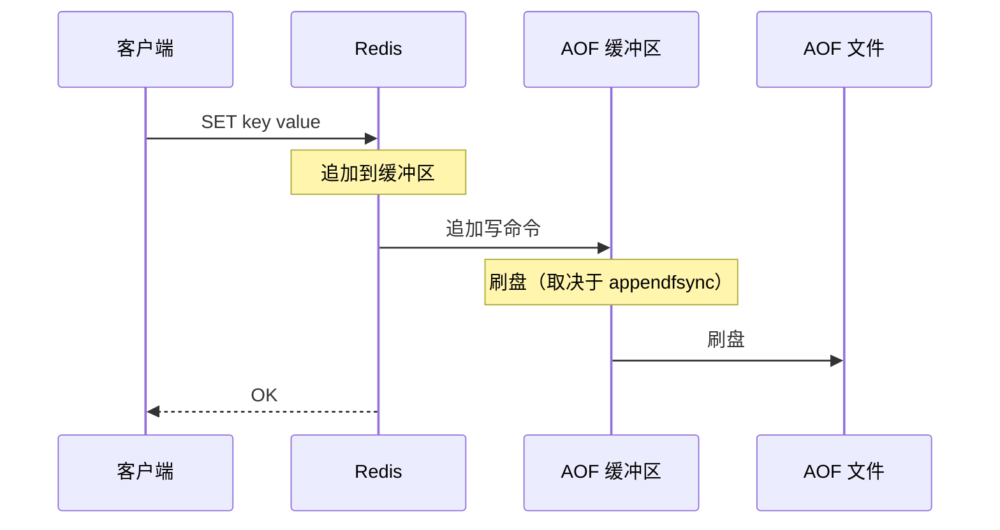
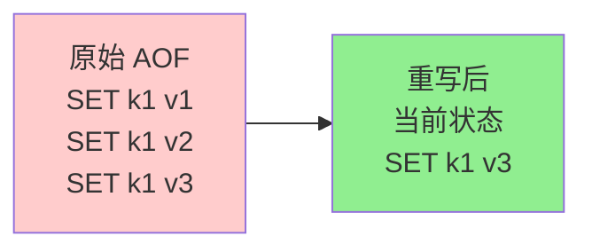

# 持久化

Redis 是内存数据库，但它提供持久化选项以在重启后保留数据。

## 为什么持久化很重要

- **数据持久性**：在断电、崩溃、重启后存活
- **备份和恢复**：时间点恢复
- **复制**：主节点使用持久化与从节点同步
- **权衡**：性能 vs 持久性

**实际影响**：
- 无持久化：重启后所有数据丢失（仅用于缓存）
- 仅 RDB：丢失上次快照以来的数据（几分钟到几小时）
- AOF：最多丢失 1 秒数据（使用 `appendfsync everysec` 时）

## RDB（Redis Database）

### 什么是 RDB？

**快照**：在指定间隔对 Redis 数据进行时间点快照。

**特点**：
- **紧凑**：某时间点数据的二进制表示
- **快速**：通过 fork 子进程写快照（最小化阻塞）
- **适合备份**：单文件，易于复制

### RDB 工作原理



**过程**：
1. Redis fork 子进程
2. 子进程将所有数据写入临时 `.rdb.tmp` 文件
3. 子进程将临时文件重命名为 `dump.rdb`（原子操作）
4. 子进程退出，主进程继续处理请求

**Fork 机制**：
- 写时复制（Copy-on-write）：子进程共享父进程的内存页
- 最小阻塞：Fork 耗时毫秒级（取决于内存大小）
- 额外内存：子进程在快照期间使用额外内存

### RDB 配置

```bash
# 在 M 秒内至少 N 个 key 变更时保存快照
save 900 1      # 900 秒（15 分钟）内至少 1 个 key 变更
save 300 10     # 300 秒（5 分钟）内至少 10 个 key 变更
save 60 10000   # 60 秒内至少 10000 个 key 变更

# 禁用 RDB（注释掉所有 save 行）
# save ""

# 快照文件名
dbfilename dump.rdb

# 快照目录
dir /var/lib/redis

# 压缩（默认 yes）
rdbcompression yes

# 快照失败时停止写入（默认 yes）
stop-writes-on-bgsave-error yes
```

### RDB 优缺点

| 优点 | 缺点 |
|------|------|
| 文件体积紧凑 | 上次快照后的数据丢失 |
| 恢复快速（加载文件）| 大数据集 Fork 消耗 CPU |
| 适合备份 | 不适合持久性关键数据 |
| 阻塞最小 | 快照间隔控制粒度 |

### 何时使用 RDB

- **备份**：用于灾难恢复的定期快照
- **纯缓存**：数据丢失可接受（从主数据库重建缓存）
- **读多写少**：写入不频繁，读取频繁

## AOF（Append Only File）

### 什么是 AOF？

**日志**：每次写操作都记录到文件中（仅追加）。

**特点**：
- **持久**：每次写入都记录（最小化数据丢失）
- **可读**：文本格式（Redis 协议格式）
- **可重写**：后台 AOF 重写以压缩文件

### AOF 工作原理



**配置：**
```bash
# 启用 AOF
appendonly yes

# AOF 文件名
appendfilename "appendonly.aof"

# fsync 策略
appendfsync everysec  # 默认：每秒刷盘（推荐）
# appendfsync always   # 每次写入都刷盘（最安全，最慢）
# appendfsync no      # 由操作系统决定（最快，最不安全）
```

**fsync 策略**：
- **always**：每次写入都刷盘（最安全，最慢）
- **everysec**：每秒刷盘（推荐，平衡安全性和性能）
- **no**：由操作系统决定何时刷盘（最快，可能丢失最多 30 秒数据）

### AOF 重写

**问题**：AOF 文件随每次写入不断增长（包含所有历史写入）

**解决方案**：后台重写以压缩文件



**重写过程**：
1. Redis fork 子进程
2. 子进程将当前数据集写入临时 AOF 文件（紧凑）
3. 父进程在缓冲区累积新的写入
4. 子进程将父进程的写入追加到临时文件
5. 将临时文件重命名为 AOF 文件（原子操作）

**配置：**
```bash
# 文件大小增长 X% 时触发 AOF 重写
auto-aof-rewrite-percentage 100

# AOF 文件大小超过 X MB 时触发重写
auto-aof-rewrite-min-size 64mb
```

**手动重写：**
```bash
BGREWRITEAOF  # 后台重写
```

### AOF 优缺点

| 优点 | 缺点 |
|------|------|
| 持久（everysec 下最多丢 1 秒）| 文件比 RDB 大 |
| 可读（人类可读的 Redis 命令）| 恢复较慢（重放命令）|
| 精细控制（appendfsync）| 重写消耗 CPU |

### 何时使用 AOF

- **持久性关键**：金融数据、用户交易
- **审计追踪**：每次写入都有记录
- **恢复**：最小化崩溃时的数据丢失

## RDB vs AOF 对比

| 特性 | RDB | AOF |
|------|-----|-----|
| **持久化方式** | 定时间点快照 | 每次写入都记录 |
| **文件大小** | 紧凑 | 较大 |
| **恢复速度** | 快（加载文件）| 慢（重放命令）|
| **数据丢失** | 几分钟到几小时 | 几秒（everysec）|
| **CPU 使用** | Fork 密集 | 重写密集 |
| **适用场景** | 备份、缓存 | 持久性、审计 |

## 组合持久化（推荐）

**Redis 4.0+**：同时使用 RDB 和 AOF

```bash
# 同时启用
appendonly yes
save 900 1
save 300 10
save 60 10000

# AOF 使用 RDB 前导以加速恢复
aof-use-rdb-preamble yes
```

**优势**：
- **快速恢复**：RDB 前导（基础快照）+ AOF 追加（增量）
- **持久性**：AOF 最小化数据丢失
- **备份**：RDB 用于定期备份

**恢复过程**：
1. 加载 RDB 前导（快速）
2. 重放 RDB 快照之后的 AOF 命令

## 选择持久化策略

### 纯缓存（无持久化）

```bash
# 同时禁用 RDB 和 AOF
save ""
appendonly no
```

**使用场景**：纯缓存（会话数据、临时数据）

**恢复方式**：从主数据库（MySQL、PostgreSQL）重建缓存

### 仅 RDB

```bash
# 启用 RDB
save 900 1
save 300 10
save 60 10000

# 禁用 AOF
appendonly no
```

**使用场景**：备份、读多写少、数据丢失可接受

### 仅 AOF

```bash
# 启用 AOF
appendonly yes
appendfsync everysec

# 禁用 RDB
save ""
```

**使用场景**：持久性关键（金融交易、审计日志）

### 组合（RDB + AOF）

```bash
# 同时启用
appendonly yes
aof-use-rdb-preamble yes
save 900 1
save 300 10
save 60 10000
```

**使用场景**：两者兼得（持久性 + 快速恢复）

## 复制与持久化

**主从复制**：
- **主节点**：可使用 RDB、AOF 或两者（用于持久化和部分同步）
- **从节点**：始终使用 RDB（用于初始同步和部分重新同步）

**复制链接：**
```bash
# 从节点配置
replicaof <master_ip> <master_port>

# 从节点持久化（可选）
save 900 1  # 从节点可以做快照
appendonly no  # 从节点通常禁用 AOF
```

## 监控持久化

```bash
# 检查持久化状态
INFO persistence

# 关键指标
# rdb_last_save_time: 上次 RDB 保存的时间戳
# aof_enabled: 1 表示 AOF 已启用
# aof_rewrite_in_progress: 1 表示重写正在进行
# aof_current_size: 当前 AOF 文件大小
# aof_base_size: 上次重写后的 AOF 文件大小
```

## 面试题

### Q1：RDB 和 AOF 有什么区别？

**答案**：RDB 是定时间点快照（紧凑、恢复快、可能丢数据）。AOF 记录每次写入（持久、文件大、恢复慢）。

### Q2：什么时候应该用 AOF 而不是 RDB？

**答案**：持久性关键的应用（金融数据、审计追踪），数据丢失不可接受。AOF 在 `appendfsync everysec` 下最多丢失 1 秒数据。

### Q3：什么是 AOF 重写？

**答案**：后台进程通过将当前数据集重写到临时文件来压缩 AOF 文件，替换原始文件。防止文件无限增长。

## 延伸阅读

- **[数据结构](../data-structures)** - 理解 Redis 中存储的数据
- **[集群](../cluster)** - 复制上下文中的持久化
- **[缓存模式](../caching-patterns)** - 持久化下的缓存失效
