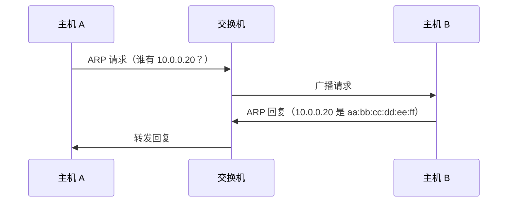
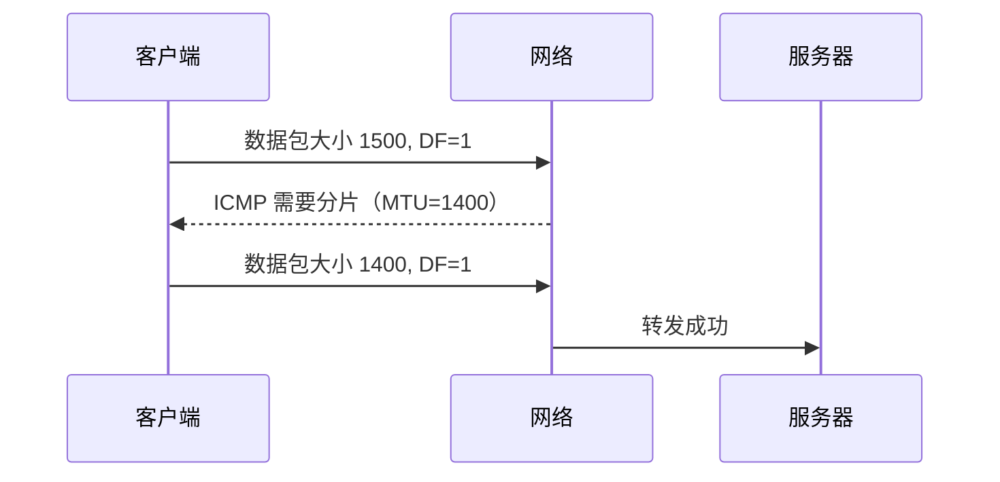

# 数据链路层

数据链路层负责在本地网段内实现节点到节点的数据传输。

## 为什么对后端系统重要

- ARP 故障可能表现为随机服务中断
- MTU 不匹配导致隐蔽的分片和重传
- VLAN 和二层隔离影响服务可达性

## MAC 地址 vs IP 地址

| 属性 | MAC 地址 | IP 地址 |
| --- | --- | --- |
| 范围 | 本地网段 | 可路由网络 |
| 层级 | 数据链路层 | 网络层 |
| 示例 | `00:1A:2B:3C:4D:5E` | `10.0.1.25` |

## ARP（地址解析协议）

ARP 在广播域内将 IP 映射为 MAC 地址。



常用命令：

```bash
ip neigh
arp -n
```

## 以太网帧基础

一个帧包括目的/源 MAC、可选的 VLAN 标签、EtherType、载荷和 FCS。

## MTU 和分片

MTU 定义了链路上可承载的最大三层载荷。

- 以太网默认通常为 1500 字节
- 封装（VPN/隧道）会减少有效 MTU
- 过大的数据包可能被分片或丢弃（设置了 DF 位时）

## MTU 路径发现 {#mtu-path-discovery}

路径 MTU 发现用于找到整条路径上的最小 MTU。



常用命令：

```bash
# Linux
ping -M do -s 1472 <target>

# 接口 MTU
ip link show
```

## VLAN 和广播域

- VLAN 隔离二层广播流量
- 不正确的 VLAN 标签可能导致单向流量或完全隔离

## 常见事故

### 症状：VPN 上间歇性超时

- 检查隧道开销和路径 MTU
- 捕获 ICMP fragmentation-needed 消息
- 在隧道边缘调整 MTU/MSS

### 症状：同一子网内主机不可达

- 验证 ARP 条目状态（`FAILED`、`STALE`、`REACHABLE`）
- 确认交换机/VLAN 配置和 MAC 学习

## 相关阅读

- [物理层](../physical-layer)
- [网络层](../network-layer)
- [故障排查概览](../troubleshooting)
- [MTU 问题](../troubleshooting/mtu-issues)
