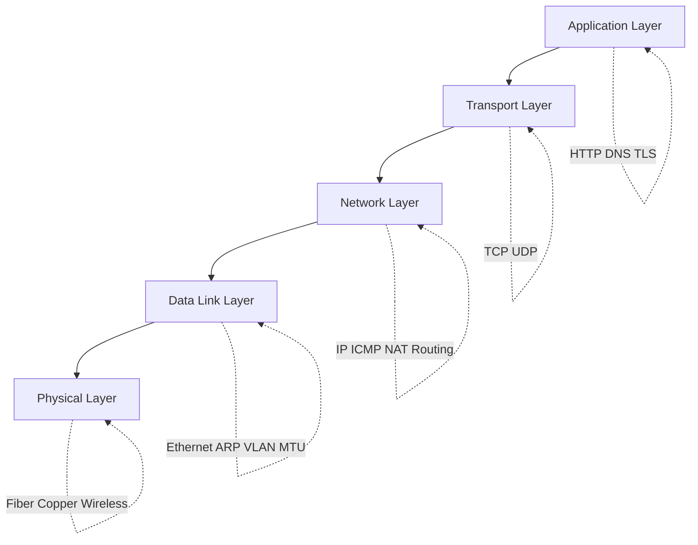
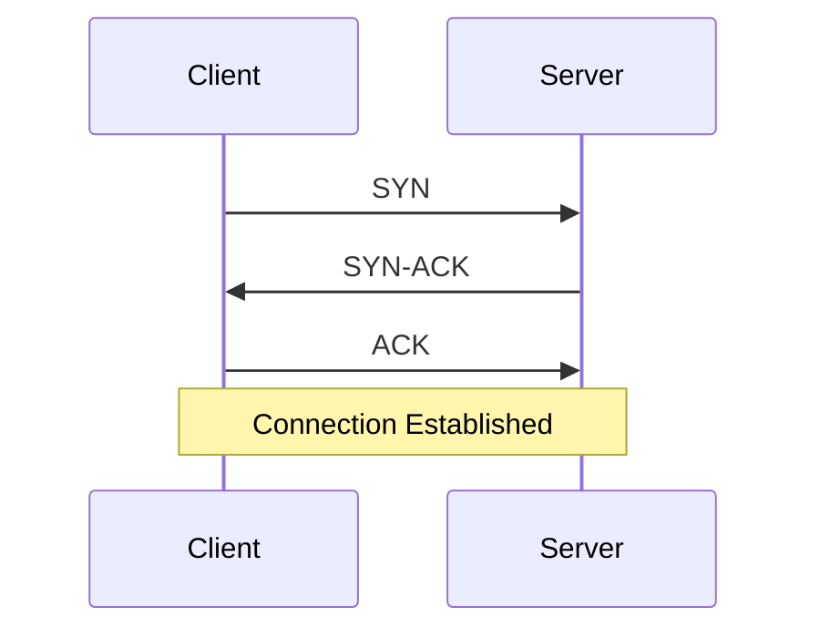

# 网络与操作系统

本节讲解后端工程师在实际故障排查中需要用到的网络和操作系统基础知识。

## 学习目标

完成本节后，你应该能够：

- 解释数据包从应用代码到网络硬件的完整流转过程。
- 排查常见生产故障：超时、连接重置、DNS 失败、MTU 问题。
- 熟练使用关键工具：`ss`、`tcpdump`、`traceroute`、`dig`、`strace`。
- 针对延迟和吞吐量选择实用的优化方案。

## TCP/IP 五层模型



## 三次握手（概览）



## 阅读路径

1. 从**物理层**开始，理解延迟和区域拓扑。
2. 进入**数据链路层**和**网络层**，学习 ARP、MTU、路由和 NAT。
3. 深入**传输层**，掌握 TCP 性能和可靠性。
4. 最后学习**应用层**和协议级别的故障排查。

## 核心章节

- [物理层](./physical-layer)
- [数据链路层](./data-link-layer)
- [网络层](./network-layer)
- [传输层](./transport-layer)
- [应用层](./application-layer)
- [故障排查概览](./troubleshooting)

## 专题指南

- [DNS 解析](./dns)
- [TLS 握手](./tls)
- [Linux 性能调优](./linux-performance)
- [容器网络](./container-networking)
- [网络性能优化](./network-performance)
- [网络安全基础](./network-security)
- [调试用系统调用](./syscalls)

## 常用工具速查

```bash
# 连通性和路径
ping -c 4 8.8.8.8
traceroute example.com

# DNS
dig +short example.com

# TCP 套接字
ss -tulpen

# 抓包
tcpdump -i any port 443 -nn
```

## 实践建议

- 先用最简单的命令复现问题。
- 确认故障属于 DNS、TCP、TLS 还是应用逻辑层面。
- 在修改配置前先收集证据。
