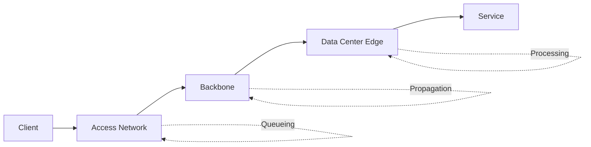

# 物理层

物理层通过铜缆、光纤和无线介质传输比特。后端工程师通常不直接管理线缆，但物理约束仍然决定着服务延迟和可靠性。

## 为什么后端工程师需要关注

- 区域选择直接影响 API 延迟。
- 跨区域复制性能受光速延迟约束。
- 底层丢包和抖动在上层表现为重试、超时和吞吐量崩溃。

## 传输介质

| 介质 | 典型距离 | 吞吐量 | 说明 |
| --- | --- | --- | --- |
| 铜缆以太网 | 短到中等 | 高 | 成本低，对电磁干扰更敏感 |
| 光纤 | 长 | 很高 | 延迟一致性更好 |
| 无线 | 不定 | 不定 | 抖动和干扰更大 |

## 带宽 vs 吞吐量

- **带宽**：理论最大线路速率。
- **吞吐量**：扣除协议开销、丢包和拥塞后的实际传输速率。

实际吞吐量总是低于带宽。

## 延迟构成

端到端延迟通常包括：

1. 传播延迟（距离）。
2. 序列化延迟（数据包大小 / 链路速率）。
3. 排队延迟（缓冲压力）。
4. 处理延迟（设备处理）。



## 区域和可用区规划

- 尽可能将延迟敏感路径保持在同一区域内。
- 多可用区用于高可用，而非跨洲低延迟。
- 多区域场景下，规划异步模式和冲突策略。

## 常用命令

```bash
# RTT 和丢包
ping -c 10 8.8.8.8

# 逐跳路径
traceroute api.example.com

# 综合丢包和延迟趋势
mtr -rw api.example.com
```

## 典型生产场景

### 场景 1：全球用户，单区域部署

症状：远距离地理区域用户报告首字节延迟高。

对策：

- 按地理位置测量 RTT。
- 增加区域边缘节点/CDN。
- 将读密集流量路由到最近的区域。

### 场景 2：跨区域数据库复制延迟

症状：写入高峰期复制延迟增大。

对策：

- 重新评估区域对之间的延迟预算。
- 尽可能批量写入。
- 重新审视同步 vs 异步复制需求。

## 检查清单

- 确认每个区域的目标延迟 SLO。
- 测量 p50/p95/p99 RTT，不仅看平均值。
- 同时跟踪丢包和抖动，而非只看吞吐量。
- 记录区域拓扑和故障切换路径。

## 相关阅读

- [数据链路层](../data-link-layer)
- [网络层](../network-layer)
- [网络性能优化](../network-performance)
