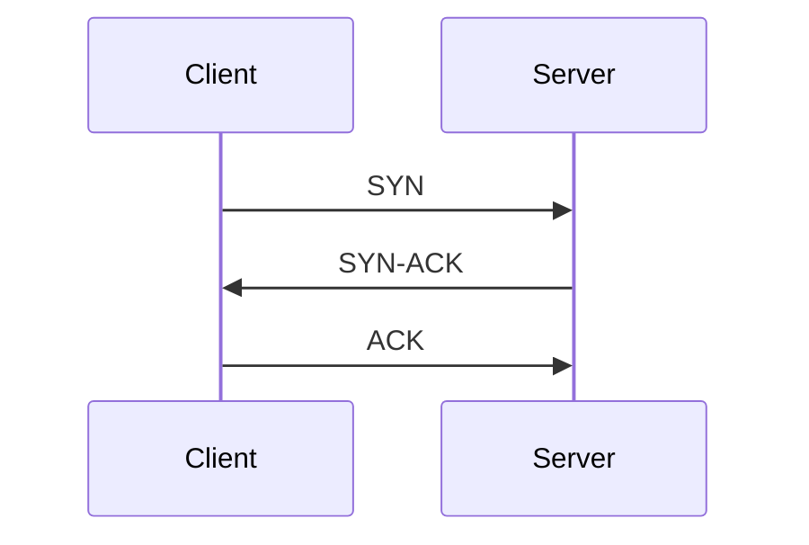
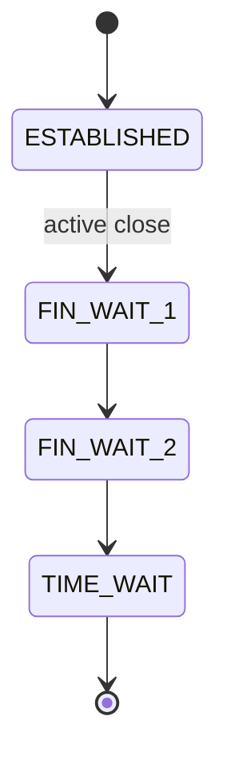

# 传输层

传输层是后端延迟和可靠性问题最常见的根因。

## 为什么重要

- 连接建立和拆除直接影响尾延迟。
- 不当的超时/重试策略会放大故障。
- 缓冲区和窗口调优控制高延迟链路上的吞吐量。

## TCP vs UDP

| 主题 | TCP | UDP |
| --- | --- | --- |
| 可靠性 | 有序且重传 | 尽力而为 |
| 连接 | 有状态 | 无连接 |
| 典型用途 | HTTP、数据库、RPC | DNS、流媒体、QUIC 传输 |

## TCP 三次握手



握手增加启动延迟。高 QPS 系统必须复用连接。

## 流量控制和拥塞控制

- **流量控制**保护接收方缓冲区。
- **拥塞控制**保护网络路径。

监控命令：

```bash
ss -ti
```

## 连接生命周期



高 `TIME_WAIT` 计数在短连接工作负载中是正常的，但仍可能耗尽临时端口。

## 实用调优方向

- Keep-alive 和连接池限制。
- 连接/读/写超时预算。
- 带幂等性和退避的重试策略。
- 仅在测量后调整内核套接字参数。

## 调试手册

```bash
# 套接字状态和队列大小
ss -tan state established,time-wait

# 数据包级视图
tcpdump -i any tcp port 443 -nn
```

## 常见事故

### 连接超时

- 按顺序检查路由/防火墙/监听端口。
- 验证调用方和被调用方的超时配置是否匹配。

### 连接重置

- 检查 RST 数据包和上游空闲超时。
- 验证 keep-alive 心跳和代理设置。

### 长 RTT 下吞吐量崩溃

- 验证窗口缩放和接收缓冲区。
- 按工作负载对比拥塞算法行为。

## 相关阅读

- [应用层 - HTTP](../application-layer#http)
- [应用层 - TLS](../application-layer#tls-ssl)
- [网络性能优化](../network-performance)
- [TCP 问题](../troubleshooting/tcp-issues)
