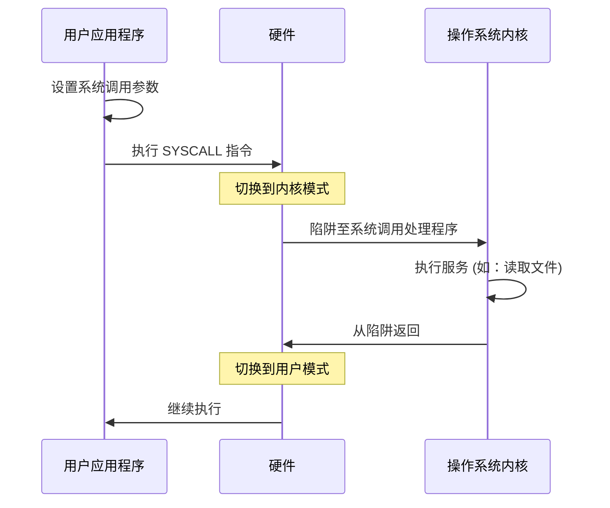

# 操作系统引论

操作系统 (Operating System, OS) 是管理计算机硬件并为计算机程序提供服务的软件。它作为用户应用程序与硬件之间的中介。

## 目标与功能

### 主要目标
1.  **方便性**：使计算机系统易于使用。
2.  **效率**：以高效的方式利用计算机硬件。
3.  **吞吐量**：最大化单位时间内完成的工作量。

### 核心功能
- **资源管理**：CPU、内存、存储和 I/O 设备。
- **进程管理**：创建、调度和终止进程。
- **内存管理**：内存空间的分配和保护。
- **文件系统管理**：在持久存储上组织数据。
- **I/O 设备管理**：处理硬件中断和驱动程序操作。
- **安全与保护**：确保系统完整性和数据隐私。

## 操作系统演进历史

操作系统的发展可以追溯到几个关键阶段：

1.  **批处理系统 (1950s)**：相似的任务被组合在一起并作为一个批次运行。执行期间没有用户交互。
2.  **分时系统 (1960s)**：多个用户通过终端同时与系统交互。CPU 在任务之间迅速切换。
3.  **个人计算 (1970s-80s)**：专注于个人用户的界面和响应性（例如 DOS、早期的 Windows/macOS）。
4.  **微内核与分布式系统 (1990s)**：最小化内核功能并实现跨网络机器的计算。
5.  **虚拟化与云 (2000s 至今)**：在同一硬件上运行多个操作系统实例（管理程序）和容器化。

## 操作系统结构

### 单体结构 (Monolithic Structure)
整个操作系统作为一个单一的大程序在内核模式下运行。所有服务共享相同的地址空间。
- **优点**：开销低，性能高。
- **缺点**：难以维护；一部分故障可能导致整个系统崩溃。
- **例子**：Linux、传统 Unix、MS-DOS。

### 微内核结构 (Microkernel Structure)
从内核中移除所有非核心组件，并将它们实现为系统级和用户级程序。
- **优点**：高可靠性和可扩展性。
- **缺点**：频繁的进程间通信 (IPC) 导致性能开销。
- **例子**：Mach、L4、QNX。

### 模块化与混合结构 (Modular & Hybrid Structure)
现代操作系统通常采用混合方法。核心是单体的以保证性能，但通过可加载内核模块 (LKM) 添加功能。
- **例子**：Windows NT、macOS (XNU 内核)。

## 用户模式与内核模式

现代处理器通过**执行模式**提供硬件支持，以保护操作系统免受用户程序的干扰。

- **用户模式 (User Mode)**：对硬件 and 内存的访问受限。应用程序运行在此模式。
- **内核模式 (Kernel Mode)**：不受限地访问所有硬件、CPU 指令和内存。操作系统核心运行在此模式。

### 模式位 (Mode Bit)
一个硬件标志位指示当前模式。某些“特权”指令只能在内核模式下执行。

## 系统调用 (System Calls)

系统调用提供了运行程序与操作系统之间的接口。它们是用户模式程序向内核请求服务的唯一方式。

### 系统调用机制 (陷阱/Trap)
1.  用户程序将参数放入寄存器/栈中。
2.  执行特殊指令（例如 `INT`、`SYSCALL`）。
3.  硬件切换到内核模式并跳转到预定义的陷阱处理程序。
4.  内核识别系统调用号并执行相应的例程。
5.  内核返回结果并切换回用户模式。

