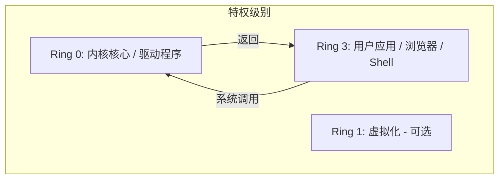

# 操作系统绪论：架构、引导与硬件交互

操作系统（Operating System, OS）是计算机系统中最关键的软件。它充当“大总管”的角色，将复杂的硬件原语抽象为应用程序清晰、逻辑化的接口，同时确保资源的效率、隔离性与安全性。

本章将深入探讨现代操作系统的基础结构，追踪其从简单的批处理程序到复杂的分布式和云原生内核的演进历程。

---

## 1. 操作系统的多重角色

要理解操作系统，必须从三个不同的视角来看待它：

### 1.1 资源管理器 (Resource Manager)
操作系统就像一个管理硬件资源的“官僚机构”：
- **CPU 调度**：决定哪个进程获得“大脑”的使用权以及使用多长时间。
- **内存分配**：为进程划分物理 RAM，同时防止它们越界。
- **I/O 管理**：管理异步硬件设备（磁盘、网卡、键盘）的混乱世界。
- **能量管理**：动态调整 CPU 频率（P-states）并让外设进入休眠以节省电力。

### 1.2 抽象层 (Abstraction Layer / 扩展机)
操作系统隐藏了硬件“丑陋”的真相：
- 应用程序看到的不是向旋转磁碟写入原始扇区，而是**文件系统**。
- 应用程序看到的不是管理以太网线上的物理电压，而是**套接字 (Socket)**。
- 应用程序看到的不是管理物理 RAM 地址，而是**虚拟地址空间**。

### 1.3 安全卫士 (Security Guard / 隔离与保护)
在多用户、多任务环境中，操作系统确保：
- **进程隔离**：进程 A 不能读取或写入进程 B 的内存。
- **权限分离**：用户应用程序不能执行会导致硬件崩溃的指令。
- **访问控制**：用户只能访问其被授权查看的文件。

---

## 2. 历史演进：从真空管到容器

了解操作系统的发展史，可以解释为什么现代内核会设计成现在的样子。

### 2.1 第一代 (1945–1955)：真空管与插接板
像 ENIAC 这样的计算机没有操作系统。编程是通过手动插接电缆完成的。单个“作业”拥有整台机器。
- **瓶颈**：设置时间超过了执行时间。

### 2.2 第二代 (1955–1965)：晶体管与批处理系统
引入了**批处理系统 (Batch System)**。程序员将代码写在纸上，打成穿孔卡片，然后交给操作员。
- **常驻监控程序 (Resident Monitor)**：一个留在内存中的原始 OS，用于自动加载下一个作业。
- **中断的引入**：IBM 7090 引入了 I/O 信号通知 CPU 的能力，结束了纯忙等 (Busy-waiting) 时代。

### 2.3 第三代 (1965–1980)：集成电路与多道程序设计
IBM System/360 时代。**多道程序设计 (Multiprogramming)** 诞生。
- **问题**：I/O 很慢。如果一个作业在等待磁带，CPU 就会闲置。
- **解决方案**：在内存中保留多个作业。当作业 A 等待 I/O 时，将 CPU 切换到作业 B。
- **分时系统 (Time-Sharing, CTSS/Unix)**：给每个用户一个时间片，营造出专用机器的错觉。

### 2.4 第四代 (1980–至今)：大规模集成电路、个人电脑与网络
微处理器的兴起。
- **个人操作系统**：CP/M, MS-DOS, 早期 Windows。最初关注的是 UI 而非保护机制。
- **现代时代**：类 Unix 系统（Linux, macOS）和 Windows NT 趋向于高稳定性、多用户、网络化的架构。

---

## 3. 操作系统架构

内核的内部结构决定了其性能、可靠性与安全性。

### 3.1 单体内核 (Monolithic Kernels, 如 Linux, FreeBSD, 传统 Unix)
整个操作系统（调度器、文件系统、网络、驱动程序）都在**内核模式**下的一个大型地址空间中运行。
- **性能**：极高。组件间的通信通过简单的函数调用完成。
- **复杂性**：难以维护。显卡驱动的一个 bug 就能导致整个内核崩溃（Panic/蓝屏）。
- **现代缓解方案**：可加载内核模块 (LKMs) 允许在运行时加载/卸载内核部分功能。

### 3.2 微内核 (Microkernels, 如 L4, Mach, QNX, Minix)
内核中只保留最基本的功能：地址空间管理、线程调度和进程间通信 (IPC)。
- **哲学**：将其他所有功能（文件系统、驱动、网络栈）移至**用户空间**，作为独立的进程运行。
- **可靠性**：如果文件系统崩溃，内核仍保持运行。只需重启文件系统服务即可。
- **性能权衡**：频繁的上下文切换和 IPC 开销。

### 3.3 混合内核 (Hybrid Kernels, 如 Windows NT, macOS/XNU)
折中方案。结构上看起来像微内核（分为多个服务），但为了性能，大多数“服务”运行在内核空间。

### 3.4 外内核 (Exo-kernels) 与 库操作系统 (Unikernels)
- **外内核**：给予应用程序直接访问硬件资源的权利，实现极简抽象，允许应用实现专门的文件系统或网络栈。
- **库操作系统**：将应用程序及其所需的 OS 组件编译成一个可引导的二进制文件。在云原生/无服务器环境中因极小体积而流行。

---

## 4. 引导流程剖析 (从上电到 Init)

当你按下电源键后的头几秒钟发生了什么？

### 4.1 第一阶段：硬件初始化 (BIOS/UEFI)
1. **POST (上电自检)**：硬件自我检查（RAM, CPU, 基础 I/O）。
2. **UEFI (统一可扩展固件接口)**：现代 BIOS 的替代者。它本身就是一个微型 OS，能识别 GPT 分区和文件系统 (FAT32)。
3. **执行**：UEFI 读取**启动顺序**并查找 **EFI 系统分区 (ESP)**。

### 4.2 第二阶段：引导加载程序 (GRUB/LILO/Windows Boot Manager)
引导程序的任务是在磁盘上找到内核，将其加载到 RAM，并跳转到其入口点。
- **GRUB Stage 1**：位于 MBR（446 字节）。其唯一任务是加载 Stage 2。
- **GRUB Stage 2**：识别文件系统。读取 `/boot/grub/grub.cfg`，显示菜单并加载 `vmlinuz`（压缩的内核映像）。

### 4.3 第三阶段：内核初始化
1. **解压缩**：内核在 RAM 中自我解压。
2. **架构设置**：探测 CPU 特性，初始化 MMU（内存管理单元），建立临时页表。
3. **子系统初始化**：初始化调度器、内存管理器（伙伴系统/Slab）和 VFS。
4. **挂载根目录**：内核挂载根文件系统（通常使用 `initrd` 或 `initramfs` 作为临时桥梁）。

### 4.4 第四阶段：用户空间的诞生 (`init` 进程)
内核催生第一个用户空间进程，通常是 `/sbin/init` (PID 1)。
- 在现代 Linux 中，这就是 **systemd**。
- systemd 随后启动所有其他后台服务（守护进程）、图形界面和登录提示。

---

## 5. 硬件特权级：保护环 (Protection Rings)

为了防止有 bug 的程序覆盖内核，CPU 提供了硬件强制的保护级别。

### 5.1 x86-64 保护环
- **Ring 0 (内核模式)**：完全控制。可以执行任何指令并访问任何内存地址。
- **Ring 3 (用户模式)**：受限。不能执行 I/O 指令 (`IN`/`OUT`)、修改页表或禁用中断。
- **Ring 1 & 2**：历史上打算给驱动程序使用，但现代 OS 极少使用。

### 5.2 环间转换
Ring 3 程序如何获取 Ring 0 服务？它不能直接跳转到内核函数。
- **机制**：程序必须触发异常（软件中断）或使用 `SYSCALL` 指令。
- **控制**：硬件跳转到内核中**预定义好的地址**，确保用户不能执行任意内核代码。

---

## 6. 中断：操作系统的脉搏

操作系统是**事件驱动**的。它大部分时间都在待命，直到中断发生。

### 6.1 中断类型
1. **硬件中断 (异步)**：由外部设备生成（如网卡收到了数据包）。
2. **异常 (同步)**：由于错误条件由 CPU 生成（如除以零、缺页中断）。
3. **软件中断 (Traps)**：由代码故意触发（如用于系统调用的 `INT 0x80`）。

### 6.2 中断生命周期
1. **中断信号**：硬件拉高中断控制器 (APIC) 的线条。
2. **CPU 暂停**：CPU 完成当前指令。
3. **上下文保存**：CPU 自动将当前的程序计数器 (PC) 和寄存器保存到**内核栈**中。
4. **IDT 查找**：CPU 在**中断描述符表 (IDT)** 中查找向量，以找到**中断服务例程 (ISR)** 的地址。
5. **执行**：ISR 运行（上半部）。
6. **IRET**：`IRET` (中断返回) 指令恢复上下文并将 CPU 返回到之前的任务。

---

## 7. 系统调用：通往内核的桥梁

系统调用是内核提供的 API。典型的操作系统提供 300–500 个系统调用。

### 7.1 常见类别
- **进程控制**：`fork()`, `execve()`, `exit()`, `wait()`。
- **文件管理**：`open()`, `read()`, `write()`, `close()`, `lseek()`。
- **设备管理**：`ioctl()`, `read()`, `write()`。
- **信息维护**：`getpid()`, `time()`。
- **通信**：`pipe()`, `shmget()`, `mmap()`。

### 7.2 系统调用剖析 (Linux x86-64)
1. **库封装**：用户调用 C 库 (glibc) 中的 `read()`。
2. **准备**：glibc 将系统调用号（如 `read` 为 0）放入 `rax` 寄存器，参数放入 `rdi`, `rsi`, `rdx`。
3. **切换**：glibc 执行 `SYSCALL` 指令。
4. **内核模式**：CPU 跳转到内核中的 `entry_SYSCALL_64` 处理程序。
5. **分发**：内核使用**系统调用表**（函数指针数组）调用实际函数 `sys_read`。
6. **返回**：内核将结果放入 `rax` 并执行 `SYSRET`。

---

## 8. 标准与 API：POSIX

为了确保软件能在不同 OS 上运行，创建了 **POSIX (可移植操作系统接口)** 标准。

- **目标**：如果你使用 POSIX 调用（如 `open`, `fork`）编写程序，它应该能在 Linux, macOS, FreeBSD 上编译运行，且只需极小改动。
- **Windows 合规性**：Windows 原生不完全兼容 POSIX，但提供了兼容层 (WSL - 适用于 Linux 的 Windows 子系统)，将 Linux 系统调用映射到 Windows 内核。

---

## 9. 现代趋势：操作系统的未来

### 9.1 内核中的 Rust
内存安全漏洞（缓冲区溢出、释放后使用）占安全漏洞的 ~70%。Linux 内核已开始集成 **Rust**，为驱动程序提供内存安全的抽象。

### 9.2 eBPF：可编程内核
**eBPF** 允许开发者在不重新编译内核的情况下，在运行时向内核注入微型程序，以执行高性能网络、安全监控和分析。

### 9.3 云原生操作系统
内核正在针对容器密度进行优化。**KVM** 和 **Firecracker** (微型 VM) 等技术模糊了传统虚拟化与容器之间的界限。

---

## 10. 核心概念复习清单

| 概念 | 描述 | 为什么重要 |
| :--- | :--- | :--- |
| **单体内核** | 所有功能都在一个内核空间 | 快但脆弱 |
| **微内核** | 内核只保留极简服务 | 稳定且模块化 |
| **Traps** | 软件生成的中断 | 系统调用的核心 |
| **IDT** | 中断处理程序表 | 硬件事件的跳转表 |
| **Ring 0** | 最高特权 CPU 模式 | 内核所在地 |
| **用户空间** | Ring 3 受限区域 | 浏览器/Shell 所在地 |
| **Init (PID 1)** | 第一个用户进程 | 所有进程的父进程 |
| **VFS** | 虚拟文件系统 | 磁盘/套接字的统一抽象 |

---

*第 01 章结束。接下来的旅程：[第 02 章：进程管理](/docs/cs/os/process-management)。*
