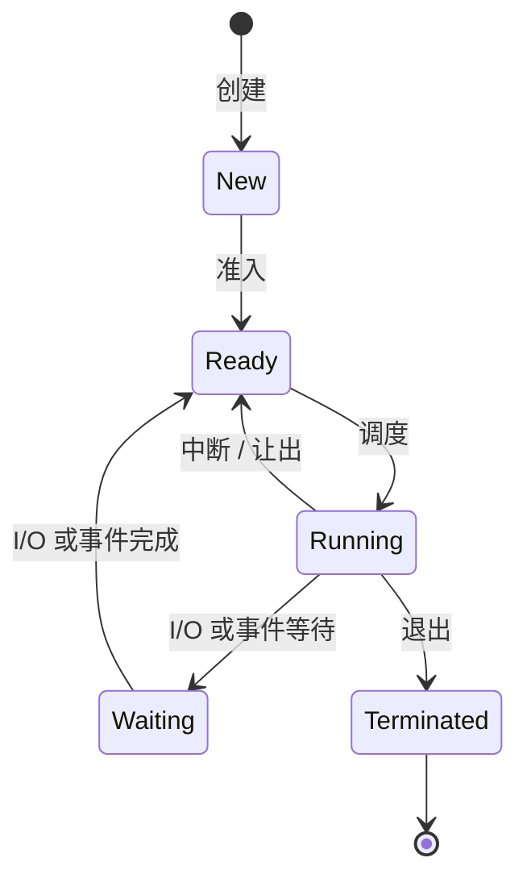

# 进程管理

**进程** (Process) 是程序的动态执行过程。程序是磁盘上的静态指令集，而进程是动态的，拥有自己的状态、内存空间和系统资源。

## 程序与进程

| 程序 (Program) | 进程 (Process) |
| :--- | :--- |
| 磁盘上的静态文件（可执行文件） | 程序的一个活动的、正在运行的实例 |
| 被动实体 | 主动实体 |
| 存在于存储器中 | 存在于内存 (RAM) 中 |
| 可以产生多个进程 | 执行的一个实例 |

## 进程状态

进程在其生命周期中会在各种状态之间转换。

- **创建 (New)**：进程正在被创建。
- **就绪 (Ready)**：等待被分配给处理器。
- **运行 (Running)**：指令正在执行。
- **等待/阻塞 (Waiting/Blocked)**：等待某个事件发生（如 I/O 完成）。
- **终止 (Terminated)**：执行结束。

## 进程控制块 (PCB)

操作系统为每个进程维护一个名为 PCB 的数据结构。它存储了管理和恢复进程所需的所有信息。

- **进程标识符 (PID)**：唯一标识符。
- **进程状态**：当前状态（就绪、运行等）。
- **程序计数器 (PC)**：下一条要执行指令的地址。
- **CPU 寄存器**：CPU 寄存器的值（在上下文切换期间恢复）。
- **内存信息**：页表、分段限制。
- **打开文件**：打开的文件描述符列表。
- **优先级**：用于 CPU 调度。

## 上下文切换 (Context Switch)

**上下文切换**是保存当前正在运行进程的状态并恢复下一个要执行进程的状态的过程。

1.  将 CPU 寄存器和 PC 保存到当前进程的 PCB 中。
2.  更新当前进程的状态（例如，从运行态到就绪态）。
3.  从就绪队列中选择一个新进程。
4.  从新进程的 PCB 中加载寄存器和 PC。
5.  硬件开始执行新 PC 指向的指令。

> **注意**：上下文切换是有开销的；在此期间，用户应用程序没有进行任何有用的工作。

## CPU 调度算法

CPU 调度程序决定就绪队列中的哪个进程应该下一个运行。

### 先来先服务 (FCFS)
进程按照到达的顺序执行。
- **优点**：实现简单。
- **缺点**：“护送效应” (Convoy Effect) —— 长进程会延迟短进程。

### 短作业优先 (SJF)
下一个 CPU 执行时间最短的进程优先调度。
- **优点**：最小化平均等待时间。
- **缺点**：难以预测未来的执行时间；可能导致长进程饥饿。

### 轮转调度 (RR)
每个进程被分配一个小的单位时间（时间片/Time Quantum）。如果进程未完成，它将被移到队列末尾。
- **优点**：公平；适用于分时系统。
- **缺点**：时间片大小的选择至关重要（太小 = 过度的上下文切换，太大 = FCFS）。

### 多级反馈队列 (MLFQ)
进程根据其行为（CPU 密集型 vs. I/O 密集型）在多个队列之间移动。
- **优点**：动态调整以适应进程需求；优先处理交互式任务。

## 进程间通信 (IPC)

进程经常需要相互通信。由于进程是相互隔离的，它们使用由内核调节的 IPC 机制。

- **管道 (Pipe)**：单向数据流（父进程到子进程）。
- **消息队列 (Message Queue)**：存储在内核中的离散消息。
- **共享内存 (Shared Memory)**：映射到多个进程地址空间的内存区域。（最快，但需要同步）。
- **信号 (Signal)**：异步通知（例如 `SIGKILL`、`SIGINT`）。
- **套接字 (Socket)**：同一机器或网络上进程之间的通信。
