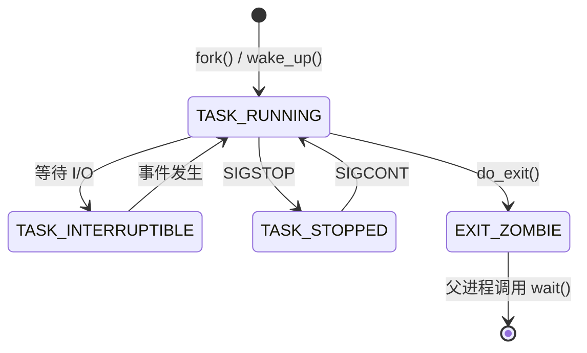

# 进程管理：从任务结构到高级调度

**进程 (Process)** 是操作系统中工作的基本单位。如果说“程序”是存储在磁盘上的指令的被动集合，那么“进程”就是这些指令的活动执行，它涵盖了内存状态、CPU 寄存器值、打开的文件以及安全上下文。

本章探讨现代内核如何管理数以千计的并发进程，确保 CPU 的公平分配，并提供任务间的隔离。

---

## 1. 进程剖析

在 Linux 内核中，进程（或线程）由一个庞大的数据结构表示，称为**进程控制块 (PCB)**。具体到 Linux，这个结构就是 `struct task_struct`。

### 1.1 `task_struct` (Linux 内核)
位于 `<linux/sched.h>` 中，该结构包含内核管理进程所需的所有信息：
- **状态 (State)**：当前执行状态（运行中、睡眠、僵尸）。
- **PID & TGID**：进程 ID 和 线程组 ID。
- **任务列表**：指向前一个和后一个任务的指针（双向循环链表）。
- **内存描述符 (`struct mm_struct`)**：指向页表和内存段的指针。
- **文件描述符表 (`struct files_struct`)**：所有打开的文件和套接字的列表。
- **信号处理程序**：进程如何响应 `SIGINT` 等信号。
- **CPU 亲和性**：允许进程运行在哪些 CPU 核心上。
- **命名空间 (Namespaces)**：容器特定的隔离（PID, 网络, 挂载）。

### 1.2 进程内存布局
当进程加载到内存中时，OS 将其虚拟地址空间组织为几个段：

| 段 | 内容 | 权限 |
| :--- | :--- | :--- |
| **代码段 (Text)** | 编译后的机器码指令 | 只读、可执行 |
| **数据段 (Data)** | 已初始化的全局和静态变量 | 读/写 |
| **BSS 段** | 未初始化的全局变量（初始化为零） | 读/写 |
| **堆 (Heap)** | 动态分配的内存 (`malloc`, `new`) | 读/写 (向上增长) |
| **栈 (Stack)** | 局部变量、函数参数、返回地址 | 读/写 (向下增长) |

---

## 2. 进程生命周期与状态转换

进程是动态的。它们根据自身需求和内核的决策在不同状态之间移动。

### 2.1 Linux 进程状态
- **TASK_RUNNING (R)**：进程正在使用 CPU，或者在“就绪”队列中等待轮到自己。
- **TASK_INTERRUPTIBLE (S)**：睡眠状态。等待某个事件（如 I/O 完成或信号）。
- **TASK_UNINTERRUPTIBLE (D)**：深度睡眠。通常在等待磁盘 I/O。它不能被信号唤醒（即使是 `kill -9`）。
- **TASK_STOPPED (T)**：被调试器或 `SIGSTOP` 等信号暂停。
- **EXIT_ZOMBIE (Z)**：进程已结束，但其父进程尚未读取其退出状态。
- **EXIT_DEAD (X)**：在条目从任务列表中移除之前的最终状态。

### 2.2 状态转换图

---

## 3. 创建与管理进程

在类 Unix 系统中，进程创建遵循独特的 `fork-exec` 模式。

### 3.1 `fork()` 系统调用
`fork()` 创建父进程的一个近乎完美的副本。
- **写时复制 (Copy-on-Write, COW)**：为了优化性能，内核不会立即复制父进程的内存。它共享物理页面，只有当其中一个进程尝试写入页面时才进行复制。
- **返回值**：
  - 子进程中返回 `0`。
  - 父进程中返回子进程的 PID。

### 3.2 `execve()` 系统调用
`execve()` 用一个新程序替换当前进程的内存（代码、数据、堆、栈）。PID 保持不变。

### 3.3 `clone()` 系统调用 (Linux 特有)
`clone()` 是 `fork()` 和 `pthread_create()` 背后的底层调用。它允许精细控制父子进程之间共享的内容（内存、文件描述符、信号）。这就是 Linux 实现线程的方式——将其视为“轻量级进程”。

---

## 4. CPU 调度：完全公平调度器 (CFS)

调度程序的任务是决定哪个 `TASK_RUNNING` 进程获得下一个 CPU 时间片。现代 Linux 使用 **完全公平调度器 (Completely Fair Scheduler, CFS)**。

### 4.1 核心哲学
CFS 旨在随着时间的推移为每个进程提供平等的 CPU 份额。它模拟了一个“完美的多任务 CPU”，其中 $N$ 个进程各获得 $1/N$ 的 CPU 功率。

### 4.2 关键机制：虚拟运行时间 (`vruntime`)
每个进程都有一个 `vruntime` 变量。
- 当进程运行时，其 `vruntime` 增加。
- 调度程序总是选择 `vruntime` **最低**的进程来运行。
- **权重**：优先级更高（"nice" 值更低）的进程，其 `vruntime` 增加得更慢，从而允许它们获得更多的实际 CPU 时间。

### 4.3 数据结构：红黑树 (Red-Black Tree)
CFS 不使用简单的队列，而是将就绪进程存储在**红黑树**中（一种自平衡二叉搜索树），按 `vruntime` 排序。
- **查找复杂度**：$O(\log N)$，用于找到最低的 `vruntime`。
- **插入复杂度**：$O(\log N)$，用于在进程运行结束后重新插入。

### 4.4 实时调度
对于需要严格时序的任务（如音频处理、工业控制），Linux 提供：
- **SCHED_FIFO**：一直运行直到完成或被阻塞。
- **SCHED_RR**：同一优先级内的轮转调度。
- **SCHED_DEADLINE**：使用最早截止时间优先 (EDF) 算法。

---

## 5. 进程间通信 (IPC) 深度解析

由于进程是隔离的，它们需要显式的机制来交换数据。

### 5.1 管道 (Pipes) 与 FIFO
- **匿名管道**：通过 `pipe()` 创建。用于父子进程通信。受内核缓冲区限制（通常为 64KB）。
- **有名管道 (FIFOs)**：作为文件出现在文件系统中 (`mkfifo`)。允许无关进程通信。

### 5.2 共享内存 (`shmget`, `mmap`)
最快的 IPC 形式。两个进程将相同的物理内存页面映射到它们各自的虚拟地址空间。
- **挑战**：需要同步机制（如信号量）来防止竞态条件。

### 5.3 Unix 域套接字 (Unix Domain Sockets)
类似于网络套接字，但针对本地通信进行了优化。它们支持在进程间传递**文件描述符**。

### 5.4 信号 (Signals)：异步通知
信号是基于整数的小型警报。
- **可靠 vs 不可靠**：现代 Linux 信号是排队的（实时信号），而传统信号如果发送太快可能会丢失。

---

## 6. 现代隔离技术：命名空间与控制组

这是 **容器化** (Docker, Kubernetes) 的基石。

### 6.1 命名空间 (Namespaces - “你能看到什么”)
命名空间将全局系统资源包装在一个抽象中，使进程看起来拥有自己的隔离实例。
- **PID 命名空间**：进程看到的自己 PID 为 1。
- **网络命名空间**：隔离的网络接口和路由表。
- **挂载命名空间**：私有挂载点。
- **用户命名空间**：容器内的 root 在容器外是一个非特权用户。

### 6.2 控制组 (Cgroups - “你能用多少”)
控制组限制、统计并隔离一组进程的资源使用（CPU, 内存, 磁盘 I/O, 网络）。
- **Cgroups v2**：现代实现，具有统一的层级结构和更好的资源控制逻辑。

---

## 7. 故障排除与可观测性

作为开发人员或 SRE，你必须知道如何观察进程行为。

| 工具 | 用途 | 关键指标 |
| :--- | :--- | :--- |
| `top` / `htop` | 实时概览 | 每个进程的 CPU/内存占用 |
| `ps aux` | 静态快照 | 进程状态与所有者 |
| `strace` | 跟踪系统调用 | 进程阻塞在哪里？ |
| `lsof` | 列出打开文件 | 持有哪些文件/套接字？ |
| `pstack` | 打印堆栈跟踪 | 线程当前正在执行什么？ |
| `kill` | 发送信号 | 终止或暂停任务 |

---

## 8. 核心概念复习清单

- [ ] `fork()`、`vfork()` 和 `clone()` 之间的区别。
- [ ] `vruntime` 如何决定 CFS 中的下一个进程。
- [ ] “等待-退出”流程：如何防止僵尸进程堆积。
- [ ] 命名空间如何实现容器隔离。
- [ ] IPC 选择：何时使用共享内存 vs 套接字。

---

*第 02 章结束。继续前往：[第 03 章：线程与并发](/docs/cs/os/threads-concurrency)。*
