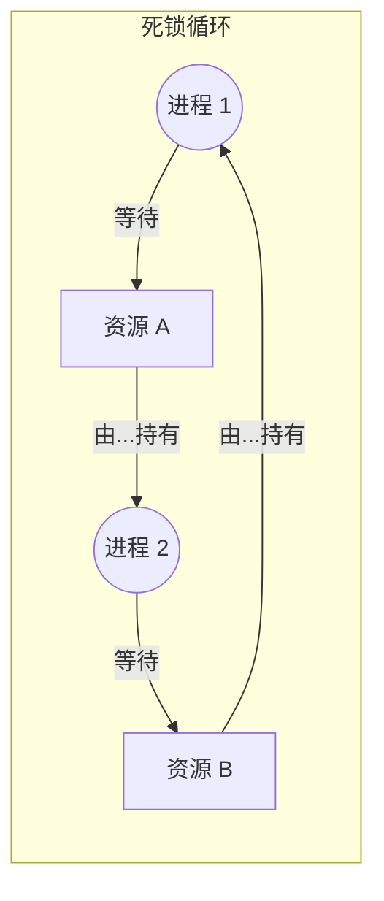

# 线程与并发

并发 (Concurrency) 是同时执行多个任务的能力。虽然进程提供了高度的隔离，但**线程** (Thread) 允许在单个地址空间内实现轻量级的并行。

## 线程与进程

进程是资源的容器，而线程是执行的单位。

| 特性 | 进程 (Process) | 线程 (Thread) |
| :--- | :--- | :--- |
| **内存** | 独立的地址空间 | 与同级线程共享地址空间 |
| **通信** | IPC（由内核协调） | 直接访问共享变量 |
| **创建成本** | 高（内存、文件描述符等） | 低（仅需栈、寄存器） |
| **切换成本** | 高（刷新 TLB、更换 MMU 状态） | 低（上下文保留在同一进程中） |
| **隔离性** | 高（一个崩溃不会影响其他进程） | 低（一个崩溃可能导致整个进程结束） |

## 线程模型

现代操作系统支持两类线程：

- **用户线程 (User Threads)**：由库（如 Pthreads）管理，内核不可知。
- **内核线程 (Kernel Threads)**：由操作系统直接管理和调度。

### 多线程模型
- **多对一 (Many-to-One)**：所有用户线程映射到一个内核线程。（如果一个线程等待 I/O，所有线程都会阻塞）。
- **一对一 (One-to-One)**：每个用户线程映射到自己的内核线程。（Linux 和 Windows 采用此模型）。
- **多对多 (Many-to-Many)**：一个用户线程池映射到一个内核线程池。

## 并发问题

### 临界区 (Critical Section)
访问共享资源（如全局变量）的代码块。一次只能有一个线程在临界区内执行。

### 竞态条件 (Race Condition)
结果取决于多个线程的相对时间或交错执行。这发生在两个或多个线程在没有适当同步的情况下访问共享数据时。

### 死锁 (Deadlock)
两个或多个线程永久阻塞，每个都在等待另一个持有的资源。

## 同步原语 (Synchronization Primitives)

操作系统和硬件提供工具来协调对共享资源的访问。

- **互斥锁 (Mutex - Mutual Exclusion)**：一种简单的二进制锁。一次只能有一个线程持有。
- **信号量 (Semaphore)**：基于计数器的锁。如果计数 > 0，则允许访问。可用于资源计数。
- **条件变量 (Condition Variable)**：允许线程等待直到满足特定的逻辑条件。
- **自旋锁 (Spinlock)**：线程“忙等”（在循环中自旋）直到锁可用的锁。适用于内核代码中的短时间等待。

## 死锁问题

### 必要条件 (Coffman Conditions)
死锁发生必须同时满足以下四个条件：
1.  **互斥 (Mutual Exclusion)**：资源不可共享。
2.  **持有并等待 (Hold and Wait)**：线程持有一个资源并等待另一个资源。
3.  **不可抢占 (No Preemption)**：不能强行夺走资源。
4.  **循环等待 (Circular Wait)**：一组线程陷入循环等待。

### 死锁管理
- **预防 (Prevention)**：构建系统使至少一个 Coffman 条件不可能成立（例如：强制资源排序）。
- **避免 (Avoidance)**：动态决定资源请求是否会导致不安全状态（例如：**银行家算法 (Banker's Algorithm)**）。
- **检测与恢复 (Detection & Recovery)**：允许死锁发生，检测它们（使用等待图），并打破循环（例如：终止一个进程或抢占资源）。

