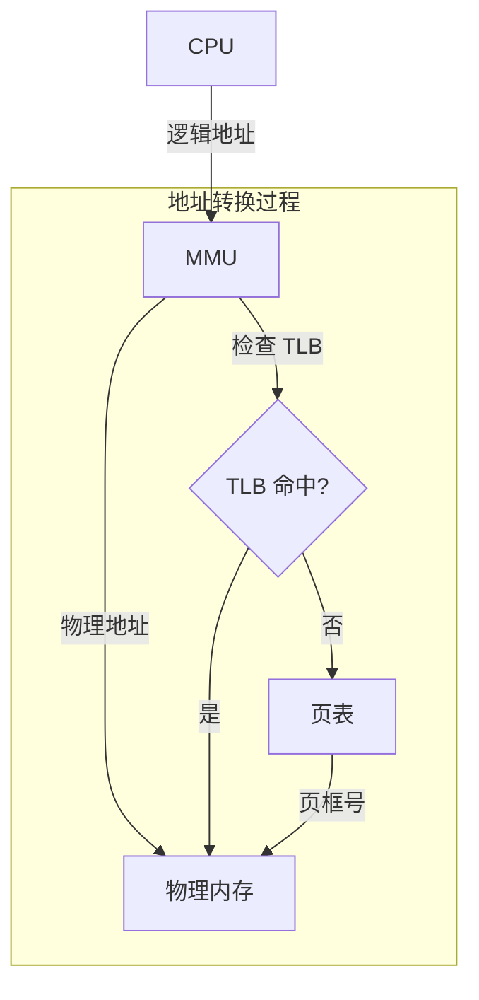

# 内存管理

内存管理的目的是为每个进程提供其私有的地址空间，并最大化物理内存 (RAM) 的利用率。

## 逻辑地址与物理地址

- **逻辑地址 (Logical Address)**：由 CPU 产生。程序使用这些地址。
- **物理地址 (Physical Address)**：RAM 硬件中的实际位置。

**MMU (内存管理单元)** 是一个硬件组件，负责将逻辑地址实时转换为物理地址。

## 地址转换技术

### 分段 (Segmentation)
内存被划分为大小可变的段（例如：代码段、数据段、栈段）。
- **优点**：符合程序员对程序的理解。
- **缺点**：产生**外部碎片 (External Fragmentation)**（细碎且不连续的空闲内存）。

### 分页 (Paging)
物理内存被划分为固定大小的块，称为**页框 (Frames)**。逻辑内存被划分为同样大小的块，称为**页 (Pages)**。
- **优点**：消除外部碎片；允许非连续的内存分配。
- **缺点**：产生**内部碎片 (Internal Fragmentation)**（最后一页/页框内未使用的空间）。

### 页表 (Page Table)
内核中的一种数据结构，由 MMU 使用，存储从页号到页框号的映射。
- **TLB (转换后备缓冲区)**：一种硬件缓存，存储最近使用的页到页框的转换结果，以加速内存访问。

## 虚拟内存 (Virtual Memory)

虚拟内存允许进程在仅有一部分处于物理内存中时也能执行。

- **请求分页 (Demand Paging)**：仅在访问页时才将其加载到内存中。
- **缺页中断 (Page Fault)**：当进程访问当前不在内存中的页时触发的硬件异常。内核随后从磁盘（交换区/Swap area）获取该页。

## 页面置换算法

当内存已满且需要加载新页时，操作系统必须选择一个页面进行置换。

- **FIFO (先进先出)**：最简单，但容易出现 **Belady 异常**（分配更多页框反而导致更多缺页中断）。
- **LRU (最近最少使用)**：置换最长时间未被访问的页。通常很高效，但难以在硬件中完美实现。
- **时钟算法 (Clock/Second-Chance)**：LRU 的一种实用近似。在页表项中使用一个“访问位”。

## 内核内存分配

内核本身需要为其自身结构动态分配内存。

### 伙伴系统 (Buddy System)
将大块内存分割为 2 的幂次方大小。当一个块被释放时，如果其“伙伴”可用，则与其合并。
- **优点**：分配和释放速度快；减少外部碎片。

### Slab 分配器 (Slab Allocator)
为频繁使用的内核对象（如 PCB、inode）预分配缓存。
- **优点**：对于特定对象大小无内部碎片；性能极高。

