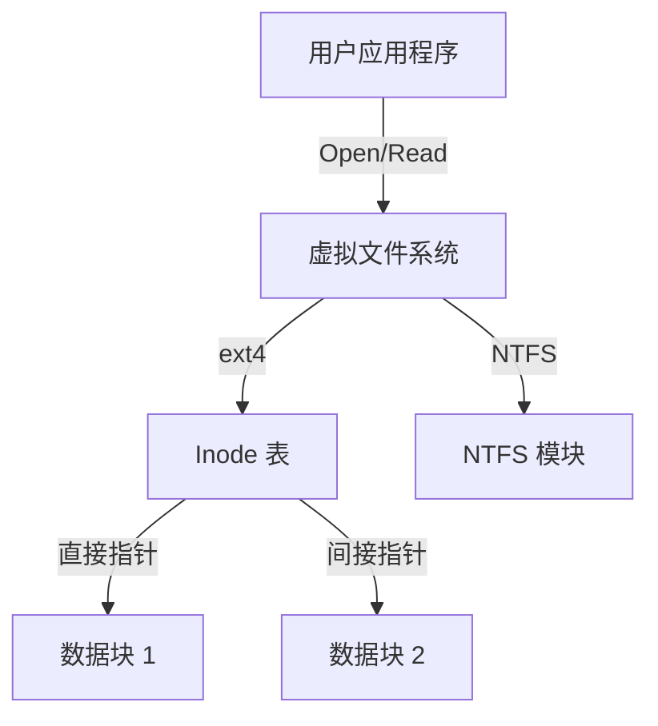

# 文件系统

文件系统为用户和应用程序提供了一种逻辑方法，用于在持久存储上存储、组织 and 访问数据。

## 文件与目录

- **文件 (File)**：存储的逻辑单位，表示一个字节序列。
- **目录 (Directory)**：一种特殊文件，包含文件名及其对应元数据（或指针）的列表。
- **文件描述符 (File Descriptor, FD)**：操作系统管理的打开文件表的整数索引。当进程打开文件时，内核向其返回一个 FD。

## 文件系统实现 (以 Linux/ext4 为例)

大多数现代文件系统构建在三个主要数据结构之上：

### Inode (索引节点)
文件的核心元数据结构。它包含：
- **文件类型**（普通文件、目录等）
- **权限**（所有者、组、其他）
- **文件大小**
- **创建、访问和修改时间戳**
- **数据块指针**（直接、间接、双重间接）

> **注意**：Inode **不**存储文件名；文件名存储在目录中。

### 超级块 (Superblock)
包含关于整个文件系统的元数据，例如：
- **块和 inode 的总数**
- **空闲块和 inode 的数量**
- **块大小**（例如 4 KB）
- **挂载状态**

### 数据块 (Data Block)
存放文件内容的实际存储区域。

## 可靠性与日志记录 (Journaling)

文件系统面临的一个主要挑战是在系统崩溃后（例如在写操作期间）保持一致性。

- **日志记录 (Journaling)**：一种技术，文件系统在将更改实际写入主文件系统区域之前，先在专用区域（日志）中记录每次元数据或数据的更改。如果发生崩溃，文件系统只需重放日志即可恢复一致性。

## 常见文件系统

- **ext4 (Linux)**：一种稳定、高性能的日志文件系统。
- **XFS (Linux)**：可扩展、高性能的文件系统，是许多企业发行版（如 RHEL）的默认选择。
- **NTFS (Windows)**：具有高级安全性 (ACL) 和压缩功能的专有日志文件系统。
- **APFS (macOS)**：针对 SSD 优化，支持快照和空间共享。
- **ZFS**：高级文件系统，具有写时复制 (Copy-on-write)、快照和数据完整性验证（校验和）等功能。

## 性能优化

- **页缓存 (Page Cache)**：操作系统利用空闲 RAM 来缓存频繁访问的磁盘块。
- **预读 (Read-ahead)**：内核通过提前读取几个块到内存中来预测未来的读取操作。
- **回写缓存 (Write-back Caching)**：写入操作先缓存在内存中，并定期刷新到磁盘，以提高响应速度。

