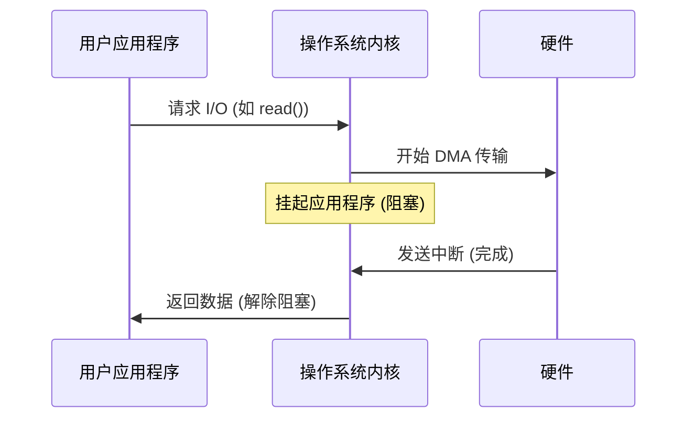

# I/O 系统

I/O 系统负责管理 CPU 与外部硬件设备之间的通信。它为连接到计算机的各种设备提供统一的接口。

## 设备分类

- **字符设备 (Character Devices)**：按字节处理数据（例如键盘、鼠标、串口）。
- **块设备 (Block Devices)**：按固定大小的块处理数据（例如硬盘、SSD）。
- **网络设备 (Network Devices)**：处理数据包（例如以太网卡、Wi-Fi 卡）。

## 与硬件通信

内核使用几种技术与设备交互：

### 轮询 (Polling)
CPU 反复检查设备状态。
- **优点**：实现简单。
- **缺点**：浪费 CPU 周期（忙等）。

### 中断 (Interrupts)
当设备就绪或发生事件时，设备向 CPU 发出信号。
- **中断处理程序 (ISR)**：为响应特定中断而执行的内核函数。
- **上半部与下半部 (Top Halves & Bottom Halves)**：现代操作系统将中断处理分为快速部分（上半部，禁用进一步中断）和延迟部分（下半部，执行繁重工作）。

### 直接存储器访问 (DMA)
允许设备在不涉及 CPU 的情况下直接与 RAM 传输数据。
- **机制**：CPU 告诉 DMA 控制器要传输数据的地址和大小。传输完成后，DMA 控制器发送一个中断。

## 设备驱动程序 (Device Drivers)

**设备驱动程序**是一个内核模块，它了解如何与特定的硬件设备通信，并向内核其余部分提供标准化的 API。

## I/O 性能与缓冲

### 缓冲 (Buffering)
在数据发送到设备 or 应用程序之前，将其临时存储在内存中。
- **双缓冲 (Double Buffering)**：使用两个缓冲区，以便在清空一个缓冲区的同时填充另一个。

### 缓存 (Caching)
将频繁使用的数据存储在快速内存中，以避免慢速 I/O 操作。

## 阻塞 vs. 非阻塞 vs. 异步 I/O

- **阻塞 I/O (Blocking I/O)**：进程被挂起，直到 I/O 操作完成。
- **非阻塞 I/O (Non-blocking I/O)**：系统调用立即返回。如果数据未就绪，则返回错误（例如 `EWOULDBLOCK`）。进程必须重试。
- **异步 I/O (Asynchronous I/O)**：进程启动 I/O 操作并继续执行。当操作完成时，内核通知进程（例如通过信号 or 回调）。

