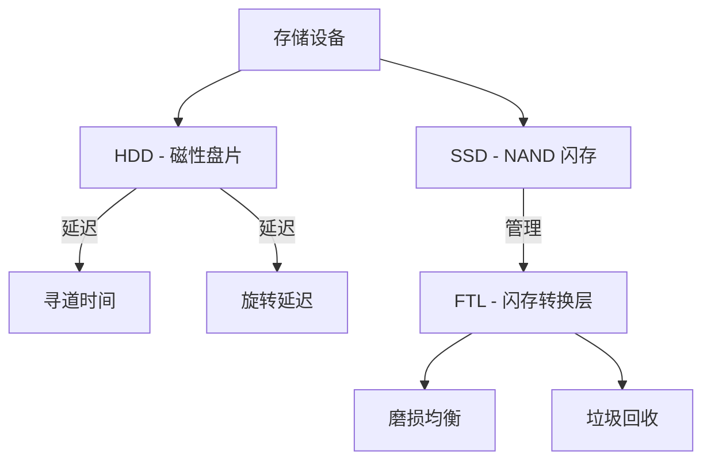

# 存储系统

存储系统负责管理跨各种物理介质的非易失性数据存储。

## 机械硬盘 (HDD) 结构

传统的 HDD 由一个或多个具有磁性表面的旋转盘片组成。
- **磁道 (Track)**：盘片上的同心圆。
- **扇区 (Sector)**：磁道的一个小部分（通常为 512 字节或 4 KB）。
- **柱面 (Cylinder)**：在相同磁臂位置下，跨多个盘片的一组磁道。
- **寻道时间 (Seek Time)**：将磁臂移动到正确磁道所需的时间。
- **旋转延迟 (Rotational Latency)**：目标扇区旋转到磁头下方所需的时间。

## 固态硬盘 (SSD)

SSD 使用 NAND 闪存，没有移动部件。它们速度快得多，但具有独特的特性：
- **页与块 (Pages and Blocks)**：数据以页为单位（如 8-16 KB）进行读写，但必须以块为单位（如 128-256 页）进行擦除。
- **FTL (闪存转换层)**：逻辑块地址 (LBA) 与物理闪存位置之间的映射。它负责**磨损均衡 (Wear Leveling)**（分散写入以避免过早失效）和**垃圾回收 (Garbage Collection)**。

## RAID (独立磁盘冗余阵列)

RAID 将多个物理磁盘组合成一个逻辑单元，以提高性能和/或可靠性。

- **RAID 0 (条带化/Striping)**：将数据分散在多个磁盘上。速度快，但没有冗余（如果一个磁盘损坏，所有数据都会丢失）。
- **RAID 1 (镜像/Mirroring)**：在多个磁盘上复制数据。高可靠性，但容量减半。
- **RAID 5 (奇偶校验/Parity)**：在至少三个磁盘上对数据和奇偶校验位进行条带化。提供冗余且性能良好。
- **RAID 6 (双重奇偶校验/Double Parity)**：可以承受两个磁盘同时损坏。
- **RAID 10 (1+0)**：镜像磁盘的条带化。结合了高性能和高可靠性。

## 磁盘调度算法

内核必须决定满足待处理磁盘 I/O 请求的顺序，以最小化寻道时间。

### SCAN (电梯算法/Elevator Algorithm)
磁臂从一端开始向另一端移动，沿途满足请求，然后反向移动。
- **优点**：比 FCFS 更公平；减少饥饿现象。

### C-SCAN (循环扫描/Circular SCAN)
类似于 SCAN，但当移动到末端时，它立即返回到起点，在返回过程中不满足任何请求。
- **优点**：提供更均匀的等待时间。

