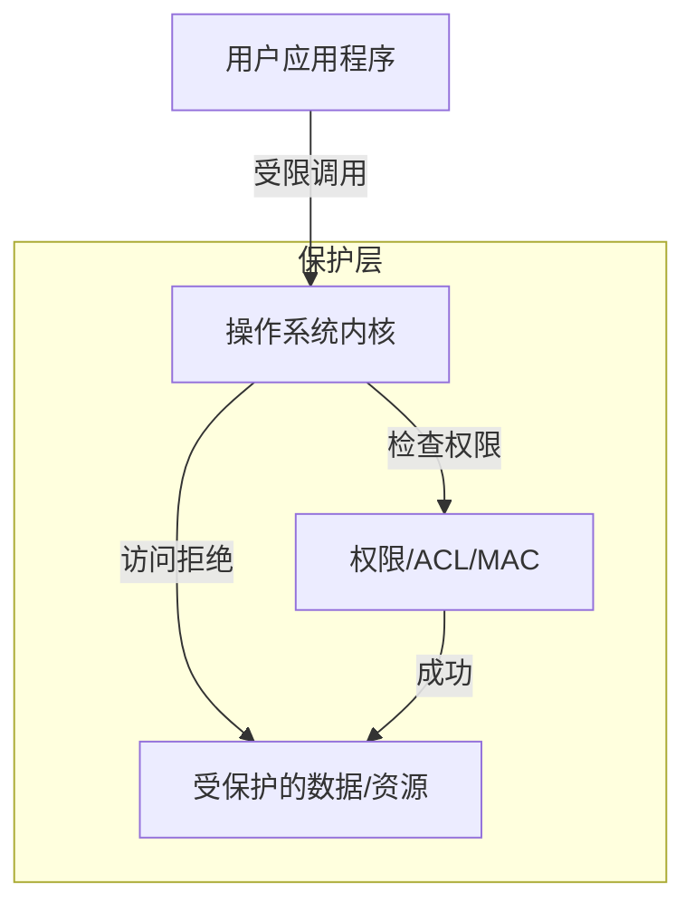

# 安全与保护

安全性涉及保护系统及其用户免受未经授权的访问和恶意活动的侵害。

## 用户权限与所有权

现代操作系统使用基于用户和组的离散权限模型。

- **UID (用户 ID)**：每个用户的唯一标识符。root 用户 (UID 0) 拥有完全控制权。
- **GID (组 ID)**：为了共享权限而将用户组合在一起。
- **文件权限**：通常包括所有者、组和其他人的读 (r)、写 (w) 和执行 (x) 权限。

## 访问控制列表 (ACL)

标准权限简单但不够灵活。ACL 提供了一种更细粒度的方法，可以为特定文件或目录分配特定用户或组的权限。

## 沙箱与隔离 (Sandboxing and Isolation)

**沙箱**是一个受限环境，应用程序可以在其中运行而无法访问系统的其余部分。
- **机制**：系统调用过滤（如 `seccomp`）、受限的文件访问和隔离的网络栈。

## 内核安全机制

### 强制访问控制 (MAC)
操作系统强制执行一组用户无法覆盖的安全规则。
- **SELinux (安全增强型 Linux)**：由美国国家安全局 (NSA) 开发的强大框架，通过对文件和进程使用“标签”来控制交互。
- **AppArmor**：一种更简单的 MAC 实现，为特定应用程序使用配置文件。

### 地址空间布局随机化 (ASLR)
随机化关键区域（栈、堆、库）的内存地址，使攻击者更难利用缓冲区溢出漏洞。

### 内核页表隔离 (KPTI)
分离用户和内核页表，以防止诸如 **Meltdown** 之类的侧信道攻击。

## 保护环 (Protection Rings)

硬件提供了多个保护级别（环）。
- **Ring 0**：内核模式（完全访问权限）。
- **Ring 3**：用户模式（受限访问权限）。
- **Ring 1 & 2**：很少使用；原本设计用于设备驱动程序。

