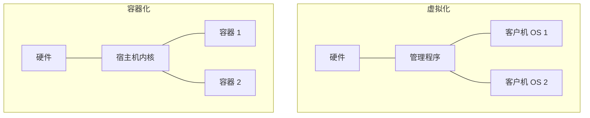

# 虚拟化与容器

虚拟化通过对硬件进行抽象，允许在单台物理机器上并发运行多个操作系统。

## 虚拟化类型

### 全虚拟化 (Full Virtualization)
客户机操作系统 (Guest OS) 并不知道自己运行在虚拟机中。管理程序 (Hypervisor) 拦截并模拟所有特权指令。
- **例子**：VMware, VirtualBox。

### 半虚拟化 (Para-virtualization)
对客户机操作系统进行修改，使其意识到自己运行在虚拟环境中。它向管理程序发起特殊的系统调用（超调用/hypercalls），而不是尝试直接执行特权指令。
- **例子**：Xen (早期版本)。

## 管理程序 (Hypervisor / VMM)

**虚拟机监视器 (Virtual Machine Monitor, VMM)**，或称为管理程序 (Hypervisor)，是用于管理和隔离虚拟机 (VM) 的软件。

- **第 1 型 (裸机型/Bare Metal)**：直接运行在硬件上（例如 Xen, VMware ESXi）。
- **第 2 型 (托管型/Hosted)**：作为应用程序运行在宿主操作系统之上（例如 KVM, VirtualBox）。

## 容器 (Containers)

容器通过共享宿主机的内核，同时隔离用户空间，提供了一种更轻量级的隔离形式。

### 容器的核心 Linux 技术

- **命名空间 (Namespaces)**：提供进程隔离（例如 PID、网络、挂载）。每个容器都有自己独立的系统视图。
- **控制组 (Cgroups/Control Groups)**：限制和监控资源使用情况（例如 CPU、内存、磁盘 I/O）。
- **联合文件系统 (Union File System / UnionFS)**：允许将多个目录合并为一个单一的文件系统视图（例如 OverlayFS）。

| 特性 | 虚拟机 (VM) | 容器 (Container) |
| :--- | :--- | :--- |
| **隔离性** | 硬件级（强隔离） | 进程级（中等隔离） |
| **客户机 OS** | 每个 VM 都有完整的 OS | 共享宿主机内核 |
| **启动时间** | 分钟级 | 秒级 |
| **资源消耗** | 高（完整的 OS 开销） | 低（资源共享） |

## Docker 与编排

- **Docker**：最流行的用于构建、分发和运行容器化应用程序的平台。
- **Kubernetes (K8s)**：一个用于在机器集群中管理大规模容器部署的编排平台。

