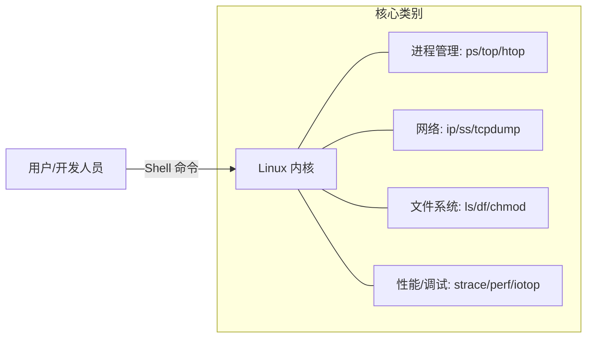

# Linux 基础

用于管理和调试 Linux 系统的实用工具与命令。

## 进程管理

- **ps**：显示当前活动进程的信息。
    - `ps aux`：所有进程的详细列表。
- **top / htop**：实时进程监控。
- **kill**：向进程发送信号（例如 `kill -9 <PID>`）。
- **nice / renice**：调整进程的优先级。

## 文件系统与磁盘

- **ls**：列出目录内容（例如 `ls -lah`）。
- **df / du**：检查磁盘空间使用情况。
- **chmod / chown**：更改文件权限和所有权。
- **mount / umount**：挂载和卸载文件系统。
- **ln**：创建链接（符号链接或硬链接）。

## 网络

- **curl / wget**：下载文件并与 API 交互。
- **ip / ifconfig**：管理网络接口和 IP 地址。
- **netstat / ss**：列出活动的网络连接和监听端口。
- **tcpdump / wireshark**：捕获并分析网络数据包。

## Shell 脚本

- **bash**：标准的 Linux Shell。
- **管道 (|)**：将多个命令连接在一起（例如 `cat logs.txt | grep "ERROR"`）。
- **重定向 (`>`, `>>`, `<`)**：控制命令的输入/输出。
- **环境变量**：存储配置值（例如 `$PATH`, `$USER`）。

## 系统管理

- **systemd / systemctl**：用于管理系统服务的标准 init 系统。
    - `systemctl start <service>`：启动服务。
    - `systemctl status <service>`：检查服务状态。
- **journalctl**：查看和管理系统日志。

## 性能与调试

- **perf**：一个强大的分析工具，可以跟踪硬件和软件事件。
- **strace**：跟踪进程发起的系统调用。
- **lsof**：列出进程打开的所有文件。
- **iotop**：监控每个进程的实时磁盘 I/O 使用情况。
- **free**：显示系统的总内存和空闲内存。

