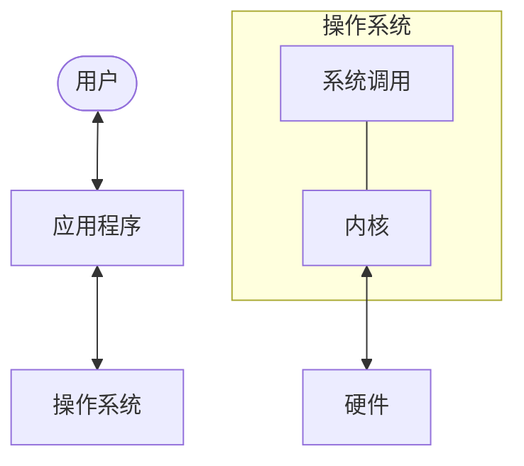

# 操作系统概述

操作系统 (Operating Systems, OS) 是管理计算机硬件并为计算机程序提供公共服务的底层软件。它们作为用户/应用程序与物理硬件之间的中介。

## 学习路径

本系列文档涵盖了操作系统的核心概念和现代实现：

1.  **[操作系统引论](./introduction)**：目标、历史和基本结构。
2.  **[进程管理](./process-management)**：操作系统如何管理多任务。
3.  **[线程与并发](./threads-concurrency)**：管理同步执行和同步。
4.  **[内存管理](./memory-management)**：处理物理内存和虚拟内存。
5.  **[文件系统](./file-system)**：组织和存储数据。
6.  **[I/O 系统](./io-system)**：与外部设备交互。
7.  **[存储系统](./storage-system)**：管理磁盘和 RAID。
8.  **[安全与保护](./security-protection)**：保护系统资源和数据。
9.  **[虚拟化](./virtualization)**：管理程序 (Hypervisor) 和容器技术。
10. **[Linux 基础](./linux-essentials)**：实用工具和性能分析。

## 操作系统核心功能

- **资源管理**：CPU、内存和 I/O 的分配。
- **进程协调**：调度和同步。
- **数据持久化**：文件系统和存储管理。
- **安全性**：访问控制和隔离。
- **抽象**：在不同硬件上提供一致的 API（系统调用）。

