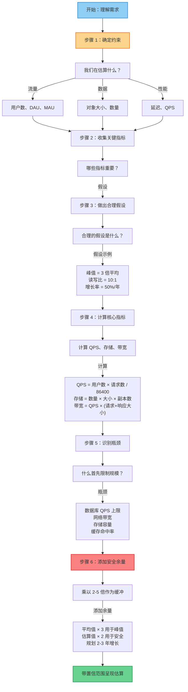
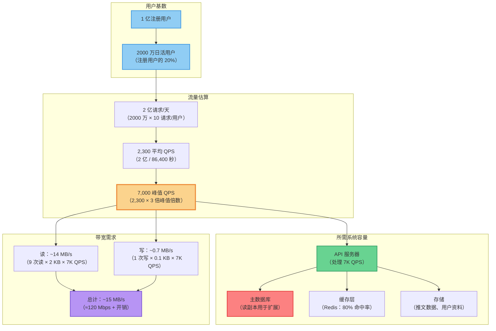

# 6. 粗略估算（Back-of-the-Envelope）

粗略估算（BOE）是系统设计面试和实际架构决策中的关键技能。它让你快速评估设计方案是否可行、识别瓶颈，并在不进行详细计算的情况下做出明智的权衡。

## 什么是粗略估算？

BOE 估算是进行快速、粗略计算的做法，用于：
- **验证可行性**：这个设计能否处理所需的规模？
- **识别瓶颈**：哪个组件最先出问题？
- **指导架构决策**：哪些权衡有意义？
- **估算成本**：粗略的数量级成本预估
- **促进沟通**：向利益相关者解释你的推理

**核心原则**：BOE 关注的是在一个数量级内（2-10 倍）正确，而非精确。在系统设计中，精确的数字往往是错的，因为假设会变化。好的近似推理比虚假的精确更有价值。

## 为什么它很重要

### 1. 快速可行性评估
在面试和设计会议中，你需要快速确定设计方案是否在合理范围内。BOE 让你尽早排除明显不可行的方案。

### 2. 瓶颈识别
通过估算每个组件的容量，找出最薄弱的环节。这指导优化精力的投入方向。

### 3. 成本效益分析
快速估算让你比较不同方案。对于预期规模，这个昂贵的解决方案是否值得？

### 4. 沟通
说"这个设计可以用 4 台服务器处理约 100 万 QPS"比"这应该能工作"更有说服力。

## 常见估算场景

### 系统化估算框架



**关键原则**：
- **从约束开始**：你在估算什么？（流量、存储、性能）
- **使用合理假设**：明确记录假设
- **逐步计算**：展示你的过程，不要跳步
- **识别瓶颈**：哪个组件最先失败？
- **添加安全余量**：系统在生产中很少按预期表现
- **带置信度呈现**："我们用这 4 台服务器可以处理约 100 万 QPS"（而非"精确的 987,654 QPS"）

### 请求速率估算

**起点**：用户数量及其行为

**值得记住的数字**：
- **活跃用户**：DAU（日活跃用户）或 MAU（月活跃用户）
- **请求模式**：每个用户每次会话/每天的平均请求数
- **峰值 vs 平均**：峰值通常是平均值的 2-5 倍（用 3 倍作为粗略启发式）

**估算步骤**：

1. **估算用户基数**：
   - 新产品：做出合理假设（如 3 年内 1000 万用户）
   - 现有产品：使用当前数据

2. **估算活跃用户**：
   - 消费类应用：注册用户的 10-30% 为 DAU
   - 企业工具：注册用户的 50-80% 为 DAU
   - 社交媒体：20-50% DAU/MAU 比率

3. **估算每用户请求数**：
   - 读密集型：每天 5-20 次请求
   - 交互型：每天 20-100 次请求
   - 写密集型：每天 1-5 次请求

4. **计算平均 QPS**：
   ```
   DAU × 每用户每天请求数 = 每天总请求数
   每天总请求数 / 86400 = 平均 QPS
   ```

5. **应用峰值倍数**：
   ```
   峰值 QPS = 平均 QPS × 3（启发式）
   ```

**示例：类 Twitter 服务**
- 1 亿注册用户
- 20% DAU（2000 万日活用户）
- 每用户每天 10 次请求
- 峰值倍数：3 倍

**计算**：
```
每天总请求 = 2000 万用户 × 10 请求 = 2 亿请求/天
平均 QPS = 200,000,000 / 86,400 ≈ 2,300 QPS
峰值 QPS = 2,300 × 3 ≈ 7,000 QPS
```



**系统设计启示**：
- **API 服务器**：7K QPS 用 4-8 台服务器即可处理（每台 1K-2K QPS）
- **数据库**：主库处理写入（~700 QPS），读副本处理读取（~6.3K QPS）
- **缓存**：对读密集型负载至关重要（80% 缓存命中 = 5K QPS 来自缓存，1.3K 来自 DB）
- **带宽**：120 Mbps 不算大，远在单条 1 Gbps 网络容量之内

### 存储估算

**起点**：数据模型和保留需求

**关键组成部分**：
- 对象大小（每项的平均大小）
- 对象数量
- 保留期限
- 副本因子

**估算步骤**：

1. **估算对象大小**：
   - 用户资料：~1-5 KB
   - 推文/帖子：~200 字节 - 1 KB
   - 照片：~100 KB - 5 MB
   - 视频：分钟数 × 码率

2. **估算对象数量**：
   - 用户数 × 每用户对象数
   - 增长率：每天新增对象数

3. **计算存储**：
   ```
   总存储 = 对象数量 × 对象大小 × 副本因子
   ```

4. **考虑增长**：
   - 规划未来 1-3 年
   - 考虑预期增长率

**示例：照片存储服务**
- 1000 万用户
- 每用户平均 100 张照片
- 平均照片大小：500 KB
- 2 个副本（用于可用性）
- 每年 50% 增长

**计算**：
```
当前存储 = 1000 万 × 100 × 500 KB × 2 = 1 TB
1 年增长 = 1 TB × 1.5 = 1.5 TB
2 年 = 1 TB × (1 + 1.5 + 1.5²) ≈ 5.5 TB
3 年 = 1 TB × (1 + 1.5 + 1.5² + 1.5³) ≈ 12 TB

规划：12-15 TB 存储
```

### 带宽估算

**起点**：请求/响应大小和请求速率

**关键组成部分**：
- 请求大小（出站）
- 响应大小（入站）
- 请求速率
- 读/写比（典型 10:1 读多写少）

**估算步骤**：

1. **计算平均请求大小**：
   - API 请求：~100 字节 - 1 KB
   - 照片上传：最大 5 MB
   - 视频：高度可变

2. **计算平均响应大小**：
   - 读响应：~1-10 KB（取决于用例）
   - 写确认：~100 字节

3. **计算带宽**：
   ```
   每秒带宽 = QPS × (请求大小 + 响应大小)
   ```

**示例：API 服务**
- 峰值 QPS：10,000
- 请求大小：200 字节
- 响应大小：2 KB
- 读/写比：9:1（9 次读，1 次写）

**计算**：
```
读带宽 = 10,000 QPS × 0.9 × 2 KB = 18 MB/s
写带宽 = 10,000 QPS × 0.1 × 0.2 KB = 0.2 MB/s
总带宽 = 18.2 MB/s ≈ 146 Mbps

加上开销：HTTP 头（20-30%）、加密（5-10%）
最终估算：146 Mbps × 1.3 ≈ 190 Mbps
```

**网络成本考虑**：
- 数据传输出站费用（AWS、GCP、Azure）
- 1 TB/月是常见的免费额度
- 计算月成本：带宽 × 每月秒数

### 数据库容量估算

**起点**：数据模型和访问模式

**单机限制**：
- 现代数据库服务器：~10K-50K QPS（取决于查询复杂度）
- IOPS 限制：每块 SSD 约 ~5K-10K 随机 IOPS
- 网络：常见 ~1 Gbps

**估算步骤**：

1. **估算读写比**：
   - 社交媒体：100:1 读多写少
   - 电商：10:1 到 50:1
   - 消息：1:1 均衡

2. **分别计算读和写 QPS**：
   ```
   读 QPS = 总 QPS × (读比例 / (读比例 + 写比例))
   写 QPS = 总 QPS - 读 QPS
   ```

3. **估算所需机器数**：
   ```
   读机器数 = 读 QPS / 单机读容量
   写机器数 = 写 QPS / 单机写容量
   总机器数 = 读机器数 + 写机器数
   ```

4. **添加副本用于可用性**：
   - 典型：2-3 个副本
   - 纳入机器数量

**示例：社交媒体帖子**
- 峰值 QPS：7,000
- 读/写比：100:1
- 单机容量：10K QPS（读）、5K QPS（写）
- 3 个副本用于可用性

**计算**：
```
读 QPS = 7,000 × (100 / 101) ≈ 6,930 QPS
写 QPS = 7,000 × (1 / 101) ≈ 70 QPS

读机器 = 6,930 / 10,000 ≈ 0.7 → 使用 1 台（有余量）
写机器 = 70 / 5,000 ≈ 0.01 → 使用 1 台（有余量）

主机器：2 台（1 台读 + 1 台写，有余量）
副本机器：4 台（用于 HA，2 个副本）
总机器：6 台
```

### 缓存容量估算

**起点**：缓存命中率和工作集大小

**关键概念**：
- 缓存命中率：从缓存服务的请求百分比
- 工作集：频繁访问的数据
- 缓存大小：应能容纳工作集并留有增长空间

**估算步骤**：

1. **估算可缓存数据**：
   - 多少百分比的请求可以缓存？
   - 热点数据 vs 长尾数据

2. **估算命中率**：
   - 设计良好的缓存：70-90% 命中率
   - 差的缓存：20-40% 命中率

3. **计算缓存大小**：
   - 估算热点数据集
   - 乘以对象大小
   - 添加 2-3 倍余量

**示例：商品目录缓存**
- 总商品数：1000 万
- 热门商品（80% 流量）：10 万
- 商品数据大小：每件 5 KB
- 目标命中率：90%

**计算**：
```
热点数据大小 = 100,000 × 5 KB = 500 MB
添加余量：500 MB × 2 = 1 GB
添加元数据/开销：1 GB × 1.2 = 1.2 GB

每个缓存节点规划：1.5-2 GB
```

### 内存估算

**起点**：应用内存需求

**关键组成部分**：
- 基础内存（框架、运行时开销）
- 每连接内存
- 缓存数据
- Worker/线程内存

**估算步骤**：

1. **每实例基础内存**：
   - 简单 API：100-500 MB
   - 复杂应用：1-4 GB
   - Java 应用：512 MB - 2 GB（JVM 开销）

2. **每连接内存**：
   - HTTP 连接：~10-50 KB
   - 数据库连接：~1-5 MB

3. **计算总内存**：
   ```
   总内存 = 基础内存 + (最大连接数 × 每连接内存)
   ```

4. **添加余量（2-4 倍）**：
   - 防止 OOM
   - 允许 GC 开销（托管语言）
   - 峰值流量余量

**示例：API 服务器**
- 基础内存：500 MB
- 最大并发连接：10,000
- 每连接内存：20 KB
- 余量倍数：2

**计算**：
```
连接内存 = 10,000 × 20 KB = 200 MB
总工作内存 = 500 MB + 200 MB = 700 MB
加余量：700 MB × 2 = 1.4 GB

每实例规划：2 GB 内存
```

## BOE 估算中的常见错误

### 1. 过于精确
**错误**：计算到很多位有效数字（"我们需要精确的 1,247 台机器"）

**为什么是错的**：假设是粗略的，精确计算给人虚假的准确性印象

**更好的方法**："我们大约需要 1,200-1,300 台机器"或"约 1.3K 台机器"

### 2. 忘记峰值 vs 平均值
**错误**：仅为平均负载规划

**为什么是错的**：峰值是故障发生的时候。为平均值规划的系统在峰值时会崩溃

**更好的方法**：为峰值规划（通常是平均值的 2-5 倍，用 3 倍作为启发式）

### 3. 忽略副本和开销
**错误**：只计算原始存储

**为什么是错的**：需要副本保证可用性，需要开销用于索引/元数据

**更好的方法**：乘以副本因子（2-3 倍）和开销（1.2-1.5 倍）

### 4. 不考虑增长
**错误**：仅为当前负载计算

**为什么是错的**：如果不为增长规划，系统很快就会过时

**更好的方法**：规划未来 1-3 年，考虑增长率（常见每年 50-100%）

### 5. 只关注单一组件
**错误**：优化一个组件的估算而忽略其他组件

**为什么是错的**：瓶颈会转移到下一个组件

**更好的方法**：估算路径中的所有组件以找到真正的瓶颈

### 6. 使用错误的单位
**错误**：混淆 bits/bytes、MB/MiB，或混淆时间单位

**为什么是错的**：数量级错误（bits 和 bytes 之间差 8 倍）

**更好的方法**：明确单位，仔细转换

## 值得记住的参考数字

**用户行为**：
- 活跃用户比例：10-30%（消费类）、50-80%（企业类）
- 每用户每天请求数：5-20（读密集型）、20-100（交互型）
- 会话时长：10-30 分钟（消费应用）、2-8 小时（企业工具）

**系统容量（每台现代机器）**：
- API 服务器：1K-10K QPS（取决于复杂度）
- 数据库（读）：10K-50K QPS（简单查询）
- 数据库（写）：5K-20K QPS（取决于事务复杂度）
- 缓存（Redis）：10K-100K QPS
- 负载均衡器：10K-100K QPS（L4）、1K-10K QPS（L7）

**存储成本（粗略 AWS 等价）**：
- S3：约 $0.02-0.03/GB/月
- EBS SSD：约 $0.08-0.15/GB/月
- S3 Standard vs IA：3-5 倍成本差异

**带宽成本**：
- 出站：约 $0.05-0.15/GB（因地区而异）
- 入站：通常免费

**数据大小**：
- 短文本（推文）：200 字节 - 1 KB
- 用户资料：1-5 KB
- 照片（压缩后）：100 KB - 500 KB
- 照片（原始）：1-5 MB
- 全高清电影：~4-8 GB
- 全高清电视剧集：~1-3 GB

## 实用估算框架

### 步骤 1：明确需求
- 用户：总共多少？活跃多少？
- 增长：预期增长率是多少？
- 时间线：这个设计应该持续多少年？

### 步骤 2：确定关键约束
对这个设计最重要的是什么？
- **读密集型**：关注读容量、缓存
- **写密集型**：关注写容量、数据库分片
- **存储密集型**：关注存储成本、保留
- **延迟敏感型**：关注地理分布、缓存

### 步骤 3：逐组件估算
从用户请求开始，追踪每个组件：
1. **入口层**：负载均衡器容量
2. **API 服务器**：请求处理容量
3. **缓存**：命中率、热点数据大小
4. **数据库**：读写分离、每台机器限制
5. **存储**：总存储、增长率

### 步骤 4：找到瓶颈
比较各组件容量。容量（相对于需求）最低的组件就是瓶颈。

### 步骤 5：合理性检查
- 数字是否合理？（不是"我们需要 10 亿台机器"）
- 是否考虑了副本和开销？
- 是否为增长和故障留有余量？

## BOE 在系统设计面试中

**面试格式**：
1. 面试官："设计一个 URL 短链接服务"
2. 你：提出澄清问题（规模、功能需求）
3. 面试官："每天 1 亿次 URL 缩短，1 亿次日读取"
4. 你：做 BOE 估算指导设计

**示例面试估算（URL 短链接）**：

**需求**：
- 每天写入 1 亿次
- 每天读取 1 亿次
- 读/写比 10:1
- 存储 5 年

**计算**：
```
写 QPS = 100,000,000 / 86,400 ≈ 1,160 QPS
峰值写入 = 1,160 × 3 ≈ 3,500 QPS

读 QPS = 100,000,000 / 86,400 ≈ 1,160 QPS
峰值读取 = 1,160 × 3 ≈ 3,500 QPS

URL 大小：短 URL（7 字符）+ 长 URL（平均 100 字符）= ~107 字节
5 年存储 = 1 亿 × 365 天 × 5 年 × 107 字节 ≈ 20 TB
加副本（3 倍）：60 TB 总计

内存缓存（热门 URL，80% 流量）：
20 TB × 0.2 = 4 TB 工作集
每个缓存节点：6-8 GB（含 2-3 倍余量）

机器需求（受 DB 写入限制）：
单台 DB：5K 写 QPS
所需 DB 机器 = 3,500 / 5,000 ≈ 1
+ 用于 HA 的副本：1 主 + 2 副本 = 3 台机器
API 服务器（每台 10K QPS）：
4,000 QPS / 10,000 = 1 台 API 服务器（太紧张）
使用 2-3 台 API 服务器作为余量
```

**BOE 的关键洞察**：
- 写密集型（DB 瓶颈），需要缓存策略
- 存储可管理（5 年 60 TB）
- 读容量需要优化（积极缓存）
- 不需要很多机器（可以从小规模开始并扩展）

## 当 BOE 不够用时

**需要详细计算的情况**：
- 做采购决策时（精确成本重要）
- 性能关键系统（毫秒级重要）
- 昂贵的基础设施（云成本显著）
- 合规要求（需要精确数字）

**使用 BOE 的场景**：
- 可行性评估（是/否决策）
- 架构比较（2-10 倍以内）
- 面试设计（数量级足够）
- 初始规划（详细设计阶段之前）

## 常用估算快捷方式

**粗略转换**：
- 1 K = 1,000
- 1 M = 1,000 K = 1,000,000
- 1 B = 8 bits
- 1 GB = 1,000 MB
- 1 TB = 1,000 GB
- 8 小时 = ~30,000 秒
- 1 天 = ~86,000 秒

**有用的倍数**：
- 2 倍：翻倍，显著变化
- 10 倍：一个数量级
- 100 倍：两个数量级
- 1000 倍：三个数量级

**经验法则**：
- 如果你要乘超过 3-4 个数字，写下来以避免出错
- 始终做合理性检查：这个数字感觉对吗？
- 不确定时，四舍五入到 1 位有效数字（1M，而非 1.23M）
- 对不确定的值使用范围（1-2M，而非 1.5M）
