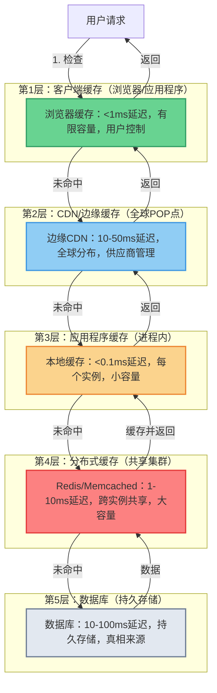
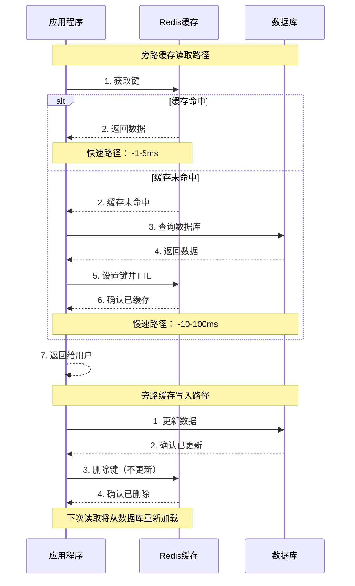
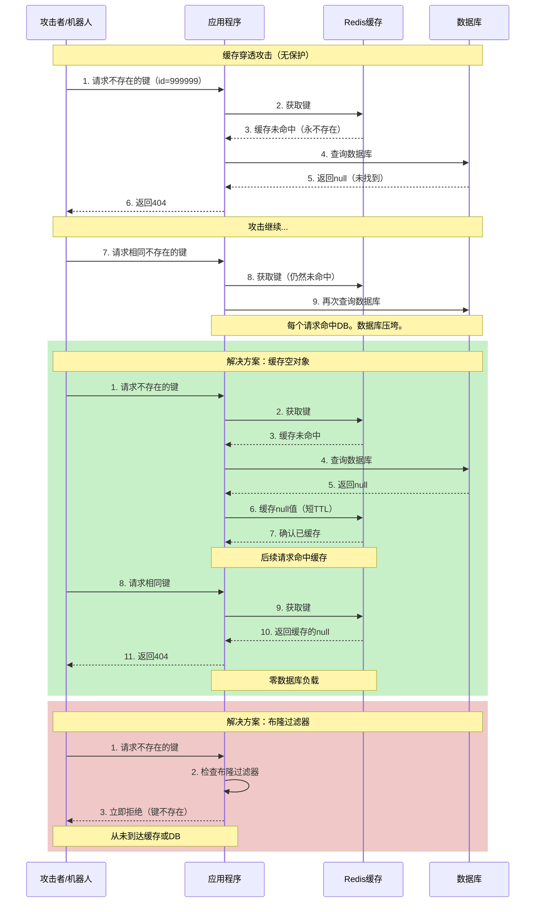

# 4. 缓存层

缓存购买延迟并减少源服务器负载，但它也引入了正确性风险和操作复杂性。缓存不是"免费的速度提升"；它是一个具有自身故障模式的分布式系统组件。

## 此层包含什么

- 缓存访问模式：旁路缓存（Cache Aside）、穿透缓存（Read Through）、直写缓存（Write Through）、回写缓存（Write Behind）、预刷新（Refresh-Ahead）。
- 过期和失效策略：TTL（生存时间）、显式失效、事件驱动失效、版本控制。
- 多级缓存：边缘/CDN、应用程序"近缓存"和共享分布式缓存。
- 热键和过载保护：请求合并、抖动TTL（Jittered TTLs）和安全回退。

## 为什么很重要

### 1. 它改善尾部延迟
即使平均数据库延迟看起来不错，尾部延迟也可能主导用户体验。缓存命中减少方差并保护p99（99百分位延迟）。

### 2. 它保护源服务器
数据库和关键服务在突发流量下会失效。缓存可以将"流量峰值中断"转变为"降级但运行中"的事件。

### 3. 它降低成本
正确使用时，缓存可以延迟昂贵的数据库扩展并减少重复计算。

## 缺点和风险

- 数据陈旧：最快的数据有时是错误的数据。
- 失效复杂性：正确性通常取决于正确地执行失效操作。
- 缓存中断：当缓存失效时，源服务器可能因突然的回填而超载。
- 写入路径复杂性：直写/回写模式增加了协调和故障处理。

## 关键权衡和如何决定

### 缓存部署策略

#### 部署层次概览

缓存通常以层次结构部署，从最接近用户的客户端（客户端侧）到最远的（分布式缓存）。每个级别在延迟、容量、一致性和复杂性方面提供不同的权衡：

**四级缓存层次结构：**

1. **客户端缓存（浏览器/应用程序）**：零网络延迟，容量有限，用户控制
2. **CDN/边缘缓存**：地理接近性，全局失效，供应商管理
3. **应用程序本地缓存**：进程内内存，极快，特定于实例
4. **分布式缓存**：跨所有实例共享，网络延迟，一致视图

**多级缓存策略：**
- 缓存从客户端→CDN→应用程序→分布式缓存→数据库级联
- 每个级别都可以处理请求，减少后续级别的负载
- 在一个级别上的缺失会进行到下一个级别
- 失效必须考虑所有级别（陈旧数据可以跨级别持续存在）



**缓存流程：**
1. **客户端缓存** - 零网络延迟，最快命中，但有限且由用户控制
2. **CDN边缘** - 地理接近性，吸收大部分全球流量
3. **应用程序缓存** - 内存中，极快但特定于实例
4. **分布式缓存** - 跨所有实例共享，一致视图
5. **数据库** - 持久存储，真相来源

**按级别的权衡：**

| 级别 | 延迟 | 容量 | 一致性 | 复杂性 |
|-------|---------|----------|-------------|------------|
| 客户端端 | <1ms | 有限 | 无（用户控制） | 低 |
| CDN/边缘 | 10-50ms | 大 | 最终一致性 | 中等 |
| 应用程序 | <0.1ms | 小 | 无（每个实例） | 低 |
| 分布式 | `1 到 10 毫秒` | 大 | 可配置 | 高 |

#### 缓存类型选择决策框架

**选择客户端缓存时：**
- 数据是静态的或很少变化
- 地理延迟很重要（全球用户群）
- 数据可以公开共享
- 轻微的陈旧数据是可以接受的

**选择CDN/边缘缓存时：**
- 内容在全球分布
- 源服务器负载减少至关重要
- 需要DDoS保护
- 内容可以容忍传播延迟

**选择应用程序本地缓存时：**
- 数据被频繁访问
- 跨实例的轻微不一致是可以接受的
- 延迟至关重要（亚毫秒级）
- 数据量小（KB到MB范围）

**选择分布式缓存时：**
- 需要跨实例的一致性
- 数据跨用户共享
- 缓存容量超过本地内存
- 需要持久性（Redis可选）

---

**浏览器缓存（客户端缓存）：**

**工作原理：** 浏览器根据HTTP标头（Cache-Control、ETag、Last-Modified）在本地存储响应。

**优点：**
- 零网络请求（最佳性能）
- 零服务器负载
- 静态资产和用户特定数据的绝佳选择
- 通过HTTP标头简单实现

**缺点：**
- 控制有限（用户可以清除缓存）
- 存储因浏览器和设备而异
- 难以在到期前失效
- 不适合敏感或个性化数据

**最适合：**
- 静态资产（CSS、JS、图像、字体）
- 频繁变化的公共API响应
- 用户配置文件数据（每个浏览器缓存，合理时间段到期）

**业务场景示例：**
- **营销网站：** 静态HTML、CSS、JS（小时/天缓存持续时间）
- **产品图片：** 静态产品摄影（天/周缓存持续时间）
- **用户设置：** 首选项、语言设置（小时缓存持续时间）

**CDN / 边缘缓存：**

**工作原理：** 内容交付网络在边缘位置全局存储内容，从最近位置提供服务。

**优点：**
- 地理延迟减少（内容靠近用户）
- 大幅减少源服务器负载（大多数请求永不到达源服务器）
- 边缘DDoS吸收（攻击在到达源服务器前被吸收）
- 内置HTTP标头支持
- 全局失效能力

**缺点：**
- 陈旧数据风险（更新传播缓慢）
- 失效成本（全局失效可能很昂贵）
- 缓存行为控制有限
- 供应商锁定风险
- 高流量成本

**最适合：**
- 全球静态资产（图像、媒体、下载）
- 公共API响应
- 媒体流（视频块）
- 软件下载

**业务场景示例：**
- **媒体流：** 视频块全局缓存（分钟/小时缓存）
- **软件分发：** 应用程序安装程序、更新（天缓存）
- **公共API：** 产品列表、公共数据（分钟缓存带失效）
- **文档：** 技术文档、帮助内容（小时/天缓存）

**应用程序级缓存（近缓存/本地缓存）：**

**工作原理：** 应用程序进程内的内存缓存（例如，Guava、Caffeine、JavaScript Map）。

**优点：**
- 极快（无网络往返，内存中）
- 实现简单
- 无需共享基础设施
- 应用程序完全控制

**缺点：**
- 跨实例不一致（每个实例有自己的缓存）
- 内存容量有限（与应用程序内存竞争）
- 数据跨实例重复（内存效率低下）
- 失效挑战（必须跨所有实例失效）
- 新实例的缓存冷启动

**最适合：**
- 配置数据（功能标志、设置）
- 小而频繁访问的数据
- 轻微不一致可接受的数据
- 读密集型参考数据（查找表、映射）

**业务场景示例：**
- **功能标志：** 功能配置（秒/分钟缓存）
- **国家/地区映射：** IP地理位置映射（小时缓存）
- **汇率：** 货币兑换率（分钟缓存）
- **产品类别：** 类别层次结构（分钟/小时缓存）

**共享分布式缓存（Redis、Memcached）：**

**工作原理：** 专用缓存基础设施通过网络从所有应用程序实例访问。

**优点：**
- 跨所有实例的一致视图
- 大容量（可以缓存比本地内存更多的数据）
- 单一失效位置
- 可以持久化数据（Redis持久化选项）
- 高级功能（过期、pub/sub、数据结构）

**缺点：**
- 网络延迟开销
- 需要额外的基础设施操作
- 单点故障（需要复制/高可用性）
- 操作复杂性
- 成本（专用基础设施）

**最适合：**
- 用户会话数据
- 购物车内容
- 昂贵的查询结果
- 速率限制计数器
- 用户特定频繁访问的数据

**业务场景示例：**
- **购物会话：** 活跃购物车（分钟/小时缓存）
- **用户配置文件：** 配置文件数据、首选项（分钟缓存）
- **API响应：** 昂贵的数据库查询结果（分钟缓存）
- **速率限制：** 请求计数器、配额跟踪（秒/分钟缓存）

**数据库查询缓存：**

**工作原理：** 数据库在内部缓存查询执行计划和结果集。

**优点：**
- 对应用程序透明（自动）
- 由数据库引擎优化
- 无需额外基础设施
- 由数据库专家处理

**缺点：**
- 控制有限（数据库控制缓存）
- 与其他数据库操作共享
- 容量有限
- 由数据库写入失效

**最适合：**
- 频繁执行的查询
- 读密集型工作负载
- 具有可重复模式的分析查询

**业务场景示例：**
- **报告查询：** 具有可预测查询模式的每日报告
- **仪表板查询：** 指标和聚合（秒/分钟缓存）
- **产品查找：** 频繁访问的产品数据（秒缓存）

**完整页面缓存：**

**工作原理：** 缓存整个渲染的HTML页面，无需执行应用程序逻辑即可提供服务。

**优点：**
- 最大性能（无应用程序执行）
- 最小服务器负载
- 简单架构

**缺点：**
- 不适合个性化内容
- 失效挑战（任何内容更改都会使页面失效）
- 仅限于个性化程度低的页面
- 陈旧内容风险

**最适合：**
- 公共页面（首页、营销页面）
- 博客文章和文章
- 产品列表页面
- 文档页面

**业务场景示例：**
- **营销网站：** 首页、关于页面（分钟/小时缓存）
- **博客：** 文章页面（小时/天缓存）
- **文档：** 帮助和文档页面（小时缓存）
- **产品列表：** 类别浏览页面（秒/分钟缓存）

**对象缓存（部分页面缓存）：**

**工作原理：** 缓存数据对象，通过组装缓存对象动态渲染页面。

**优点：**
- 灵活（可以在缓存共享内容的同时个性化）
- 比完整页面缓存更高的命中率
- 适合个性化体验
- 在自然对象边界缓存

**缺点：**
- 比完整页面缓存复杂
- 仍然需要应用程序逻辑
- 每个页面多次缓存查找
- 组装开销

**最适合：**
- 混合个性化内容和共享内容的页面
- 具有昂贵对象加载的动态页面
- 用户仪表板（共享数据的个性化视图）

**业务场景示例：**
- **社交动态：** 用户特定的动态由缓存帖子组成（秒缓存）
- **用户仪表板：** 缓存数据的个性化视图（分钟缓存）
- **产品页面：** 产品详情 + 用户特定定价（分钟缓存）

### 缓存读写策略

缓存读写策略定义应用程序如何与缓存和数据库交互。策略选择显著影响读取性能、写入性能、数据一致性和系统复杂性。

#### 读取策略

**旁路缓存（延迟加载）：**

**工作原理：**
- **读取路径：** 应用程序检查缓存 → 如果未命中，查询数据库 → 将结果写入缓存 → 返回数据
- **写入路径：** 应用程序更新数据库 → 删除缓存条目（不更新缓存）



**优点：**
- 实现简单（应用程序控制缓存逻辑）
- 缓存只包含实际请求数据（高效缓存使用）
- 适用于任何数据库（不需要特定于数据库的功能）
- 失败的缓存写入不会破坏功能（缓存未命中下次读取会重新填充）

**缺点：**
- 缓存未命中惩罚：三次操作（检查缓存 + 数据库查询 + 写入缓存）
- 竞争条件期间数据陈旧（在缓存失效完成前读取）
- 缓存未命中后第一次请求总是经历更高延迟
- 仅按需缓存填充（缓存冷问题）

**最适合：**
- 读密集型工作负载，写入相对较少
- 通用缓存场景
- 希望完全控制缓存行为的应用程序
- 愿意在应用程序代码中管理缓存-DB一致性的团队

**业务场景：**
- **电子商务产品详情：** 产品被频繁读取（数千次），很少更新（价格每天更改几次）。旁路缓存确保只有请求的产品被缓存，在读取时最小化数据库负载，在价格更新时的缓存失效很简单（删除缓存条目）。

**为什么删除缓存而不是更新：**
- 写入时更新缓存会浪费缓存写入（如果在下次读取前数据更新多次）
- 删除确保下次读取时加载新鲜数据（延迟加载）
- 简化写入路径（无需获取当前值来更新缓存）
- 避免缓存可能永远不会再次读取的数据污染

---

**穿透缓存（Read Through）：**

**工作原理：**
- **读取路径：** 应用程序从缓存请求数据 → 缓存提供者在未命中时管理数据库查找 → 缓存返回数据
- **写入路径：** 应用程序更新数据库 → 缓存提供者处理失效（实现依赖）

**优点：**
- 应用程序代码更简单（缓存抽象层处理未命中/检索逻辑）
- 缓存填充一致（缓存提供者确保所有缓存条目遵循相同模式）
- 减少应用程序复杂性（读取路径中没有显式数据库查询）
- 更容易理解（缓存是读取的单一真相来源）

**缺点：**
- 需要缓存提供者支持（并非所有缓存库都支持穿透缓存）
- 比旁路缓存灵活性差（自定义缓存填充逻辑更难）
- 供应商锁定（绑定到缓存提供者的实现）
- 缓存-DB交互模式控制更少

**最适合：**
- 希望代码更简单而非最大灵活性的应用程序
- 愿意采用缓存提供者抽象的团队
- 缓存提供者高效支持穿透缓存的场景
- 具有标准化缓存键模式的应用程序

**业务场景：**
- **用户配置文件查找：** 用户配置文件数据频繁访问（会话检查、配置文件显示）。缓存提供者（例如，带穿透缓存的Redis）在缓存未命中时自动从数据库加载用户配置文件，应用程序代码只需调用`cache.get(userId)`而无需显式数据库查询逻辑。

---

#### 写入策略

**直写缓存（Write Through）：**

**工作原理：**
- **写入路径：** 同步写入缓存和数据库（事务性或顺序）
- **读取路径：** 从缓存读取（假设写入成功则始终新鲜）
- 应用程序在缓存和数据库写入都完成后才确认

**优点：**
- 缓存始终与数据库一致（强一致性）
- 读取始终快速（缓存中的数据始终是最新的）
- 简单推理模型（写入 = 缓存和DB原子更新）
- 无写入后陈旧数据读取
- 可预测行为（无需推理后台异步操作）

**缺点：**
- 更高写入延迟（两次写入：缓存 + 数据库）
- 数据未重新读取时浪费缓存写入（浪费缓存容量）
- 数据库是瓶颈（缓存不减少数据库写入负载）
- 写入失败处理更复杂（如果缓存写入成功但数据库失败怎么办？）

**最适合：**
- 写入密集型、读取密集型工作负载，其中数据一致性至关重要
- 金融应用程序、银行系统（缓存和DB必须保持一致）
- 陈旧数据在写入后不可接受的场景
- 需要强一致性保证的应用程序

**业务场景：**
- **银行系统账户余额：** 当用户转账时，账户余额必须原子更新到缓存和数据库。直写缓存确保缓存的余额始终准确，读取总是返回当前余额，转账后没有陈旧余额读取。轻微写入延迟增加可接受正确性保证。

---

**回写缓存（Write Behind）：**

**工作原理：**
- **写入路径：** 立即写入缓存 → 向应用程序确认 → 后台异步写入数据库
- **读取路径：** 从缓存读取（极快，缓存是临时的真相来源）
- 数据库在延迟后以批处理方式异步更新

**优点：**
- 极低写入延迟（仅在缓存写入后确认）
- 高写入吞吐量（数据库写入批处理、平滑处理）
- 减少数据库负载（多个缓存写入合并为更少的DB写入）
- 自然写入批处理（合并同一键的多个更新）

**缺点：**
- **数据丢失风险：** 如果缓存在DB写入完成前失败，数据丢失
- 缓存是临时真相来源（复杂故障场景）
- 复杂恢复逻辑（必须从缓存重放挂起的写入）
- 可能发生陈旧数据读取（在后台DB写入完成前）
- 持久性不保证（确认的写入可能不持久）

**最适合：**
- 高频写入工作负载，其中一些数据丢失可接受
- 分析、指标、点击流跟踪
- 非关键数据，其中吞吐量优先于持久性
- 可以容忍数据丢失的应用程序（近似数据可接受）

**业务场景：**
- **点击流跟踪：** 每秒数百万点击事件，丢失一些事件可接受。回写允许立即接受所有写入（缓存确认），每几秒批处理写入数据库。如果缓存失败，只丢失最后几秒钟的点击（对分析可接受）。

**风险缓解：**
- 配置回写队列大小（防止无界内存使用）
- 设置强制DB写入前的最大延迟（绑定数据丢失窗口）
- 为回写队列实现持久化（在缓存重启时生存）
- 监控回写队列深度（如果队列增长，缓存无法跟上时报警）

---

**绕过缓存（Write Around）：**

**工作原理：**
- **写入路径：** 仅写入数据库（绕过缓存，不更新或不删除缓存）
- **读取路径：** 检查缓存 → 如果未命中，从数据库加载 → 填充缓存
- 仅在读取时填充缓存，不在写入时

**优点：**
- 避免填充缓存不会读取的数据（减少缓存污染）
- 仅缓存实际请求数据（高效缓存使用）
- 简单写入路径（单个数据库写入）
- 为永不会读取的数据节省缓存写入

**缺点：**
- 写入后第一次读取总是缓存未命中（最近写入的数据延迟更高）
- 写入后数据可能仍保留在缓存中（直到TTL过期）
- 不适合读取后写入一致性要求
- 最近更新的数据读取延迟更高

**最适合：**
- 一次写入但很少读取的数据（一次写入，可能读取模式）
- 审计日志、历史记录、事件日志
- 立即读取后写入一致性不需要的数据
- 缓存污染预防至关重要的场景

**业务场景：**
- **订单完成记录：** 订单完成时，记录写入数据库（审计跟踪），很少在写入后立即访问。绕过缓存确保订单完成记录不污染缓存（缓存保留用于热数据，如活跃购物车、产品详情）。如果订单记录稍后请求（客服），缓存未命中从数据库加载并为将来访问缓存。

---

#### 策略选择决策矩阵

| 场景 | 读取模式 | 写入模式 | 推荐策略 | 理由 |
|----------|--------------|---------------|---------------------|-----------|
| 读密集型，很少更新 | 频繁读取，很少写入 | N/A | 旁路缓存 | 按需填充，最小缓存污染 |
| 写密集型，数据丢失可接受 | 偶尔读取 | 频繁写入 | 回写缓存 | 最大化写入吞吐量，接受一些数据丢失 |
| 读写平衡，一致性关键 | 频繁读取 | 频繁写入 | 直写缓存 | 强一致性，缓存始终新鲜 |
| 一次写入，可能读取 | 偶尔读取 | 一次 | 绕过缓存 | 避免缓存污染，按需缓存 |
| 需要简单应用程序代码 | 频繁读取 | 偶尔写入 | 穿透缓存 | 更简单代码，缓存提供者管理复杂性 |
| 高并发热键 | 非常频繁读取 | 偶尔写入 | 旁路缓存 + 互斥锁 | 防止缓存雪崩，单个DB查询未命中 |

#### 策略组合模式

常见生产系统组合多种策略：

**旁路缓存 + 绕过缓存（最常见）：**
- **读取：** 旁路缓存（检查缓存，未命中时从DB加载）
- **写入：** 绕过缓存（仅写入数据库，绕过缓存）
- **最适合：** 缓存污染预防重要的通用工作负载
- **业务场景：** 社交媒体平台（帖子频繁读取，一次写入，仅在读取时缓存）

**穿透缓存 + 直写缓存（简化一致性）：**
- **读取：** 穿透缓存（缓存提供者处理未命中）
- **写入：** 直写缓存（缓存和DB同步更新）
- **最适合：** 希望代码简单且具有强一致性的应用程序
- **业务场景：** 银行应用程序（余额更新需要立即一致性）

**读取用旁路缓存 + 写入用回写缓存（高吞吐量）：**
- **读取：** 旁路缓存（检查缓存，未命中时加载）
- **写入：** 回写缓存（写入缓存，异步DB写入）
- **最适合：** 高吞吐量场景，其中一些数据丢失可接受
- **业务场景：** 分析平台（每秒数百万事件，批处理写入DB）

---

### 缓存失效策略

缓存失效决定何时以及如何删除或更新缓存数据。选择正确的失效策略平衡新鲜度、一致性、性能和复杂性。

#### 基于TTL的过期

**工作原理：** 缓存条目在写入或访问后的固定时间后自动过期。

**TTL变体：**

**绝对TTL：**
- 缓存条目在特定绝对时间过期（例如，下午5:00）
- **最适合：** 具有已知失效时间的数据（日终价格、每日快照）

**滑动TTL：**
- 缓存条目在最后访问后N秒过期（例如，最后读取后1小时）
- **最适合：** 频繁访问的数据（保持热数据新鲜，冷数据过期）

**写入时TTL：**
- 缓存条目在数据写入后N秒过期
- **最适合：** 具有已知陈旧容差的数据（产品价格、汇率）

**读取时TTL：**
- 每次访问时刷新缓存条目TTL
- **最适合：** 频繁访问的数据（防止热数据过期）

**优点：**
- 实现简单（大多数缓存库原生支持TTL）
- 有界陈旧性（最大陈旧性 = TTL持续时间）
- 无需协调（无需失效消息或基础设施）
- 优雅降级（陈旧数据服务直到过期，然后加载新鲜数据）

**缺点：**
- 在过期前服务陈旧数据（无立即一致性）
- 热数据可能过早过期（如果使用写入时TTL）
- 冷数据浪费缓存空间（如果使用滑动TTL，很少访问的数据保持缓存）
- 需要仔细TTL选择（太短 = 高未命中率，太长 = 陈旧数据）

**最适合：**
- 具有已知陈旧容差的数据
- 协调开销不可接受的简单缓存场景
- 最终一致性可接受的应用程序

**业务场景：**
- **产品目录：** 产品价格很少更改，5分钟陈旧度可接受。设置TTL = 300秒产品数据。如果价格更改，旧价格最多服务5分钟（简单性和性能的可接受权衡）。关键价格更改（错误）可以触发显式失效。

---

#### 显式失效

**工作原理：** 当数据更改时，应用程序显式删除缓存条目（直接缓存API调用）。

**失效方法：**

**缓存失效API：**
- 应用程序直接调用缓存删除操作
- `cache.delete(key)` 当数据更新时
- **优点：** 立即失效，简单协调
- **缺点：** 必须跟踪所有缓存键（对派生/缓存数据复杂）

**失效队列：**
- 应用程序将失效事件发布到消息队列
- 缓存消费者使用失效事件并删除条目
- **优点：** 与应用程序代码解耦，跨多个缓存实例工作
- **缺点：** 消息队列基础设施，事件传递保证

**发布/订阅：**
- 应用程序将失效事件发布到发布/订阅主题
- 所有缓存实例订阅并删除条目
- **优点：** 跨多个缓存层简单失效
- **缺点：** 重复事件，事件丢失（订阅者离线）

**优点：**
- 立即一致性（数据更改时缓存立即失效）
- 无陈旧数据（下次读取时加载新鲜数据）
- 精确控制（应用程序确切决定何时失效）
- 简单推理（数据更改 = 缓存失效）

**缺点：**
- 复杂协调（必须为数据跟踪所有缓存键）
- 竞争条件（在失效完成前读取看到陈旧数据）
- 缓存键管理复杂性（如果数据在多个键下缓存怎么办？）
- 分布式失效挑战（多个缓存实例/层）

**最适合：**
- 需要立即一致性的关键数据
- 陈旧数据不可接受的应用程序
- 具有可预测缓存键模式的系统

**业务场景：**
- **用户权限更改：** 当用户权限被撤销时，必须立即生效。显式失效确保权限缓存在撤销时立即删除，下次请求从数据库重新加载新鲜权限。没有撤销用户可以访问受限资源的窗口。

**缓存键跟踪挑战：**
- **派生数据：** 用户配置文件在多个键下缓存（user_id、email、username）。所有键必须跟踪和失效。
- **计算数据：** 用户的"推荐产品"从购买历史派生。购买历史更改时必须失效。
- **聚合数据：** 仪表板指标从多个表聚合。任何基础表更改时必须失效。

---

#### 事件驱动失效

**工作原理：** 数据库更改事件自动触发缓存失效（与应用程序逻辑解耦）。

**事件源方法：**

**CDC（变更数据捕获）：**
- 捕获数据库预写日志（WAL）或事务日志
- 解析INSERT/UPDATE/DELETE操作
- 将变更事件发布到消息队列
- 缓存消费者失效受影响条目
- **优点：** 与应用程序解耦（数据库更改自动失效缓存）
- **缺点：** 基础设施（Debezium、Kafka Connect），事件排序

**数据库触发器：**
- 数据库触发器在INSERT/UPDATE/DELETE时执行
- 触发器发布失效事件（通过消息队列或HTTP）
- **优点：** 数据库驱动（保证在数据更改时执行）
- **缺点：** 数据库触发器增加复杂性，性能影响

**消息队列集成：**
- 应用程序在数据库写入后将变更事件发布到消息队列
- 缓存消费者订阅并失效
- **优点：** 解耦，跨微服务工作
- **缺点：** 应用程序必须记得发布事件（易错）

**优点：**
- 与应用程序逻辑解耦（自动，无手动失效调用）
- 单一真相来源（数据库是真相来源，事件从DB派生）
- 跨微服务工作（多个服务可以订阅相同事件）
- 审计跟踪（变更事件可以记录和重放）

**缺点：**
- 基础设施复杂性（CDC、消息队列、事件消费者）
- 事件传递保证（如果消息队列丢失事件怎么办？）
- 重复事件（精确一次传递挑战）
- 事件排序（必须按顺序应用失效以避免竞争条件）

**最适合：**
- 多缓存架构（多个缓存层或实例）
- 微服务（多个服务缓存相同数据）
- 具有复杂失效要求的应用程序

**业务场景：**
- **具有多缓存层的电子商务平台：** 产品数据缓存在浏览器缓存、CDN、应用程序缓存和Redis中。当产品在数据库中更新时，CDC捕获变更事件，发布到消息队列。所有缓存层订阅并失效产品数据。无需手动协调跨层失效。

---

#### 基于版本的失效

**工作原理：** 缓存条目包含版本号或时间戳，更新时递增版本，旧版本自然过期。

**版本控制方法：**

**缓存键中的版本：**
- 缓存键包含版本：`product:123:v1`、`product:123:v2`
- 更新时，递增版本，新缓存键
- 旧版本通过TTL过期
- **优点：** 无需协调（旧版本简单不被请求）
- **缺点：** 旧版本暂时共存（浪费缓存空间）

**值中的版本：**
- 缓存值包含版本/时间戳
- 应用程序在读取时检查版本
- 如果版本不匹配，丢弃缓存条目
- **优点：** 单一缓存键（无重复数据）
- **缺点：** 应用程序必须在每次读取时检查版本（复杂）

**全局版本计数器：**
- 整个数据集的单版本计数器
- 递增版本时所有缓存键失效
- **优点：** 简单失效（单个计数器递增）
- **缺点：** 粗粒度（失效整个缓存，不只是更改数据）

**优点：**
- 失效无需协调（无删除操作）
- 旧版本自然过期（TTL处理清理）
- 不可变数据模式（缓存永不更新，仅添加）
- 简单实现（版本控制逻辑简单）

**缺点：**
- 旧版本暂时共存（旧版本直到TTL仍缓存）
- 过渡期间可能发生陈旧数据（从旧版本读取前新版本已缓存）
- 浪费缓存空间（旧版本占用空间直到过期）
- 需要向前兼容的缓存键（客户端必须请求最新版本）

**最适合：**
- 不可变数据模式
- 内容交付（具有版本化URL的静态资产）
- 失效协调复杂的场景

**业务场景：**
- **具有版本化URL的静态资产（CSS、JS）：** `style.v1.css` → `style.v2.css` 在更新时。旧版本缓存在浏览器缓存中继续工作，新版本在下次页面加载时提供服务。无需失效，旧资产自然过期。实现零停机部署（拥有旧版本的用户继续工作，新用户获得新版本）。

---

### 缓存算法和驱逐策略

**LRU（最近最少使用）：**

**工作原理：** 驱逐最长时间未被访问的项目。

**优点：**
- 实现简单
- 对时间局部性良好（最近使用的项目可能再次使用）
- 许多工作负载性能合理

**缺点：**
- 完美实现可能很昂贵（需要跟踪访问顺序）
- 一次性访问模式（扫描）污染缓存
- 容易发生缓存颠簸

**最适合：**
- 通用缓存
- Web应用程序数据
- 频繁使用的参考数据

**LFU（最不经常使用）：**

**工作原理：** 驱逐访问频率最低的项目。

**优点：**
- 对稳定访问模式极佳
- 热门项目保持在缓存中
- 读密集型工作负载良好

**缺点：**
- 需要跟踪访问频率（开销）
- 新项目在建立频率前有驱逐风险
- 冷启动问题
- 访问模式变化适应缓慢

**最适合：**
- 具有可预测流行度的静态内容
- 长期缓存的数据
- 参考数据

**ARC（自适应替换缓存）：**

**工作原理：** 基于工作负载动态平衡LRU和LFU。

**优点：**
- 适应变化的工作负载
- 平衡新近性和频率
- 比可变工作负载的固定策略命中率更好

**缺点：**
- 实现更复杂
- 需要调整参数
- 与简单策略相比开销

**最适合：**
- 可变工作负载
- 混合访问模式
- 需要自适应行为的生产系统

**随机驱逐：**

**工作原理：** 当缓存满时随机选择要驱逐的项目。

**优点：**
- 极其简单实现
- 最小开销
- 对某些工作负载出奇地有效

**缺点：**
- 可能驱逐热项目
- 不考虑访问模式
- 性能不可预测

**最适合：**
- 非常小的缓存
- 简单用例
- 所有项目具有相似价值的工作负载

**基于时间的过期（TTL）：**

**工作原理：** 项目在写入或访问后固定时间后过期。

**优点：**
- 简单推理
- 陈旧性的自然边界
- 易于沟通
- 防止陈旧数据

**缺点：**
- 热项目可能过早过期
- 冷项目可能留在缓存中浪费空间
- 需要仔细TTL选择

**最适合：**
- 具有已知陈旧容差的数据
- 时间敏感数据
- 简单缓存管理

### 新鲜度与速度

**按用例的新鲜度策略：**

**实时（秒级）：**
- 股票价格、加密货币汇率
- 库存水平（高需求物品）
- 身份验证/授权（安全性需要新鲜度）
- 用户会话状态
- **权衡：** 为正确性增加源服务器负载

**近实时（分钟级）：**
- 用户配置文件数据
- 产品信息
- 社交媒体动态
- 仪表板指标
- **权衡：** 最小陈旧性以显著减少负载

**最终一致性（小时/天）：**
- 分析和报告
- 历史数据
- 存档内容
- 推荐（陈旧推荐可接受）
- **权衡：** 为可接受陈旧性最大化负载减少

### 分布式缓存考虑

**缓存一致性：**

**最终一致性（大多数用例可接受）：**
- 接受缓存副本间的短期分歧
- TTL绑定最大陈旧性
- 简单架构
- **最适合：** 产品数据、用户配置文件、推荐

**强一致性（昂贵，很少需要）：**
- 跨缓存副本同步更新
- 更高延迟
- 更复杂故障模式
- **最适合：** 身份验证会话、关键业务数据

**缓存复制：**

**无复制（故障时数据丢失）：**
- 简单，低延迟
- 对缓存可接受（可从源重新生成）
- **最适合：** 性能关键、低价值缓存数据

**异步复制（最终一致性）：**
- 主从复制
- 快速写入（异步）
- 副本间临时分歧
- **最适合：** 大多数生产用例

**同步复制（强一致性）：**
- 所有副本在写入时更新
- 较慢写入
- 无数据丢失，无分歧
- **最适合：** 关键缓存数据、会话

**缓存分片：**

**为什么分片缓存：**
- 单个缓存实例限制容量
- 分片增加总缓存容量
- 将负载分布在多个缓存节点

**分片策略：**
- **基于哈希：** 缓存键的一致性哈希到节点
- **基于范围：** 键范围分配给节点
- **基于目录：** 查找服务将键映射到节点

**权衡：**
- **容量：** 分片启用更大总缓存
- **延迟：** 单分片访问（如果键已知）
- **复杂性：** 路由逻辑，重新平衡
- **运营成本：** 更多缓存基础设施要管理

### 缓存预热策略

**被动预热（按需加载）：**
- 首次请求时将项目加载到缓存
- 简单，无需基础设施
- **缺点：** 重启后缓存冷导致源负载峰值
- **最适合：** 小规模应用程序，有弹性的源

**主动预热（预加载）：**
- 在服务流量前填充缓存
- 应用程序启动时预热，无冷启动
- **缺点：** 需要预热基础设施，启动延迟
- **最适合：** 大规模应用程序，脆弱的源

**后台预热：**
- 定期刷新热项目
- 保持频繁访问的数据新鲜
- **缺点：** 后台源和缓存负载
- **最适合：** 关键路径，可预测访问模式

**预热策略：**

**完整缓存预热：**
- 预加载所有可缓存数据
- 可预测的缓存状态
- **最适合：** 小数据集，关键系统

**选择性预热：**
- 仅预热热项目（按访问频率前20%）
- 更快预热，较少源负载
- **最适合：** 大数据集，幂律访问分布

**渐进式预热：**
- 随时间递增预加载
- 平滑源负载
- **最适合：** 大数据集，脆弱的源

**缓存预热触发器：**
- **应用程序部署：** 在服务生产流量前预热缓存
- **缓存刷新：** 缓存清除或重启后
- **计划：** 热项目定期刷新
- **失效驱动：** 批量失效后

### 三大缓存问题

三个基本缓存故障模式导致生产中断：**缓存穿透（Cache Penetration）**、**缓存击穿（Cache Breakdown）**和**缓存雪崩（Cache Avalanche）**。理解这些问题及其缓解对于设计弹性缓存系统至关重要。

#### 缓存穿透

**问题定义：**
缓存穿透发生当应用程序反复查询不存在的数据（数据库中不存在的数据）。每个请求未命中缓存（从不命中）并命中数据库，用不存在的键查找压垮数据库。



**为什么会发生：**
- 攻击者扫描不存在的键（恶意渗透测试）
- 应用程序错误请求无效键（例如，负用户ID）
- 合法请求已停用/删除的数据（产品、用户）
- 具有许多不存在的键的常规工作负载（稀疏数据集）

**示例攻击场景：**
攻击者顺序请求不存在用户的配置文件：`user_99999`、`user_99998`、`user_99997`等。这些用户都不存在于数据库中，所以缓存从不命中（没什么可缓存的）。每个请求命中数据库，导致数据库过载。

**业务影响：**
- 数据库过载（CPU、连接、I/O饱和）
- 服务中断（数据库无法服务合法请求）
- 增加成本（攻击流量导致数据库自动扩展）
- 差的用户体验（超时、合法用户错误）

**解决方案：**

**1. 缓存空对象：**

**工作原理：**
当数据库查询返回null（数据未找到）时，用短TTL缓存null结果。后续请求相同键命中缓存（null值）且不命中数据库。

**实现：**
- 查询数据库 → null结果 → `cache.set(key, NULL, ttl=30)`（短TTL）
- 下次请求相同键 → 缓存命中（null值）→ 返回"未找到"无DB查询

**优点：**
- 实现简单（像常规值一样缓存null值）
- 立即有效（防止相同不存在的键重复DB查询）
- 无额外基础设施（使用现有缓存）

**缺点：**
- 如果许多不存在的键浪费缓存空间（null值消耗内存）
- null值可能陈旧（如果数据稍后创建，缓存的null阻止访问）
- null值需要比真实数据更短的TTL（平衡缓存浪费与陈旧性）

**最适合：**
- 有限数量的不存在键
- 重复相同键查询的攻击场景
- 相对稳定的不存在键数据集

**业务场景：**
- **具有已停产产品的产品目录：** 产品停产并从数据库中移除。客户反复搜索停产产品相同产品ID。缓存空对象30秒，防止相同停产产品重复DB查询。如果产品重新上架，最坏情况30秒延迟后可访问。

**2. 布隆过滤器：**

**工作原理：**
高效测试元素是否在集合中的概率数据结构。布隆过滤器可以快速说"键绝对不存在"或"键可能存在"（假阳性可能，无假阴性）。

**实现：**
- 用数据库中所有有效键预填充布隆过滤器
- 在缓存/DB查询前，检查布隆过滤器："可能存在" → 进行到缓存/DB；"绝对不存在" → 立即返回"未找到"
- 快速O(1)查找，小内存占用（数百万键在MB内存中）

**优点：**
- 极快（O(1)查找，不存在键的数据库查询）
- 内存高效（数百万键在MB内存中）
- 防止所有不存在的键查询命中数据库（100%有效）
- 无假阴性（如果布隆过滤器说"不存在"，它绝对不存在）

**缺点：**
- 假阳性可能（布隆过滤器可能说"键可能存在"当它不存在时，导致不必要的DB查询）
- 数据集更改时需要重建（添加/删除键 → 重建布隆过滤器）
- 额外基础设施复杂性（布隆过滤器管理，重建过程）

**最适合：**
- 具有许多不存在键查询的大数据集
- 缓存至关重要的高流量系统
- 静态或缓慢变化的数据集

**业务场景：**
- **具有数百万产品的电子商务平台：** 攻击者扫描不存在的产品ID（暴力发现产品）。布隆过滤器预填充所有有效产品ID。无效产品ID立即拒绝，无需缓存/DB查询。零来自不存在产品查找的数据库负载。

**假阳性影响：**
- 允许但最小化假阳性（布隆过滤器大小调整为<1%假阳性率）
- 假阳性 → 不必要的缓存/DB查询（可接受，比每个查询命中DB好）

**3. 请求验证：**

**工作原理：**
在缓存/DB查询前验证请求参数。拒绝无效ID、格式错误的请求在API层。

**实现：**
- 验证ID范围（例如，user_id必须 > 0 且 < 10,000,000）
- 验证格式（例如，UUID必须匹配UUID模式）
- 用400错误请求拒绝无效请求

**优点：**
- 在缓存查找前防止无效请求
- 实现简单（输入验证）
- 减少攻击面

**缺点：**
- 不帮助有效但不存在键（例如，user_id=12345格式有效但不存在）
- 需要已知有效范围/模式

**最适合：**
- 所有系统（深度防御）
- 具有明确定义键格式/范围的系统

**推荐方法：**
- **分层防御：** 请求验证 + 布隆过滤器 + 缓存空对象
- **布隆过滤器**用于大规模系统（最有效）
- **缓存空对象**用于简单场景（对小型数据集足够好）
- **请求验证**始终（深度防御）

---

#### 缓存击穿

**问题定义：**
缓存击穿发生当热键（频繁访问的数据）过期，大量并发请求相同键同时未命中缓存。所有请求同时命中数据库，导致过载。

**为什么会发生：**
- 热键 TTL 过期（自然过期）
- 热键手动失效（管理员操作、错误）
- 缓存重启（包括热键在内的所有键冷）
- 同步缓存失效（多个缓存层失效相同键）

**示例场景：**
名人在10:00 AM的新闻帖子从缓存过期。数百万用户同时请求相同帖子。所有请求未命中缓存并同时命中数据库。数据库过载，服务超时。

**与其他问题的区别：**
- **缓存穿透：** 不存在的键，永不在缓存中（连续未命中模式）
- **缓存击穿：** 存在的键，从缓存过期（一个热键的并发未命中峰值）

**业务影响：**
- 关键路径的数据库过载（热键 = 关键数据）
- 热门内容服务中断（最坏时间失效）
- 差的用户体验（热门内容超时）

**解决方案：**

**1. 互斥锁：**

**工作原理：**
当热键缓存未命中时，只有一个请求（每个缓存键）被允许填充缓存。其他请求等待缓存完成，然后从缓存读取。

**实现：**
- 请求1：缓存未命中 → 获取锁`lock:key` → 查询数据库 → 填充缓存 → 释放锁
- 请求2、3、4...：缓存未命中 → 尝试获取锁 → 锁由请求1持有 → 等待 → 锁释放 → 从缓存读取

**分布式锁：**
- 对于多实例系统，使用分布式锁（Redis SETNX、Redlock、etcd）
- 锁范围到缓存键（`lock:cache_key:123`）
- 锁超时（防止人口填充失败）

**优点：**
- 防止数据库雪崩（每个缓存键保证单个DB查询）
- 等待者从缓存读取后无DB查询
- 可预测的数据库负载（由热键数量而非请求并发性绑定）

**缺点：**
- 增加等待请求延迟（阻塞等待缓存填充）
- 锁管理复杂性（分布式锁，锁超时，死锁处理）
- 单一争用点（所有请求在锁上序列化）
- 锁开销（锁获取/释放操作）

**最适合：**
- 昂贵数据加载的热键（数据库查询 > 10ms）
- 高并发场景（数千相同键并发请求）
- 数据库过载不可接受的关键路径

**业务场景：**
- **闪购产品详情：** 闪购上午10:00开始，数千用户同时请求相同产品详情。产品详情从缓存过期。互斥锁确保只有一个请求从数据库加载产品详情，其他等待并从缓存读取。数据库处理1个查询而非1000个，无过载。

**2. 热键永不过期：**

**工作原理：**
为已知热键设置非常长的TTL（有效永不过期）。在数据变得陈旧前背景刷新（预刷新）。

**实现：**
- 热键TTL = 24小时或更长
- 后台作业每N分钟刷新热键（例如，每5分钟）
- 热键始终在缓存中，永不过期通过TTL

**优点：**
- 简单（无锁，无协调）
- 热键无缓存未命中（消除数据库负载）
- 无延迟峰值（热键始终可用）

**缺点：**
- 如果背景刷新失败热键数据陈旧（热键不刷新）
- 必须主动识别热键（需要访问模式分析）
- 背景刷新基础设施（计划作业，故障处理）
- 如果热键停止是热浪费缓存空间（长TTL保持陈旧数据）

**最适合：**
- 可预测热键（特色产品、趋势内容、首页数据）
- 热键提前已知的系统
- 具有相对稳定访问模式的应用程序

**业务场景：**
- **首页特色产品：** 特色产品每天更改一次，但每天访问数百万次。缓存特色产品24小时TTL，产品更改时在后台刷新。特色产品始终在缓存中，无缓存未命中，无数据库负载。

**3. 请求合并：**

**工作原理：**
将相同缓存键的并发请求合并为单个数据库查询。所有等待请求在数据库查询完成时接收相同响应。

**实现：**
- 请求1：缓存未命中 → 开始数据库查询 → 标记请求为"进行中"
- 请求2、3、4...：缓存未命中 → 检测到相同键的"进行中"请求 → 等待
- 请求1完成数据库查询 → 填充缓存 → 向所有等待请求响应

**与互斥锁的区别：**
- **互斥锁：** 显式锁，等待者在锁获取上阻塞
- **请求合并：** 无锁，等待者检测进行中请求并加入等待队列

**优点：**
- 无锁争用（无锁获取/释放开销）
- 比互斥锁简单（无需分布式锁）
- 自然背压（进行中请求限制并发性）

**缺点：**
- 等待者仍然经历延迟（等待数据库查询完成）
- 需要合并基础设施（跟踪进行中请求）
- 比简单互斥锁复杂

**最适合：**
- 具有热键的高并发场景
- 希望避免锁开销的系统
- 具有现有合并基础设施的应用程序

**业务场景：**
- **社交媒体趋势主题：** 数千用户同时请求相同趋势主题动态。请求合并确保单个数据库查询，所有等待者在查询完成时接收相同响应。无锁开销，高效数据库负载。

**推荐方法：**
- **互斥锁**用于昂贵数据加载（数据库查询 > 10ms）- 最常见方法
- **永不过期**用于可预测热键与已知刷新计划 - 如果适用最简单
- **请求合并**用于具有现有合并基础设施的系统 - 减少锁开销

---

#### 缓存雪崩

**问题定义：**
缓存雪崩发生当大量缓存键同时过期，导致缓存未命中突然激增。数据库因突然查询激增而过载，导致服务中断。

**为什么会发生：**
- **系统重启：** 所有缓存冷，键以相同TTL加载 → 同时过期
- **批量过期：** 键以相同时间加载（例如，部署后）与相同TTL → 同步过期
- **缓存服务器故障：** 缓存节点故障，所有键丢失，突然未命中峰值
- **计划失效：** 批量失效操作（例如，清除所有匹配模式的键）

**示例场景：**
缓存在上午10:00重启。应用程序将所有热键加载到具有1小时TTL（上午10:00）的缓存中。在11:00，所有键同时过期。突然的缓存未命中峰值（所有键同时过期），数据库过载，服务超时。

**与其他问题的区别：**
- **缓存穿透：** 不存在的键，永不在缓存中（连续未命中模式）
- **缓存击穿：** 单个热键过期，一个键的并发未命中峰值
- **缓存雪崩：** 许多键同时过期，大量并发未命中峰值

**业务影响：**
- 完整系统中断（所有缓存相关路径失败）
- 最坏可能时机（数据库已经从正常流量过载）
- 级联故障（数据库过载 → 缓存填充失败 → 更多缓存未命中）

**解决方案：**

**1. TTL抖动：**

**工作原理：**
为每个缓存键的TTL添加随机偏移量。通过随机化过期时间防止同步过期。

**实现：**
- 不用`cache.set(key, value, ttl=3600)`（1小时精确）
- 使用`cache.set(key, value, ttl=3600 + random(0, 300))`（1小时 + 随机0-300秒）
- 每个键有略微不同的TTL，过期在时间窗口内分散

**优点：**
- 实现简单（单行代码更改）
- 有效预防（在时间窗口内分散过期）
- 无额外基础设施（使用现有缓存TTL机制）

**缺点：**
- 不帮助缓存重启场景（所有键同时加载，仍同步）
- 需要选择适当的抖动窗口（太小 = 分散不足，太大 = 过期不可预测）
- 使缓存行为更难推理（更难推理键何时过期）

**最适合：**
- 所有缓存系统（默认实践，始终使用）
- 防止批量过期从同步加载

**业务场景：**
- **用户配置文件缓存：** 用户配置文件加载到具有1小时TTL + 随机0-300秒抖动的缓存中。不是所有配置文件同时过期（例如，上午11:00），而是分散在5分钟窗口（上午10:55 - 11:05 AM）。数据库负载平滑，无突然峰值。

**抖动窗口选择：**
- **经验法则：** 抖动 = 基础TTL的10-20%
- **示例：** TTL = 3600秒（1小时），抖动 = 360秒（6分钟）
- **权衡：** 更大抖动 = 更好分散，更不可预测过期

**2. 缓存高可用性：**

**工作原理：**
以高可用配置部署缓存以防止单节点故障导致雪崩。

**HA方法：**

**Redis Sentinel（自动故障转移）：**
- 主从复制（主处理写入，从复制）
- Sentinel监控主/从健康
- 自动故障转移（如果主故障，从提升为主）
- **优点：** 主故障自动恢复
- **缺点：** 故障转移时间（秒到分钟），故障转移期间某些请求失败

**Redis Cluster（分布式缓存）：**
- 多节点分片缓存
- 每个分片有主从复制
- 集群在部分节点故障下继续运行
- **优点：** 无单点故障，水平扩展
- **缺点：** 操作复杂性，集群管理

**多AZ部署：**
- 跨多个可用区域部署缓存节点
- 区域故障不导致完全缓存中断
- **优点：** 区域级故障弹性
- **缺点：** 跨区域延迟，更高成本

**优点：**
- 防止单节点故障导致雪崩
- 缓存服务器故障弹性
- 自动恢复（Sentinel、Cluster）

**缺点：**
- 基础设施成本（多个缓存节点，跨AZ复制）
- 操作复杂性（监控，故障转移，集群管理）
- 增加延迟（一致性跨区域复制）

**最适合：**
- 需要高可用性的生产系统
- 缓存中断灾难性的业务关键应用程序

**业务场景：**
- **电子商务平台：** 闪销期间缓存中断灾难性（收入损失）。Redis Cluster部署跨3个可用区域。单个AZ故障或单个缓存节点故障不导致完全缓存中断。闪销继续平滑。

**3. 速率限制和熔断器：**

**工作原理：**
通过速率限制数据库查询和在数据库过载时打开熔断器保护数据库免受缓存未命中风暴影响。

**实现：**

**速率限制：**
- 限制每秒数据库查询（QPS阈值）
- 过量请求排队或拒绝返回"服务不可用"
- **优点：** 保护数据库免受过载
- **缺点：** 雪崩期间降级用户体验

**熔断器：**
- 监控数据库错误率和延迟
- 数据库过载时打开熔断器（错误 > 阈值，延迟 > 阈值）
- 请求绕过数据库并返回缓存/默认响应
- 关闭熔断器时数据库恢复
- **优点：** 防止级联故障，自动恢复
- **缺点：** 熔断器开启期间降级功能

**优雅降级：**
- 返回缓存中的陈旧数据（如果可用）而不是查询数据库
- 返回默认响应（例如，"数据暂时不可用"）
- 队列请求稍后处理（如果适用）
- **优点：** 服务保持功能（降级但运行中）
- **缺点：** 雪崩期间差用户体验

**优点：**
- 保护数据库免受过载（防止级联故障）
- 优雅降级（服务保持运行）
- 自动恢复（数据库恢复时熔断器关闭）

**缺点：**
- 雪崩期间降级用户体验
- 需要降级策略（数据库过载时返回什么？）
- 调整复杂性（阈值，超时，恢复策略）

**最适合：**
- 所有生产系统（深度防御）
- 具有不可预测缓存故障模式的系统
- 降级服务比中断好的应用程序

**业务场景：**
- **具有熔断器的API网关：** 缓存雪崩导致数据库过载（延迟 > 1000ms，错误率 > 5%）。熔断器打开，API网关返回陈旧缓存数据或"数据暂时不可用"消息。数据库免受过载，在缓存填充完成后恢复。熔断器关闭，正常服务恢复。

**4. 多级缓存：**

**工作原理：**
在层次结构中部署多个缓存级别。如果一个级别失效或过期，高级别仍有热数据。

**缓存级别：**
- **L1：应用程序本地缓存（内存中）** - 最快，特定于实例
- **L2：分布式缓存（Redis）** - 共享，一致
- **L3：数据库** - 持久存储

**如何帮助雪崩：**
- L2缓存失效或故障 → L1缓存仍有热数据
- 数据库免受突然未命中峰值保护（L1吸收大多数请求）
- 渐进式降级（L2未命中时L1命中）

**优点：**
- 冗余（多个缓存级别防止单点故障）
- 渐进式降级（一个级别故障，其他仍运行）
- 数据库保护（L1缓存在L2故障期间吸收请求）

**缺点：**
- 增加复杂性（管理多个缓存级别，一致性）
- 一致性挑战（跨级别缓存一致性）
- 陈旧数据风险（L1可能比L2有旧数据）

**最适合：**
- 需要弹性的大规模系统
- 具有可预测热数据的小工作集适合L1的应用程序
- 数据库过载灾难性的系统

**业务场景：**
- **视频流平台：** L1本地缓存（前100个视频在内存中），L2分布式缓存（Redis），L3数据库（源服务器）。Redis故障（L2）不导致中断，因为L1缓存仍服务前100个视频。大多数请求命中L1，最小数据库负载。渐进式降级（前100个视频L1命中率 > 90%）。

**5. 缓存预热：**

**工作原理：**
在缓存重启或计划过期前将热数据预加载到缓存中。防止缓存冷风暴。

**预热策略：**

**部署前主动预热：**
- 在服务生产流量前预热热数据
- 部署过程：预热缓存 → 健康检查 → 服务流量
- **优点：** 生产中无缓存冷期
- **缺点：** 部署时间更长（预热时间）

**渐进式预热：**
- 随时间递增预加载（不是所有请求同时）
- 在预热窗口内分散数据库负载
- **优点：** 平滑数据库负载（无突然峰值）
- **缺点：** 更长预热时间

**计划预热：**
- 定期刷新热数据（在TTL过期前）
- 预刷新：在过期前刷新缓存
- **优点：** 防止过期引起的雪崩
- **缺点：** 后台数据库负载（持续刷新负载）

**失效驱动预热：**
- 批量失效后，主动预热受影响缓存键
- **优点：** 目标预热（仅受影响键）
- **缺点：** 需要跟踪失效键

**优点：**
- 防止缓存冷风暴（服务流量前缓存热）
- 平滑数据库负载（渐进式预热分散负载）
- 可预测性能（从开始热数据在缓存中）

**缺点：**
- 预热基础设施（脚本，作业，监控）
- 启动延迟（预热时间前就绪）
- 预热期间数据库负载（必须在低流量期间安排）

**最适合：**
- 计划部署（已知缓存重启时间）
- 具有可预测热数据的系统（可以预加载已知工作集）
- 源脆弱的应用程序（数据库不能处理缓存冷峰值）

**业务场景：**
- **每日缓存重启（维护）：** 缓存每天凌晨3:00重启（低流量）。重启前，识别前1000个热键。重启后，10分钟内逐渐预热热键（每分钟100个）。数据库负载平滑，无突然峰值。在上午流量增加前缓存热。

**推荐方法：**
- **TTL抖动**（始终使用，默认实践）- 第一道防线
- **缓存HA**（生产系统）- 防止单节点故障
- **速率限制 + 熔断器**（所有生产系统）- 深度防御
- **多级缓存**（大规模系统）- 额外弹性层
- **缓存预热**（计划部署）- 防止缓存冷场景

---

## 指标和监控

有效缓存需要衡量正确的指标。没有指标，缓存就是猜测。本节涵盖公式、基准和操作目标。

### 缓存命中率

**公式：**
```
命中率 = 缓存命中 / (缓存命中 + 缓存未命中)
```

**计算示例：**
- 总请求数：10,000
- 缓存命中：8,500
- 缓存未命中：1,500
- 命中率：8,500 / 10,000 = 85%

**目标值：**
- **优秀：** 90%+（良好调整的缓存，适当的缓存键，有效TTL）
- **良好：** 80-90%（可接受的缓存有效性，改进空间）
- **差：** < 80%（缓存策略需要审查，调查根本原因）

**低命中率原因：**

1. **缓存太小：** 容量不足，在重用前驱逐热数据
   - **症状：** 高驱逐率，命中率随时间下降
   - **修复：** 增加缓存容量，优化缓存大小

2. **TTL太短：** 在重用前过期，热数据不保持缓存
   - **症状：** 高未命中率，短缓存持续时间
   - **修复：** 增加热键TTL

3. **缓存键设计差：** 不匹配访问模式
   - **症状：** 高未命中率，缓存键不反映查询模式
   - **修复：** 重新设计缓存键以匹配访问模式（例如，按复合键缓存）

4. **高数据变更：** 频繁更改数据，缓存经常失效
   - **症状：** 高失效率，尽管访问率高命中率低
   - **修复：** 对变更敏感的数据接受较低命中率，或使用陈旧接受模式

5. **缓存冷：** 刚重启，尚未预热
   - **症状：** 重启后立即命中率低，随时间改善
   - **修复：** 实现缓存预热（预热热数据）

**监控最佳实践：**

**按端点跟踪命中率：**
- 不要仅依赖全局命中率（可能掩盖特定端点的性能）
- 示例：`/api/products`命中率 = 95%，`/api/user-profiles`命中率 = 40%（问题）
- **操作：** 个别调查低命中率端点

**按缓存键类型跟踪命中率：**
- 按数据类型分组缓存键（用户配置文件、产品、会话）
- 示例：`user:*`命中率 = 90%，`product:*`命中率 = 60%（问题）
- **操作：** 调查性能差的键类型（TTL、缓存大小、键设计）

**命中率下降报警：**
- 报警命中率低于阈值持续一段时间
- 示例：如果命中率 < 70% 报警5分钟
- **关联：** 将命中率下降与缓存重启、部署、配置更改关联

**命中率 vs 业务价值：**
- 不是所有缓存命中相等（一些键比其他更有价值）
- 示例：缓存静态HTML（低价值，易重新生成）vs 缓存昂贵数据库查询（高价值，昂贵重新生成）
- **操作：** 优先优化高价值缓存键

---

### 延迟指标

**关键延迟百分位：**

**p50（中位数）：**
- 50%请求经历此延迟或更好
- 代表典型用户体验
- **目标：** 分布式缓存命中 < 1ms，本地缓存命中 < 0.1ms

**p95：**
- 95%请求经历此延迟或更好
- 代表大多数用户的良好体验
- **目标：** 分布式缓存命中 < 5ms，本地缓存命中 < 1ms

**p99：**
- 99%请求经历此延迟或更好
- 尾部延迟，对用户体验至关重要
- **目标：** 分布式缓存命中 < 10ms，本地缓存命中 < 2ms

**p99.9：**
- 99.9%请求经历此延迟或更好
- 极端尾部，指示异常值和延迟峰值
- **目标：** 分布式缓存命中 < 50ms，调查峰值

**目标值（分布式缓存 - Redis）：**
- **缓存命中：** < 1ms (p50), < 5ms (p99), < 10ms (p99.9)
- **缓存未命中：** 数据库延迟 + 缓存写入延迟（通常10-100ms，取决于数据库）
- **本地缓存命中：** < 0.1ms (p50), < 1ms (p99)（内存中，无网络）

**性能影响：**

**缓存命中 vs 缓存未命中延迟：**
- 每个缓存未命中增加数据库延迟（通常10-100ms）
- 高缓存命中率 + 低缓存延迟 = 优秀用户体验
- 差缓存命中率 = 高数据库负载 + 高延迟

**延迟峰值检测：**
- 突然p99/p99.9延迟增加表示问题
- **可能原因：** 缓存过载，网络问题，垃圾收集，缓存驱逐风暴
- **操作：** 立即调查延迟峰值（与缓存指标、数据库指标关联）

**监控最佳实践：**

**按操作跟踪延迟：**
- 分离GET vs SET vs DELETE操作的延迟
- 示例：GET延迟 = 1ms，SET延迟 = 5ms（SET由于内存分配较慢）
- **操作：** 优化慢操作（例如，批处理SET操作）

**按缓存键类型跟踪延迟：**
- 不同数据类型有不同的延迟特性
- 示例：字符串GET = 1ms，哈希HGET = 2ms，列表LRANGE = 10ms（复杂操作较慢）
- **操作：** 优化或避免昂贵操作

**延迟降级报警：**
- 如果p99延迟超过阈值报警持续一段时间
- 示例：如果p99 > 10ms报警5分钟
- **操作：** 调查延迟降级（缓存过载，网络问题）

---

### 吞吐量指标

**每秒查询数（QPS）：**

**缓存特定基准：**

**Redis单实例：**
- **简单操作（GET、SET）：** 10,000-100,000 QPS（取决于硬件、网络）
- **复杂操作（LRANGE、ZRANGE）：** 1,000-10,000 QPS（由于数据处理较慢）
- **管道操作：** 50,000-200,000 QPS（批处理减少网络往返）

**Memcached单实例：**
- **简单操作（GET、SET）：** 100,000+ QPS（比Redis快由于更简单的数据模型）
- **多获取：** 200,000+ QPS（批处理操作非常高效）

**本地内存缓存：**
- **任何操作：** 1,000,000+ QPS（受CPU限制，无网络开销）

**监控最佳实践：**

**跟踪当前QPS vs 容量：**
- 示例：当前QPS = 50,000，Redis容量 = 80,000 QPS（62.5%已使用）
- **操作：** 计划增长（接近70-80%容量时扩展缓存）

**QPS接近容量报警：**
- 当QPS超过阈值时报警（例如，容量的70%）
- **操作：** 主动扩展（添加缓存节点，优化操作）在饱和前

**按操作类型跟踪QPS：**
- 分离GET vs SET vs DELETE的QPS
- 示例：GET QPS = 90,000，SET QPS = 10,000（读密集型工作负载，预期）
- **意外：** SET QPS = 90,000，GET QPS = 10,000（写密集型，对缓存不寻常）
- **操作：** 调查写密集型模式（缓存变更，不适当的缓存策略）

**按缓存键类型跟踪QPS：**
- 示例：`session:*` QPS = 50,000，`product:*` QPS = 5,000
- **操作：** 使用QPS按键类型来优先缓存优化和预热

---

### 缓存大小指标

**关键指标：**

**缓存内存使用：**
- 当前内存消耗（字节、MB、GB）
- 示例：Redis used_memory = 4.5 GB

**缓存内存限制：**
- 最大配置内存（maxmemory设置）
- 示例：Redis maxmemory = 8 GB

**内存使用百分比：**
- 内存使用 / 内存限制
- 示例：4.5 GB / 8 GB = 56.25% 已使用

**驱逐率：**
- 每秒驱逐项目数（由于内存限制）
- 示例：Redis evicted_keys 每秒 = 100（高驱逐）

**项目计数：**
- 缓存项目总数（键计数）
- 示例：Redis 键计数 = 10,000,000

**目标值：**

**内存使用：**
- **最佳：** 限制的70-80%（波动热数据增长的缓冲）
- **警告：** 限制的80-90%（接近容量，计划扩展）
- **严重：** > 限制的90%（紧急扩展需要，内存不足风险）

**驱逐率：**
- **健康：** 低（每秒0-10次驱逐）表示缓存大小适当
- **警告：** 中等（每秒10-100次驱逐）表示缓存太小或TTL太短
- **严重：** 高（>每秒100次驱逐）表示缓存不足，紧急扩展需要

**项目计数：**
- 跟踪项目计数随时间变化（增长率）
- 示例：项目计数从1M增长到10M在1周内（10倍增长，计划容量）

**解释：**

**高驱逐率原因：**
1. **缓存太小：** 工作集内存限制不足
   - **修复：** 增加缓存内存限制（垂直或水平扩展）

2. **TTL太短：** 键在重用前过期（高变更）
   - **修复：** 增加热键TTL

3. **缓存污染：** 缓存低价值数据（很少访问）
   - **修复：** 重新设计缓存策略（不缓存低价值数据）

**内存使用100%：**
- **风险：** 内存不足错误，缓存崩溃，数据丢失
- **紧急操作：** 立即扩展缓存（添加内存或节点）

**低内存使用（<50%）：**
- **问题：** 过度配置缓存（浪费成本）
- **机会：** 减少缓存容量（省钱），或缓存更多数据（提高命中率）

**监控最佳实践：**

**跟踪内存使用趋势：**
- 绘制内存使用随时间变化（天，周）
- **操作：** 基于增长趋势预测容量需求

**内存使用阈值报警：**
- 在70%（警告）、80%（计划扩展）、90%（紧急）报警
- **操作：** 饱和前主动扩展

**跟踪驱逐率峰值：**
- 驱逐率突然增加表示问题
- **可能原因：** 缓存大小减少，TTL更改，访问模式变化
- **操作：** 立即调查驱逐率峰值

---

### 错误率指标

**关键错误：**

**缓存连接错误：**
- 连接拒绝（缓存不可用），网络超时
- **可能原因：** 缓存服务器下线，网络问题，防火墙规则
- **影响：** 请求回退到数据库，数据库过载

**缓存超时错误：**
- 请求超时（缓存响应太慢）
- **可能原因：** 缓存过载，高延迟，网络问题
- **影响：** 增加延迟，请求超时

**缓存操作错误：**
- 无效操作（错误数据类型，不支持命令），缓存损坏
- **可能原因：** 应用程序错误，缓存配置错误，缓存软件错误
- **影响：** 操作失败，数据不一致

**目标值：**
- **健康：** < 0.1%错误率（99.9%成功率）
- **警告：** 0.1-1%错误率（性能降级，调查）
- **严重：** > 1%错误率（紧急调查，缓存可能故障）

**错误率峰值报警：**
- 如果错误率 > 1% 报警1分钟
- **操作：** 立即调查（缓存故障，网络问题，应用程序错误）

**业务影响：**
- 缓存错误 → 回退到数据库 → 数据库过载
- 高错误率可能表示缓存故障 → 需要立即关注
- 长期缓存中断 → 级联故障（数据库过载 → 服务中断）

**监控最佳实践：**

**按错误类型跟踪错误率：**
- 分别跟踪连接错误，超时错误，操作错误
- **操作：** 不同错误类型不同根本原因

**将错误率与其他指标关联：**
- 示例：错误率峰值 + 高延迟 → 缓存过载
- 示例：错误率峰值 + 零延迟 → 缓存下线（连接拒绝）
- **操作：** 使用关联诊断根本原因

**按缓存实例/节点跟踪错误率：**
- 识别集群中有问题的节点
- 示例：节点A错误率 = 0%，节点B错误率 = 5%（节点B问题）
- **操作：** 更换或修复有问题节点

---

### 操作指标

**缓存重启频率：**
- 跟踪缓存重启（计划的和非计划的）
- **计划重启：** 计划维护，部署
- **非计划重启：** 崩溃，OOM杀死，基础设施故障
- **目标：** 最小化非计划重启（稳定性）

**缓存重启影响：**
- 重启后命中率下降（缓存冷）
- 重启后数据库负载峰值（缓存未命中风暴）
- **操作：** 实现缓存预热最小化重启影响

**缓存失效率：**
- 每秒失效率（显式失效，TTL过期）
- 示例：失效 = 每秒1000
- **高失效率含义：** 高数据变更 → 较低命中率
- **操作：** 调查高失效率（TTL太短，频繁更新）

**缓存预热持续时间：**
- 重启后预热缓存所需时间
- 示例：预热持续时间 = 5分钟（预加载前1000个键）
- **目标：** 最小化预热持续时间（减少缓存冷期）
- **操作：** 优化预热过程（并行加载，批处理操作）

---

## Redis vs Memcached比较

选择Redis和Memcached是常见架构决策。两者都是内存数据存储，但它们有不同的优点和用例。

### 功能比较

| 功能 | Redis | Memcached |
|---------|-------|-----------|
| **数据类型** | 丰富：字符串、哈希、列表、集合、有序集合、位图、HyperLogLog、地理、流 | 简单：仅字符串/二进制 |
| **持久化** | 是：RDB（快照）、AOF（仅追加日志）、混合 | 否：纯内存，重启时数据丢失 |
| **内存效率** | 良好，但数据结构开销（每个对象元数据） | 优秀：为内存效率优化（slab分配） |
| **复制** | 内置：主从复制，Sentinel自动故障转移 | 无内置复制：需要客户端分片 |
| **集群** | 是：Redis Cluster（自动分片，故障转移，16384个槽） | 无：需要客户端分片 |
| **线程模型** | 单线程（主逻辑）→ 简单，无锁，CPU绑定 | 多线程 → 更好CPU利用率，并发操作 |
| **性能（简单GET/SET）** | 快：~100,000 QPS（单实例，简单操作） | 更快：~200,000+ QPS（单实例，简单操作） |
| **性能（复杂操作）** | 可变：~1,000-50,000 QPS（取决于操作复杂性） | N/A（无复杂操作） |
| **高级功能** | 发布/订阅，事务（MULTI/EXEC），Lua脚本，地理，流，位图 | 基本：获取/设置/删除/删除/CAS（检查并设置） |
| **内存管理** | LRU/LFU驱逐，maxmemory设置，内存使用统计 | LRU驱逐，slab分配（固定大小内存块） |
| **缓存过期** | 每键TTL（秒，毫秒），细粒度控制 | 每键TTL（秒），简单过期 |
| **操作** | 丰富：复杂数据类型上的原子操作（HINCRBY，ZADD，LPUSH） | 简单：获取/设置/删除/附加/前置/CAS |
| **查询语言** | 无（但Lua脚本支持复杂操作） | 无 |
| **社区和生态系统** | 大型，活跃，广泛生态系统（库，工具，云服务） | 较小，稳定，成熟（开发活跃度较低） |
| **客户端库** | 广泛：所有主要语言的Redis客户端 | 可用：Memcached客户端可用，选项较少 |
| **云服务** | AWS ElastiCache Redis，Google Cloud Memorystore，Azure Cache for Redis | AWS ElastiCache Memcached，Google Cloud Memorystore（Memcached） |
| **用例适配** | 通用缓存，数据结构，发布/订阅，队列，排行榜，速率限制 | 简单键值缓存，会话存储，简单缓存场景 |

### 选择Redis时

**选择Redis时：**

**需要丰富数据结构：**
- **列表：** 动态信息流，消息队列，最近项目列表
- **集合：** 唯一项目集合，标签索引，好友列表
- **有序集合：** 排行榜，分数排名，优先队列
- **哈希：** 对象缓存（用户配置文件，产品详情）
- **位图：** 考勤跟踪，布尔标志，快速位操作
- **HyperLogLog：** 基数估计（唯一访问者，不同计数）

**业务场景：社交媒体平台**
- **排行榜：** 使用有序集合按积分、粉丝、参与度排名用户（ZADD，ZRANGE）
- **动态信息流：** 使用列表存储最近帖子（LPUSH，LRANGE）
- **好友列表：** 使用集合存储好友关系（SADD，SMEMBERS）
- **用户配置文件：** 使用哈希缓存配置文件数据（HGETALL，HSET）
- **实时通知：** 使用发布/订阅进行即时通知（PUBLISH，SUBSCRIBE）

**需要持久化：**
- 不能承受重启时丢失缓存数据
- 缓存用作主要数据存储（不仅是缓存）
- 持久性要求（数据必须通过重启）
- **业务场景：** 用户会话（会话数据必须通过重启持续）

**需要高级功能：**
- **发布/订阅：** 实时消息传递，通知，聊天应用程序
- **事务：** 多键原子操作（银行转账，库存更新）
- **Lua脚本：** 服务器端复杂操作（速率限制，分布式锁）
- **地理空间：** 基于位置的功能（附近用户，位置搜索）
- **流：** 事件流，日志聚合，消息队列

**业务场景：实时协作应用程序**
- **发布/订阅：** 向所有连接客户端广播编辑（PUBLISH/SUBSCRIBE）
- **事务：** 原子文档更新（MULTI/EXEC）
- **Lua脚本：** 速率限制（防止滥用）

**需要内置复制和高可用性：**
- 需要自动故障转移（Sentinel）
- 需要主从复制（只读副本）
- 需要集群分片（水平扩展）
- **业务场景：** 需要99.99%正常运行时间的电子商务平台（Redis Sentinel用于自动故障转移）

**将缓存用作数据存储：**
- 缓存是真相来源（数据仅存在于Redis中）
- 回写缓存（数据写入缓存，稍后持久化到DB）
- **业务场景：** 点击流跟踪（事件写入Redis，批处理到数据库稍后）

---

### 选择Memcached时

**选择Memcached时：**

**简单键值缓存足够：**
- 仅需字符串/二进制数据类型
- 简单GET/SET操作
- 无需复杂数据结构
- **业务场景：** Web应用程序会话缓存（会话ID → 会话数据字符串）

**简单操作最大性能：**
- 需要多线程性能（CPU绑定工作负载）
- 简单键值操作的最高QPS
- 延迟关键（亚毫秒级GET/SET）
- **业务场景：** 高流量网站（每小时数百万页面浏览，缓存HTML片段）

**不需要持久化：**
- 缓存是纯优化（数据可从数据库重建）
- 会话数据可重新创建（用户只需再次登录）
- 仅临时缓存
- **业务场景：** 产品目录缓存（产品数据可从数据库重新加载如果缓存丢失）

**不需要高级功能：**
- 无需发布/订阅，事务，脚本
- 简单缓存要求
- **业务场景：** API响应缓存（缓存JSON API响应）

**现有Memcached专业知识：**
- 团队熟悉Memcached
- 现有Memcached基础设施
- 迁移成本不证明合理
- **业务场景：** 具有Memcached的遗留系统（除非令人信服的迁移原因，否则坚持Memcached）

**业务场景：Web应用程序会话缓存**
- **数据：** 会话数据（用户ID，时间戳，首选项，购物车）
- **格式：** JSON字符串（序列化会话对象）
- **访问模式：** 频繁读取，偶尔写入
- **要求：** 最大性能，会话可丢失时重新创建
- **解决方案：** Memcached（简单键值，最高QPS，无需持久化）

---

### 迁考虑

**Memcached → Redis：**
- **直接迁移：** Redis支持Memcached语义（GET、SET、DELETE）
- **机会：** 迁移后利用Redis高级功能（数据结构，发布/订阅）
- **迁移风险：** 如果使用自定义序列化，数据结构兼容性
- **方法：** 双写（迁移期间同时写入Memcached和Redis），切换到Redis，停用Memcached

**Redis → Memcached：**
- **如果使用Redis特定功能则复杂：** 数据结构（列表，集合，有序集合），发布/订阅，事务
- **仅在使用简单字符串操作时可行：** 仅GET/SET/DELETE
- **通常不推荐：** 失去功能（数据结构，持久化，复制）
- **何时考虑：** 极端性能要求（Memcached多线程QPS优势）

**混合方法：**
- **Redis用于复杂缓存场景：** 数据结构，队列，排行榜，发布/订阅
- **Memcached用于简单高性能键值缓存：** 会话缓存，简单对象缓存
- **最适合：** 具有不同缓存需求的大规模系统
- **复杂性：** 操作开销（管理两个缓存系统）

**业务场景：大规模电子商务平台**
- **Redis：** 购物车操作（用于购物的有序集合），产品排行榜，实时通知（发布/订阅）
- **Memcached：** 产品目录缓存（简单键值），会话缓存，API响应缓存
- **理由：** 每个缓存使用优点，最大化和性能功能

---

## 操作清单

- 定义新鲜度要求和用户可见语义
- 选择适当的缓存读写策略（旁路缓存，穿透缓存，直写缓存，回写缓存，绕过缓存）
- 实现缓存失效策略（TTL，显式，事件驱动，基于版本）
- 设计缓存键结构以匹配访问模式
- 通过设计而非运气预防三大缓存问题（穿透，击穿，雪崩）
- 配置TTL抖动防止同步过期
- 实现关键路径缓存预热
- 设置全面指标（命中率，延迟，吞吐量，错误率，缓存大小）
- 配置报警（命中率下降，延迟增加，错误率峰值，内存使用）
- 计划缓存中断（回退，优雅降载，负载卸载）
- 根据要求选择适当的缓存技术（Redis vs Memcached）
- 如需要弹性实现多级缓存
- 设计缓存高可用性（复制，集群，多AZ）
- 像生产更改一样对待缓存配置更改（审查，分阶段推出）