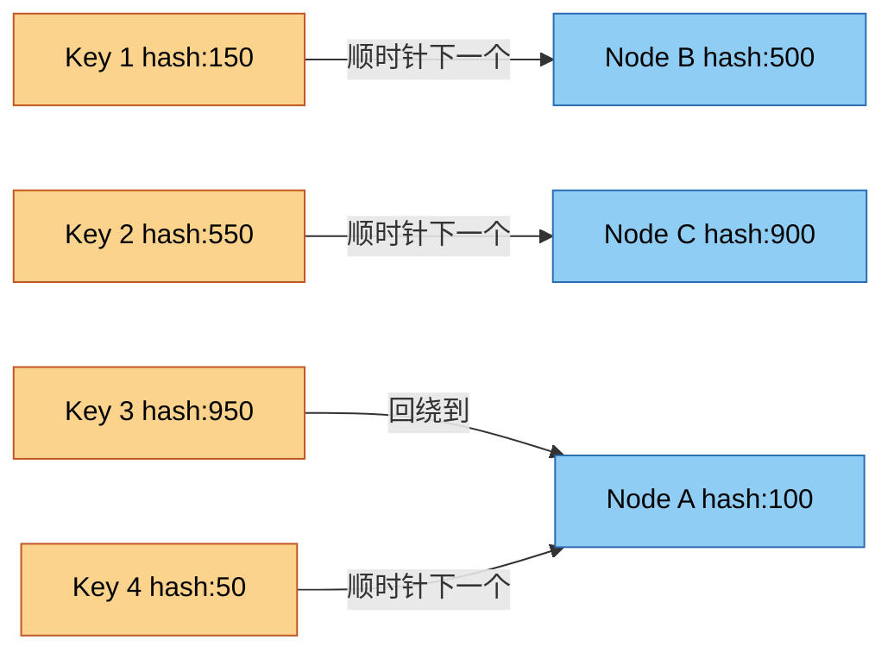
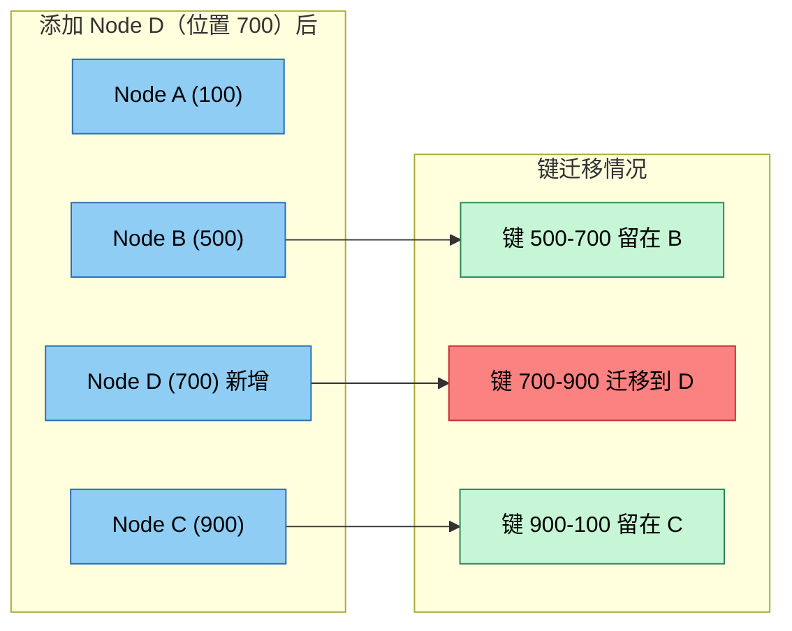
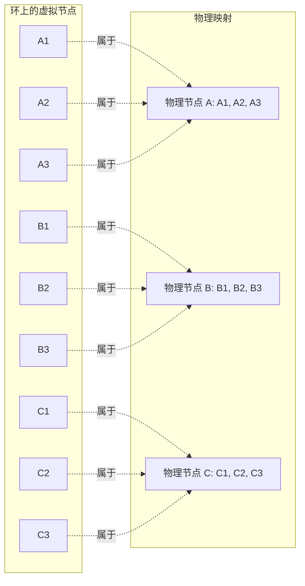
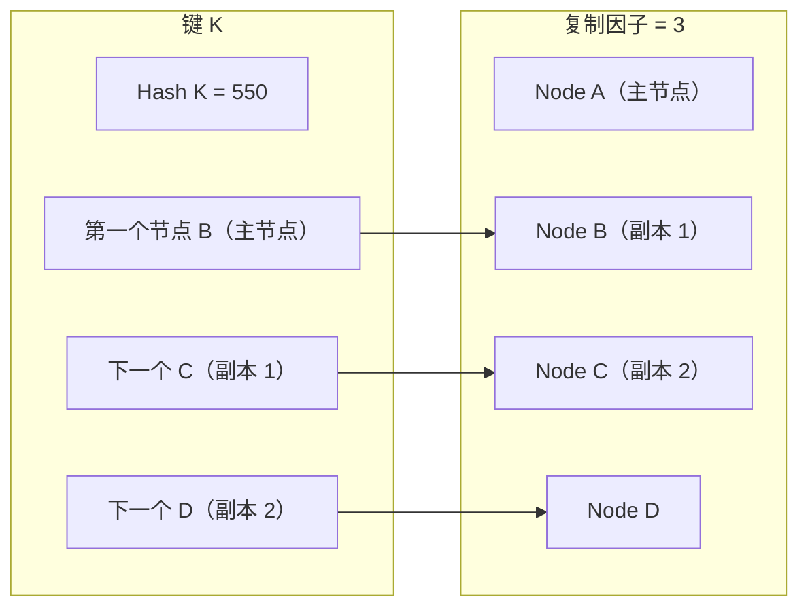

# 一致性哈希

一致性哈希是在分布式系统中分发数据的基础技术，能够在节点增减时最小化数据迁移。它是现代分布式缓存、数据库和负载均衡器的核心机制。

## 问题：为什么需要一致性哈希

### 传统哈希方法

给定 `n` 个缓存节点，朴素方法使用 `hash(key) % n` 来路由请求：

```
node = hash(user_id) % n
```

**问题**：当 `n` 变化（增减节点）时，几乎所有键都重新映射到不同节点：

- 10 个节点 → 增加 1 个节点：约 91% 的键重新映射（`1 - 10/11`）
- 10 个节点 → 移除 1 个节点：约 10% 的键永久丢失
- 数据库/缓存影响：大规模同时缓存未命中雪崩

这对分布式系统是灾难性的：
- 热数据同时变冷
- 源数据库被缓存重建请求淹没
- 重新分片期间系统延迟飙升
- 迁移期间数据暂时不可用

### 一致性哈希的解决方案

一致性哈希保证：
- 添加节点时**只有 K/n 的键重新映射**（K = 总键数，n = 节点数）
- 移除节点时**只有 K/n 的键重新映射**
- 其他所有键保留在原节点
- 平滑重平衡，无大规模中断

## 一致性哈希的工作原理

### 核心概念：哈希环

一致性哈希不再映射到线性范围 `[0, n-1]`，而是将**数据键**和**节点**都映射到一个大型环形地址空间（通常是 `0` 到 `2^32-1` 或 `2^64-1`）。



### 路由算法

查找存储某个键的节点：
1. 哈希键：`position = hash(key)`
2. 沿环顺时针移动
3. 遇到的第一个节点就是**负责节点**

### 添加节点

添加新节点时：
1. 哈希节点标识符找到其位置
2. 该节点接管从其位置**顺时针到下一个节点**之间的键
3. 只有这些键需要迁移（通常是总键数的 `1/n`）



### 移除节点

当节点故障或被移除时：
1. 该节点的键范围成为孤儿
2. 顺时针下一个节点继承该范围
3. 只有故障节点的键需要重新映射

## 虚拟节点：解决分布不均匀问题

### 问题

基本一致性哈希有以下问题：
- **分布不均匀**：节点少时，数据分布不均
- **热点**：某个受欢迎的节点承担不成比例的流量
- **容量不均**：不同节点有不同的硬件容量

### 解决方案：虚拟节点（VNodes）

每个物理节点在环上由多个虚拟节点表示：
- 物理节点 A → 虚拟节点 A1、A2、A3、...、A100
- 每个虚拟节点在环上有自己的位置
- 更多虚拟节点 = 更好的分布，但更多元数据开销



### 虚拟节点的优势

**更好的负载分布**：
- 3 个物理节点，每个 100 个虚拟节点 → 300 个分布点
- 将方差从 ±50% 降低到 ±5%
- 渐近地趋向均匀分布

**异构容量支持**：
- 强大节点：200 个虚拟节点
- 较小节点：100 个虚拟节点
- 更大的节点按比例处理更多数据

**故障域隔离**：
- 每个物理节点的数据分散在环上
- 一个故障将负载分散到多个幸存节点
- 部分故障期间更好的负载分布

**更容易重平衡**：
- 添加节点：增量添加其虚拟节点
- 每个虚拟节点接管一小片
- 渐进式数据迁移，非批量迁移

## 数学分析

### 键分布

`N` 个物理节点，每个物理节点 `V` 个虚拟节点：
- 总虚拟节点数：`N × V`
- 每个节点预期 `1/N` 的键
- 负载分布标准差：`σ ≈ 1/√(N × V)`

**示例**：
- 10 个节点，每个 100 个虚拟节点 → 1000 个总虚拟节点
- 每个节点预期键数：10%
- 标准差：~3.2%

### 拓扑变化时的数据迁移

**添加一个节点**：
- 旧节点数：`n`
- 新节点数：`n+1`
- 迁移键数：约 `K/(n+1)`，K = 总键数
- 迁移百分比：`1/(n+1)`

**移除一个节点**：
- 迁移键数：约 `K/n`
- 迁移百分比：`1/n`

**10 亿键的示例**：
- 传统哈希（10→11 节点）：约 91% 迁移（~9.1 亿键）
- 一致性哈希（10→11 节点）：约 9% 迁移（~9000 万键）

## 哈希函数选择

### 要求

**良好的分布性**：
- 哈希空间中均匀分布
- 最小化碰撞
- 雪崩效应（输入微小变化 → 输出大幅变化）

**性能**：
- 快速计算（热路径上关键）
- 最小 CPU 开销
- 缓存友好的访问模式

**确定性**：
- 相同输入始终产生相同哈希值
- 环稳定性关键

### 常见选择

| 哈希函数 | 位数 | 速度 | 质量 | 备注 |
|---------|------|------|------|------|
| **MurmurHash3** | 128 | 快 | 优秀 | 非加密，广泛使用 |
| **xxHash** | 64 | 非常快 | 很好 | CPU 优化，流行 |
| **CityHash** | 64/128 | 快 | 很好 | Google 的哈希，针对字符串优化 |
| **SHA-1** | 160 | 慢 | 优秀 | 非加密用途过重 |
| **SHA-256** | 256 | 更慢 | 优秀 | 加密哈希，较慢 |

**推荐**：大多数分布式系统使用 MurmurHash3 或 xxHash。

### 哈希环大小

常见选择：
- **32 位环（0 到 2^32-1）**：约 40 亿个位置，大多数系统足够
- **64 位环（0 到 2^64-1）**：几乎无限碰撞空间，大规模使用
- **SHA-1（160 位）**：Amazon Dynamo 使用，视为环形

更大的环 = 更低的碰撞概率，但更多元数据内存。

## 实际应用

### 分布式缓存系统

**Redis Cluster**：
- 使用哈希槽（16384 个槽）而非纯一致性哈希
- 每个主节点拥有多个槽
- 类似原理：拓扑变化时最小化重排

**Memcached（Ketama）**：
- 流行的一致性哈希实现
- 默认每台服务器 160 个虚拟节点
- Twitter、Facebook 等使用

**DynamoDB**：
- 每个分区跨多个节点
- 一致性哈希用于分区放置
- 虚拟节点用于负载均衡

### 内容分发网络

**Akamai CDN**：
- 通过一致性哈希将内容 URL 映射到边缘服务器
- 添加新边缘服务器 → 最少内容重映射
- 扩展期间维持缓存命中率

### 负载均衡

**NGINX 一致性哈希**：
- 负载均衡器模块，一致性哈希路由
- 无需集中式会话存储的粘性会话
- 添加后端服务器 → 最少会话中断

### 分布式数据库

**Cassandra**：
- 一致性哈希用于数据分区
- 虚拟节点（vnodes）用于 token 分配
- 每个节点负责多个 token 范围

**Riak**：
- 一致性哈希是数据分布的核心
- 可配置每物理节点的虚拟节点数
- 副本优先列表概念

## 高级主题

### 复制

一致性哈希天然支持复制：
- 找到键的主节点后
- 继续顺时针找 `R-1` 个更多节点
- 这些就是副本节点



**优势**：
- 自动副本放置
- 无需集中式目录
- 通过数据冗余实现容错

### 使用复合键的数据分区

多维数据：
```
composite_key = hash(user_id) + hash(timestamp)
partition = consistent_hash(composite_key)
```

**用例**：带用户分区的时间序列数据
- 确保同一用户的数据位于同一位置
- 在用户内，基于时间的分区实现高效查询

### 热点缓解

**问题**：某些键异常热门（流行项目）。

**解决方案**：

1. **为热键添加虚拟节点**：
   - 热键获得多个虚拟节点
   - 负载分散到多个物理节点

2. **本地缓存 + 一致性哈希**：
   - 热键使用近端缓存
   - 一致性哈希用于缓存到源站的路由

3. **请求合并**：
   - 同一键的多个并发请求
   - 单次源站请求，多个响应

### 故障处理与容错

**节点故障检测**：
- 心跳/gossip 协议
- 标记节点为故障
- 其虚拟节点的范围重新分配

**临时故障（节点恢复）**：
- 某些系统选择等待恢复
- 避免不必要的数据迁移
- 权衡：临时不可用 vs. 重平衡成本

**永久故障（节点移除）**：
- 顺时针下一个节点继承范围
- 可能导致临时负载不均
- 系统最终重平衡

## 实现考量

### 元数据管理

**节点级元数据**：
- 虚拟节点位置
- 每个虚拟节点的键范围
- 复制关系

**集群级元数据**：
- 总节点数、每节点虚拟节点数
- 复制因子
- 配置版本管理

**元数据分发**：
- 集中式配置服务（ZooKeeper、etcd）
- 去中心化系统的 Gossip 协议
- 过期元数据容忍 vs. 一致性要求

### 客户端 vs. 服务端路由

**客户端路由**：
- 客户端本地缓存环元数据
- 客户端直接计算目标节点
- **优点**：无路由瓶颈，低延迟
- **缺点**：客户端复杂度，元数据同步

**服务端路由**：
- 任何节点可接收任何请求
- 路由层转发到正确节点
- **优点**：简单客户端，集中控制
- **缺点**：路由跳开销，路由瓶颈风险

**混合方式**：
- 客户端缓存元数据，直接处理请求
- 元数据过期时回退到路由层
- 兼具两者优势

### 重平衡策略

**立即重平衡**：
- 拓扑变化后立即迁移数据
- **优点**：系统快速平衡
- **缺点**：高数据传输开销，网络拥塞

**渐进式重平衡**：
- 限制并发数据传输
- 节流重平衡流量
- **优点**：可控的网络使用
- **缺点**：更长的不平衡期

**优先级重平衡**：
- 优先迁移热键
- 冷数据后续迁移
- **优点**：关键数据先平衡
- **缺点**：更复杂的逻辑

### 监控与可观测性

**关键指标**：
- 节点间数据分布（方差、热点）
- 每节点请求分布
- 重平衡期间数据传输速率
- 重平衡持续时间
- 重平衡前后的缓存命中率

**告警**：
- 不均匀分布超过阈值
- 长时间重平衡
- 过多数据迁移
- 热点检测

## 权衡与局限性

### 何时不适合使用一致性哈希

**小规模系统**：
- 少于约 5 个节点：收益递减
- 更简单的方案可能足够

**频繁拓扑变化**：
- 频繁自动扩缩容的环境
- 重平衡开销可能超过收益
- 考虑替代分区策略

**强一致性需求**：
- 一致性哈希是最终一致性
- 对于强一致性，考虑基于共识的系统

### 替代方案

**范围分区**：
- 按键范围分区（如 a-m、n-z）
- **优点**：高效范围查询，简单
- **缺点**：热点风险，分布不均
- **适用于**：时间序列数据，分析工作负载

**目录分区**：
- 集中式映射服务跟踪键到节点的分配
- **优点**：灵活，可优化负载
- **缺点**：单点故障，扩展瓶颈
- **适用于**：小规模系统，灵活性优先

**模哈希（Jump Hash）**：
- 一致性哈希的数学替代方案
- 确定性，最小元数据
- **优点**：快速计算，低开销
- **缺点**：添加节点需要完全重排
- **适用于**：稳定的集群规模

## 生产最佳实践

### 虚拟节点配置

**起始建议**：
- 每物理节点 100-200 个虚拟节点
- 根据分布方差调整
- 更多虚拟节点 = 更好分布，更多内存

**异构集群**：
- 虚拟节点数与节点容量成比例
- 强大节点：2× 虚拟节点
- 监控确保平衡匹配容量

### 哈希函数与环大小

**默认选择**：
- MurmurHash3 或 xxHash
- 64 位或 128 位哈希空间
- 避免加密哈希（不必要开销）

### 复制配置

**复制因子**：
- 通用场景：3 个副本
- 关键数据：更多副本
- 成本敏感：更少副本

**副本放置**：
- 将副本分散到不同故障域（机架、可用区）
- 确保单个机架故障不会丢失所有副本

### 运维检查清单

- [ ] 监控分布方差和热点
- [ ] 负载不均时告警
- [ ] 带节流的渐进式重平衡
- [ ] 测试故障场景（节点丢失、网络分区）
- [ ] 定期重平衡演练
- [ ] 版本化元数据以支持回滚
- [ ] 客户端库处理元数据刷新
- [ ] 元数据不匹配时回退到路由层

## 总结

一致性哈希是分布式系统的基础技术，在拓扑变化时最小化数据迁移。其核心优势包括：

- **最小中断**：节点变化时只有 1/n 的键重新映射
- **可扩展性**：天然支持水平扩展
- **容错性**：优雅降级和恢复
- **简洁性**：优雅的算法，属性被充分理解

在设计分布式缓存、数据库或负载均衡器时，一致性哈希应是你首先考虑的分区策略之一。它在各大主流系统中久经考验，在提出数十年后仍然具有现实意义。

**关键要点**：
1. 需要可扩展数据分布时使用一致性哈希
2. 虚拟节点对均匀分布至关重要
3. 非加密哈希选择 MurmurHash3 或 xxHash
4. 监控分布方差并调整虚拟节点数
5. 上线前充分测试故障场景
