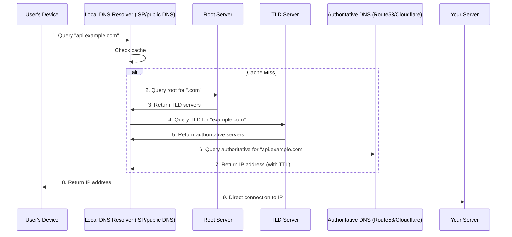
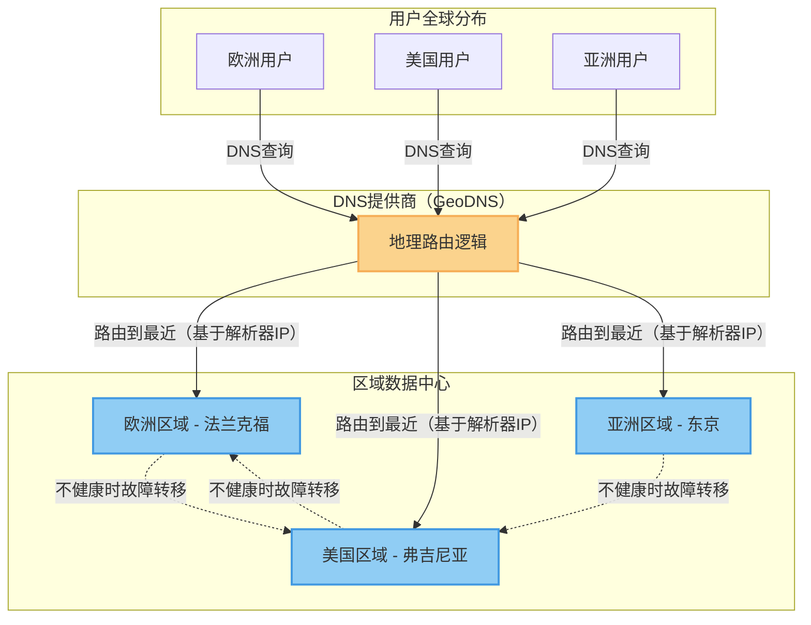
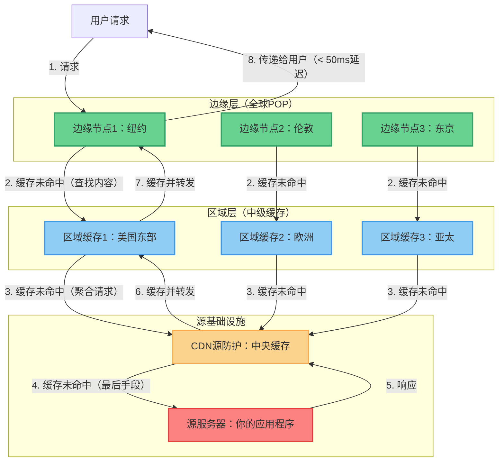

# 1. 入口层

入口层是系统的第一个边界。它的职责是将"不可信、突发性、多样化"的外部流量转换为"可路由、已认证、已治理"的内部请求。

这一层是许多故障开始的地方，也是许多故障可以预防的地方。同时，这里的小配置错误可能会造成很大的影响范围。设计良好的入口层可以保护系统免受滥用，高效地分发流量，并为横切关注点提供单一治理点。

## 这一层包含的内容

- 全局流量管理：DNS路由、地理分布和故障转移协调
- 边缘安全：WAF策略、DDoS缓解、机器人检测和流量过滤
- 流量分发：负载均衡、健康检查和安全故障转移
- 策略执行：认证、授权、限流、配额和滥用保护
- 路由和版本控制：路径/主机/头部路由、金丝雀发布和兼容性管理
- API网关功能：请求/响应转换、协议转换和聚合
- 边缘缓存和计算：CDN缓存、边缘计算和内容传递优化
- 入口可观察性：访问日志、高基数请求元数据和请求关联

如果在这里继续添加"只是一个规则"的处理，请将其视为一个产品：配置评审、变更管理和回滚必须是第一流的。

## 为什么它很重要

### 1. 它将可靠性向上游移动
早期拒绝或调整流量比在服务图深处处理负载更有效。边缘的失败请求比经过五个内部跃点的失败请求成本更低。DNS级别的故障转移和基于边缘的阻止可以阻止恶意流量到达你的基础设施。

### 2. 它集中了横切关注点
认证、限流、路由和兼容性规则很难在多个服务中一致地实现。受控的入口点可以防止"策略漂移"，并确保所有服务保持一致的安全态势。

### 3. 它支持后端演化
当客户端调用稳定的合约（网关/BFF）时，你的内部拓扑可以在不断破坏客户端的情况下进行演化。DNS抽象允许你在不破坏客户端的情况下移动基础设施。

### 4. 它优化了全球用户体验
边缘缓存、计算和智能路由将内容带到用户附近，减少延迟并提高感知性能，无论地理位置如何。适当的DNS路由确保用户自动到达最佳端点。

## 缺点和风险

- 延迟开销：每个边缘功能都需要时间和计算成本
- 配置风险：一个糟糕的规则可能会让整个系统宕机
- DNS传播延迟：更改需要时间在全球范围内传播，导致不一致
- 瓶颈：如果未设计为可扩展，集中的网关可能成为扩展限制
- 治理摩擦：过度集中控制可能会拖慢团队并导致变通方案
- 操作复杂性：边缘的更多移动部件意味着更多潜在的故障点
- 成本：全局边缘部署、高级负载均衡器和DNS服务在大规模时可能很昂贵
- 缓存复杂性：全局范围内过时内容传播和失效的挑战

## DNS作为全局流量调度器

DNS（域名系统）是互联网的目录服务，但对于高可用性系统，它充当全局流量调度器。它是将用户请求路由到你的基础设施的第一个决策点，使其成为入口层可靠性的关键组件。

### DNS解析流程

当用户请求你的服务时，DNS解析发生在连接到你的基础设施之前的任何网络连接：



**流程步骤：**
1. **用户设备查询本地DNS解析器**（通常是ISP或公共DNS如Google 8.8.8.8）
2. **DNS解析器检查缓存** - 如果缓存且未过期，跳到第8步
3. **解析器查询根服务器**获取TLD（.com、.org等）
4. **根返回负责该域扩展名的TLD服务器**
5. **解析器查询TLD服务器**获取域名（example.com）
6. **TLD返回该域的权威DNS服务器**
7. **解析器查询权威DNS**获取完整主机名
8. **权威DNS基于你的路由策略返回IP地址**
9. **用户设备直接连接**到返回的IP地址

**关键含义：** DNS决策在你的基础设施之外进行。一旦返回IP地址，在DNS缓存过期之前，你无法重定向请求。

### 地理路由（GeoDNS）

**目的：** 根据地理位置将用户路由到最近或最合适的区域。

**工作原理：**
- DNS提供商从DNS查询的源IP识别用户位置
- 返回最近数据中心或最佳区域的IP地址
- 可以根据提供商功能在国家、区域或城市级别路由

**优点：**
- 减少全球用户的延迟（连接到最近区域）
- 合规优势（数据驻留要求、GDPR）
- 跨区域的负载分布
- 自动故障转移到健康区域

**缺点：**
- 有限的粒度（国家或区域级别，不是城市级精度）
- DNS解析器位置可能与用户位置不匹配（ISP DNS、公司DNS、公共DNS）
- 缓存响应降低路由效果（TTL挑战）
- 多区域策略的复杂配置

**准确性限制：**
- DNS查询来自DNS解析器，而不是用户设备
- 公司VPN、公共DNS服务（Google、Cloudflare）和ISP基础设施掩盖用户位置
- 典型准确性：国家级别（95%+）、区域级别（70-80%）、城市级别（50-60%）



**最适合：**
- 具有区域数据中心的全球SaaS
- 合规驱动的路由（数据驻留要求）
- 全球用户群性能优化
- 多区域主动-主动架构

**业务场景示例：**

*全球SaaS平台：*
- 欧洲用户路由到法兰克福区域（GDPR合规）
- 亚洲用户路由到东京区域（延迟优化）
- 美国用户路由到弗吉尼亚区域（最大用户群）
- 故障转移：如果法兰克福区域故障，欧洲用户路由到弗吉尼亚（增加延迟但系统保持可用）

*内容传递策略：*
- 将用户路由到最近的边缘POP（存在点）
- 静态内容来自CDN边缘节点
- 动态内容来自区域源服务器
- 基于地理的功能标记（渐进式区域发布）

### 加权流量分发

**目的：** 在多个端点之间按百分比分发流量，实现渐进式迁移和容量管理。

**工作原理：**
- 为每个DNS记录分配权重（例如，区域A占50%，区域B占50%）
- DNS提供商根据权重轮换响应
- 支持蓝绿部署和金丝雀发布

**用例：**

**蓝绿部署：**
- 100%到当前版本（区域A）
- 切换到0%区域A，100%区域B（即时切换）
- 回滚：切换回100%区域A
- **业务价值：** 零停机部署，即时回滚能力

**渐进式迁移（金丝雀）：**
- 第1周：区域A（旧版）90%，区域B（新版）10%
- 第2周：区域A 75%，区域B 25%
- 第3周：区域A 50%，区域B 50%
- 第4周：区域A 0%，区域B 100%
- **业务价值：** 控制风险暴露，渐进式容量构建

**容量管理：**
- 70%到主区域（较大容量）
- 30%到次要区域（较小容量）
- 根据成本和容量约束调整权重
- **业务价值：** 在保持性能的同时优化基础设施成本

**优点：**
- 无需更改基础设施即可进行简单的流量分割
- 支持渐进式发布和测试
- 无需客户端更改
- 快速回滚能力

**缺点：**
- DNS缓存降低精度（用户停留在缓存的IP上）
- 不适合每个请求的路由（粒度太粗）
- 分割粒度有限（取决于DNS提供商）
- 缓存过期期间客户端可见IP更改

### DNS健康检查和故障转移

**目的：** 自动将流量从不健康的端点路由走，以保持可用性。

**工作原理：**
- DNS提供商持续监控每个端点的健康状况
- 健康检查：HTTP/HTTPS探测、TCP连接检查或自定义健康检查端点
- 不健康的端点自动从DNS响应中移除
- 流量自动重定向到健康的端点

**健康检查配置：**

**检查类型：**
- **HTTP/HTTPS检查：** 请求特定路径（例如，`/health`），期望200 OK响应
- **TCP检查：** 验证端口是否接受连接
- **自定义检查：** 域特定的健康逻辑（数据库连接、外部依赖）

**检查参数：**
- **检查间隔：** 探测频率（通常10-60秒）
- **超时：** 等待响应的时间（通常2-10秒）
- **故障阈值：** 连续失败多少次后标记为不健康（通常2-5次）
- **恢复阈值：** 连续成功多少次后标记为健康（通常2-5次）

**优点：**
- 无需人工干预的自动故障转移
- 减少MTTR（平均修复时间）
- 地理冗余（故障转移到不同区域）
- 配置简单，无需复杂的路由基础设施

**缺点：**
- 故障转移时间受DNS缓存限制（TTL）
- 误报（临时网络故障触发故障转移）
- 摆动（如果健康检查不稳定，状态快速变化）
- 目标基础设施上的健康检查开销

**故障转移场景：**

*区域故障：*
1. 美国东部区域变得不健康（健康检查失败）
2. DNS从响应中移除美国东部IP
3. 新的DNS查询只返回美国西部IP
4. 拥有美国东部缓存IP的现有用户在缓存过期前遇到错误
5. **业务影响：** 新用户立即工作，现有用户在TTL时间内恢复

*渐进降级：*
- 健康检测到响应时间增加
- 自动将流量转移到更健康的区域
- 通过重新分配负载防止级联故障
- **业务影响：** 在部分降级情况下保持性能

### TTL配置权衡

**TTL（生存时间）：** DNS响应被DNS解析器和客户端缓存的时间。

**低TTL（30-60秒）：**

**优点：**
- 快速故障转移（更改快速传播）
- 能够快速响应事件
- 灵活的流量管理

**缺点：**
- 更高的DNS查询量（更频繁地查询权威DNS）
- 增加DNS提供商成本
- 略高的初始连接延迟（更多DNS查找）

**最适合：**
- 主动-被动故障转移场景
- 快速变化的基础设施
- 需要快速更改的事件响应
- 需要快速回滚的蓝绿部署

**高TTL（300-3600秒）：**

**优点：**
- 减少DNS查询量（降低成本）
- 更快的解析（缓存响应）
- 减少对权威DNS基础设施的负载

**缺点：**
- 慢速故障转移（缓存的IP在TTL持续时间内持续存在）
- 响应事件的能力有限
- 更改在全球范围内传播需要时间

**最适合：**
- 很少更改的稳定基础设施
- 成本敏感的部署
- 具有高可用性要求的静态IP

**TTL策略框架：**

*关键生产服务：*
- 主要记录：60-120秒（平衡快速故障转移和成本）
- 紧急覆盖：5-10秒（仅事件响应，高成本）
- 静态资源：3600+秒（不常更改）

*开发/暂存环境：*
- 300-600秒（更改可接受，成本优化）

*内部服务：*
- 60-300秒（操作灵活性）

**业务影响：**

*快速故障转移场景：*
- TTL：30秒
- 在00:00:00检测到故障
- 在00:00:30更新DNS
- 最后缓存响应在00:01:00过期
- 总故障转移时间：约60秒
- 用户影响：新请求60秒错误

*慢速故障转移场景：*
- TTL：300秒（5分钟）
- 在00:00:00检测到故障
- 在00:02:30更新DNS
- 最后缓存响应在00:05:00过期
- 总故障转移时间：约5分钟
- 用户影响：新请求5分钟错误

## Web应用防火墙（WAF）

### WAF基础和放置

**目的：** 保护Web应用程序免受绕过传统网络防火墙的应用层（第7层）攻击。

**WAF防护内容：**
- OWASP十大漏洞（SQL注入、XSS、CSRF等）
- 机器人流量和自动化攻击
- 应用层DDoS攻击
- 通过虚拟修补的零日漏洞利用
- 恶意文件上传和注入攻击

**WAF在架构中的放置：**

**负载均衡器前的WAF（云WAF/CDN集成）：**

```
用户 → DNS → WAF/DDoS保护 → 负载均衡器 → 应用服务器
```

**优点：**
- 在流量到达你的基础设施之前阻止恶意流量
- 独立于你的基础设施扩展（云提供商扩展）
- 在边缘吸收DDoS（你的基础设施永远不会看到攻击流量）
- 托管的安全规则和威胁情报
- 全球分布（处处保护）

**缺点：**
- 每请求额外成本
- 供应商锁定（专有规则语法）
- 对被阻止请求的可见性有限（日志访问取决于供应商）
- 可能产生误判阻止合法流量
- 对规则评估过程的控制有限

**最适合：**
- 公开面向的Web应用程序
- 高风险目标（金融、医疗、电子商务）
- 缺乏专门安全知识的团队
- 需要全球DDoS保护的应用程序

**业务场景：** 节假日销售期间的电子商务网站使用云WAF阻止SQL注入尝试和抓取攻击，同时吸收DDoS流量，确保合法客户始终能够完成购买。

**负载均衡器后的WAF（自托管WAF）：**

```
用户 → DNS → 负载均衡器 → WAF → 应用服务器
```

**优点：**
- 对规则和评估逻辑的完全控制
- 无额外每请求成本（基于软件）
- 所有请求的详细可见性（包括被阻止的）
- 应用特定威胁的自定义规则
- 无供应商锁定

**缺点：**
- 你的基础设施必须处理攻击流量（扩展风险）
- 需要安全专业知识来配置和维护
- DDoS攻击可能在WAF评估之前压垮基础设施
- 操作开销（规则更新、日志分析、调优）

**最适合：**
- 具有合规要求的内部应用程序（数据驻留）
- 具有非常特定安全要求的应用程序
- 具有强大安全团队的组织
- 供应商锁定不可接受的情况

**业务场景：** 金融服务公司为交易处理系统运行自托管WAF，以保持对安全规则的完全控制，并确保所有日志都保持在受管基础设施内。

### OWASP十大防护

**OWASP十大：** 开放Web应用程序安全项目确定的十大最关键的Web应用程序安全风险。

**WAF防护覆盖范围：**

**1. 注入（SQL、NoSQL、OS命令、LDAP）：**
- **攻击：** 用户输入中的恶意数据在后端执行命令
- **WAF防护：** SQL语法、命令元字符、编码异常的模式匹配
- **权衡：** 激进阻止可能破坏合法输入（例如，包含类SQL字符串的文本）
- **业务影响：** 数据库泄露、数据泄露、系统完全被攻破

**2. 身份验证损坏：**
- **攻击：** 利用身份验证漏洞（会话劫持、凭证填充）
- **WAF防护：** 检测暴力破解模式、凭证填充攻击、会话异常
- **权衡：** 可能阻止共享凭证或来自同一IP的合法用户
- **业务影响：** 未经授权的账户访问、数据盗窃、隐私侵犯

**3. 敏感数据泄露：**
- **攻击：** 通过加密差或数据泄露暴露敏感数据
- **WAF防护：** 检测数据泄露模式（响应中的信用卡号、SSN）
- **权衡：** 需要仔细调优以避免合法数据的误判
- **业务影响：** 监管罚款、声誉损害、法律责任

**4. XML外部实体（XXE）：**
- **攻击：** 利用XML处理器访问本地文件或导致拒绝服务
- **WAF防护：** 阻止具有实体声明或可疑XML结构的XML
- **权衡：** 可能破坏合法的基于XML的API
- **业务影响：** 数据泄露、系统被攻破、拒绝服务

**5. 访问控制损坏：**
- **攻击：** 绕过授权访问未授权数据
- **WAF防护：** 检测路径遍历尝试、强制浏览、IDOR模式
- **权衡：** WAF规则难以表达复杂的授权逻辑
- **业务影响：** 未经授权的数据访问、隐私侵犯

**6. 安全配置错误：**
- **攻击：** 利用默认配置、暴露的管理面板、详细的错误消息
- **WAF防护：** 阻止访问常见管理路径、敏感文件扩展名
- **权衡：** 如果规则过于宽泛，可能阻止合法的管理访问
- **业务影响：** 系统被攻破、数据泄露、系统完全接管

**7. 跨站脚本（XSS）：**
- **攻击：** 注入在受害者浏览器中执行的恶意脚本
- **WAF防护：** 脚本标签、事件处理器、JavaScript注入的模式匹配
- **权衡：** 可能阻止合法的用户生成内容（论坛、评论）
- **业务影响：** 用户会话劫持、恶意软件分发、网络钓鱼

**8. 不安全反序列化：**
- **攻击：** 利用不受信任数据的反序列化来执行代码
- **WAF防护：** 检测序列化对象模式、已知攻击链
- **权衡：** 没有深度协议理解难以检测
- **业务影响：** 远程代码执行、系统完全被攻破

**9. 使用已知漏洞的组件：**
- **攻击：** 利用库和框架中的已知漏洞
- **WAF防护：** 虚拟修补（阻止已知CVE的利用尝试）
- **权衡：** 依赖供应商提供CVE覆盖和规则更新
- **业务影响：** 使用公开已知漏洞的系统被攻破

**10. 不足的日志记录和监控：**
- **攻击：** 利用缺乏可见性来未检测地进行攻击
- **WAF防护：** 提供安全日志、攻击警报、指标
- **权衡：** 高日志量需要存储和分析基础设施
- **业务影响：** 延迟事件检测、延长攻击者停留时间

**误判 vs 漏判的权衡：**

**保守模式（低误判）：**
- 仅阻止明显恶意的流量
- 一些攻击通过到应用程序（应用程序必须处理）
- 最适合：具有复杂输入需求的API、用户生成内容
- **业务成本：** 增加应用程序级别安全负担

**激进模式（低漏判）：**
- 阻止任何可疑内容
- 可能阻止合法用户流量（误判）
- 最适合：高安全性应用程序、低容量内部系统
- **业务成本：** 用户体验影响、被阻止用户的支持负担

### 机器人管理策略

**机器人类别：**

**好机器人（允许）：**
- 搜索引擎爬虫（Googlebot、Bingbot）
- 监控服务（正常运行时间检查、可用性监控）
- 聚合器（新闻阅读器、价格比较）
- **策略：** 通过用户代理和/或IP验证列入白名单

**坏机器人（阻止）：**
- 凭证填充机器人（测试被盗密码）
- 抢购机器人（库存囤积、门票倒卖）
- 抓取工具（内容盗窃、价格抓取）
- DDoS机器人（参与僵尸网络攻击）
- 垃圾邮件机器人（评论垃圾邮件、表单提交滥用）
- **策略：** 阻止、限流或挑战

**灰色区域（管理）：**
- 激进监控工具（可能影响性能）
- 研究爬虫（未知声誉）
- 自动化API客户端（合法但激进）
- **策略：** 限流、监控、要求API密钥

**机器人检测技术：**

**1. 用户代理分析：**
- 简单标识符检查
- 被复杂的机器人轻易伪造
- **有效性：** 低（适用于粗过滤，不适用于安全）

**2. IP声誉：**
- 维护已知机器人/VPN/主机提供商IP列表
- 阻止或挑战来自可疑IP的流量
- **有效性：** 中等（适用于已知行为者， misses新威胁）

**3. 限流和行为分析：**
- 检测非人类模式（一致的请求时间、不可能的导航）
- 检测来自单一来源的高请求量
- **有效性：** 高（捕获自动化行为，合法用户不受影响）

**4. JavaScript挑战：**
- 要求执行JavaScript来证明浏览器
- 阻止无头浏览器和简单HTTP客户端
- **有效性：** 中等到高（对用户造成不便，复杂机器人可以执行JS）

**5. CAPTCHA挑战：**
- 要求人工交互（图像识别、谜题）
- 高度有效但用户体验差
- **有效性：** 高（仅对可疑流量作为最后手段）

**6. 设备指纹识别：**
- 分析浏览器特征（TLS指纹、HTTP/2指纹、头部）
- 检测自动化工具和模拟器
- **有效性：** 中等到高（可以被绕过，隐私问题）

**7. 基于令牌的验证：**
- 要求来自可信来源的令牌（Cloudflare、Google）
- 在允许访问前验证令牌
- **有效性：** 高（依赖第三方机器人检测）

**业务场景示例：**

*电子商务库存抢购：*
- **问题：** 机器人立即购买有限库存用于转售
- **解决方案：** 机器人检测 + JavaScript结账挑战
- **权衡：** 合法用户可能面临稍慢的结账体验
- **业务结果：** 公平的库存分配，提高客户满意度

*登录凭证填充：*
- **问题：** 机器人在多个账户上测试被盗密码
- **解决方案：** 限流 + IP声誉 + 设备指纹识别
- **权衡：** 来自共享IP（办公室、校园）的用户可能面临挑战
- **业务结果：** 减少账户接管，提高安全态势

*API抓取：*
- **问题：** 竞争对手抓取定价和产品数据
- **解决方案：** 要求API密钥、每个密钥限流、检测抓取模式
- **权衡：** 增加合法API用户的摩擦
- **业务结果：** 保护竞争情报，确保公平的API使用

### DDoS缓解和流量清洗

**DDoS（分布式拒绝服务）：** 从多个来源向服务发送流量，使其对合法用户不可用。

**DDoS攻击类型：**

**容量攻击（第3/4层）：**
- **目标：** 消耗所有可用带宽
- **方法：** UDP洪水、ICMP洪水、放大反射攻击
- **典型大小：** 100-1000+ Gbps
- **缓解：** 任意播网络、流量清洗中心

**协议攻击（第3/4层）：**
- **目标：** 耗尽服务器资源（连接、CPU、内存）
- **方法：** SYN洪水、ACK洪水、连接耗尽
- **典型大小：** 较低带宽但高连接数
- **缓解：** 连接限流、SYN Cookie、任意播

**应用层攻击（第7层）：**
- **目标：** 耗尽应用程序资源（数据库、API、应用程序逻辑）
- **方法：** HTTP洪水、慢速POST攻击、请求到昂贵端点
- **典型大小：** 低带宽、高请求率
- **缓解：** WAF、限流、应用级保护

**DDoS缓解策略：**

**1. 任意播路由：**

*工作原理：*
- 多个数据中心从不同位置宣布相同的IP地址
- BGP将流量路由到最近的数据中心
- DDoS流量分布在多个位置

*优点：*
- 没有单点故障
- 自然流量分布
- 通过分布式负载吸收攻击

*缺点：*
- 需要网络基础设施和BGP专业知识
- 仅限于具有全球存在的大型提供商
- 配置复杂

*最适合：* 大规模攻击（100+ Gbps）、全球服务

**2. 基于CDN的DDoS保护：**

*工作原理：*
- CDN边缘节点吸收并过滤攻击流量
- 仅合法流量到达源
- 利用全球网络容量

*优点：*
- 可扩展到大规模攻击（CDN比源有更大容量）
- 无需基础设施更改
- 始终开启的保护

*缺点：*
- 额外成本（特别是在大型攻击期间）
- 仅限于CDN支持的协议（主要是HTTP/HTTPS）
- 供应商依赖

*最适合：* Web应用程序、HTTP洪水、中小规模攻击

**3. 本地流量清洗：**

*工作原理：*
- 在应用程序基础设施之前部署清洗设备
- 在网络边缘检查和过滤流量
- 可以与云清洗结合使用混合方法

*优点：*
- 对过滤逻辑的完全控制
- 无额外每请求成本（基于软件）
- 保持流量分析在内部

*缺点：*
- 你的带宽仍被攻击流量消耗
- 容量有限（只能支持网络支持的）
- 硬件和维护成本

*最适合：* 合规要求（数据不能离开基础设施）、小规模攻击

**4. 云清洗服务（始终开启 vs 按需）：**

*始终开启：*
- 所有流量通过清洗中心路由
- 无激活延迟
- 更高的持续成本
- 最适合：高风险目标、24/7关键服务

*按需：*
- 正常流量直接到达源
- 攻击期间，DNS更改为通过清洗中心路由
- 更低的持续成本，激活延迟（DNS传播时间）
- 最适合：成本敏感部署、间歇性攻击风险

**业务场景示例：**

*游戏平台发布期间：*
- **攻击：** 发布期间500 Gbps容量攻击
- **缓解：** 任意播 + 基于CDN的保护
- **结果：** 合法玩家连接到最近的边缘，攻击流量全球分布
- **业务结果：** 成功发布，无停机，积极用户体验

*金融交易时段：*
- **攻击：** 针对昂贵交易端点的应用层攻击
- **缓解：** WAF + 限流 + 机器人检测
- **结果：** 恶意请求被阻止，合法交易正常处理
- **业务结果：** 无交易中断，保持合规性

*新闻网站突发事件期间：*
- **攻击：** 高流量突发新闻期间的第7层攻击
- **挑战：** 区分攻击与合法流量激增
- **缓解：** 对可疑客户端进行渐进式挑战（JS验证 → CAPTCHA）
- **结果：** 攻击流量被阻止，合法读者以最少摩擦服务
- **业务结果：** 关键事件期间新闻保持可用

### 规则管理和操作复杂性

**WAF规则生命周期：**

**1. 规则创建：**
- 从供应商提供的规则集开始（OWASP核心规则集）
- 添加应用程序特定规则（已知漏洞、自定义端点）
- 根据应用程序行为调整规则（合法模式白名单）
- **时间投入：** 初始设置40-100小时，取决于应用程序复杂性

**2. 规则调优：**
- 监控误判（合法流量被阻止）
- 监控漏判（攻击通过）
- 根据生产流量模式调整规则
- **持续工作：** 活跃应用程序每周4-8小时

**3. 规则测试：**
- 在执行前以仅日志模式测试规则
- 验证规则不破坏关键流程
- 渐进式发布（流量的百分比）
- **关键步骤：** 绝不要执行未测试的规则

**4. 规则维护：**
- 定期供应商更新（新CVE签名）
- 应用程序更改需要规则更新
- 季度规则审计和清理
- **持续工作：** 每月维护2-4小时

**操作反模式：**

**1. 警报疲劳：**
- **问题：** 警报太多，团队不再关注
- **解决方案：** 调整阈值，专注于可操作的警报，自动处理已知安全模式
- **业务风险：** 在噪音中错过真实攻击

**2. 误判禁运：**
- **问题：** 合法用户被阻止，没有人注意到直到收入下降
- **解决方案：** 定期误判审计，关键流程的自动测试，用户反馈机制
- **业务风险：** 用户流失，支持负担，收入损失

**3. 规则膨胀：**
- **问题：** 数千条规则，不清楚每个规则的作用，不敢删除规则
- **解决方案：** 定期规则审计，删除未使用的规则，记录规则目的，规则版本控制
- **业务风险：** WAF评估变慢，延迟增加，操作瘫痪

**4. 千篇一律：**
- **问题：** 管理面板的WAF规则与公共页面相同
- **解决方案：** 每个应用程序区域分离规则，认证感知规则（对认证用户更严格）
- **业务风险：** 安全态势不佳，或合法管理操作过度阻止

## 负载均衡基础

### L4 vs L7负载均衡

**第4层（传输层）负载均衡：**

L4负载均衡器在连接级别运行，基于IP地址和端口分发流量。它们基于数据包头进行路由决策，而不检查内容。

**优点：**
- 更低延迟和更高吞吐量（无内容检查开销）
- 更简单的配置和操作
- 每处理请求更低的成本
- 协议无关（适用于TCP、UDP、TLS）
- 更适合高容量、低延迟需求

**缺点：**
- 对请求语义的可见性有限（URL、头部、方法）
- 无法基于应用级属性路由
- 协议支持有限（无HTTP/2路由，gRPC感知）
- 无法终止TLS或执行基于内容的转换

**用例：**
- 高容量内部服务到服务流量
- 数据库连接路由
- 非HTTP协议（MySQL、Redis、自定义TCP）
- 微秒延迟重要的性能敏感路径

**第7层（应用层）负载均衡：**

L7负载均衡器在应用层运行，检查完整请求并根据URL、头部、cookie和内容进行智能路由决策。

**优点：**
- 内容感知路由（按URL路径、头部、查询参数）
- 协议特定优化（HTTP/2、gRPC、WebSocket支持）
- TLS终止和证书管理
- 请求/修改能力
- 丰富的流量管理（金丝雀部署、A/B测试）

**缺点：**
- 每请求更高的计算成本（解析完整请求）
- 更复杂的配置和操作
- 每请求更高延迟
- 更昂贵的基础设施和扩展

**用例：**
- 需要基于内容路由的公开面向API
- 需要基于租户路由的多租户系统
- 金丝雀部署和蓝绿发布
- API整合和协议转换

**权衡决策框架：**
- 对内部具有简单路由需求的高容量流量使用L4
- 对外部需要丰富路由逻辑和安全功能的流量使用L7
- 考虑混合：L4用于性能关键内部路径，L7用于边缘/公共API

### 负载均衡算法

**轮询（Round Robin）：**
- 顺序在服务器间分发请求
- **优点：** 简单、公平分发、无需状态
- **缺点：** 忽略服务器容量和当前负载、可变请求时长分布不均
- **最适合：** 具有相似请求处理时间的同构服务器

**最少连接（Least Connections）：**
- 路由到活动连接最少的服务器
- **优点：** 考虑当前负载、更好适应
- **缺点：** 需要跟踪连接状态，可能被长连接扭曲
- **最适合：** 可变请求时长、HTTP/1.1保持连接

**加权轮询/最少连接：**
- 基于容量为服务器分配权重
- **优点：** 支持异构基础设施、可预测的容量分配
- **缺点：** 需要手动权重调整，可能随着基础设施更改而过时
- **最适合：** 渐进式迁移场景、扩展过渡期间混合实例大小

**IP哈希/一致性哈希：**
- 基于客户端IP（或会话密钥）哈希路由
- **优点：** 按设计提供会话亲和性、可预测路由
- **缺点：** 某些IP分布可能创建不均衡分布，对服务器更改不 resilient
- **最适合：** 需要会话粘性的有状态协议

**最少响应时间（基于延迟）：**
- 路由到响应时间最低的服务器
- **优点：** 优化用户体验，适应性能降级
- **缺点：** 需要主动监控，可能在快速变化下振荡
- **最适合：** 性能敏感应用程序、自动扩展环境

## 限流策略

### 限流算法

**固定窗口计数器：**
- 在固定时间窗口内跟踪请求计数（例如，每分钟100个请求）
- **优点：** 实现和解释简单，最少内存使用
- **缺点：** 边界尖峰（窗口边界处的突发），窗口内不公平分布
- **最适合：** 防止持续滥用的简单保护，非关键限流
- **业务影响：** 用户可能经历访问突发 followed by 阻止， creating poor UX

**滑动窗口日志：**
- 在滚动窗口中跟踪所有请求的时间戳
- **优点：** 平滑限流，无边界尖峰，准确执行
- **缺点：** 高内存使用（O(N)空间用于每个窗口的N个请求），大规模时昂贵
- **最适合：** 需要精确限流低容量API，昂贵操作
- **业务影响：** 可预测的用户体验，大规模时高运营成本

**滑动窗口计数器：**
- 混合方法：用固定计数器近似滑动窗口
- **优点：** 准确性和性能的良好平衡，比固定窗口更平滑
- **缺点：** 比固定窗口更复杂，偶尔近似错误
- **最适合：** 大规模通用限流
- **业务影响：** 合理运营成本的良好用户体验

**令牌桶（Token Bucket）：**
- 令牌以固定速率累积，请求消耗令牌
- **优点：** 允许桶容量内的突发，灵活的速率整形
- **缺点：** 更复杂的状态管理，需要调整突发大小
- **最适合：** 允许突发流量的API（批处理操作、文件上传）
- **业务影响：** 用户从突发容量中受益，同时保护持续负载

**漏桶（Leaky Bucket）：**
- 请求以固定速率排队，队列有最大深度
- **优点：** 完全平滑输出速率，可预测的下游负载
- **缺点：** 队列等待时间增加延迟，队列满时可能丢弃请求
- **最适合：** 保护具有严格容量限制的下游服务，昂贵操作
- **业务影响：** 一致性能以队列延迟为代价

### 限流范围和粒度

**全局限流：**
- 所有用户或所有API键的单一限制
- **优点：** 简单的操作模型，保护整体系统容量
- **缺点：** 邻居问题（一个滥用用户影响所有人），对合法用户不公平
- **最适合：** 系统范围内容量保护，免费层保护，防止级联故障
- **业务权衡：** 为系统稳定性牺牲个别用户公平性

**每用户/每API键限流：**
- 每个凭据的单独限制
- **优点：** 公平的资源分配，邻居问题隔离，支持分层定价
- **缺点：** 更高的内存和状态管理开销，需要身份解析
- **最适合：** SaaS产品、多租户系统、免费增值模式
- **业务权衡：** 操作复杂性以更好的用户体验和货币化灵活性为代价

**每IP限流：**
- 基于客户端IP地址的限制
- **优点：** 实现简单，防止基本滥用，无需身份验证
- **缺点：** 受NAT/代理影响（许多用户共享IP），IP欺骗，对共享IP不公平
- **最适合：** DDoS缓解，公共端点滥用保护，匿名使用
- **业务权衡：** 简单保护 with 风险附带阻止

**每端点限流：**
- 不同API端点或操作的不同限制
- **优点：** 反映实际资源成本，允许精细保护
- **缺点：** 配置复杂，更难理解和沟通
- **最适合：** 具有异构操作成本的API（读 vs 写，简单查询 vs 复杂计算）
- **业务权衡：** 配置复杂性以优化的资源利用和定价模型为代价

### 限流策略选择

**面向消费者公共API：**
- 使用分层限制的每API键限流（免费、基础、高级）
- 在昂贵操作上实施令牌桶用于突发容量
- 添加每IP限制作为DDoS保护
- **业务理由：** 在支持免费增值模式的同时保护系统

**内部微服务：**
- 使用带断路器模式的每服务限流
- 实施令牌桶用于突发吸收和流量整形
- 为关键共享资源（数据库、外部API）添加全局限制
- **业务理由：** 防止级联故障，同时维护服务自主性

**高频交易/实时系统：**
- 优先考虑漏桶以获得可预测的延迟
- 在关键路径中使用滑动窗口以获得精度
- 使用每客户端限制和公平队列
- **业务理由：** 一致性和可预测性超过绝对吞吐量

**批处理/后台作业：**
- 使用具有大突发容量的令牌桶
- 实施每作业队列深度限制
- 向上游生产者添加背压信号
- **业务理由：** 防止系统过载同时允许高效批处理

## API网关架构

### 集中式网关模式

**所有服务的单一API网关：**
所有外部流量通过一个统一网关路由，处理认证、限流、路由和监控。

**优点：**
- 集中式策略执行和治理
- 简化客户端集成（单一端点，统一认证）
- 一致的监控、日志记录和可观察性
- 更容易实现横切关注点（TLS、WAF、DDoS保护）
- 减少安全和合规的操作复杂性

**缺点：**
- 单点故障和潜在性能瓶颈
- 可能成为发布协调瓶颈（多个团队依赖一个网关）
- 风险功能蔓延（网关成为"只是一个规则"的垃圾场）
- 难以独立于后端服务扩展
- 过多中间件层可能导致过高延迟

**最适合：**
- 具有有限团队数的小到中型系统
- 需要严格控制的严格监管行业（金融、医疗）
- 需要统一安全态势和合规执行的API
- 服务边界尚未稳定的启动阶段

**业务权衡：**
- **操作简单性 vs 团队速度：** 更简单的操作但可能减慢独立团队部署
- **安全性一致性 vs 灵活性：** 统一保护但可能不适合所有服务需求
- **成本效率：** 单一网关基础设施 vs 多个网关成本

### 后端为前端（BFF）模式

**每种客户端类型的专用网关：**
每种客户端类型（Web、移动、IoT、第三方集成）都有自己的定制API网关。

**优点：**
- 每个客户端优化的数据形状（移动获得最小负载，Web获得丰富数据）
- 独立的部署周期（移动团队无需协调Web团队）
- 客户端特定逻辑与共享后端服务隔离
- 减少过度获取和获取不足问题
- 通过客户端优化响应聚合更好性能

**缺点：**
- 多个BFF之间的代码重复（通用转换逻辑）
- 更多基础设施需要操作和维护
- 客户端之间行为差异风险
- 增加测试表面（必须验证每个BFF合约）
- 可能存在不一致的业务逻辑执行风险

**最适合：**
- 具有不同客户端需求高度差异的产品（移动 vs 桌面 vs 智能手表）
- 具有自主客户端团队的组织
- 客户端特定优化提供明确业务价值的情况
- API演化场景中客户端无法同步升级

**业务权衡：**
- **开发速度 vs 维护成本：** 更快的客户端团队迭代以更多代码为代价
- **用户体验 vs 操作开销：** 定制UX需要更多基础设施
- **客户端自主性 vs 一致性：** 独立演化 risk 分裂的产品体验

### 边车网关模式（服务网格）

**与服务共置的网关：**
每个服务都有自己的边车代理处理入口、出口和服务间通信。

**优点：**
- 真正的服务自主性（团队拥有他们的网关配置）
- 每个服务的细粒度限流和安全策略
- 自然扩展（网关随服务扩展）
- 清晰的所有权和问责制
- 支持多语言环境（不同语言/框架共存）

**缺点：**
- 显著的操作开销（许多移动部件）
- 除非执行治理，否则跨服务策略不一致
- 更高的资源消耗（每个服务都需要网关基础设施）
- 复杂的调试和故障排除（请求路径变成迷宫）
- 配置漂移和不一致安全姿态的风险

**最适合：**
- 具有强大平台工程能力的大型组织
- 多语言微服务架构
- 具有每服务合规要求的高度监管环境
- 投资服务网格（Istio、Linkerd、AWS App Mesh）的组织

**业务权衡：**
- **团队自主性 vs 操作复杂性：** 最大团队自由以显著平台投资为代价
- **灵活性 vs 效率：** 定制每服务配置 vs 标准化、优化模式
- **可扩展性 vs 成本：** 服务规模自然对齐 vs 许多网关的开销

### 架构平面：控制、数据和治理

现代API网关和服务网格将关注点分离为三个架构平面。

**控制平面：**

*目的：* 配置管理和策略分发。

*职责：*
- 接受配置更改（路由、限流、认证策略）
- 验证配置更改
- 将配置分发到数据平面节点
- 管理证书生命周期
- 版本控制和回滚配置

*关键特征：*
- 与数据平面最终一致（更改需要时间传播）
- 部署的关键路径但不是请求处理的关键路径
- 可以根据需求是单实例或高可用

*业务影响：*
- 配置部署延迟：更改生效的速度（通常为秒到分钟）
- 部署的单点故障（不是流量）
- 需要仔细的变更管理和验证

**数据平面：**

*目的：* 运行时请求处理和流量管理。

*职责：*
- 处理传入请求
- 执行路由逻辑
- 执行限流
- 执行身份验证和授权
- 请求/响应转换
- 指标和日志记录发射

*关键特征：*
- 高可用和水平可扩展
- 最小状态（大多数是无状态的以实现可扩展性）
- 性能优化（低延迟、高吞吐量）
- 从控制平面接收配置

*业务影响：*
- 直接影响用户体验（延迟、可用性）
- 扩展成本（必须为峰值负载配备缓冲区）
- 故障直接影响用户（大多数实现中没有优雅降级）

**管理平面：**

*目的：* 可观察性、管理和用户界面。

*职责：*
- 人类操作员和自动化的API
- 指标仪表板和可视化
- 日志聚合和搜索
- 警报管理
- 审计日志记录
- 调试工具

*关键特征：*
- 不是流量关键路径
- 可以有更简单的可用性要求
- 更丰富、更复杂的功能（非性能关键）

*业务影响：*
- 操作效率（好工具减少繁琐工作）
- 调试和事件响应速度
- 合规和审计要求
- 团队生产力和入职

**权衡：**

*分离的好处：*
- 控制平面故障不影响流量（数据平面继续服务最后已知配置）
- 数据平面可以独立于管理平面扩展
- 管理平面可以更丰富/更慢而不影响性能
- 关注点分离有助于调试

*分离的成本：*
- 更复杂的架构（更多移动部件）
- 配置传播延迟（更改不是即时的）
- 最终一致挑战（故障排除配置同步问题）
- 更多基础设施需要操作和监控

### 技术选择框架

**Java生态系统：**

*Spring Cloud Gateway：*
- **基础：** Project Reactor, Spring WebFlux（非阻塞、响应式）
- **架构：** 响应式编程模型、事件驱动
- **优势：** Java生态系统熟悉度、spring集成、动态路由
- **考虑：** 响应式模型学习曲线、JVM开销
- **最适合：** 基于Spring的应用程序、具有Java专业知识的团队

*Zuul 2.0：*
- **基础：** Netflix OSS，异步非阻塞
- **架构：** 源服务器模型，嵌入到应用程序中
- **优势：** Netflix规模经过验证，灵活过滤器
- **考虑：** Netflix特定模式，操作复杂性
- **最适合：** Netflix风格微服务，自定义过滤需求

**Nginx生态系统：**

*Kong（基于OpenResty）：*
- **基础：** Nginx + LuaJIT
- **架构：** 独立网关，基于插件的扩展性
- **优势：** 高性能，丰富的插件生态系统，社区支持
- **考虑：** 自定义插件Lua，大规模操作复杂性
- **最适合：** 高性能需求，API管理需求

*APISIX（基于OpenResty）：*
- **基础：** Apache项目，云原生设计
- **架构：** 无重启动态配置，基于etcd
- **优势：** 云原生，动态配置，现代功能集
- **考虑：** 生态系统比Kong新，社区较小
- **最适合：** Kubernetes环境，云原生架构

**服务网格生态系统：**

*Envoy（数据平面）：*
- **基础：** C++，Lyft创建，CNCF项目
- **架构：** 边车代理，通过过滤器可扩展
- **优势：** 高性能，可观察性优先，协议无关
- **考虑：** 需要控制平面（Istio等），复杂配置
- **最适合：** 服务网格部署，多语言环境

*Istio（Envoy的控制平面）：*
- **基础：** Google、IBM、Lyft合作
- **架构：** 控制平面 + Envoy数据平面
- **优势：** 丰富的功能集（流量管理、安全、可观察性）
- **考虑：** 显著的操作复杂性，陡峭的学习曲线
- **最适合：** 投资平台工程的大型组织

**云提供商托管：**

*AWS API Gateway：*
- **优势：** 完全托管，AWS集成，按请求付费
- **考虑：** 供应商锁定，请求限制，冷启动
- **最适合：** AWS为中心的应用程序，最小操作开销偏好

*Google Cloud Endpoints / API Gateway：*
- **优势：** GCP集成，Cloud ESP（可扩展服务代理）
- **考虑：** GCP生态系统依赖
- **最适合：** GCP为中心的应用程序，Google Cloud客户

*Azure API Management：*
- **优势：** 企业功能，混合部署支持
- **考虑：** 复杂的定价层，企业重点
- **最适合：** 企业客户，混合云场景

**决策框架：**

*选择Java生态系统当：*
- 团队有强大的Java专业知识
- 现有的基于Spring的微服务
- 需要与Java生态系统服务紧密集成
- 首选类型安全配置和JVM工具

*选择Nginx生态系统当：*
- 性能关键（低延迟、高吞吐量）
- 团队具有Nginx操作/背景
- 需要灵活的插件系统
- 首选独立部署模型

*选择服务网格当：*
- 多语言微服务环境
- 需要服务间身份验证和mTLS
- 要求所有服务统一可观察性
- 拥有强大的平台团队

*选择云托管当：*
- 想要最小操作开销
- 已经承诺云提供商生态系统
- 不需要自定义扩展需求
- 首选OPEX而非CAPEX（按请求付费 vs 基础设施投资）

### 关键设计考虑

**性能瓶颈风险：**

*问题：* API网关如果设计不当可能成为瓶颈。

*症状：*
- 通过网关的延迟增加
- 网关CPU/内存饱和在后端服务之前
- 网关吞吐量限制

*缓解：*
- 无状态设计（无内存会话状态）
- 水平扩展能力
- 到后端的连接池
- 高效算法复杂度（正则表达式路由可能昂贵）
- 生产前大规模负载测试

*业务影响：* 网关瓶颈影响整个系统，限制可扩展性

**高可用模式：**

*冗余：*
- 在负载均衡器后部署多个网关实例
- 关键系统的多AZ或多区域部署
- 基于健康检查的故障转移

*优雅降级：*
- 缓存限流状态（避免单点故障）
- 允许降级功能操作（例如，日志记录 vs 请求处理）
- 控制平面不可用时回退到安全默认值

*部署安全性：*
- 蓝绿或金丝雀部署
- 自动回滚能力
- 预生产测试环境

*业务影响：* 网关 downtime 影响所有服务，HA是关键的

**无状态要求：**

*为什么无状态：*
- 无需粘性会话的水平扩展
- 实例故障不影响会话
- 简化部署和回滚

*网关中的状态（反模式）：*
- 内存限流状态（重启时丢失，跨实例不一致）
- 身份验证的会话存储（使用JWT或外部会话存储）
- 请求关联数据（使用头部或分布式跟踪）

*正确处理状态：*
- 限流：使用Redis、DynamoDB或具有分布式状态的一致性哈希
- 认证：使用JWT或外部会话存储
- 配置：外部配置存储（etcd、Consul）

*业务影响：* 无状态设计支持扩展和弹性

**插件扩展性：**

*扩展点：*
- 认证插件（OAuth、JWT、自定义认证）
- 限流插件（不同算法、范围）
- 转换插件（请求/响应修改）
- 可观察性插件（自定义指标、日志格式）

*插件权衡：*
- 丰富的插件生态系统：更快开发但更大攻击面
- 自定义插件：精确匹配但维护负担
- 插件版本控制：向后兼容复杂性

*最佳实践：*
- 最小化插件数量（性能、复杂性）
- 可能时优先标准插件而非自定义
- 将插件作为一流软件进行版本和测试
- 监控插件性能影响

*业务影响：* 插件 enable 定制化但增加操作负担

## CDN和边缘计算策略

### CDN缓存层次

内容分发网络使用分层缓存结构来优化内容传递：



**缓存层次优势：**
- **边缘POP：** 最快响应（< 50ms），最高周转率
- **区域缓存：** 聚合边缘未命中，减少源负载90%+
- **源防护：** 源之前的最终缓存层，防止惊群效应
- **源服务器：** 仅处理唯一缓存未命中（总流量的5-10%）

### 静态内容缓存

**在边缘缓存什么：**
- 静态资源：图像、CSS、JavaScript包、字体、视频
- 慢变化率的公共API响应（产品列表、公开资料）
- 文档、营销页面和低频率更改内容
- 私有内容的时间限制签名URL（防止盗链）

**优点：**
- 显著延迟减少（从最近的边缘位置传递内容）
- 减少源负载（大多数请求永远不会到达你的服务器）
- 更好的全球用户体验（地理接近性）
- 内置DDoS吸收（边缘网络吸收流量峰值）
- 更低的带宽成本（边缘到用户通常比源到用户全球更便宜）

**缺点：**
- 陈旧风险（缓存内容可能过时）
- 缓存失效复杂性（必须全球传播）
- 控制有限（缓存行为取决于CDN头部和配置）
- 可能传递过时的配置或关键内容
- 供应商锁定（迁移到不同CDN需要重新验证和预热）

**权衡考虑：**
- **缓存持续时间 vs 新鲜度：** 更长TTL节省金钱并提高性能但增加陈旧风险
- **全局失效成本 vs 一致性：** 即时全局失效昂贵但对关键更新必要
- **边缘覆盖 vs 成本：** 全局边缘存在显著增加成本

**最适合：**
- 媒体密集型应用程序（图像、视频、静态资源）
- 全球分布的用户群
- 高读写比率的内容
- 营销网站和公开面向的文档
- 需要快速资源加载的移动应用程序

**业务场景示例：**
- **电子商务：** 产品图像和描述缓存数小时；库存和定价数据根据业务需求缓存几秒或几分钟
- **媒体流：** 视频块积极缓存；身份验证令牌在边缘验证
- **SaaS营销：** 文档和营销页面缓存延长时期；API响应基于数据敏感性缓存

### CDN机制：拉取 vs 推送

**拉取CDN（按需缓存）：**

*工作原理：*
1. 客户端从边缘节点请求内容
2. 边缘节点检查本地缓存
3. 如果缓存未命中，边缘节点从源获取内容
4. 边缘节点本地缓存内容
5. 边缘节点将内容传递给客户端
6. 后续请求从缓存服务直到TTL过期

*特征：*
- 懒加载（首次请求时获取内容）
- 自动缓存填充
- 源接收缓存未命中请求
- 缓存通过流量自然预热

*优点：*
- 简单设置（只需配置CDN，指向源）
- 无需内容上传或预热
- 自动扩展（受欢迎的内容自然缓存）
- 更低操作开销

*缺点：*
- 新内容的冷启动（每个区域的首次请求命中源）
- 缓存过期期间源流量激增（所有边缘节点同时重新获取）
- 对什么缓存和何时缓存控制有限
- 可能出现缓存雪崩（缓存未命中时的惊群效应）

*最适合：*
- 具有可预测访问模式的内容
- 渐进内容发布
- 中等流量站点（源可以处理缓存未命中负载）
- 操作能力有限的小团队

*业务场景：* 博客平台，其中受欢迎的文章在每个区域前几次阅读后缓存。源处理初始负载但随着内容受欢迎程度增长而受益于缓存。

**推送CDN（预热/内容预置位）：**

*工作原理：*
1. 内容上传或通过CDN API失效
2. CDN主动将内容推送到边缘节点
3. 内容预填充在边缘缓存中
4. 来自任何区域的第一个请求从缓存服务
5. 推送内容无源请求

*特征：*
- 热加载（内容主动分布）
- 显式缓存填充控制
- 源与缓存未命中流量隔离
- 需要内容更改触发器

*优点：*
- 无冷启动（内容立即全球可用）
- 源保护（无意外流量峰值）
- 可预测的缓存行为
- 更适合高流量事件（产品发布、实时内容）

*缺点：*
- 复杂设置（必须实现推送逻辑，处理故障）
- 内容管理开销（必须为更新触发推送）
- 更高成本（推送操作通常单独收费）
- 推送从未访问内容的风险（浪费资源）

*最适合：*
- 时间敏感内容（软件发布、新闻）
- 高流量事件（产品发布、实时流）
- 大文件（视频、软件安装程序）
- 需要即时全球可用性的内容

*业务场景：* 发布新版本的软件公司。二进制文件在发布公告前推送到所有边缘节点。所有用户从本地边缘下载，源永远不会过载。

**拉取 vs 推送决策框架：**

| 因素 | 拉取CDN | 推送CDN |
|--------|----------|----------|
| **设置复杂性** | 低（配置即可） | 高（需要集成） |
| **源保护** | 有限（缓存未命中命中源） | 优秀（无缓存未命中） |
| **首次请求延迟** | 较高（缓存获取） | 低（已缓存） |
| **操作开销** | 低（自动） | 高（手动触发） |
| **成本结构** | 每请求 | 每请求 + 推送操作 |
| **最佳流量模式** | 有机、渐进访问 | 计划的爆发、发布 |
| **所需团队专业知识** | 基础CDN配置 | 内容工程、自动化 |

**混合方法：**

*策略：* 对大多数内容使用拉取，对关键/高流量内容使用推送。

*实现：*
- 拉取：常规内容（文章、产品页面、文档）
- 推送：关键资源（软件安装程序、高流量落地页）
- 推送：时间敏感内容（实时事件页面、突发新闻）
- 拉取：用户生成内容（不可预测的访问模式）

*业务场景：* 电子商务平台：
- 产品图像：拉取（有机访问，中等流量）
- 促销落地页：推送（计划流量峰值）
- 软件更新：推送（关键资源，即时可用性）
- 用户评论：拉取（不可预测，中等流量）

### 边缘计算和边缘服务器less

**在边缘运行什么：**
- 身份验证和授权令牌验证
- 请求路由和A/B测试逻辑
- 头部修改和请求/响应转换
- 简单的API组合和聚合（边缘的BFF模式）
- Web应用防火墙（WAF）规则和DDoS保护
- URL重写和重定向逻辑
- 自定义限流和机器人检测

**优点：**
- 安全和路由决策的亚毫秒延迟
- 减少源负载（计算在请求到达源之前发生）
- 全球一致性（规则同时部署 everywhere）
- 更好的用户体验（全球更快的响应时间）
- 成本效率（边缘计算通常比源计算更便宜用于简单操作）

**缺点：**
- 有限的计算模型（CPU、内存、执行时间限制）
- 有限的库和框架支持
- 供应商特定实现（难以在CDN提供商之间迁移）
- 调试复杂性（分布式执行环境）
- 边缘服务器less的冷启动
- 有限的状态管理（边缘计算应该是无状态的）

**业务权衡：**
- **开发灵活性 vs 性能约束：** 边缘计算更快但比源计算更具限制性
- **供应商锁定 vs 性能优化：** 自定义边缘逻辑提供卓越性能但将你绑定到特定CDN供应商
- **功能复杂性 vs 边缘能力：** 丰富功能可能不适合边缘约束

**最适合：**
- 身份验证和授权（边缘JWT验证）
- 动态路由和功能标记传递
- 简单API转换和协议转换
- 安全过滤和请求标准化
- 基于位置的内容定制

**业务场景示例：**
- **多区域SaaS：** 边缘JWT验证防止未认证请求到达源
- **A/B测试平台：** 边缘功能标记路由确保跨请求的用户一致性体验
- **内容本地化：** 地理路由在边缘将用户定向到符合规定的区域源（GDPR数据驻留）

### 地理路由和延迟优化

**基于DNS的地理路由（GeoDNS）：**
- 基于客户端位置解析不同的IP地址
- 在DNS层简单实现
- 有限的粒度（国家或区域级别）
- 可被DNS解析器缓存，降低效果
- **最适合：** 粗粒度区域路由，备份/故障转移场景

**任意播路由：**
- 多个源服务器从不同位置宣布相同IP地址
- BGP路由自动确定最近服务器
- 真正的网络级优化
- 需要网络基础设施和BGP配置
- **最适合：** 需要网络级优化的高容量服务，大型CDN

**基于延迟的路由（LBR）：**
- 主动测量从客户端到多个数据中心的延迟
- 路由到最低延迟端点
- 需要持续测量基础设施
- 在快速变化的网络条件下可能振荡
- **最适合：** 具有全球用户群的性能关键应用程序

**权衡框架：**
- **实现复杂性 vs 性能：** 任意播提供最佳性能但实现最复杂
- **成本 vs 覆盖：** 全球存在昂贵；区域中心可能更具成本效益
- **可靠性 vs 优化：** 简单DNS路由比复杂主动测量系统更可靠

## 要规划故障的模式

- 过载和队列：保护p99延迟通常比平均延迟更重要
- 客户端重试风暴：边缘限流应该考虑重试，而不仅仅是初始请求
- 部分故障：优先快速失败和优雅降级而非慢速超时
- DNS传播延迟：计划故障转移期间的DNS缓存（5分钟TTL = 5分钟部分故障）
- 缓存失效故障：在应用程序层设计陈旧内容（验证新鲜度）
- WAF误判：确保用户可以报告阻止，团队有快速回滚程序
- CDN源连接：如果源不可用，边缘节点应服务陈旧内容（在可接受情况下）
- 限流计数器故障：根据安全姿态 fail open（允许流量）或 fail closed（阻止流量）

## 操作清单

### DNS操作
- **所有权：** DNS记录和路由策略的明确所有权
- **TTL策略：** 根据故障转移要求配置（关键服务：30-120s）
- **健康检查：** 配置适当的间隔和故障阈值
- **故障转移测试：** 定期故障转移演练（关键服务每季度）
- **监控：** DNS查询量、响应时间、健康检查状态

### 安全操作
- **WAF规则：** 记录、测试和版本控制
- **规则审查：** 每季度WAF规则准确性和必要性审计
- **误判流程：** 被阻止流量的用户反馈机制
- **机器人管理：** 定期审查机器人检测有效性
- **事件响应：** DDoS响应、WAF绕过升级的运行手册

### 负载均衡操作
- **健康检查配置：** 每个后端的适当间隔和阈值
- **算法选择：** 基于后端特征（同构 vs 异构）的合理化
- **会话亲和性：** 粘性会话的文档化理由（有状态服务）
- **容量规划：** 峰值流量场景的定期负载测试

### 限流操作
- **策略对齐：** 限流与业务层次和滥用模型对齐
- **监控：** 限流命中率、用户影响、误判率
- **事件响应：** 事件期间调整限制的程序
- **用户沟通：** 限流和错误消息的清晰文档

### API网关操作
- **配置审查：** 网关配置的变更管理
- **性能监控：** 每个网关实例的延迟、吞吐量、错误率
- **插件维护：** 网关软件的定期更新和安全补丁
- **部署安全性：** 金丝雀部署、自动回滚能力

### CDN操作
- **缓存策略：** 基于内容新鲜度要求的TTL配置
- **失效程序：** 缓存失效的文档化流程
- **源保护：** 拉取 vs 推送策略文档化和实现
- **成本监控：** 每个服务或内容类型的CDN成本跟踪
- **故障转移测试：** CDN源故障转移的定期测试

### 横切关注点
- **指标：** 请求率、错误率、饱和度、尾部延迟（每组件）
- **日志：** 访问日志、安全事件、配置更改
- **跟踪：** 入口层组件的请求跟踪
- **警报：** 基于SLA要求配置的警报阈值
- **文档：** 架构图、运行手册、更改程序