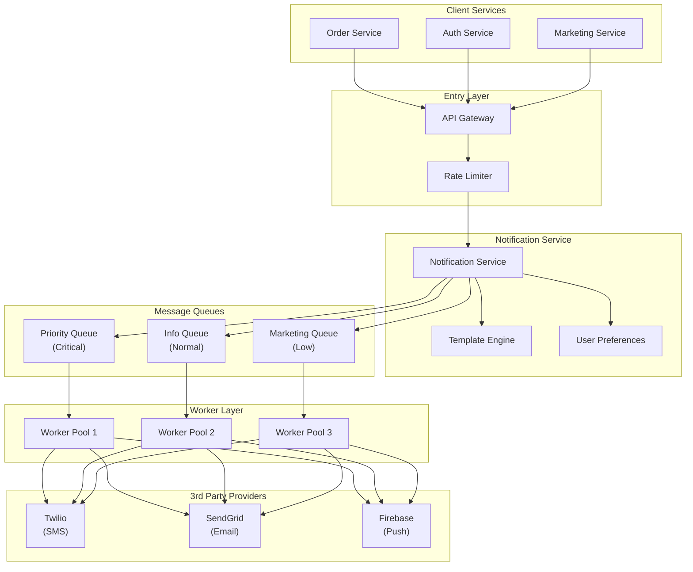
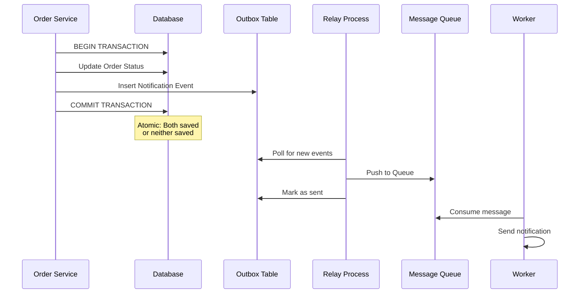
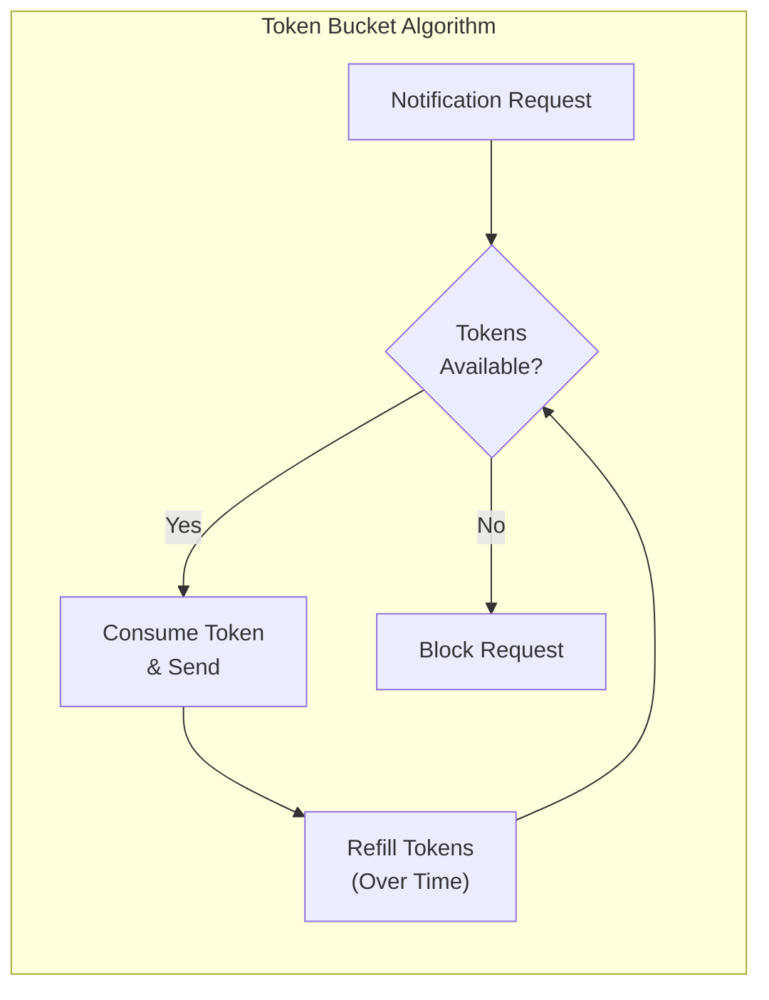
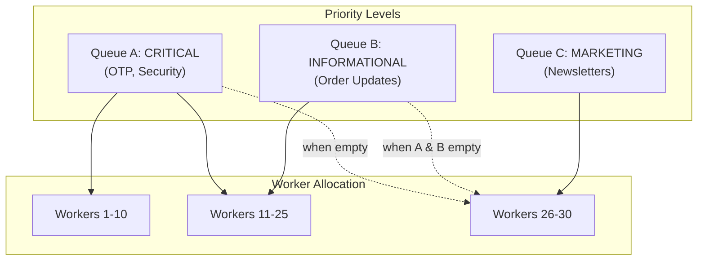
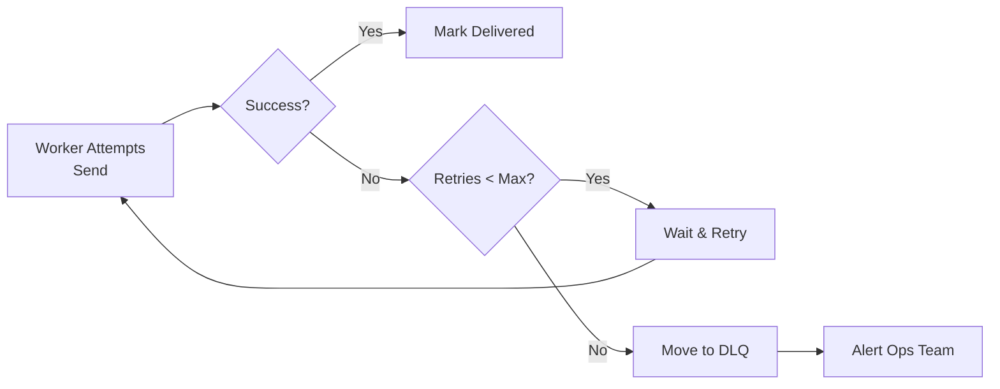

# 通知系统

设计通知系统需要平衡高可用性、可靠投递和严格的速率控制，以防止用户疲劳。本设计概述了一个可扩展的多通道通知引擎，能够每小时处理数百万条通知。

## 需求

### 功能需求

**多通道支持：**
- SMS（通过 Twilio、AWS SNS）
- Email（通过 SendGrid、AWS SES）
- 移动推送（通过 Firebase Cloud Messaging、Apple Push Notification Service）

**模板系统：**
- 基于预定义模板的动态消息生成
- 支持变量（用户名、订单 ID、OTP 验证码）
- 多语言支持
- HTML 和纯文本格式

**优先级：**
- 高优先级告警（OTP、安全告警）必须绕过低优先级营销消息
- 每种通知类型可配置优先级

**用户偏好：**
- 尊重用户定义的特定通道"退订"设置
- 每个通道的通知偏好
- 免打扰时段

### 非功能需求

**可靠性：**
- 至少一次投递保证
- 系统故障时无消息丢失
- 幂等消息处理

**可扩展性：**
- 每小时处理数百万条通知
- 所有组件支持水平扩展
- 高效资源利用

**低延迟：**
- 高优先级通知在数秒内投递
- 关键告警端到端延迟 < 5 秒

**可用性：**
- 99.9% 正常运行时间 SLA
- 服务商故障时优雅降级

## 高层架构

系统使用事件驱动的解耦架构，确保某个服务商（如 SendGrid）的故障不会阻塞整个流水线。



### 核心组件

| 组件 | 职责 |
|------|------|
| **API Gateway** | 内部/外部服务的入口点。处理认证和粗粒度限流 |
| **Notification Service** | 验证请求、获取用户设置、将消息路由到正确的队列 |
| **Rate Limiter** | 防止向用户发送垃圾通知；确保符合服务商配额 |
| **Template Engine** | 将动态数据（用户名、订单 ID）注入 HTML 或文本模板 |
| **Message Queues** | 解耦生产与消费。为高/低优先级设置独立队列 |
| **Workers** | 消费消息并向第三方服务商发起调用 |

## 请求流程

### 1. 通知请求

```json
{
  "user_id": "12345",
  "channel": "email",
  "priority": "high",
  "template_id": "order_confirmation",
  "data": {
    "username": "John Doe",
    "order_id": "ORD-2024-001",
    "total": "$99.99"
  },
  "idempotency_key": "req-abc123"
}
```

### 2. 处理步骤

**步骤 1：API Gateway 验证**
- 认证调用方服务
- 应用粗粒度限流（每服务限制）
- 验证请求模式

**步骤 2：限流检查**
- 检查用户级通知限制
- 检查服务商配额可用性
- 超限时阻止或节流

**步骤 3：Notification Service 处理**
- 获取用户偏好（退订状态、首选通道）
- 根据优先级确定目标队列
- 将通知存入数据库（Outbox 模式）
- 推送到对应的消息队列

**步骤 4：Worker 处理**
- 从队列拉取消息
- 使用用户数据渲染模板
- 调用服务商 API（Twilio/SendGrid/Firebase）
- 处理服务商响应
- 更新投递状态
- 失败时使用指数退避重试

## 可靠投递与一致性

### Outbox 模式

为确保系统崩溃时通知不会丢失，系统使用 Outbox 模式保证数据库状态和消息队列操作之间的原子性。



### 关键机制

**原子性：**
- 业务状态变更和通知事件在同一个本地数据库事务中保存
- 要么都成功，要么都失败
- 没有系统崩溃导致通知丢失的时间窗口

**Relay 进程：**
- 后台进程从"Outbox"表读取
- 将事件推送到消息队列
- 可以使用 CDC（变更数据捕获）工具如 Debezium/Canal
- 幂等：跟踪已处理事件以避免重复

**去重：**
- 每条通知有唯一的 `idempotency_key`
- 服务商去重：向服务商发送 `idempotency_key`
- 消费者去重：处理前检查 `idempotency_key`
- 确保至少一次投递且不产生重复通知

### 故障场景

**场景 1：数据库提交后崩溃，队列推送前**
- Outbox 记录已存在
- Relay 进程会重试
- 消息最终被投递

**场景 2：队列推送成功，Worker 崩溃**
- 消息保留在队列中（未被 ACK）
- 其他 Worker 会消费它
- 幂等键防止重复处理

**场景 3：服务商 API 超时**
- Worker 使用指数退避重试
- 幂等键防止重复发送
- 达到最大重试次数后，移至死信队列

## 限流与优先级

处理大规模流量需要在多个层级进行智能流量管理。

### 用户级节流

**目的：** 防止向单个用户发送过多通知

**实现（Redis + Token Bucket）：**
```
Key: rate_limit:user:{user_id}:hour
Value: Token bucket state
Limit: 10 notifications/hour
```

**算法：**
- 每个用户有一个令牌桶（容量 N，补充速率 R）
- 发送通知消耗 1 个令牌
- 令牌随时间补充（例如，10 个/小时 = 每 6 分钟补充 1 个）
- 桶空时阻止请求



### 服务商配额管理

**目的：** 保持在第三方服务商限制内

**示例：**
- Twilio：$1/100 条 SMS，按套餐月配额
- SendGrid：免费层 100 封邮件/天
- Firebase：推送无限制，但有设备注册限制

**实现：**
- 在 Redis 中跟踪使用量
- 跨 Worker 的分布式计数器
- 预分配配额池
- 接近限制时告警
- 配额耗尽时节流

### 优先级队列

三级优先级系统确保关键通知优先处理。



**队列 A（关键）：**
- OTP、安全告警、密码重置
- 专用 Worker 池（即时处理）
- 抢占：可以从队列 C 借用 Worker

**队列 B（信息）：**
- 订单更新、配送状态、支付确认
- 共享 Worker 池
- 正常优先级

**队列 C（营销）：**
- 新闻简报、促销、推荐
- 最小的 Worker 池
- 仅在 A 和 B 都为空时处理
- 负载下首先被节流

## 故障处理与弹性

### 重试策略

**指数退避：**
```
Attempt 1: Immediate
Attempt 2: Wait 1 second
Attempt 3: Wait 2 seconds
Attempt 4: Wait 4 seconds
Attempt 5: Wait 8 seconds
Max retries: 5 attempts
```

**抖动（Jitter）：**
- 在退避中添加随机抖动（±20%）
- 防止雷群效应
- 分散重试负载

### 死信队列（DLQ）

达到最大重试次数后，消息移至 DLQ：
- 存储以供人工检查
- 问题解决后可重新处理
- 向运维团队发送告警
- 30 天后自动归档



### 熔断器

**目的：** 避免在故障服务商上浪费资源

**状态：**
1. **Closed（关闭）：** 正常运行，请求通过
2. **Open（打开）：** 服务商故障，请求立即被阻止
3. **Half-Open（半开）：** 测试服务商是否恢复

**实现：**
- 跟踪每个服务商的失败率
- 如果最近 100 次请求中失败率 > 50% → 打开熔断器
- 60 秒后 → 半开（允许 1 个测试请求）
- 测试成功 → 关闭熔断器
- 测试失败 → 保持打开

**降级策略：**
- Email 服务商宕机：排队稍后发送或使用备用服务商
- SMS 服务商宕机：使用备用 SMS 服务商
- Push 服务商宕机：排队重试（推送有时间敏感性）

## 数据存储

### 关系型数据库（PostgreSQL）

**用户数据：**
```sql
CREATE TABLE users (
    id BIGINT PRIMARY KEY,
    email VARCHAR(255),
    phone VARCHAR(20),
    push_token VARCHAR(500),
    timezone VARCHAR(50),
    created_at TIMESTAMP
);

CREATE TABLE user_preferences (
    user_id BIGINT PRIMARY KEY,
    email_enabled BOOLEAN DEFAULT true,
    sms_enabled BOOLEAN DEFAULT true,
    push_enabled BOOLEAN DEFAULT true,
    quiet_hours_start TIME,
    quiet_hours_end TIME,
    FOREIGN KEY (user_id) REFERENCES users(id)
);
```

**模板：**
```sql
CREATE TABLE templates (
    id VARCHAR(100) PRIMARY KEY,
    name VARCHAR(255),
    channel VARCHAR(20), -- 'email', 'sms', 'push'
    subject_template TEXT,
    body_template TEXT,
    language VARCHAR(10),
    version INT
);
```

**Outbox 表：**
```sql
CREATE TABLE notification_outbox (
    id BIGSERIAL PRIMARY KEY,
    user_id BIGINT,
    channel VARCHAR(20),
    priority VARCHAR(20),
    template_id VARCHAR(100),
    template_data JSONB,
    idempotency_key VARCHAR(100) UNIQUE,
    status VARCHAR(20), -- 'pending', 'queued', 'sent', 'failed'
    created_at TIMESTAMP,
    processed_at TIMESTAMP
);
```

### NoSQL / 时序数据库（Elasticsearch/ClickHouse）

**通知日志：**
- 高吞吐量的投递状态跟踪
- 状态：已发送、已投递、已打开、失败、已退回
- 每条通知的分析
- 仪表板的聚合统计
- 故障投递的排查

**Schema（Elasticsearch）：**
```json
{
  "notification_id": "notif-123",
  "user_id": "12345",
  "channel": "email",
  "provider": "sendgrid",
  "status": "delivered",
  "timestamp": "2024-01-15T10:30:00Z",
  "metadata": {
    "opened": true,
    "clicked": false,
    "bounce_reason": null
  }
}
```

### 内存存储（Redis）

**使用场景：**
1. **限流计数器：**
   - 用户级通知限制
   - 服务商配额跟踪

2. **令牌桶状态：**
   - 每用户令牌桶
   - 快速读写访问

3. **缓存：**
   - 用户偏好（缓存 5 分钟）
   - 模板渲染缓存
   - 服务商 API 响应

**数据结构：**
```
rate_limit:user:{user_id}:hour     -> String (counter)
user_preferences:{user_id}          -> Hash (cached)
provider_quota:{provider}:{date}    -> String (counter)
token_bucket:{user_id}              -> Hash (tokens, last_refill)
```

## 扩展策略

### 水平扩展

**无状态组件：**
- API Gateway：基于 CPU/RPS 自动扩展
- Notification Service：基于队列深度自动扩展
- Workers：基于队列长度自动扩展

**有状态组件：**
- 数据库：读副本扩展读取
- Redis：集群模式分片
- 消息队列：原生集群（Kafka、RabbitMQ）

### 垂直扩展考量

**数据库优化：**
- 按日期分区 outbox 表
- 在 `status` 和 `created_at` 上建索引
- 将旧通知归档到冷存储

**Redis 优化：**
- 使用适当的淘汰策略
- 按 user_id 哈希分片
- 不同用途使用独立 Redis 实例

## 监控与可观测性

### 关键指标

**吞吐量：**
- 每秒通知数（整体、每通道）
- 每个优先级的队列深度
- Worker 利用率

**延迟：**
- 端到端延迟（请求到投递）
- 每组件延迟分解
- P50、P95、P99 延迟

**可靠性：**
- 投递成功率（整体、每服务商）
- 重试率
- DLQ 消息数
- 熔断器触发次数

**用户体验：**
- 每用户通知数（分布）
- 退订率
- 垃圾投诉数

### 告警

**严重告警：**
- DLQ 大小超过阈值
- 投递成功率 < 95%
- 熔断器打开
- 队列深度持续增长（Worker 处理不过来）

**警告告警：**
- 服务商配额达到 80%
- 高重试率
- P99 延迟 > 10 秒

## 安全考量

### 数据保护

**PII（个人身份信息）：**
- 静态加密邮箱、手机号
- 最小化日志中的 PII
- 按保留策略自动清除旧数据

**模板注入防护：**
- 对用户提供的模板数据进行清理
- 使用带自动转义的模板引擎
- 模板变量使用白名单方式

### 访问控制

**认证：**
- 内部服务使用 API Key
- 外部客户端使用 OAuth 2.0
- 每 API Key 的限流

**授权：**
- 服务间：只能向自己的用户发送
- 管理操作使用 RBAC
- 所有访问记录审计日志

### 合规

**GDPR：**
- 有权退订所有通信
- 有权删除数据
- 数据导出功能

**CAN-SPAM 法案：**
- 营销邮件必须提供退订选项
- 页脚包含实体邮寄地址
- 10 天内处理退订请求

## 生产最佳实践

### 测试

**负载测试：**
- 模拟每小时 100 万条通知
- 测试队列深度激增
- 故障注入（服务商故障）

**混沌工程：**
- 随机杀死 Worker
- 模拟网络分区
- 服务商 API 故障

### 部署

**蓝绿部署：**
- 零停机部署
- 新版本逐步推出
- 出问题时即时回滚

**特性开关：**
- 按用户启用/禁用通道
- A/B 测试模板
- 新功能逐步推出

### 运维手册

**队列深度过高：**
1. 检查 Worker 健康状态（自动扩展可能失败）
2. 检查服务商是否故障（熔断器）
3. 添加临时 Worker 容量
4. 必要时节流非关键队列

**投递成功率下降：**
1. 检查服务商状态页
2. 审查最近的代码变更
3. 检查限流设置（可能正在被节流）
4. 故障转移到备用服务商

**DLQ 率过高：**
1. 调查常见失败模式
2. 检查模板错误
3. 审查服务商 API 变更
4. 必要时重启 Worker

## 总结

一个设计良好的通知系统通过以下方式平衡可靠性、可扩展性和用户体验：

- **事件驱动架构：** 使用消息队列解耦组件
- **Outbox 模式：** 原子化的数据库 + 队列操作确保可靠性
- **多级优先级：** 关键消息始终优先处理
- **智能限流：** 保护用户免受垃圾通知，保护服务商免受配额耗尽
- **弹性模式：** 指数退避、DLQ、熔断器
- **全面监控：** 实时系统健康可见性

本设计可以扩展到每小时处理数百万条通知，同时保持关键告警的亚秒级延迟并尊重用户偏好。

**关键要点：**
1. 使用消息队列实现解耦和可靠性
2. 实现 Outbox 模式确保原子性
3. 使用专用队列为关键通知设定优先级
4. 在用户和服务商两个层面进行限流
5. 监控一切：吞吐量、延迟、成功率
6. 为故障做好计划：重试、DLQ、熔断器
7. 尊重用户偏好和隐私法规
