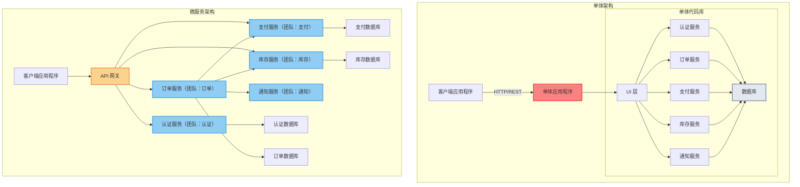
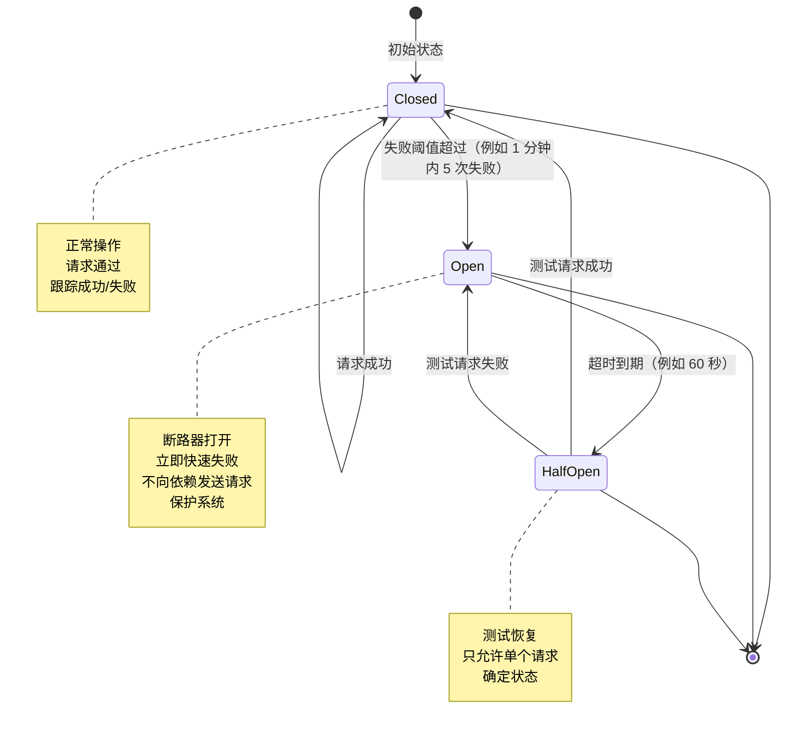

# 2. 服务层

服务层是业务能力所在的地方。它也是最难扩展问题出现的地方：不是原始吞吐量，而是协调、故障传播和组织复杂性。

良好的服务层设计使变更变得便宜且故障被限制在局部。糟糕的服务层设计使每次变更都变得危险，每次事件都令人困惑。服务层的结构决定了你的组织如何运作、故障如何传播，以及你能够多快地发布新功能。

## 此层包含什么

### 服务边界

服务边界定义了一个服务拥有什么（行为、数据、API）和不拥有什么。设计良好的边界与业务能力和团队结构保持一致，实现独立开发和部署。

### 核心服务职责

**业务逻辑处理：**
- 领域规则强制执行和验证（业务不变量、约束和策略）
- 业务计算和转换（定价、折扣、风险评分、资格判断）
- 有界上下文内的工作流编排（订单处理、账户管理、内容审批）
- 不属于基础设施或数据层的特定领域操作

**事务管理：**
- 服务边界内的 ACID 保证（拥有数据的一致性）
- 分布式工作流的补偿逻辑（回滚操作、补偿事务）
- 事务边界设计（何时打开/关闭事务、锁定策略）
- 分布式事务协调（Saga 模式、最终一致性处理）

**数据聚合：**
- 从多个来源组合数据（API、数据库、缓存、外部服务）
- API 组合模式（从多个服务获取数据、批量查询）
- 聚合数据的缓存策略（缓存失效、TTL 管理）
- 不同客户端的响应形状优化（BFF 模式、GraphQL 字段）

**AI Agent 编排：**
- LLM 工作流管理（提示链、多步推理、工具选择）
- AI 服务组合（协调多个 AI 模型和服务）
- 工具/函数调用编排（参数提取、执行规划、结果合成）
- 多代理协调（监督器模式、协作代理工作流、代理交接）
- AI 特定的可靠性（非确定性响应的重试策略、成本控制、回退逻辑）

### 协作模式

- 同步调用与异步事件，以及工作流如何协调
- 立即确认需求时的请求/响应模式
- 松散耦合和故障隔离的事件驱动模式
- 结合同步和异步通信的混合方法

### 可靠性行为

- 超时、重试、背压、断路器和舱壁隔离
- 部分系统故障时的降级策略
- 不可用依赖的回退机制
- 自我保护的速率限制和负载丢弃

### 一致性策略

- 工作流某些部分失败时系统的行为
- 每个业务能力的强一致性与最终一致性权衡
- 分布式事务的补偿操作
- 部分故障期间用户可见的状态（待处理、处理中、部分完成）

### 可观测性期望

- 必须跨服务边界跟踪和测量的内容
- 请求跟踪和关联 ID
- 业务指标（延迟、吞吐量、操作错误率）
- 合规和调试的审计跟踪

## 为什么很重要

### 1. 团队自主性
当边界清晰且所有权真实时，团队可以独立部署并更快地行动，而不会互相干扰。清晰的服务所有权将技术边界与组织结构对齐，减少了协调开销。

### 2. 故障隔离
如果你明确设计为部分故障并避免"默认紧耦合"，故障将变成局部性的而非系统性的。设计良好的服务边界可以防止级联故障导致整个系统崩溃。

### 3. 演进式架构
当契约稳定且依赖受限时，你可以以更少的风险替换或重写系统的部分。这使你能够采用新技术并通过渐进式修复而非痛苦的改写来修复架构错误。

### 4. 可扩展性对齐
服务边界允许你扩展系统中最需要的部分，而不是统一扩展一切。这优化了基础设施成本并提高了资源利用率。

## 缺点和风险

- 调试随着调用图的增长而变得困难。
- 网络在规模上频繁失败；你必须将超时和重试作为核心设计，而不是事后考虑。
- 一致性从"数据库问题"变成了"工作流问题"。
- 运营开销快速增长：部署、访问控制、值班和事件响应。
- 分布式事务比进程内事务困难几个数量级。
- 网络序列化和协议处理的性能开销。
- 随着服务增加，集成测试呈指数级复杂化。

## 关键权衡和如何决定

### 服务粒度

**过于粗糙（单体服务）：**
- 多个团队在同一代码库中工作导致部署冲突
- 变更需要跨团队边界协调
- 扩展是全有或全无的（即使只有一个功能热门也必须扩展整个服务）
- 技术选择影响整个代码库
- 测试表面随着系统增长而增长

**过于精细（纳米服务）：**
- 网络延迟开销主导请求时间
- 运营复杂性爆炸式增长（更多部署、监控、值班轮换）
- 调试需要跟踪多个服务
- 分布式事务几乎不可能
- 共享基础设施问题在许多服务中重复

**单体与微服务决策框架：**



**单体优势：**
- 简单部署（单一工件）
- 组件间无网络延迟
- 简单事务和一致性
- 更容易测试和调试
- 更低的运营开销
- 更适合小型团队和早期产品

**单体劣势：**
- 技术锁定（单一语言/框架）
- 难以单独扩展组件
- 组织边界变得人为化
- 所有变更影响整个系统
- 随着代码库增长，部署变得更危险

**微服务优势：**
- 独立部署和扩展
- 技术多样性（每项工作使用合适的工具）
- 清晰的团队所有权边界
- 故障隔离（一个服务故障不一定导致整个系统崩溃）
- 支持组织扩展

**微服务劣势：**
- 网络延迟和可靠性问题
- 分布式事务困难
- 运营复杂性大幅增加
- 集成测试成本高
- 需要成熟的 DevOps 实践

**业务场景指导：**

**何时从单体开始：**
- 团队规模小（< 10-15 个开发人员）
- 产品市场匹配不确定（需求快速变化）
- 流量和数据规模未知
- 组织中运营专业知识有限
- 需要快速迭代产品功能

**何时拆分为微服务：**
- 多个团队需要独立的部署周期
- 不同组件有冲突的可扩展性需求
- 不同组件受益于不同的技术栈
- 组织结构有清晰的领域边界
- 运营团队可以支持分布式系统复杂性

**不要仅仅因为以下原因拆分为微服务：**
- 这是流行的架构
- 你想使用多种技术（技术多样性应该是需求驱动的）
- 你认为它能"解决"所有可扩展性问题
- 你想雇佣"微服务工程师"

### 通信协议：REST vs GraphQL vs gRPC

**REST（Representational State Transfer）：**

**优势：**
- 无处不在的工具和生态系统支持
- 通过 HTTP 语义实现缓存友好
- 跨语言和平台的广泛兼容性
- 简单且人类可读
- 对于公共 API 和外部集成的优秀选择

**劣势：**
- 过度获取和获取不足的问题
- 相关数据的多次往返
- 效率较低的序列化（基于文本的 JSON）
- 类型安全性有限（取决于实现）
- 版本控制可能复杂

**最适合：**
- 面向公共的 API
- 与第三方集成
- 简单的 CRUD 操作
- 具有标准 HTTP 客户端的 Web 应用程序

**GraphQL：**

**优势：**
- 客户端恰好请求所需数据（无过度获取）
- 单次请求获取复杂嵌套数据
- 强类型模式
- 自文档化 API
- 优秀的 BFF（Backend for Frontend）模式

**劣势：**
- 服务器实现更复杂
- 缓存更困难（POST 请求，无 HTTP 语义）
- 查询复杂性可能导致性能问题（嵌套查询、N+1 问题）
- 需要仔细的模式设计和演化
- 对于简单 API 来说过度

**最适合：**
- 移动应用程序（带宽优化）
- 复杂数据关系和聚合
- 客户端驱动的数据需求
- BFF（Backend for Frontend）模式

**gRPC（Remote Procedure Call）：**

**优势：**
- 高效的二元序列化（Protocol Buffers）
- 强契约执行和类型安全
- 多语言内置代码生成
- 双向流（服务器推送、客户端推送）
- 优秀的内部服务间通信

**劣势：**
- 人类可读性有限（二进制协议）
- 浏览器支持有限
- 更复杂的调试和工具
- 通过共享模式的紧耦合
- 不适合公共 API

**最适合：**
- 高性能内部微服务
- 实时流式应用程序
- 多语言环境（不同语言的服务）
- 低延迟需求

**业务权衡总结：**
- **公共 API**：REST 用于广泛兼容性，GraphQL 用于复杂数据需求
- **内部微服务**：gRPC 用于性能和类型安全，REST 用于简单性
- **移动客户端**：GraphQL 最小化数据传输，带版本控制的 REST 确保稳定性

### 同步与异步协作

**同步通信（请求/响应）：**

**优势：**
- 更简单的心理模型和调试流程
- 立即反馈（错误直接返回给调用者）
- 更容易推理系统状态
- 自然要求立即确认的用户操作
- 直接的错误处理

**劣势：**
- 放大尾延迟（调用者等待整个链）
- 创建级联故障（下游故障影响上游）
- 服务间的时间紧耦合
- 难以在负载下扩展（所有服务必须可用）
- 没有自然的重试或死信队列

**最适合：**
- 需要立即确认的用户操作（支付、关键写入）
- 数据必须新鲜的简单查询操作
- 业务规则要求同步验证的操作
- 低延迟需求路径

**异步通信（事件、消息）：**

**优势：**
- 自然的故障隔离（发送者不依赖接收者可用性）
- 平滑流量峰值（消息队列缓冲负载）
- 支持重试和死信处理
- 服务可以独立扩展
- 更适合长时间运行的操作

**劣势：**
- 更复杂的心理模型（消息流不太明显）
- 最终一致性（数据处理完成前数据是过时的）
- 更难调试（必须跟踪消息历史）
- 需要持久化消息基础设施
- 消息排序和重复的潜在挑战

**最适合：**
- 后台处理（电子邮件通知、报告、数据聚合）
- 高容量写入操作（不需要立即确认）
- 故障隔离关键的跨服务通信
- 长时间运行的工作流（订单处理、数据管道）

**业务场景指导：**

**同步用于：**
- 支付处理（用户必须知道支付是否成功）
- 库存检查（用户必须知道商品是否可用）
- 身份验证和授权（用户必须立即知道）
- 一致性比可用性更重要的重要写入

**异步用于：**
- 欢迎邮件和通知
- 分析数据收集
- 搜索索引
- 服务间数据同步
- 推荐生成
- 报告生成

**混合方法（常见模式）：**
- 同步：接受用户请求并创建领域实体
- 异步：处理副作用（通知、索引、分析）
- 用户看到复杂操作的"处理中"状态
- 后端在处理完成时更新用户（WebSocket、轮询）

## 服务治理基础设施

服务治理包含使服务能够相互发现、访问配置和在大规模可靠运行的基础设施和模式。这些能力是微服务架构的基础，随着系统复杂性增长而变得至关重要。

### 服务发现和注册

**目的：** 使服务能够动态地相互查找和通信，而不需要硬编码的网络位置。服务发现使服务能够扩展、故障转移和演化而不会破坏客户端。

**注册策略：**

**自我注册：**
- 服务在启动时向注册表自行注册
- 服务在关闭时注销（优雅或强制）
- 服务发送周期性心跳以保持"健康"状态

*优势：*
- 实现简单（没有额外的基础组件）
- 服务控制自己的注册生命周期
- 服务启动时立即注册
- 适合容器化和自动扩展环境

*劣势：*
- 陈旧条目的风险（服务崩溃时未注销）
- 网络分区可能导致僵尸注册
- 没有注册一致性的强制执行
- 服务必须包含注册逻辑（库依赖）

*最适合：*
- 容器化环境（Kubernetes 与服务网格）
- 快速实例周转的自动扩展服务
- 舒适使用客户端库的团队
- 具有可靠网络连接的环境

**第三方注册：**
- 平台或编排器代表服务进行注册
- 注册由基础设施管理，而不是应用程序代码
- 健康状态由外部监控和更新

*优势：*
- 可靠的注册（基础设施管理）
- 不需要应用程序代码进行注册
- 所有服务注册模式一致
- 集中控制和可见性

*劣势：*
- 基础设施耦合（绑定到特定平台）
- 额外的运营复杂性
- 注册延迟（与服务启动不同步）
- 平台特定的实现

*最适合：*
- 平台管理的部署（Kubernetes、云平台）
- 具有强大平台工程的组织
- 需要注册保证的服务
- 多语言生态系统（避免每种语言的注册库）

**发现模式：**

**客户端服务发现：**
- 客户端查询注册表以获取服务实例
- 客户端选择实例并直接请求
- 客户端实现负载均衡和重试逻辑

*优势：*
- 没有额外的网络跳转（客户端到服务直接连接）
- 更低延迟（无中间路由）
- 更简单的基础设施（无路由层）
- 客户端控制负载均衡策略

*劣势：*
- 客户端耦合到注册表（所有客户端的注册表依赖）
- 版本复杂性（客户端必须理解注册表协议）
- 不同客户端实现的不一致负载均衡
- 更难演化注册表协议（所有客户端必须更新）

*最适合：*
- 性能优化的内部服务通信
- 受限环境中的有限服务变体
- 具有标准化客户端库的多语言系统
- 高吞吐量内部 API

*业务场景：* 微服务平台，服务使用 gRPC 通信。每个服务包含处理服务发现、负载均衡和重试逻辑的客户端库。运营团队从简化的基础设施中受益，但必须维护多种语言的客户端库。

**服务器端服务发现：**
- 客户端向负载均衡器或 API 网关发送请求
- 负载均衡器查询注册表并将请求路由到服务实例
- 服务实例保持对客户端路由逻辑的不可知

*优势：*
- 客户端无关（客户端中没有注册表依赖）
- 集中路由策略（所有客户端一致）
- 简化的客户端逻辑（客户端只调用网关）
- 更容易的协议演化（只有网关需要更新）
- 丰富的路由功能（金丝雀、蓝绿、加权路由）

*劣势：*
- 额外的网络跳转（增加延迟）
- 网关依赖（如果不可用则单点故障）
- 网关扩展需求（必须处理所有流量）
- 潜在的网关瓶颈

*最适合：*
- 具有不同客户端类型的公共 API
- 多客户端环境（Web、移动、第三方集成）
- 希望集中流量管理的组织
- 需要高级路由模式的系统

*业务场景：* 具有Web、移动和第三方市场客户端的电商平台。API 网关处理服务发现、限流和身份验证。客户端团队不需要担心后端服务位置或注册协议。

**高级服务发现功能：**

**加权实例选择：**
- 为服务实例分配权重以进行流量分发
- 支持金丝雀部署（10% 流量到新版本）
- 支持蓝绿部署（0% 或 100% 路由）
- 支持逐步迁移和容量管理

*用例：*
- 金丝雀发布：5% 流量路由到新服务版本
- 基于容量的路由：更多流量路由到更大实例
- A/B 测试：基于用户段路由流量
- 区域路由：当可用时优先本地实例

**区域感知路由：**
- 将请求路由到相同可用区域或区域中的服务
- 减少跨区域数据传输成本
- 通过本地化改进延迟
- 在部分中断期间启用区域隔离

*业务价值：*
- 降低云成本（避免跨区域数据传输费用）
- 更好的性能（区域内更低延迟）
- 改进的可靠性（故障期间的区域隔离）

**基于元数据的路由：**
- 基于服务元数据（版本、容量、自定义标签）路由
- 启用基于版本的路由（v1 vs v2 服务）
- 启用容量感知路由（路由到容量最少的实例）
- 启用功能特定路由（路由到具有特定功能的实例）

*用例：*
- API 版本控制：将 /v1/requests 路由到 v1 实例
- 容量优化：路由到有 spare capacity 的实例
- 功能标志路由：将 beta 功能路由到特定实例

### 分布式配置中心

**目的：** 无需服务重启的集中式配置管理。分布式配置中心实现动态配置更新、环境特定管理和大规模运营控制。

**核心能力：**

**动态配置更新：**
- 推送模型：服务器立即将配置更改推送到客户端
- 拉取模型：客户端定期轮询配置更改
- 混合模型：带有长轮询或 Webhook 通知的拉取

*推送模型优势：*
- 即时配置传播（所有服务立即更新）
- 无轮询开销（减少网络流量和服务器负载）
- 实时配置控制

*推送模型劣势：*
- 服务器复杂性（必须维护到所有服务的持久连接）
- 网络依赖（连接问题阻止更新）
- 可扩展性挑战（数千个服务需要持久连接）

*推送模型最适合：*
- 需要立即传播的关键配置
- 低到中等服务数量（数百到低千）
- 配置驱动的功能（功能标志、断路器阈值）

*拉取模型优势：*
- 更简单的服务器实现（无持久连接管理）
- 更好的可扩展性（无状态，水平扩展）
- 网络弹性（临时问题不阻止更新）
- 客户端控制更新时机

*拉取模型劣势：*
- 配置传播延迟（高达轮询间隔）
- 轮询开销（即使没有更改的持续网络流量）
- 过时配置风险（服务使用过时配置运行）

*拉取模型最适合：*
- 大规模环境（数千个服务）
- 非关键配置（可以容忍延迟）
- 资源受限环境

**环境特定配置：**
- 分离的配置命名空间（dev、staging、prod）
- 配置继承（基础配置 + 环境覆盖）
- 环境验证（防止生产环境中的 dev 配置）
- 配置升级（dev → staging → prod 工作流）

**敏感数据管理：**
- 秘密存储集成（静态加密、内存中解密）
- 访问控制（谁可以查看/修改特定配置）
- 审计日志（谁在何时更改了什么）
- 秘密轮换（自动凭据更新）

**配置版本控制和回滚：**
- 版本历史（所有配置更改被跟踪）
- 回滚能力（立即恢复到先前配置）
- 更改审批工作流（生产更改需要审批）
- 配置差异工具（部署前可视化更改）

**配置验证：**
- 模式验证（强制配置结构和类型）
- 范围验证（确保值在可接受范围内）
- 依赖验证（一起验证相关配置）
- 试运行模式（在不应用的情况下预览更改）

**技术选项：**

**Spring Cloud Config：**
- **基础：** Spring 生态系统，Git 支持的配置存储
- **架构：** 中央配置服务器与客户端库
- **优势：** 本地 Spring 集成，Git 版本控制，环境配置文件
- **考虑：** Java/Spring 生态系统重点，Git 依赖
- **最适合：** 基于 Spring 的应用程序，使用 Java/Spring 的团队
- **业务场景：** 运行 Spring Boot 微服务的金融服务。配置存储在 Git 中以进行审计跟踪。团队利用现有的 Spring 专业知识 和 Git 工作流。

**Apollo：**
- **基础：** 携程，开源分布式配置中心
- **架构：** 配置服务器 + 管理门户 + 客户端 SDK
- **优势：** 丰富的 UI，命名空间支持，多语言客户端，灰度发布
- **考虑：** 运营复杂性（多个组件需要部署）
- **最适合：** 需要丰富配置管理的大规模部署
- **业务场景：** 具有 500+ 微服务的中电商平台。运营团队使用 Web UI 进行配置更改。每个服务的命名空间组织实现清晰的所有权。

**Consul：**
- **基础：** HashiCorp，服务发现 + 配置存储
- **架构：** 用于配置的 KV 存储，集成的服务发现
- **优势：** 一个平台中的服务发现 + 配置，简单操作
- **考虑：** 有限的配置 UI（主要是 API/CLI 驱动）
- **最适合：** 已经使用 Consul 进行服务发现的团队
- **业务场景：** 使用 Consul 进行服务网格的 SaaS 平台。添加现有的 Consul 部署的配置 KV 存储。统一的基础设施减少了运营开销。

**etcd：**
- **基础：** CoreOS 分布式键值存储，Kubernetes 后端
- **架构：** 具有强一致性的分布式 KV 存储
- **优势：** Kubernetes 原生，强一致性，简单操作
- **考虑：** 有限的 UI，主要是 API 驱动（需要工具）
- **最适合：** Kubernetes 环境，云原生架构
- **业务场景：** 在 Kubernetes 上运行的容器化平台。使用 etcd 作为单一事实来源。通过 Kubernetes ConfigMaps 和自定义控制器进行配置更改。

**云托管选项：**
- **AWS Parameter Store / Secrets Manager：** AWS 集成，按使用付费，非常适合以 AWS 为中心的部署
- **Azure App Configuration：** Azure 集成，功能标志支持
- **Google Cloud Runtime Config：** GCP 集成，简单的 KV 存储

**权衡和业务影响：**

**推送 vs 拉取：**
- **推送：** 更快的传播但以基础设施复杂性为代价
- **拉取：** 更简单的基础设施但以延迟更新为代价
- **业务决策：** 配置更改必须多快生效？

**客户端 vs 服务器端加密：**
- **客户端加密：** 秘密从不离开客户端加密（更安全，更难实现）
- **服务器端加密：** 秘密在配置中心加密，请求时解密（更简单，信任配置中心）
- **业务决策：** 法规要求和安全态势

**配置耦合：**
- **紧密耦合配置：** 配置更改时服务必须一起更新（有风险，需要协调）
- **松散耦合配置：** 服务验证并拒绝无效配置（更安全，更复杂）
- **业务决策：** 服务部署周期有多独立？

**供应商锁定 vs 运营控制：**
- **云托管（AWS Parameter Store）：** 更低运营开销但以供应商锁定为代价
- **自托管（Consul、etcd）：** 完全控制但以运营复杂性为代价
- **业务决策：** 内部平台专业知识 vs 产品差异化重点

### 全面分布式跟踪

**目的：** 跨服务边界跟踪请求以进行调试和性能分析。分布式跟踪提供端到端请求流可见性，实现快速事件诊断和性能优化。

**核心概念：**

**跟踪上下文传播：**
- **跟踪 ID：** 整个请求旅程的唯一标识符（所有跨度共享相同跟踪 ID）
- **跨度 ID：** 单个操作的唯一标识符（一个服务调用）
- **父跨度 ID：** 对父跨度的引用，建立跨度层次结构
- **跟踪头：** 携带跟踪上下文的 HTTP 头（traceparent、baggage）

*传播流：*
1. 服务 A 接收请求，创建根跨度（跟踪 ID：ABC，跨度 ID：1）
2. 服务 A 调用服务 B，传递跟踪头（跟踪 ID：ABC，父跨度 ID：1）
3. 服务 B 创建子跨度（跟踪 ID：ABC，跨度 ID：2，父跨度 ID：1）
4. 服务 B 调用服务 C，传递跟踪头（跟踪 ID：ABC，父跨度 ID：2）
5. 服务 C 创建子跨度（跟踪 ID：ABC，跨度 ID：3，父跨度 ID：2）

**跨度生命周期：**
- **跨度开始：** 操作开始时的时间戳
- **跨度标签：** 键值元数据（service.name、http.method、http.status_code）
- **跨度日志：** 跨度内的结构化事件（错误、调试消息）
- **跨度结束：** 操作完成时的时间戳
- **跨度持续时间：** 结束时间 - 开始时间（操作延迟）

**采样策略：**

**基于头的采样：**
- 在跟踪开始时（根跨度）进行采样决策
- 全部或无样例：要么跟踪整个请求，要么不跟踪
- **优势：** 简单，完整跟踪（无不完整请求图）
- **劣势：** 无法基于有趣事件采样（错误、慢操作）
- **最适合：** 高流量流量，不需要完整跟踪

**基于尾部的采样：**
- 收集所有跨度，在跟踪完成后进行采样决策
- 基于跟踪特征采样（包含错误、慢持续时间、特定服务）
- **优势：** 智能采样（优先考虑有趣的跟踪），从不错误错误
- **劣势：** 高基础设施成本（必须缓冲所有跨度），复杂实现
- **最适合：** 错误可见性至关重要的关键系统

**动态采样：**
- 根据流量和系统状态调整采样率
- 低流量：高采样率（100%）
- 高流量：低采样率（1-10%）
- **优势：** 成本优化，适应流量模式
- **劣势：** 复杂配置，高流量期间可能错过低频率问题
- **最适合：** 可变流量模式，成本敏感部署

**行李传播：**
- 跨服务传播超出跟踪标识符的上下文
- 随请求跨所有服务旅行的键值对
- **用例：**
  - 用户 ID（跨服务跟踪特定用户的请求）
  - 租户 ID（多租户系统，标识所有操作的租户）
  - 请求 ID（跨服务关联日志）
  - 功能标志（传播实验功能状态）
  - 业务上下文（订单 ID、会话 ID、关联 ID）

**实现考虑：**

**检测开销：**
- **性能影响：** 跨度创建、上下文传播和网络传输消耗 CPU 和内存
- **典型开销：** 1-5% 延迟增加，5-15% CPU 增加（取决于采样率）
- **缓解：**
  - 采样（减少跟踪体积）
  - 异步跨度导出（不阻塞请求处理）
  - 高效跨度序列化（Protocol Buffers 等二进制协议）
  - 选择性检测（检测关键路径，跳过健康检查）

**上下文传播协议：**
- **W3C 跟踪上下文：** 标准 HTTP 头（traceparent、tracestate），供应商无关
- **B3 (Zipkin)：** 原始传播格式，广泛采用
- **Jaeger 格式：** Jaeger 特定的头
- **最佳实践：** 使用 W3C 跟踪上下文实现供应商互操作性

**跨度命名策略：**
- **高基数风险：** 每个请求的唯一跨度名称（例如，"/user/123/profile"）创建无限唯一跨度名称
- **低基数最佳实践：** 使用操作名称，不是特定参数（例如，"GET /user/`{id}`"）
- **命名约定：** service.operation（例如，"user-service.getProfile"）
- **标签用于特定内容：** 将变量数据放在标签中，而不是跨度名称（例如，标签："user.id"："123"）

**日志关联：**
- 在应用程序日志条目中包含跟踪 ID
- 启用集中式日志以将日志与跟踪关联
- **格式：** [trace_id=ABC123] [span_id=DEF456] 日志消息这里
- **业务价值：** 无需按时间戳搜索，从跟踪跳转到特定操作的日志

**技术选项：**

**Jaeger：**
- **基础：** Uber，开源，CNCF 毕业项目
- **架构：** 代理（sidecar）→ 收集器 → 查询服务 → UI
- **优势：** 可扩展（基于 Kafka 的后端），丰富的 UI，供应商无关
- **考虑：** 运营复杂性（多个组件需要部署）
- **最适合：** 大规模部署，投资可观测性的组织
- **业务场景：** 具有 1000+ 服务的网约车平台。Jaeger 扩展到每天数百万跟踪。值班团队使用跟踪可视化来调试复杂的请求流。

**Zipkin：**
- **基础：** Twitter，原始分布式跟踪系统
- **架构：** 报告器 → 收集器 → 存储 → UI
- **优势：** 比 Jaeger 简单，经过规模验证，广泛的语言支持
- **考虑：** 功能比 Jaeger 少，更简单的 UI
- **最适合：** 分布式跟踪新手，更简单的部署
- **业务场景：** 逐步采用跟踪的电商公司。Zipkin 的简单性 enables 快速推出。团队在投资 Jaeger 之前验证价值。

**SkyWalking：**
- **基础：** Apache 项目，中国社区起源
- **架构：** 代理 → 收集器 → 存储 → UI
- **优势：** APM 重点（指标 + 跟踪 + 日志），代码分析，中国社区
- **考虑：** 在西方生态系统中不够成熟
- **最适合：** 想要统一 APM（指标 + 跟踪 + 日志在一个平台中）的组织
- **业务场景：** 需要可观测性的中国金融科技平台。SkyWalking 提供统一的指标、跟踪和日志，具有强大的本地支持。

**AWS X-Ray：**
- **基础：** AWS 托管服务
- **架构：** AWS SDK 集成 → X-Ray API → 控制台 UI
- **优势：** 完全托管，AWS 服务集成，无运营开销
- **考虑：** 供应商锁定，大规模时的成本，有限的定制
- **最适合：** 以 AWS 为中心的应用程序，想要托管可观测性的团队
- **业务场景：** 在 AWS Lambda 上运行的无服务器创业公司。X-Ray 自动集成。团队专注于产品，而不是可观测性基础设施。

**OpenTelemetry：**
- **基础：** 可观测性的供应商无关标准（跟踪 + 指标 + 日志）
- **架构：** SDK → 收集器 → 后端（Jaeger、Zipkin、云厂商）
- **优势：** 供应商无关，面向未来，统一可观测性
- **考虑：** 仍在成熟中，生态系统碎片化
- **最适合：** 想要供应商灵活性的新部署
- **业务场景：** 多云 SaaS 平台。OpenTelemetry SDK 跨 AWS、GCP、Azure 工作。无需更改检测代码即可切换后端供应商。

**业务价值：**

**平均恢复时间（MTTR）减少：**
- **跟踪之前：** 调试生产事件需要按时间戳跨多个服务关联日志（30-60 分钟）
- **跟踪之后：** 按跟踪 ID 或错误标签搜索，立即看到整个请求流（1-5 分钟）
- **业务影响：** 减少停机时间，提高客户满意度，降低值班压力

**性能优化：**
- **用例：** 识别请求流中的延迟瓶颈
- **示例：** 结账过程慢（p99：2.5s）。跟踪显示库存服务耗时 1.8s。团队优化库存缓存，p99 降低到 600ms。
- **业务影响：** 提高转化率，更好的用户体验，减少基础设施成本（需要更少的服务实例）

**服务依赖映射：**
- **用例：** 了解哪些服务依赖哪些服务
- **示例：** 计划弃用旧服务。跟踪显示 15 个服务依赖它。计划延长弃用时间表。
- **业务影响：** 信息化的架构决策，减少破坏性变更风险

**合规和审计：**
- **用例：** 跟踪用于合规的请求处理
- **示例：** 金融交易需要审计跟踪。与交易 ID 一起记录的跟踪 ID enables 完整请求重建。
- **业务影响：** 合规性，审计准备，取证分析

### 服务发现模式（现有）

**客户端服务发现：**
- 服务直接查询注册表，调用其他服务
- 优势：无额外跳转，更简单的基础设施
- 劣势：客户端耦合到注册表，版本复杂性
- 最适合：性能优化的内部服务，受控环境

**服务器端服务发现：**
- 负载均衡器/网关查询注册表，路由请求
- 优势：集中策略，客户端无关
- 劣势：额外跳转，网关依赖
- 最适合：公共 API，多客户端环境

**注册方法：**
- **自我注册：** 服务自行注册（简单，陈旧条目风险）
- **第三方注册：** 平台代表服务管理（可靠，基础设施耦合）

## 弹性模式

### 断路器模式

**目的：** 通过在依赖持续失败时快速失败来防止级联故障。



**工作原理：**
- 跟踪时间窗口内对依赖的失败
- 当失败阈值达到时，断路器打开
- 打开断路器：立即失败请求而不调用依赖
- 超时后，尝试单个请求（半开状态）
- 如果请求成功，关闭断路器；如果失败，重新打开

**优势：**
- 防止级联故障
- 快速失败为健康路径节省资源
- 支持优雅降级（回退响应）
- 保护故障依赖免受过载

**劣势：**
- 增加服务逻辑复杂性
- 需要调整（阈值、超时）
- 部分故障对用户可见（需要优雅降级）
- 必须区分瞬时和永久故障

**最适合：**
- 对已知故障模式的外部服务调用
- 失败应触发回退的关键依赖
- 保护共享资源免受过载期间的降级

**业务场景示例：**
- **电商：** 产品推荐服务下线 → 显示默认畅销商品
- **搜索：** 搜索服务降级 → 显示缓存的热门结果
- **支付：** 支付网关超时 → 排队重试并显示"处理中"状态

### 重试模式

**目的：** 通过重试失败的操作来处理瞬时故障。

**关键考虑：** 无界重试导致重试风暴并放大故障。始终有预算地重试。

**指数退避与抖动：**
- 短延迟后初始重试（例如 50ms）
- 每次后续重试等待指数更长（100ms、200ms、400ms...）
- 添加抖动（随机变化）防止惊群效应
- 设置最大重试限制和最大超时

**优势：**
- 处理瞬时故障（网络故障、临时过载）
- 实现简单
- 提高不可靠依赖的整体成功率

**劣势：**
- 可能放大 struggling 依赖的负载（重试风暴）
- 增加调用者的延迟（重试需要时间）
- 幂等性要求（必须处理重复请求）
- 可以掩盖真实问题（一切看起来正常但重试率高）

**最适合：**
- 网络服务调用，瞬时故障常见
- 非面向用户的后台操作
- 具有明确幂等性保证的操作

**避免用于：**
- 面向用户的交互式请求（重试感觉像慢性能）
- 非幂等操作（不能安全重试）
- 快速失败比延迟成功更好的操作

### 舱壁模式

**目的：** 隔离资源池，使一个故障组件不会消耗所有资源。

**工作原理：**
- 每个依赖使用单独的线程池、连接池或资源限制
- 一个热依赖不能消耗健康路径所需的资源
- 故障组件饱和自己的池，而不是全局资源

**优势：**
- 防止级联的资源耗尽
- 支持优雅降级（某些功能工作，其他快速失败）
- 每个功能的可预测资源分配
- 更容易容量规划

**劣势：**
- 利用不足的资源（空闲池不能共享）
- 更复杂的配置（每个依赖调整池大小）
- 必须选择正确的隔离边界

**最适合：**
- 具有多个客户端类型或功能区域的服务
- 具有不可预测性能的第三方集成
- 后台处理与面向用户操作混合

**业务场景示例：**
- **API 服务：** 内部 vs 外部 API 的单独连接池（外部 API 问题不影响内部）
- **文件处理：** 用户上传 vs 批量导入的单独线程池（大批量作业不慢速用户上传）
- **数据库：** 读取副本 vs 写入主库的单独连接池（慢速读取不消耗写入连接）

### 超时模式

**目的：** 防止无限等待并快速失败不健康的操作。

**超时层次结构：**
- **每操作超时：** 特定操作的最大时间（例如数据库查询）
- **总体请求超时：** 整个用户请求的最大时间（所有操作总和）
- **连接超时：** 建立连接的最大时间
- **读/写超时：** I/O 操作的最大时间

**优势：**
- 防止线程/连接无限挂起
- 强制系统优雅地处理过载
- 保护调用者和被调用者免受卡住操作的伤害
- 断路器功能必需

**劣势：**
- 需要仔细调整（太短：错误失败；太长：慢检测）
- 不同操作类型需要不同的超时
- 必须考虑尾延迟，而不是平均值

**最适合：**
- 所有基于网络的操作（无例外）
- 面向用户的请求（用户不应无限等待）
- 任何具有资源依赖的操作（数据库、队列、缓存）

**超时调整指导：**
- 基于 p99.9 预期延迟设置超时，而不是平均值
- 考虑降级场景（慢速数据库、网络拥塞）
- 为不同操作类别的超时分开（快速读取 vs 复杂聚合）
- 记录超时假设并监控 p99 延迟

## 分布式事务模式

### Saga 模式

**目的：** 管理跨多个服务的事务，无需分布式锁定。

**工作原理：**
- 将事务分解为一系列本地事务
- 每个服务执行其本地事务并发布事件
- 序列中的下一个服务基于事件执行其事务
- 如果任何步骤失败，以相反顺序执行补偿事务

**优势：**
- 避免分布式锁定和长期锁定
- 每个服务拥有其数据和事务逻辑
- 比分布式事务更好地扩展
- 清晰的审计跟踪（事件序列）

**劣势：**
- 最终一致性（系统在 saga 完成前不一致）
- 更复杂的编程模型（必须定义补偿操作）
- 对用户可能有可见的中间状态
- 比 ACID 事务更难推理

**最适合：**
- 长时间运行的业务流程（订单履行、旅行预订）
- 分布式锁定不可接受的多服务工作流
- 最终一致性可接受的操作

**业务场景示例：**
- **订单履行：** 创建订单 → 保留库存 → 收款 → 发货（每步都有补偿动作）
- **旅行预订：** 预订航班 → 预订酒店 → 预订租车（如果酒店不可用，取消航班）
- **账户迁移：** 验证源账户 → 创建目标账户 → 转移资金 → 关闭源账户

### 编排 vs 编舞

**编排：**
- 中央协调器（编排器）管理工作流
- 编排器按顺序调用每个服务
- 编排器处理故障和补偿事务
- **优势：** 更容易可视化工作流，集中错误处理
- **劣势：** 编排器成为关键基础设施，编排器必须理解整个工作流

**编舞：**
- 每个服务监听事件并执行下一步
- 没有中央协调器；工作流从事件流中涌现
- **优势：** 没有单一的协调点，服务解耦
- **劣势：** 更难理解总工作流，调试分布式事件流

**最适合：**
- **编排：** 需要集中逻辑的复杂工作流（具有复杂业务规则的订单处理）
- **编舞：** 简单事件驱动流（用户创建 → 发送欢迎邮件 → 更新分析）

## AI Agent 服务模式

AI 服务引入独特的架构挑战，包括非确定性响应、可变延迟、基于令牌的定价模型和复杂的工作流编排要求。随着 AI 能力成为现代系统的第一类组件，服务层模式必须发展为解决 AI 特定的可靠性、成本控制和可观测性问题。

### AI 服务组合

**LLM 即服务模式：**

**目的：** 将大型语言模型视为具有明确定义契约、隔离和故障处理的有界服务。LLM 服务应该像任何其他关键依赖一样管理：带有重试、断路、回退和可观测性。

**LLM 服务接口：**

*核心职责：*
- **提示管理：** 版本化提示模板、参数替换、提示验证
- **响应处理：** 流式 vs 批量响应、结构化输出解析、错误分类
- **成本跟踪：** 令牌使用跟踪、每操作/团队的成本归因、预算强制执行
- **速率限制：** API 配额管理、请求排队、基于优先级的路由
- **回退逻辑：** 模型降级（GPT-4 → GPT-3.5）、缓存响应、简化提示

**提示版本控制和 A/B 测试：**

*版本控制策略：*
- 提示的语义版本控制（v1.0.0 → v1.1.0 用于改进，v2.0.0 用于破坏性更改）
- 提示模板存储在配置中心（动态更新无需部署）
- 提示不可变历史（合规和调试的审计跟踪）
- 环境特定提示（dev 提示更快/更便宜，prod 提示优化）

*优势：*
- 无需部署的快速提示迭代
- 在生产中 A/B 测试提示（50% 流量到提示 A，50% 到提示 B）
- 如果新版本降级质量，回滚到先前提示版本
- 合规审计（哪个提示产生了哪个输出）

*业务场景：* 客户支持聊天机器人测试新提示模板。
- 第 1 周：10% 流量到新提示，监控解决率和客户满意度
- 第 2 周：新提示显示 15% 更好的解决率，扩展到 50% 流量
- 第 3 周：确认持续改进，迁移 100% 流量到新提示
- 第 4 周：检测到回归（解决率下降），回滚到先前提示版本

**工具/函数调用编排：**

**目的：** 将 LLM 函数调用、参数提取、执行和结果合成协调为可靠、可观察的服务模式。

**工具调用工作流：**

```
1. LLM 服务接收用户请求
2. LLM 确定调用哪些工具（函数选择）
3. LLM 为每个工具调用提取参数
4. 服务验证参数（模式验证、安全检查）
5. 服务执行工具调用（并行或顺序）
6. 服务收集工具结果
7. 服务将结果反馈给 LLM 进行合成
8. LLM 生成最终响应
9. 服务验证响应质量和安全性
```

*编排模式：*

**并行工具调用：**
- 同时执行多个独立工具
- **优势：** 更低延迟（工具并行运行），更好的用户体验
- **劣势：** 更复杂的错误处理（多种故障模式）
- **最适合：** 独立工具调用（获取天气 + 获取新闻 + 获取股价）

**顺序工具调用：**
- 按顺序执行工具，后续工具依赖先前结果
- **优势：** 逻辑更简单，清晰的依赖链
- **劣势：** 更高延迟（工具串行运行），单个故障阻塞整个流
- **最适合：** 依赖工具调用（搜索用户 → 查找订单历史 → 计算退款）

**迭代工具调用：**
- LLM 调用工具，分析结果，确定是否需要更多工具
- **优势：** 处理复杂的多步推理，自主代理行为
- **劣势：** 不可预测延迟（可变迭代），更难调试
- **最适合：** 研究代理、数据分析、复杂规划

*参数提取和验证：*
- **模式验证：** 确保 LLM 提取的参数匹配工具模式（类型、范围、约束）
- **安全验证：** 清理参数以防止 SQL 注入、路径遍历、命令注入
- **业务验证：** 检查业务规则（例如，退款金额 ≤ 订单总额，日期在有效范围内）
- **无效参数回退：** 要求 LLM 重新提取，向用户返回错误，使用默认值

*结果合成：*
- **结构化输出解析：** 将 LLM 文本响应转换为结构化数据（JSON、XML）
- **错误处理：** 对工具失败进行分类（超时、速率限制、无效输入）并反馈给 LLM
- **结果验证：** 确保合成响应符合质量标准（长度、格式、完整性）
- **缓存结果：** 缓存工具结果以避免冗余昂贵调用

**多代理工作流：**

**目的：** 通过协作和监督协调多个专业 AI 代理（研究、分析、写作、审核）以完成复杂任务。

**监督器模式：**

```
┌─────────────────────────────────────────────────────────────┐
│                     监督器代理                              │
│  - 接收用户请求                                             │
│  - 委派给专业代理                                           │
│  - 合成代理结果                                             │
│  - 确保任务完成                                             │
└─────────────────────────────────────────────────────────────┘
          │                    │                    │
          ▼                    ▼                    ▼
┌──────────────────┐  ┌──────────────────┐  ┌──────────────────┐
│    研究代理      │  │    分析代理      │  │    写作代理      │
│  - 网络搜索     │  │  - 数据分析     │  │  - 草稿内容     │
│  - 事实核查     │  │  - 计算         │  │  - 格式化       │
└──────────────────┘  └──────────────────┘  └──────────────────┘
```

*工作流：*
1. 监督器接收请求："为 EV 行业写市场分析报告"
2. 监督者分解为子任务：
   - 研究代理：收集最近的 EV 市场数据、新闻、趋势
   - 分析代理：分析增长模式、市场份额、预测
   - 写作代理：综合发现为结构化报告
3. 代理独立工作，向共享上下文发布结果
4. 监督者审查代理输出，验证完整性
5. 监督者生成最终报告或请求代理修改

*优势：*
- 关注点清晰分离（每个代理专业化）
- 并行执行（研究 + 分析同时运行）
- 监督监督（质量控制、任务编排）
- 可扩展（无需重构即可添加新代理）

*劣势：*
- 更高成本（每个请求多个 LLM 调用）
- 复杂编排（监督者必须协调所有代理）
- 调试复杂性（故障可能发生在任何代理）

**协作模式：*

*代理通过共享消息总线或状态一起工作：*
- 研究代理向共享上下文发布发现
- 分析代理读取研究，添加洞察
- 写作代理读取两者，草拟内容
- 审核代理批判草稿，请求修改
- 迭代继续直到达到质量阈值

*优势：*
- 自然代理协作（模拟人类团队）
- 涌现问题解决（代理在彼此工作上构建）
- 灵活（代理围绕任务自我组织）

*劣势：*
- 不可预测执行流（难以保证完成时间）
- 复杂调试（消息流可能是迷宫）
- 无限循环风险（代理迭代不收敛）

**业务场景示例：**

*带人工交接的客户支持 AI 代理：*
1. AI 支持代理接收客户查询
2. 代理使用知识库和订单历史尝试解决
3. 如果置信度 < 80% 或查询需要人工判断，路由到人工代理
4. 人工代理解决，AI 从解决中学习（反馈循环）
5. 跟踪：AI 代理 → 工具调用 → 知识库 → 置信度评分 → 人工交接 → 解决

*带验证的内容生成工作流：*
1. 写作代理根据大纲草拟博客文章
2. SEO 代理分析关键词使用、可读性、元标签
3. 事实核查代理根据可信来源验证声明
4. 编辑代理审查语调、风格、品牌一致性
5. 发布代理格式化用于 CMS，发布或请求修改
6. 每个代理作为具有专用 LLM 功能的独立微服务运行

*多代理分析系统：*
1. 研究代理从 50 个来源抓取数据（新闻、报告、数据库）
2. 分析代理处理数据，识别趋势，计算指标
3. 可视化代理从分析创建图表和图形
4. 报告代理草拟包含关键洞察的执行摘要
5. 所有代理通过消息队列协调，监督者确保 SLA 合规

### AI 特定的弹性模式

**LLM 超时和重试策略：**

**独特挑战：**
- **可变延迟：** 相同提示可能需要 2s 或 20s，取决于 LLM 负载、令牌计数、输出复杂性
- **非确定性响应：** 重试相同提示可能产生不同输出（幂等性挑战）
- **成本放大：** 使用昂贵模型（GPT-4）的朴素重试可能使成本激增
- **超时策略：** 必须平衡用户体验（快速失败）与完成率（允许长时间运行任务）

**LLM 超时模式：**

**每操作超时：**
- **快速操作：** 5-10s（分类、提取、简单问答）
- **中等操作：** 30-60s（内容生成、分析、多步推理）
- **慢速操作：** 2-5 分钟（复杂研究、文档合成、多代理工作流）
- **后台操作：** 无超时（即发即弃，轮询结果）

*超时层次结构：*
1. **LLM API 超时：** 等待 LLM 响应的最大时间（例如 60s）
2. **工具执行超时：** 工具调用的最大时间（例如每工具 10s）
3. **代理工作流超时：** 整个多代理任务的最大时间（例如 300s）
4. **面向用户超时：** 用户等待的最大时间（通常 30-60s，然后异步）

**降级超时策略：**
- 以激进超时（例如 10s）开始以获得快速响应
- 如果超时，使用降级模型（更快/更便宜，更低质量）重试
- 如果再次超时，提供用户选择："继续等待或使用基本响应？"
- 允许基于任务重要性的灵活 SLA

**LLM 重试模式：**

**相同模型重试：**
- 如果错误是瞬时的（超时、速率限制、网络错误），使用相同模型重试 LLM 调用
- **优势：** 保持质量，简单实现
- **劣势：** 重试时相同延迟，可能遇到相同速率限制
- **最适合：** 瞬时错误（503、超时、网络故障）

**模型降级重试：**
- 使用更便宜/更快的模型重试（GPT-4 → GPT-3.5 → Claude Haiku）
- **优势：** 更高成功率，更低成本，更快响应
- **劣势：** 更低质量响应，复杂回退逻辑
- **最适合：** 面向用户的查询，其中一些答案 > 超时

**提示简化重试：**
- 在重试时简化提示（减少上下文，移除可选指令，降低输出长度）
- **优势：** 减少令牌计数，可能在复杂提示失败的地方成功
- **劣势：** 较低质量输出，需要提示工程
- **最适合：** 上下文长度错误，慢速生成

**业务场景：** 聊天机器人收到需要 GPT-4 的复杂查询。
- 尝试 1：GPT-4，60s 超时 → 超时（模型过载）
- 尝试 2：GPT-3.5 Turbo，简化提示，30s 超时 → 成功
- 用户看到："我提供了快速答案。您是否希望我生成更详细的分析？（需要 1-2 分钟）"

**非确定性响应的重试考虑：**

**幂等性挑战：**
- LLM 输出在重试间变化（相同提示 → 不同答案）
- 重试可能改变响应质量（更差或更好）
- 工具调用的副作用（如果工具已执行则不能安全重试）

**幂等性缓存：**
- 为确定性响应缓存提示-响应对
- 缓存键：提示哈希 + 模型版本 + 参数
- **优势：** 即时重试，成本减少（无重复 API 调用）
- **劣势：** 过时响应，缓存失效复杂性
- **最适合：** 频繁重复的查询（FAQ、常见请求）

**非确定性补偿：**
- 设计工作流以处理响应变化（验证逻辑、质量评分）
- 使用结构化输出（JSON 模式）来规范化不同响应
- 将可变性视为功能（创造性、多样性）而不是错误

**速率限制用于令牌使用和 API 配额：**

**基于令牌的速率限制：**

**每用户令牌限制：**
- 限制每用户或团队的每日/每月令牌使用
- **优势：** 成本可预测性，公平资源分配，防止滥用
- **劣势：** 阻挡合法重度用户，需要配额管理
- **业务场景：** 免费增值 AI 产品
  - 免费层：每天 10,000 个令牌
  - 基础层：每天 100,000 个令牌
  - 企业层：无限令牌（有公平使用政策）

**每操作令牌限制：**
- 限制每个 LLM 调用的最大令牌（例如，用户查询 2000 个令牌，批量作业 10000 个）
- **优势：** 每操作成本控制，防止 runaway 提示
- **劣势：** 可能限制合法复杂任务的能力
- **实现：** 截断输入上下文，限制最大输出令牌

**基于优先级的速率限制：**
- 多个优先级队列（关键、高、中、低）
- 关键操作（认证、支付）始终首先处理
- 低优先级操作（后台分析、报告）在空闲时间处理
- **优势：** 确保关键操作始终成功，优化资源利用
- **劣势：** 复杂的队列基础设施，需要优先级分类
- **业务场景：** AI 驱动的客户服务
  - 优先级 1：活跃客户对话（实时）
  - 优先级 2：客户电子邮件响应（1 小时内）
  - 优先级 3：每日分析报告（夜间批处理）
  - 优先级 4：历史数据分析（周末处理）

**API 配额管理：**

**配额执行策略：**
- **硬配额：** 超出配额时拒绝请求（快速失败，通知用户）
- **软配额：** 允许超额但有警告（灵活，成本超支风险）
- **动态配额：** 根据系统负载调整（高峰时段减少配额）

**配额补充：**
- **每日重置：** 固定配额每日重置（简单，可预测）
- **滚动窗口：** 配额逐渐补充（例如每小时 1000 个令牌）（更平滑体验）
- **结转：** 未使用配额结转（复杂，奖励轻量用户）

**预算控制和成本管理：**

**成本归因：**
- 按操作、团队、用户、功能跟踪令牌使用
- **业务价值：** 识别成本中心，优化昂贵操作，团队计费

**实时成本监控：**
- 实时跟踪成本（不仅仅是月底账单）
- 为成本阈值设置警报（例如，月度预算的 80% 时警报）
- **业务价值：** 防止账单冲击，enable 主动成本优化

**成本优化策略：**
- **模型选择：** 为简单任务使用更便宜模型（分类用 Haiku，分析用 Sonnet）
- **缓存：** 缓存 LLM 响应以避免冗余调用
- **提示优化：** 减少提示长度而不牺牲质量
- **批处理：** 将多个查询批处理为单个 LLM 调用（效率）
- **请求队列：** 将非紧急请求推迟到非高峰时段（成本节约）

**业务场景：** AI 驱动的文档处理服务
- 每文档成本：$0.50（GPT-4，4000 个令牌）
- 月度数量：100,000 文档 → $50,000/月
- 优化：实施智能缓存（20% 缓存命中率）
- 结果：$40,000/月（20% 节省，$120,000/年）

**提示版本控制和 A/B 测试：**

**版本控制策略：**

**提示的语义版本控制：**
- **主要版本（v1.0 → v2.0）：** 破坏性更改，完全新方法
- **次要版本（v1.0 → v1.1）：** 改进、优化、错误修复
- **补丁版本（v1.0.0 → v1.0.1）：** 错误修复、格式更改

**提示生命周期：**
1. **草稿：** 开发中的提示，本地测试
2. **金丝雀：** 提示暴露给 1-5% 流量，被监控
3. **生产：** 提示服务 100% 流量（或受控百分比）
4. **弃用：** 旧版本，保留用于回滚
5. **退役：** 保留期后移除旧版本

**A/B 测试框架：**

**测试配置：**
- 流量分割（50% v1.0，50% v1.1）
- 成功指标（解决率、用户满意度、令牌效率）
- 测试持续时间（通常 7-14 天以获得统计显著性）

**统计显著性：**
- 计算检测改进所需的样本量
- 监控回归（质量降级）
- 如果明确获胜者或关键回归，提前停止测试

**业务场景：** 客户支持聊天机器人提示优化
- **对照（v1.0）：** 标准支持提示
- **测试（v1.1）：** 增强提示，带有"询问澄清问题"指令
- **假设：** v1.1 通过询问更好的问题将减少解决时间
- **指标：** 平均解决时间、客户满意度（CSAT）、解决率
- **结果：** v1.1 显示 12% 更快解决，8% 更高 CSAT
- **决策：** 将 v1.1 推广到 100% 流量

**处理非确定性故障：**

**故障模式：**

**输出质量故障：**
- LLM 生成响应但质量差（幻觉、无关内容、不安全内容）
- **检测：** 质量评分、安全过滤器、用户反馈（向下 thumbs）
- **恢复：** 使用不同提示重新生成，回退到人类，返回错误

**工具执行故障：**
- LLM 使用无效参数调用工具，工具失败
- **检测：** 工具返回错误，服务验证参数
- **恢复：** 将错误反馈给 LLM，要求 LLM 重新提取参数，中止工作流

**工作流故障：**
- 多代理工作流失败（代理崩溃、超时、循环）
- **检测：** 监督者监控、超时检测、死信队列
- **恢复：** 从最后成功步骤恢复，重新启动工作流，通知人类

**优雅降级：**

**基于质量的降级：**
- 如果高质量模型不可用，使用更便宜模型
- 如果完整工作流不可用，提供部分结果
- **用户沟通：** "我提供简化答案。完整分析在 2-3 分钟内可用。"

**回退模式：**
- **LLM 回退：** GPT-4 → GPT-3.5 → 缓存响应 → 静态响应
- **工作流回退：** 多代理 → 单代理 → 基于模板 → 错误消息
- **人类回退：** AI → 人类代理（来自失败 AI 尝试的上下文）

**业务场景：** AI 旅行助手
- **正常操作：** GPT-4，多代理（研究 + 规划 + 预订），完整行程
- **降级模式：** GPT-3.5，单代理，基本行程
- **回退模式：** 静态模板，预定义目的地
- **用户体验：** 质量优雅降级，服务始终可用

### AI 数据流模式

**LLM 交互的流式 vs 批量响应：**

**流式响应：**

**工作原理：**
- LLM 增量生成令牌
- 令牌在生成时发送到客户端（Server-Sent Events、WebSocket）
- 客户端实时渲染令牌（打字机效果）

**优势：**
- 感知延迟减少（用户立即看到进度）
- 更好的用户体验（感觉更快，即使总时间相同）
- 早期终止（如果响应出错，用户可以停止生成）

**劣势：**
- 复杂实现（需要流式基础设施）
- 更难缓存（不能缓存部分响应）
- 错误处理复杂性（如果流在生成中失败怎么办？）

**最适合：**
- 聊天界面（实时对话感）
- 长篇内容生成（用户看到进度）
- 交互式应用程序（用户可以中断和重定向）

**业务场景：** ChatGPT 风格界面
- 用户询问："解释量子计算"
- LLM 流式令牌："量子" → "计算" → "是" → "一种" → "类型" → "的" → "计算" → ...
- 用户看到响应逐字符出现
- 总生成时间：8 秒，但感知延迟：< 1 秒

**批量响应：**

**工作原理：**
- LLM 生成完整响应
- 响应作为单条消息发送到客户端
- 客户端一次显示整个响应

**优势：**
- 简单实现（标准请求/响应）
- 易于缓存（整个响应缓存）
- 质量验证（可以在发送前检查完整响应）
- 更简单的错误处理（要么成功要么失败）

**劣势：**
- 更高感知延迟（用户在空白屏幕期间等待）
- 无早期终止（必须等待完整生成）
- 长响应的用户体验更差

**最适合：**
- 后台处理（用户不等待）
- API（编程访问，非交互式）
- 短响应（无论如何快速生成）
- 批作业（离线处理多个查询）

**混合方法：**
- 向客户端流式传输以获得实时反馈
- 用于后台处理和缓存的批量处理
- **示例：** 聊天界面流式响应，但也缓存响应以供未来查询

**跨服务边界的上下文管理：**

**挑战：** LLM 是无状态的，但对话需要上下文（先前消息、用户数据、对话历史）。上下文必须跨服务边界管理（多个服务为对话做贡献）。

**上下文存储模式：**

**集中式上下文存储：**
- 所有对话上下文存储在集中式数据库中
- 服务在每次请求时检索上下文
- **优势：** 简单（单一事实来源），易于调试
- **劣势：** 性能瓶颈（每次请求数据库读取），可扩展性限制
- **最适合：** 低到中等流量，简单对话流

**分布式上下文传播：**
- 上下文通过消息头或请求元数据传播
- 每个服务管理相关上下文子集
- **优势：** 可扩展（无集中瓶颈），更快（无数据库读取）
- **劣势：** 复杂（上下文分布在服务中），更难调试
- **最适合：** 高流量系统，复杂多服务对话

**上下文压缩策略：**

**完整历史：**
- 在每次请求时将整个对话历史发送到 LLM
- **优势：** 简单，完整上下文
- **劣势：** 令牌成本随对话长度增长，延迟增加
- **最适合：** 短对话（10 条消息以内）

**摘要：**
- 定期总结旧对话，用摘要替换历史
- **优势：** 令牌成本保持有界，保持关键上下文
- **劣势：** 详细丢失，摘要生成成本
- **最适合：** 长对话（数十到数百条消息）

**滑动窗口：**
- 在上下文中仅保留最近的 N 条消息
- **优势：** 可预测的令牌成本，简单
- **劣势：** 丢失旧上下文，对话连续性问题
- **最适合：** 历史不太重要的无状态对话

**基于嵌入的检索：**
- 存储对话嵌入，通过语义搜索检索相关历史上下文
- **优势：** 智能上下文检索（找到相关过去消息），良好扩展
- **劣势：** 复杂（需要嵌入基础设施），可能错过上下文
- **最适合：** 非常长对话，知识密集型应用程序

**向量数据库集成模式：**

**目的：** 通过将向量数据库用于相似性搜索来启用语义搜索和检索增强生成（RAG）。

**架构模式：**

**预计算（离线嵌入）：**
1. 文档摄取和预处理的
2. 文档被分块为段落
3. 为每个块生成文本嵌入（例如 OpenAI 嵌入、Sentence Transformers）
4. 嵌入存储在向量数据库中（Pinecone、Weaviate、pgvector）
5. 为快速相似性搜索构建索引

**运行时检索（在线查询）：**
1. 接收用户查询
2. 生成查询嵌入（与文档嵌入相同的模型）
3. 向量数据库搜索 top-k 相似文档块
4. 检索的块作为上下文注入到 LLM 提示中
5. LLM 使用检索的上下文生成响应

**嵌入服务模式：**

**集中式嵌入服务：**
- 单个服务处理所有嵌入生成
- **优势：** 简单（一个地方管理），易于更新嵌入模型
- **劣势：** 瓶颈（所有嵌入请求通过一个服务）
- **最适合：** 低到中等数量，团队想要简单性

**分布式嵌入生成：**
- 每个服务为其自己的领域生成嵌入
- **优势：** 可扩展（无集中瓶颈），领域特定优化
- **劣势：** 复杂（必须确保所有服务使用相同嵌入模型），不一致的嵌入
- **最适合：** 高数量，领域特定数据

**向量数据库技术选项：**

**专用向量数据库：**
- **Pinecone：** 托管服务，自动扩展，卓越性能
- **Weaviate：** 开源，GraphQL API，模块化
- **Milvus：** 开源，分布式，GPU 支持
- **Qdrant：** 开源，过滤功能，边缘部署

**支持向量的通用数据库：**
- **pgvector（PostgreSQL 扩展）：** 向现有 Postgres 添加向量搜索
- **Elasticsearch：** 密集向量字段类型，kNN 搜索
- **MongoDB：** Atlas 中的向量搜索
- **Redis：** 带向量相似性的 RediSearch 模块

**RAG（检索增强生成）服务模式：**

**简单 RAG：**
1. 用户查询 → 向量搜索 → 检索文档 → LLM 生成响应
- **优势：** 简单，对许多用例有效
- **劣势：** 可能错过上下文，单次检索尝试
- **最适合：** 已知文档集的问答

**HyDE（假设文档嵌入）：**
1. 用户查询 → LLM 生成假设答案
2. 假设答案 → 向量搜索 → 检索真实文档
3. 检索的文档 → LLM 生成最终响应
- **优势：** 更好检索（假设答案通常更接近真实文档）
- **劣势：** 额外 LLM 调用（成本、延迟）
- **最适合：** 直接检索效果差的复杂查询

**多阶段 RAG：**
1. 用户查询 → 广泛向量搜索（检索 top-50 文档）
2. 使用更复杂模型重新排序文档（top-50 → top-10）
3. LLM 使用 top-10 文档生成响应
- **优势：** 更高精度（重新排序提高相关性）
- **劣势：** 复杂（多个阶段），更高延迟
- **最适合：** 精度重要的大型文档集合

**代理式 RAG：**
- LLM 决定何时检索、检索什么、检索多少次
- **优势：** 自适应（LLM 确定检索策略）
- **劣势：** 不可预测（延迟和成本变化）
- **最适合：** 需要多个检索步骤的复杂研究任务

**业务场景示例：**

**客户支持 RAG：**
- **文档：** 产品手册、FAQ、故障排除指南、先前支持工单
- **向量数据库：** Pinecone（100 万文档块，1536 维嵌入）
- **查询流：** 客户问题 → 向量搜索（top-5 相关文档）→ LLM 生成带引用的答案
- **结果：** 人类代理升级减少 40%，解决速度快 60%

**法律文档 RAG：**
- **文档：** 案例法、合同、法规、内部法律备忘录
- **向量数据库：** Weaviate（自托管，数据驻留要求）
- **查询流：** 法律查询 → 向量搜索（top-20 相关案例）→ HyDE（LLM 生成假设裁决）→ 重新排序（top-5）→ LLM 生成备忘录
- **结果：** 法律研究速度快 70%，律师满意度 90% 相关性

**电子商务产品推荐 RAG：**
- **文档：** 产品描述、评论、用户指南、比较文章
- **向量数据库：** pgvector（与现有 Postgres 集成）
- **查询流：** 用户偏好 → 向量搜索（相似产品）→ LLM 生成带理由的个性化推荐
- **结果：** 转化率提高 25%，平均订单价值提高 15%

## 规模下的弹性默认值（不可协商）

- 到处都有超时：没有超时的调用是潜在事件。
- 有预算的重试：重试只在受限时帮助；否则它们在故障期间成倍增加负载。
- 背压：通过早期和可预测地丢弃负载来保护依赖。
- 舱壁：隔离资源池，使一个热路径不会饿死一切。

## 一致性作为用户可见行为

"最终一致性"不是你声明的技术属性。它是你设计的用户体验。

- 定义哪些状态可以显示（待处理、处理中、部分完成）。
- 为部分失败定义补偿行为（退款、回滚、稍后重试、人工干预）。
- 为每个可以重试的操作定义幂等性规则。

## 运营清单

### 服务所有权和边界
- **明确所有权：** 包括数据所有权在内的清晰服务所有权，已记录和沟通
- **服务契约：** 发布的 API 契约与版本控制策略
- **团队边界：** 服务与团队结构对齐（康威定律意识）
- **依赖图：** 记录的服务依赖关系与影响分析

### 配置管理
- **配置中心：** 集中式配置（Spring Cloud Config、Apollo、Consul、etcd）
- **环境分离：** 开发、暂存、生产配置与升级工作流
- **秘密管理：** 加密的秘密与访问控制和审计跟踪
- **配置验证：** 模式验证和 applying 更改前的试运行模式
- **回滚能力：** 先前配置版本可即时恢复

### 服务发现和注册
- **注册策略：** 一致应用的自我注册或第三方（平台管理）注册
- **健康检查：** 配置有适当间隔和失败阈值的健康检查
- **发现模式：** 记录和证明的客户端或服务器端发现
- **陈旧条目清理：** 崩溃或不健康实例的自动注销
- **区域感知路由：** 多区域部署在可用时路由到本地实例

### 分布式跟踪
- **跟踪后端：** 部署和运营的 Jaeger、Zipkin、SkyWalking 或云托管（X-Ray）
- **检测覆盖率：** 所有服务发出具有一致跟踪上下文传播的跟踪
- **采样策略：** 基于流量的头部、尾部或动态采样配置
- **跨度命名：** 低基数跨度名称（service.operation，不是 /user/123）
- **日志关联：** 应用程序日志中的跟踪 ID，用于跟踪到日志跳转能力
- **跟踪保留：** 事件分析的充分保留（通常 7-30 天）

### 契约演化和弃用
- **API 版本控制：** 破坏性更改策略（URL 版本控制、头版本控制、内容协商）
- **向后兼容性：** 关于向后兼容性的默认立场（保守或自由）
- **弃用窗口：** API 弃用的最短通知期（通常 3-12 个月）
- **日落过程：** 旧 API 版本退役的文档化过程
- **沟通：** 向 API 消费者通知更改的机制（电子邮件、webhook、变更日志）

### 弹性模式
- **到处都有超时：** 每个网络调用都有超时（每操作、连接、读/写）
- **有预算的重试：** 具有指数退避、抖动和最大重试限制的重试策略
- **断路器：** 具有回退逻辑的关键依赖的断路器保护
- **舱壁：** 每个隔离的资源池（线程池、连接池）
- **背压：** 防止过载级联的负载丢弃和队列深度限制

### AI 服务运营
- **LLM 服务边界：** LLM 操作封装在具有版本化提示的专用服务中
- **提示管理：** 提示模板版本控制、A/B 测试、存储在配置中心中
- **成本监控：** 每操作、团队和用户的实时令牌使用和成本跟踪
- **速率限制：** 强制执行的基于令牌的速率限制（每用户、每操作）
- **回退策略：** 模型降级（GPT-4 → GPT-3.5）、缓存响应、人工交接已记录
- **超时处理：** 快速/中等/慢速 LLM 操作的分层超时与用户沟通
- **质量监控：** 输出质量评分、安全过滤器、用户反馈循环已运营
- **工具调用验证：** 参数验证、安全检查、错误处理已实现
- **多代理协调：** 监督器模式或协作模式与明确的故障处理

### 可观测性和监控
- **指标：** 每服务的请求率、错误率、延迟（p50、p95、p99）、饱和度
- **日志：** 具有关联 ID 的结构化日志，集中式日志聚合
- **警报：** 基于SLO/SLA要求配置的警报阈值
- **仪表板：** 服务健康、延迟、错误率的操作仪表板
- **跟踪：** 跨服务边界的请求跟踪（对于多服务系统不是可选的）

### 测试和验证
- **契约测试：** 用于服务集成的消费者驱动契约测试（Pact）
- **集成测试：** 关键服务交互的自动化集成测试
- **负载测试：** 高峰流量场景的定期负载测试
- **混沌工程：** 用于弹性验证的故障注入测试
- **AI 输出验证：** 质量检查、安全过滤器、幻觉检测

### 事件响应和调试
- **运行手册：** 常见事件场景的记录程序
- **值班轮换：** 具有升级路径的培训值班团队
- **事后分析过程：** 具有行动项的无责备事件事后分析
- **基于跟踪的调试：** 团队熟练使用分布式跟踪进行根本原因分析

### 容量规划
- **性能测试：** 定期性能测试以识别瓶颈
- **容量预测：** 基于增长趋势的预测性容量规划
- **自动扩展：** 配置和测试的水平自动扩展策略
- **成本优化：** 基础设施成本的定期审查和优化机会