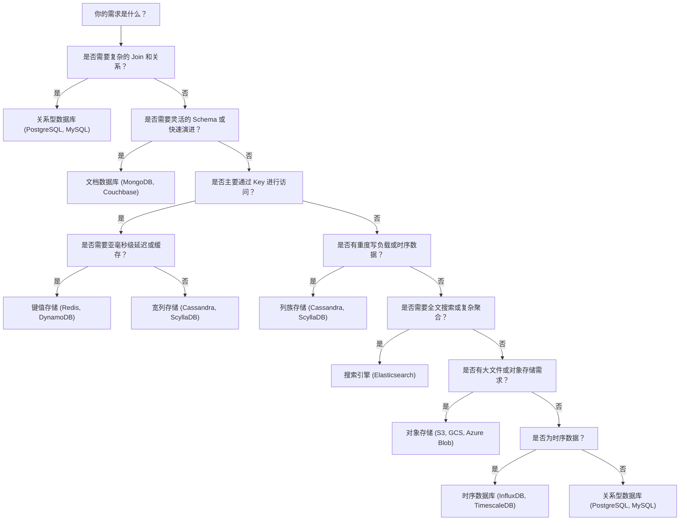

# 3. 存储层

存储层定义了你的系统在正确性方面能提供什么保证，并为可扩展性和可操作性设定了硬性上限。许多“应用层问题”最终都是数据问题：热点、写放大、锁竞争、缓慢的迁移以及跨分片复杂度。你在这一层所做的选择将约束你系统未来的能力、运维复杂度和成本结构。

## 本层涵盖内容

- **数据建模**：基于访问模式和不变性设计表/文档/键。
- **正确性保证**：事务、隔离级别，以及“一致性”对你的产品意味着什么。
- **复制与可用性**：数据如何经受故障，以及在网络分区期间读写行为如何表现。
- **扩展策略**：垂直扩展、读扩展，以及当单节点限制无法满足需求时的分片策略。
- **生命周期管理**：数据保留、归档，以及迁移和回填的运维现实。

## 为什么它很重要

### 1. 正确性即产品质量
对于许多系统，正确性就是产品本身。支付、库存、身份和权限的可靠性完全取决于它们的数据保证。

### 2. 数据层决定了你的扩展上限
计算通常可以通过投入更多资金实现水平扩展，但数据往往难以扩展，并迫使你做出艰难的抉择。

### 3. 主导长期成本
索引、复制和存储增长会转化为真实的资金支出和真实的运维负担。今天一个“廉价”的 Schema 可能会带来永久性的昂贵成本。

## 劣势与风险

- **过度提前优化**会减慢迭代速度（且你往往优化错了地方）。
- **分片**使许多问题变得更难：连接 (joins)、事务和全局约束。
- **索引**虽然能提升读取性能，但会增加写入成本和运维复杂度。
- **迁移和重新分片**是高风险操作；请在真正需要之前就做好规划。

---

## 关键权衡与决策

### 数据库类型及其权衡

**关系型数据库 (PostgreSQL, MySQL, Oracle, SQL Server):**
- **优点**: ACID 事务保证，成熟的 SQL 语言，强一致性，丰富的工具生态。
- **最适合**: 金融交易、强一致性需求（库存、权限）、结构化数据。

**文档数据库 (MongoDB, Couchbase):**
- **优点**: 灵活的 Schema，自然映射对象，易于水平扩展。
- **最适合**: 内容管理、快速演进的数据模型、产品目录。

**键值存储 (Redis, DynamoDB):**
- **优点**: 极高性能 (O(1))，简单可靠，极佳的水平扩展。
- **最适合**: 会话存储、缓存、实时排行榜、简单主键查找。

**列族存储 (Cassandra, ScyllaDB):**
- **优点**: 针对写密集优化，线性扩展，无单点故障。
- **最适合**: IoT 传感器数据、监控指标、地理分布式数据。

**搜索引擎 (Elasticsearch, Solr):**
- **优点**: 全文搜索，复杂的聚合分析，相关性评分。
- **最适合**: 产品搜索、日志分析、自动补全。

**对象存储 (Amazon S3, GCS):**
- **优点**: 无限扩展，低成本，内置冗余，适合大文件。
- **最适合**: 媒体库、备份、数据湖。

---

### 数据库选择决策树

---

### CAP 定理与一致性模型

**理解 CAP:**
- **一致性 (Consistency, C):** 每次读取均获得最新写入或错误。
- **可用性 (Availability, A):** 每个请求均收到响应，但不保证是最新写入。
- **分区容错性 (Partition Tolerance, P):** 系统在网络故障时仍能运行。

**权衡：** 在出现网络分区 (P) 时，你必须在 C 和 A 之间做出选择。

**一致性模型频谱:**
- **强一致性 (线性一致性)**：所有观察者在同一时间看到相同数据。
- **最终一致性**：如果没有新更新，系统保证最终会趋于一致。
- **因果一致性**：具有因果关系的操作按顺序被观察到。
- **写后即读一致性**：用户始终能看到自己刚刚写入的数据。

---

### 复制策略

**单主复制 (Single-Leader):**
- 一个节点处理所有写入，异步或同步复制到从节点。
- **优点**: 简单的一致性模型，易于解决冲突。
- **缺点**: 写入存在瓶颈，主节点故障需要切主。

**多主复制 (Multi-Leader):**
- 多个节点可接受写入。
- **优点**: 写入可扩展，跨区域低延迟。
- **缺点**: 复杂的冲突解决逻辑（最后写入胜出、CRDTs）。

**无主复制 (Quorum-Based):**
- 客户端向多个节点写入和读取。
- **Quorum 公式**: $W + R > N$（写法定人数 + 读法定人数 > 副本总数）。
- **优点**: 极高可用，无单点故障。

---

### 数据库索引结构

- **B+ 树**: 平衡树结构。适合范围查询和 OLTP 系统。
- **LSM 树**: 写优化结构。所有写入均为顺序追加，适合时序数据和高频写入。
- **哈希索引**: O(1) 查找。仅适合等值查询，不支持范围搜索。
- **倒排索引**: 单词到文档 ID 的映射。搜索引擎的核心。

---

### 预写日志 (Write-Ahead Logging, WAL)

**目的**: 在更改应用到数据文件前，先将其记录在顺序追加的日志中，以确保原子性和持久性。
- **崩溃恢复**: 重启时重放已提交事务，回滚未提交事务。
- **复制基础**: 从节点通过订阅主节点的 WAL 流实现状态同步。

---

### 数据库代理与中间件

- **连接池**: 复用数据库连接，减少开销（如 PgBouncer）。
- **读写分离**: 代理将写请求导向主库，读请求导向从库（如 ProxySQL）。
- **分片透明化**: 代理自动处理路由，让应用感觉像在用单表（如 ShardingSphere）。

---

### 综合分片策略 (Sharding)

**垂直分片 (Vertical Sharding):**
- 按业务功能拆分数据库（如拆分为订单库、用户库、产品库）。

**水平分片 (Horizontal Sharding):**
- 按 **分片键 (Shard Key)** 将单表数据分布到多个实例。
- **分片算法**:
  - **范围分片**: 按 ID 或时间范围分配。
  - **哈希分片**: `hash(key) % shard_count` 分配。
  - **一致性哈希**: 减少扩缩容时的数据迁移量。

**分片挑战**:
- **跨分片查询**: 尽量避免，或通过反规范化、应用层合并解决。
- **全局唯一 ID**: 弃用自增 ID，改用 Snowflake 算法或 UUID。
- **分布式事务**: 尽量通过 Saga 模式或最终一致性规避。

---

## 运维检查清单

- [ ] 在建模前充分了解你的访问模式。
- [ ] 明确定义不变性 (Invariants) 以及哪些操作必须具备事务性。
- [ ] 将重新分片和重新索引视为不可避免的必然，并在早期就进行设计。
- [ ] 制定明确的 WAL 策略和备份策略，并测试恢复流程。
- [ ] 监控慢查询、复制延迟、磁盘空间和连接池利用率。
- [ ] 制定数据生命周期管理计划（归档、删除、分层存储）。

---

*下一步：[缓存层设计](./caching-layer)*
